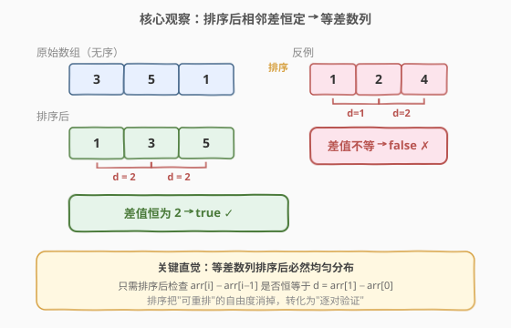
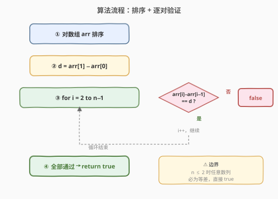

# LeetCode 判断能否形成等差数列 题解

## 1. 题目概述

- **标题 / 题号**：判断能否形成等差数列（#1502，easy）
- **链接**：https://leetcode.cn/problems/can-make-arithmetic-progression-from-sequence/
- **难度**：简单
- **标签**：数组、排序

**题意**：给你一个数字数组 `arr`。如果一个数列中，任意相邻两项的差总等于同一个常数，那么这个数列就称为**等差数列**。如果可以重新排列数组形成等差数列，请返回 `true`；否则返回 `false`。

**示例 1**：

```text
输入：arr = [3,5,1]
输出：true
解释：对数组重新排序得到 [1,3,5] 或者 [5,3,1]，任意相邻两项的差分别为 2 或 -2，可以形成等差数列。
```

**示例 2**：

```text
输入：arr = [1,2,4]
输出：false
解释：无法通过重新排序得到等差数列。
```

**约束**：

- `2 <= arr.length <= 1000`
- `-10^6 <= arr[i] <= 10^6`

> 💡 题目允许"重新排列"，这意味着元素顺序无关——这暗示了**排序**是解题的天然入口：把排列的自由度消掉后，只需验证排序后的序列是否满足等差性质即可。

## 2. 解题思路

### 2.1 暴力思路

枚举数组所有排列（共 $n!$ 种），对每种排列检查相邻差是否恒定。虽然能出结果，但时间复杂度 $O(n! \cdot n)$，当 $n = 1000$ 时完全不可行。根本问题在于——**没有利用等差数列的数学结构**：等差数列的元素排序后必然均匀分布，完全不需要枚举排列。

### 2.2 核心观察：排序 + 逐对验证



关键直觉是：如果数组**能**重排成等差数列，那么将其**排序**后得到的升序序列本身就是一个等差数列（等差数列的升序排列仍是等差数列，公差取绝对值）。

因此只需两步：

1. **排序**数组，得到升序序列。
2. 计算首两项之差 $d = \text{arr}[1] - \text{arr}[0]$，然后检查所有相邻对 $\text{arr}[i] - \text{arr}[i-1]$ 是否都等于 $d$。

> 💡 **为什么排序一定行？** 等差数列的元素集合是确定的 $\{a, a+d, a+2d, \ldots, a+(n-1)d\}$（$d > 0$ 时升序、$d < 0$ 时降序）。无论原数组是这组数的哪种打乱，排序后都还原为升序等差数列。所以"能否重排成等差数列"等价于"排序后是否为等差数列"。

> ⚠️ **边界 $n \leq 2$**：当数组长度为 2 时，任意两个数都能构成等差数列（只有一个差值），直接返回 `true`。实际上循环从 $i = 2$ 开始，$n \leq 2$ 时循环体不执行，自然返回 `true`，无需特判。

### 2.3 算法流程图



整个流程只有一重循环遍历 $i$ 从 $2$ 到 $n-1$，遇到第一个不等于 $d$ 的差值立即返回 `false`；全部通过则返回 `true`。

### 2.4 示例演算

![示例演算：arr = [3,5,1,7,9]](../images/cmamp_example_walkthrough.svg)

以 `arr = [3,5,1,7,9]` 为例：

- **排序**后得到 `[1, 3, 5, 7, 9]`。
- **求公差**：$d = \text{arr}[1] - \text{arr}[0] = 3 - 1 = 2$。
- **逐对验证**：
  - $i=2$：$5 - 3 = 2 == d$ ✓
  - $i=3$：$7 - 5 = 2 == d$ ✓
  - $i=4$：$9 - 7 = 2 == d$ ✓
- 全部通过 → 返回 `true`。

## 3. 参考代码

### C++

```cpp
class Solution {
  public:
    bool canMakeArithmeticProgression(vector<int>& arr) {
        sort(arr.begin(), arr.end());
        int d = arr[1] - arr[0];
        for (int i = 2; i < arr.size(); ++i) {
            if (arr[i] - arr[i - 1] != d) {
                return false;
            }
        }
        return true;
    }
};
```

### Python

```python
class Solution:
    def canMakeArithmeticProgression(self, arr: list[int]) -> bool:
        arr.sort()
        d = arr[1] - arr[0]
        for i in range(2, len(arr)):
            if arr[i] - arr[i - 1] != d:
                return False
        return True
```

> ⚠️ **边界**：题目保证 `n >= 2`，所以 `arr[1] - arr[0]` 不会越界。当 `n == 2` 时循环不执行，直接返回 `true`，符合"任意两个数必为等差数列"的数学事实。面试时主动提及这一边界处理，体现严谨性。

## 4. 复杂度分析

| 维度 | 复杂度 | 说明 |
|------|--------|------|
| 时间复杂度 | $O(n \log n)$ | 排序主导 $O(n \log n)$，逐对验证 $O(n)$，总体为排序复杂度 |
| 空间复杂度 | $O(\log n)$ | 排序所需栈空间（C++ `std::sort` 为内省排序，递归深度 $\log n$）；Python `list.sort` 为 TimSort，$O(n)$ 最坏 |

## 5. 扩展：$O(n)$ 时间解法——最小最大值 + 哈希集合

如果面试官追问"能否做到 $O(n)$ 时间"，可以利用等差数列的数学性质，避免排序：

1. 一次遍历找到最小值 `minVal` 和最大值 `maxVal`。
2. 若 `(maxVal - minVal) % (n - 1) != 0`，公差无法整除，返回 `false`。
3. 公差 $d = (\text{maxVal} - \text{minVal}) / (n - 1)$；若 $d = 0$ 则所有元素应相等（`minVal == maxVal` 已保证），返回 `true`。
4. 将所有元素放入哈希集合，检查 `minVal + i * d` 是否都在集合中（$i = 0, 1, \ldots, n-1$）。

```cpp
bool canMakeArithmeticProgression(vector<int>& arr) {
    int n = arr.size();
    int minVal = *min_element(arr.begin(), arr.end());
    int maxVal = *max_element(arr.begin(), arr.end());
    if ((maxVal - minVal) % (n - 1) != 0) return false;
    int d = (maxVal - minVal) / (n - 1);
    if (d == 0) return true; // 所有元素相等
    unordered_set<int> s(arr.begin(), arr.end());
    for (int i = 0; i < n; ++i) {
        if (s.find(minVal + i * d) == s.end()) return false;
    }
    return true;
}
```

| 维度 | 复杂度 | 说明 |
|------|--------|------|
| 时间复杂度 | $O(n)$ | 三次独立遍历，无排序 |
| 空间复杂度 | $O(n)$ | 哈希集合存储所有元素 |

> 💡 **取舍**：$O(n)$ 解法用 $O(n)$ 空间换掉了排序时间。当 $n$ 较小（本题 $n \leq 1000$）时，排序解法的常数更小、实现更简洁，实际运行往往更快。$O(n)$ 解法的价值在于面试中展示对等差数列结构的深入理解。

## 6. 面试要点

1. **为什么排序后一定能判断？**

   - 等差数列的元素集合是确定的 $\{a, a+d, \ldots, a+(n-1)d\}$。无论原数组如何打乱，排序后都还原为升序等差数列。所以"能重排成等差数列"等价于"排序后是等差数列"，把排列问题转化为验证问题。

2. **$n = 2$ 时为什么直接返回 `true`？**

   - 两个数之间只有一个差值，天然"恒定"。代码中循环从 $i = 2$ 开始，$n = 2$ 时循环不执行，自动返回 `true`，无需特判。

3. **如何做到 $O(n)$ 时间？**

   - 找最小最大值算出公差 $d = (\text{max} - \text{min}) / (n - 1)$，用哈希集合验证每个期望值 `min + i*d` 是否存在。需额外 $O(n)$ 空间。注意先检查整除性，否则公差不是整数必为 `false`。

4. **公差 $d = 0$ 的特殊情况？**

   - $d = 0$ 意味着所有元素相等。此时 `minVal == maxVal`，整除检查通过，集合中只需有这一个值。代码中提前 `return true` 可避免后续无意义的循环验证。

5. **与排序验证法相比，$O(n)$ 解法一定更快吗？**

   - 不一定。$n \leq 1000$ 时排序常数小、实现简单，实际往往更快。$O(n)$ 解法在大 $n$ 且元素范围大时才有优势，且需要 $O(n)$ 额外空间。面试中先给排序解法，再主动提及 $O(n)$ 优化，展示分层思考。

## 同类练习题

| # | 题目 | 与本题的关联 |
|---|------|-------------|
| 1636 | [按照频率将数组升序排序](https://leetcode.cn/problems/sort-array-by-increasing-frequency/) | 排序 + 自定义比较器，巩固排序思维 |
| 888 | [公平的糖果交换](https://leetcode.cn/problems/fair-candy-swap/) | 利用数学性质（总和差值）直接计算目标值，与 $O(n)$ 解法中"由 min/max 推公差"思路同源 |
| 1196 | [最多可以买到的苹果数量](https://leetcode.cn/problems/how-many-apples-can-you-put-into-the-basket/) | 一次遍历累加判定，简单数组遍历练习 |
| 414 | [第三大的数](https://leetcode.cn/problems/third-maximum-number/) | 一次遍历维护极值，与 $O(n)$ 解法中找 min/max 的思路类似 |
