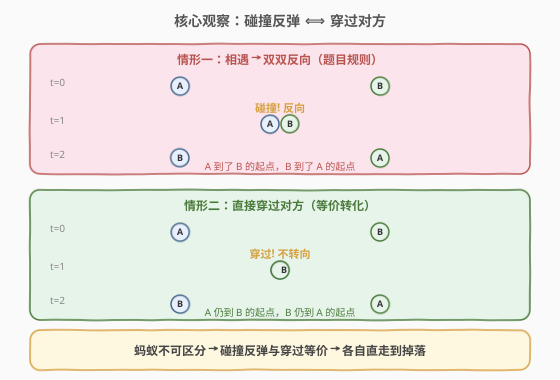
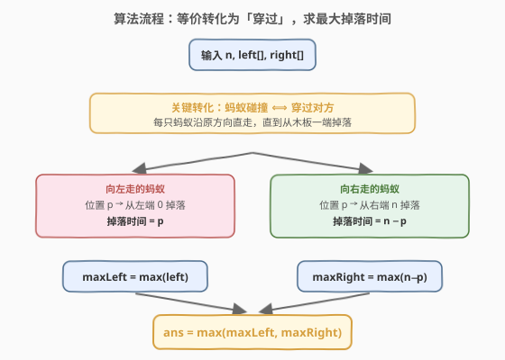
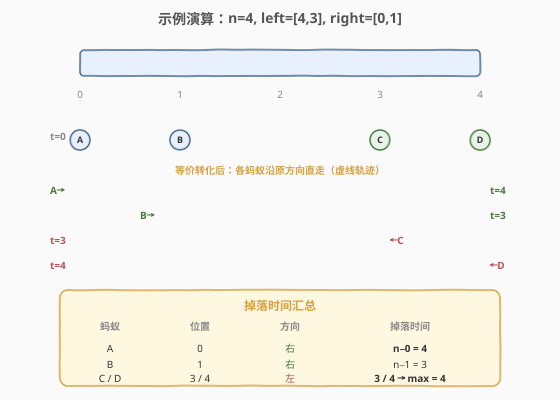

# LeetCode 所有蚂蚁掉下来前的最后一刻 题解

## 1. 题目概述

- **标题 / 题号**：所有蚂蚁掉下来前的最后一刻（#1503，medium）
- **链接**：https://leetcode.cn/problems/last-moment-before-all-ants-fall-out-of-a-plank/
- **难度**：中等
- **标签**：脑筋急转弯、数组、模拟

**题意**：有一块长度为 `n` 个单位的木板，若干蚂蚁以**每秒一个单位**的速度在木板上移动：部分向左、部分向右。当两只**不同方向**的蚂蚁在某个点相遇时，它们会**同时改变方向**并继续移动（转向不花时间）。当蚂蚁到达木板一端时立即掉落。

给定 `n`、`left`（向左走的蚂蚁在 `t=0` 时的位置数组）、`right`（向右走的蚂蚁在 `t=0` 时的位置数组），返回**最后一只蚂蚁掉落的时刻**。

**示例 1**：

```text
输入：n = 4, left = [4,3], right = [0,1]
输出：4
解释：A(0→右)、B(1→右)、C(3→左)、D(4→左)。t=4 时最后一只蚂蚁掉落。
```

**示例 2**：

```text
输入：n = 7, left = [], right = [0,1,2,3,4,5,6,7]
输出：7
解释：全部向右走，位置 0 的蚂蚁要走 7 秒到右端。
```

**示例 3**：

```text
输入：n = 7, left = [0,1,2,3,4,5,6,7], right = []
输出：7
解释：全部向左走，位置 7 的蚂蚁要走 7 秒到左端。
```

**约束**：

- `1 <= n <= 10^4`
- `0 <= left.length, right.length <= n + 1`
- `0 <= left[i], right[i] <= n`
- `1 <= left.length + right.length <= n + 1`
- `left` 和 `right` 中所有值唯一，每个值只出现在二者之一中

## 2. 解题思路

### 2.1 暴力思路：逐秒模拟

最直观的暴力做法是**逐秒模拟**每只蚂蚁的位置：每秒先把所有蚂蚁按速度推进一格，再检测同位置异向的蚂蚁对、让它们反向。直到所有蚂蚁都掉落，记录时刻。

问题是碰撞检测复杂：同一时刻可能有多对蚂蚁在多个点碰撞，且碰撞后方向变化会影响后续轨迹。最坏情况蚂蚁数 $O(n)$、模拟时长 $O(n)$，总时间 $O(n^2)$，且实现极易出错。

> 💡 转换视角：蚂蚁碰撞后反向，看似改变了每只蚂蚁的身份轨迹——但蚂蚁**不可区分**，我们只关心"什么时候有蚂蚁掉完"。这个观察能把问题降到 $O(n)$。

### 2.2 核心观察：碰撞反弹 ⟺ 穿过对方



关键洞察：**两只蚂蚁相遇后双双反向，等价于它们直接穿过对方继续前行**。原因在于蚂蚁**不可区分**——碰撞反弹后，A 走了 B 原本要走的路、B 走了 A 原本要走的路，从外部看与"穿过"的最终落点完全一致。

因此可以**完全忽略碰撞**，让每只蚂蚁沿原方向直走：

- 向左走的蚂蚁在位置 $p$：走到左端 $0$ 需 $p$ 秒。
- 向右走的蚂蚁在位置 $p$：走到右端 $n$ 需 $n - p$ 秒。

答案即所有蚂蚁掉落时间的**最大值**。

> ⚠️ 这个等价性成立的前提是蚂蚁**同质不可区分**。若题目要求"指定编号的蚂蚁"何时掉落，则不能再忽略碰撞——必须追踪身份交换。本题只问"最后一只"，故可直接用穿过模型。

### 2.3 算法流程图



### 2.4 示例演算

以示例 1 `n=4, left=[4,3], right=[0,1]` 为例，应用"穿过"等价转化后，各蚂蚁沿原方向直走的轨迹与掉落时刻：



| 蚂蚁 | 位置 | 方向 | 掉落时间 |
|------|------|------|----------|
| A | 0 | 右 | $n - 0 = 4$ |
| B | 1 | 右 | $n - 1 = 3$ |
| C | 3 | 左 | $3$ |
| D | 4 | 左 | $4$ |

$$\text{ans} = \max(4,\ 3,\ 3,\ 4) = 4$$

即 `max( max(left), max(n - p for p in right) ) = max(4, 4) = 4`，与示例一致。

> 💡 注意：虽然实际过程中 A、B 会与 C、D 碰撞多次并反向，但"穿过"模型下每只蚂蚁的掉落时间不变——这正是本题的精髓。

## 3. 参考代码

### C++

```cpp
class Solution {
  public:
    int getLastMoment(int n, vector<int>& left, vector<int>& right) {
        int maxLeft = 0;
        for (int p : left)
            maxLeft = max(maxLeft, p);

        int maxRight = 0;
        for (int p : right)
            maxRight = max(maxRight, n - p);

        return max(maxLeft, maxRight);
    }
};
```

### Python

```python
class Solution:
    def getLastMoment(self, n: int, left: List[int], right: List[int]) -> int:
        max_left = max(left) if left else 0
        max_right = max(n - p for p in right) if right else 0
        return max(max_left, max_right)
```

> 💡 Python 中 `max([])` 会抛异常，需先用 `if left` 判空；C++ 的 `left`/`right` 至少一个非空（约束 `left.length + right.length >= 1`），且初始 `maxLeft=0` 对空数组也安全。

## 4. 复杂度分析

| 维度 | 复杂度 | 说明 |
|------|--------|------|
| 时间复杂度 | $O(L + R)$ | 分别遍历 `left`、`right` 各一次，$L+R$ 为蚂蚁总数 |
| 空间复杂度 | $O(1)$ | 只用常数变量 `maxLeft`、`maxRight` |

> 💡 由约束 $L + R \le n + 1$，时间复杂度也可写为 $O(n)$。无需排序、无需模拟碰撞，是理论最优。

## 5. 面试要点

1. **为什么碰撞反弹等价于穿过？**
   - 蚂蚁**同质不可区分**。碰撞反弹后，两只蚂蚁交换了轨迹，但从外部观测，"有蚂蚁到达某端"的时刻与"穿过"模型完全一致。

2. **如果蚂蚁可区分（要追踪某只编号蚂蚁），还能用穿过模型吗？**
   - 不能直接用。需模拟碰撞时的**身份交换**：碰撞瞬间两只蚂蚁交换编号但继续沿对方方向走。不过最终"最后一只掉落时刻"仍等于穿过模型的答案，因为掉落时刻集合不变。

3. **为什么答案是取最大值而非求和？**
   - 各蚂蚁独立直走，掉落时刻互不影响。最后一只掉落 = 所有掉落时刻的最大值。

4. **边界情况？**
   - `left` 或 `right` 为空：对应方向无蚂蚁，该侧最大值取 0。
   - 蚂蚁初始在端点：如位置 0 向右、位置 n 向左，掉落时间分别为 $n$ 和 $n$，仍正确。

5. **如果速度不同（如有的快有的慢），还能这样转化吗？**
   - 不能。穿过等价性依赖"碰撞后双方速度大小不变只换方向"。若速度不同，碰撞后速度交换会导致轨迹改变，需另行分析。

## 同类练习题

| # | 题目 | 与本题的关联 |
|---|------|-------------|
| 73 | [矩阵置零](https://leetcode.cn/problems/set-matrix-zeroes/) | 常数空间标记，同样是"观察等价转化"的脑筋急转弯类 |
| 289 | [生命游戏](https://leetcode.cn/problems/game-of-life/) | 原地模拟状态转移，用位运算编码中间态，与本题"忽略碰撞"同为状态等价化简 |
| 1353 | [最多可以参加的会议数目](https://leetcode.cn/problems/maximum-number-of-events-that-can-be-attended/) | 贪心 + 优先队列，把"选哪天参会"转化为"每天选哪个会议"的视角切换 |
| 838 | [推多米诺](https://leetcode.cn/problems/push-dominoes/) | 双向力传播模拟，与蚂蚁碰撞类似的"相遇反向"模型，但需按距离计算受力 |
