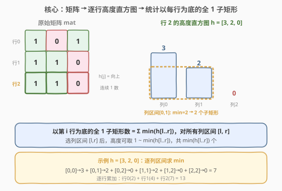
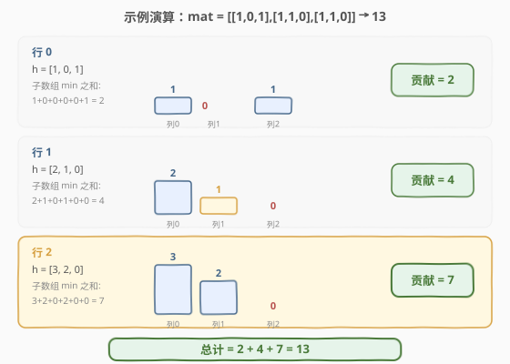

# 统计全 1 子矩形

- **题目名称**：统计全 1 子矩形
- **链接**：[1504. 统计全 1 子矩形](https://leetcode.cn/problems/count-submatrices-with-all-ones/)
- **难度**：中等
- **标签**：栈、数组、动态规划、单调栈、矩阵

## 1. 题目概述

给定一个 `m × n` 的二进制矩阵 `mat`，返回元素**全部为 1**的**子矩形**数量。子矩形是由矩阵中一段连续的行和列所围成的矩形区域。

**示例 1**：

```text
输入：mat = [[1,0,1],[1,1,0],[1,1,0]]
输出：13
解释：
  6 个 1×1 的矩形
  2 个 1×2 的矩形
  3 个 2×1 的矩形
  1 个 2×2 的矩形
  1 个 3×1 的矩形
  总计 = 6 + 2 + 3 + 1 + 1 = 13
```

**示例 2**：

```text
输入：mat = [[0,1,1,0],[0,1,1,1],[1,1,1,0]]
输出：24
```

**约束条件**：

- `1 <= m, n <= 150`
- `mat[i][j]` 仅包含 `0` 或 `1`

> 💡 本题是 [85. 最大矩形](../0001-0100/85_柱状图中最大的矩形.md) 的**计数版**——85 题求最大面积，本题求全 1 子矩形的总数。两者共享「逐行构建高度直方图」的核心思想，但本题需要把「求最大」换成「求和」，恰好对应 [907. 子数组的最小值之和](../0901-1000/907_子数组的最小值之和.md)。

---

## 2. 解题思路

### 2.1 暴力思路：枚举所有子矩形

最直观的做法：枚举子矩形的左上角 $(r_1, c_1)$ 和右下角 $(r_2, c_2)$，再检查区域内是否全为 1。

> ⚠️ **致命缺陷**：子矩形总数达 $O(m^2 n^2)$，每个检查还需 $O(mn)$，总计 $O(m^3 n^3)$。对于 $m = n = 150$，约 $1.5 \times 10^{13}$ 次操作——完全不可行。

**改进思路**：逐行处理。固定子矩形的**底边在第 $i$ 行**，问题就降维成「给定一个高度直方图 $h$，统计以该行为底的全 1 子矩形数」。

### 2.2 核心观察：高度直方图 + 单调栈



**第一步：构建高度直方图。** 对每一行，维护数组 $h[j]$：从当前位置 $(i, j)$ **向上**连续 1 的个数。

$$h[j] = \begin{cases} h[j] + 1 & \text{if } \texttt{mat}[i][j] = 1 \\ 0 & \text{if } \texttt{mat}[i][j] = 0 \end{cases}$$

处理完第 $i$ 行后，$h[j]$ 就是**以第 $i$ 行为底、第 $j$ 列为右边界**的柱子高度。

**第二步：统计以该行为底的子矩形数。** 在直方图中选一个列区间 $[l, r]$，该区间能构成的子矩形高度从 $1$ 到 $\min(h[l..r])$，共 $\min(h[l..r])$ 个。因此：

$$\text{该行贡献} = \sum_{0 \le l \le r < n} \min(h[l..r])$$

这正是 [907. 子数组的最小值之和](../0901-1000/907_子数组的最小值之和.md) 的定义——**求直方图所有子数组最小值之和**。

**第三步：单调栈高效求和。** 用单调栈维护一个**递增**的 $(\text{height}, \text{count})$ 序列，其中 $\text{count}$ 表示「以当前 $j$ 结尾的子数组中，最小值等于 $\text{height}$ 的个数」。

- 遇到 $h[j]$ 时，弹出栈顶所有 $\ge h[j]$ 的元素（它们的子数组最小值被 $h[j]$ 取代），累计 `count`。
- 压入 $(h[j], \text{count}+1)$，更新 `curSum += h[j] \times (\text{count}+1)`。
- 每步 `ans += curSum`。

> 💡 **关键洞察**：`curSum` 始终等于「以 $j$ 结尾的所有子数组的最小值之和」——即 $\sum_{l=0}^{j} \min(h[l..j])$。栈中每个 $(h, c)$ 的 $h \times c$ 恰好是那些最小值为 $h$ 的子数组贡献之和。

### 2.3 算法流程图

![单调栈演算：以 h = [3,1,2,1] 为例](../images/count_submatrices_monotonic_stack.svg)

以 $h = [3, 1, 2, 1]$ 为例演示单调栈的完整执行过程：

| 步骤 | $h[j]$ | 栈操作 | 栈（底→顶） | `curSum` | 贡献 |
|------|--------|--------|-------------|----------|------|
| $j$=0 | 3 | push(3,1) | (3,1) | 3 | 3 |
| $j$=1 | 1 | pop(3,1), push(1,2) | (1,2) | 2 | 2 |
| $j$=2 | 2 | push(2,1) | (1,2)(2,1) | 4 | 4 |
| $j$=3 | 1 | pop(2,1), pop(1,2), push(1,4) | (1,4) | 4 | 4 |

总计 $= 3 + 2 + 4 + 4 = 13$，与暴力枚举 $\sum \min(h[l..r])$ 结果一致。

### 2.4 示例演算

以示例 1 `mat = [[1,0,1],[1,1,0],[1,1,0]]` 为例，逐行构建直方图并统计：



| 行 | 高度数组 $h$ | 子数组 min 之和 | 贡献 |
|----|-------------|----------------|------|
| 0 | [1, 0, 1] | $1+0+0+0+0+1 = 2$ | 2 |
| 1 | [2, 1, 0] | $2+1+0+1+0+0 = 4$ | 4 |
| 2 | [3, 2, 0] | $3+2+0+2+0+0 = 7$ | 7 |

**总计** $= 2 + 4 + 7 = 13$ ✓

> 💡 **为什么高度数组能复用？** 每行处理时，$h[j]$ 基于上一行的值递推——`mat[i][j]` 为 1 则 $+1$，为 0 则归零。无需额外空间存储历史行，一个一维数组即可在行间滚动更新。

---

## 3. 参考代码

### C++

```cpp
class Solution {
  public:
    int numSubmat(vector<vector<int>>& mat) {
        int m = mat.size(), n = mat[0].size();
        vector<int> h(n, 0);
        int ans = 0;

        for (int i = 0; i < m; ++i) {
            for (int j = 0; j < n; ++j)
                h[j] = mat[i][j] ? h[j] + 1 : 0;

            stack<pair<int,int>> stk;
            int curSum = 0;
            for (int j = 0; j < n; ++j) {
                int cnt = 0;
                while (!stk.empty() && stk.top().first >= h[j]) {
                    auto [hh, cc] = stk.top(); stk.pop();
                    curSum -= hh * cc;
                    cnt += cc;
                }
                stk.push({h[j], cnt + 1});
                curSum += h[j] * (cnt + 1);
                ans += curSum;
            }
        }
        return ans;
    }
};
```

### Python

```python
class Solution:
    def numSubmat(self, mat: List[List[int]]) -> int:
        m, n = len(mat), len(mat[0])
        h = [0] * n
        ans = 0

        for i in range(m):
            for j in range(n):
                h[j] = h[j] + 1 if mat[i][j] else 0

            stack = []  # (height, count)
            cur_sum = 0
            for j in range(n):
                cnt = 0
                while stack and stack[-1][0] >= h[j]:
                    hh, cc = stack.pop()
                    cur_sum -= hh * cc
                    cnt += cc
                stack.append((h[j], cnt + 1))
                cur_sum += h[j] * (cnt + 1)
                ans += cur_sum

        return ans
```

> 💡 **为什么用 `>=` 而非 `>` 弹栈？** 两者都能正确求和。用 `>=` 时相等高度会被合并到右侧新元素，`count` 累加到新栈帧；用 `>` 则保留左侧旧帧。两种方式最终 `curSum` 相同，因为求和具有交换性。面试中两种写法均可，只需保持一致。

---

## 4. 复杂度分析

| 维度 | 复杂度 | 说明 |
|------|--------|------|
| 时间复杂度 | $O(mn)$ | 每行单调栈各元素至多入栈/出栈一次，$m$ 行共 $O(mn)$ |
| 空间复杂度 | $O(n)$ | 高度数组 $h$ 和单调栈，均为 $O(n)$ |

> ⚠️ 本题 $m, n \le 150$，$mn \le 22500$，$O(mn)$ 绰绰有余。即使 $m, n \le 1000$ 的变体也能轻松通过。

---

## 5. 扩展：逐列扫描法 $O(mn^2)$

如果面试时一时想不到单调栈，可以用更直观的**逐列扫描**法——对每行的高度数组，固定右端 $j$，向左扫描取运行最小值：

### C++

```cpp
class Solution {
  public:
    int numSubmat(vector<vector<int>>& mat) {
        int m = mat.size(), n = mat[0].size();
        vector<int> h(n, 0);
        int ans = 0;

        for (int i = 0; i < m; ++i) {
            for (int j = 0; j < n; ++j)
                h[j] = mat[i][j] ? h[j] + 1 : 0;

            for (int j = 0; j < n; ++j) {
                int minH = h[j];
                for (int k = j; k >= 0; --k) {
                    minH = min(minH, h[k]);
                    ans += minH;
                }
            }
        }
        return ans;
    }
};
```

| 维度 | 逐列扫描 $O(mn^2)$ | 单调栈 $O(mn)$ |
|------|---------------------|-----------------|
| 时间 | $O(mn^2)$ | $O(mn)$ |
| 空间 | $O(n)$ | $O(n)$ |
| 本题 ($n \le 150$) | 能过（$mn^2 \approx 3.4 \times 10^6$） | **更优** |
| 可读性 | 更直观，易于解释 | 需理解单调栈原理 |

> 💡 **面试建议**：先说逐列扫描法（展示降维思路），再优化到单调栈（展示对 [907 题](../0901-1000/907_子数组的最小值之和.md)套路的掌握）。这种「先暴力再优化」的表达方式在面试中加分。

---

## 6. 面试要点

1. **为什么能把二维问题降成一维？**

   - 固定子矩形的**底边**在某一行 $i$，则子矩形完全由「列区间 $[l, r]$」和「高度 $k$」决定。构建高度直方图 $h$ 后，$h[j]$ 直接给出位置 $(i, j)$ 向上的最大可用高度，二维枚举变成一维的列区间问题。

2. **为什么每行贡献等于 $\sum \min(h[l..r])$？**

   - 选定列区间 $[l, r]$ 后，全 1 子矩形的高度 $k$ 可取 $1$ 到 $\min(h[l..r])$——因为整个列区间内最矮的柱子限制了最大高度。所以该列区间贡献 $\min(h[l..r])$ 个子矩形，对所有区间求和即为该行总贡献。

3. **单调栈为什么能求子数组最小值之和？**

   - 栈中每个 $(h, c)$ 记录了「以当前 $j$ 结尾、最小值为 $h$ 的子数组有 $c$ 个」。`curSum` 是这些 $h \times c$ 的累加，恰好等于 $\sum_{l \le j} \min(h[l..j])$。新元素入栈时弹出所有 $\ge h[j]$ 的旧帧，把它们和自身合并为一个新帧——因为这些子数组的最小值都被 $h[j]$ 取代了。

4. **和 85 题（最大矩形）的区别？**

   - 85 题在直方图中求**最大矩形面积**（$\max_{[l,r]} \min(h[l..r]) \times (r-l+1)$），用单调栈找每个柱子的左右边界。本题求**所有子矩形总数**（$\sum_{[l,r]} \min(h[l..r])$），单调栈维护的是累加和而非最大值。骨架相似但目标不同。

5. **高度数组为什么可以在行间复用？**

   - $h[j]$ 的递推只依赖上一行的值：遇到 1 就 $+1$，遇到 0 就归零。用一个一维数组在行间滚动更新即可，无需存储整个历史矩阵，空间 $O(n)$。

---

## 7. 同类练习题

- [85. 最大矩形](https://leetcode.cn/problems/maximal-rectangle/)：同一「逐行直方图」框架，求最大面积而非计数，单调栈找左右边界
- [907. 子数组的最小值之和](https://leetcode.cn/problems/sum-of-subarray-minimums/)：本题每行的核心子问题，单调栈求 $\sum \min(h[l..r])$ 的母题
- [84. 柱状图中最大的矩形](https://leetcode.cn/problems/largest-rectangle-in-histogram/)：单调栈的招牌题，85 题和本题的共同基础
- [1277. 统计全为 1 的正方形子矩阵](https://leetcode.cn/problems/count-square-submatrices-with-all-ones/)：同类矩阵计数题，DP 求正方形（本题是任意矩形）
- [221. 最大正方形](https://leetcode.cn/problems/maximal-square/)：矩阵 DP 入门，与 1277 互为「最大 vs 计数」的对照
