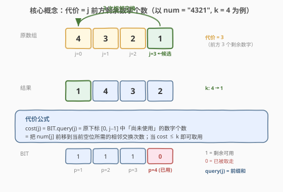

# LeetCode 最多 K 次交换相邻数位后得到的最小整数 题解

## 1. 题目概述

- **标题 / 题号**：最多 K 次交换相邻数位后得到的最小整数（#1505，hard）
- **链接**：https://leetcode.cn/problems/minimum-possible-integer-after-at-most-k-adjacent-swaps-on-digits/
- **难度**：困难
- **标签**：贪心、树状数组、字符串、线段树

**题意**：给定一个表示大整数的字符串 `num` 和整数 `k`。可以交换**相邻数位**的数字，**最多** $k$ 次。返回能得到的最小整数（以字符串形式，可含前导 0）。

**示例 1**：

```text
输入：num = "4321", k = 4
输出："1342"
解释：4321 → 4312 → 4132 → 1432 → 1342，共 4 次相邻交换得到最小整数。
```

**示例 2**：

```text
输入：num = "100", k = 1
输出："010"
解释：把第 2 位的 '0' 交换到首位即可。输出可含前导 0，但输入保证无前导 0。
```

**示例 3**：

```text
输入：num = "36789", k = 1000
输出："36789"
解释：已经升序，无需任何交换。
```

**约束**：

- $1 \le \text{num.length} \le 3 \times 10^4$
- `num` 只包含数字且不含前导 0
- $1 \le k \le 10^9$

> 💡 $n \le 3 \times 10^4$ 而 $k$ 可达 $10^9$——意味着 $k$ 往往远大于实际所需交换数，瓶颈在于「如何在每一位上快速选出能负担得起的最小数字」。朴素的 $O(n^2)$ 模拟交换会超时，需要用**树状数组**把「计算前移代价」降到 $O(\log n)$。

## 2. 解题思路

### 2.1 暴力思路：逐位贪心 + 模拟交换

直观贪心：从左到右逐位确定结果。对目标位 $i$，在剩余数字中找**能负担得起**的最小数字——即在原串下标 $[i',\, i'+k]$ 范围内找最小值（$i'$ 是当前剩余序列的起点），把它一步步相邻交换到最前，消耗相应次数并从剩余序列中移除。

> ⚠️ **致命缺陷**：每确定一位都要在剩余序列里线性扫描找最小值，并执行 $O(\text{距离})$ 次交换，总计 $O(n^2)$。对 $n = 3 \times 10^4$ 约 $9 \times 10^8$ 次操作，超时。

**突破口**：不要真去「执行交换」——只需**计算代价**并**标记已用位置**。用树状数组维护「哪些位置还未被取走」，就能 $O(\log n)$ 算出把某位置前移到当前空位所需的交换次数。

### 2.2 核心观察：代价 = 前方剩余数字个数



**关键定义**：把原串下标 $j$ 处的数字前移到「当前目标位」，需要交换的次数等于**$j$ 前方尚未被取走的数字个数**——因为这些数字还挡在 $j$ 前面，必须逐个交换越过。

形式化：设 $\text{live}(p)$ 表示原下标 $p$ 处数字是否仍可用（1 可用 / 0 已取走），则

$$\text{cost}(j) = \sum_{0 \le p < j} \text{live}(p)$$

即原下标 $[0,\, j-1]$ 内剩余数字的个数。这正是**树状数组（BIT）的前缀和查询** $\text{BIT.query}(j)$，可在 $O(\log n)$ 完成。

> 💡 **为什么不直接用「$j - i$」当代价？** 因为前面有些数字可能已经被取走（前移到结果里了），它们不再挡路。比如 `"4321"` 取走位置 3 的 `'1'` 后，下一次要把位置 1 的 `'3'` 前移时，位置 0 的 `'4'` 还在挡路，但位置 2、3 已空——实际只需越过 1 个数字（`'4'`），而非 $1 - 0 = 1$。当中间有已用位置时，$j - i$ 会**高估**代价，而 BIT 前缀和给出的是**精确**的剩余挡路数。

**贪心策略**：对每个目标位 $i$（$i = 0 \ldots n{-}1$），从小到大枚举数字 $d \in [0, 9]$：

1. 找 $d$ 的**最左未用位置** $j$（用 `pos[d]` 列表 + 游标维护）。
2. 计算 $\text{cost} = \text{BIT.query}(j)$。
3. 若 $\text{cost} \le k$：取用此 $j$，令 $k \mathop{-}= \text{cost}$，在 BIT 中把 $j$ 标记为已用（位置 $j{+}1$ 处加 $-1$），把 $d$ 追加到结果，跳出枚举。

> 💡 **为什么取最左未用位置？** 对同一数字 $d$，$\text{cost}(j) = \text{BIT.query}(j)$ 随 $j$ 单调不减（BIT 前缀和只增不减）。所以最左未用位置的代价最小、最可能 $\le k$；且取走它后，右侧同值数字仍保留，给后续位最大选择空间。

### 2.3 算法流程图


**完整步骤**：

1. **预处理**：遍历 `num`，把每个数字 $d$ 的原下标按升序存入 `pos[d]`；为每个 `pos[d]` 维护一个游标 `ptr[d]`（初始 0，指向最左未用位置）。
2. **初始化 BIT**：1-indexed，位置 $p \in [1, n]$ 对应原下标 $p-1$，全部置 1（表示所有数字可用）。
3. **逐位填结果**（$i = 0 \ldots n{-}1$）：
   - 枚举 $d = 0 \ldots 9$：
     - 若 $\text{ptr}[d] \ge |\text{pos}[d]|$，该数字已用完，跳过。
     - 取 $j = \text{pos}[d][\text{ptr}[d]]$，算 $\text{cost} = \text{BIT.query}(j)$。
     - 若 $\text{cost} \le k$：$k \mathrel{-}= \text{cost}$，`BIT.add(j+1, -1)`，`ptr[d]++`，结果追加 $d$，`break`。
4. **返回**拼接的结果字符串。

### 2.4 示例演算

以 `num = "4321", k = 4` 为例演示完整执行：


| 步骤 | 目标位 $i$ | 选 $d$ | 原下标 $j$ | cost | $k$ 剩余 | BIT $[0,1,2,3]$ | 结果 |
|------|-----------|--------|-----------|------|---------|-----------------|------|
| 1 | 0 | 1 | 3 | 3 | 1 | $[1,1,1,\mathbf{0}]$ | "1" |
| 2 | 1 | 3 | 1 | 1 | 0 | $[1,\mathbf{0},1,0]$ | "13" |
| 3 | 2 | 4 | 0 | 0 | 0 | $[\mathbf{0},0,1,0]$ | "134" |
| 4 | 3 | 2 | 2 | 0 | 0 | $[0,0,\mathbf{0},0]$ | "1342" |

**逐步解读**：

- **步骤 1**（$i{=}0$）：试 $d{=}0$ 无；$d{=}1$ 在 $j{=}3$，前方剩余 $[0,1,2]$ 共 3 个，$\text{cost}{=}3 \le 4$，取用。$k \to 1$，位置 3 标记已用。
- **步骤 2**（$i{=}1$）：$d{=}1$ 已用完；$d{=}2$ 在 $j{=}2$，前方剩余 $[0,1]$ 共 2 个（位置 0 的 `'4'`、位置 1 的 `'3'`），$\text{cost}{=}2 > 1$，放弃；$d{=}3$ 在 $j{=}1$，前方剩余 $[0]$ 共 1 个，$\text{cost}{=}1 \le 1$，取用。$k \to 0$。
- **步骤 3**（$i{=}2$）：$d{=}2$ 在 $j{=}2$，$\text{cost}{=}1 > 0$ 放弃；$d{=}3$ 已用完；$d{=}4$ 在 $j{=}0$，前方无数字，$\text{cost}{=}0 \le 0$，取用。
- **步骤 4**（$i{=}3$）：$d{=}2$ 在 $j{=}2$，前方 $[0,1]$ 均已用，$\text{cost}{=}0$，取用。

最终结果 `"1342"` ✓。

> 💡 **$k$ 很大时怎么办？** 若 $k \ge n^2$，理论上能把任意数字移到任意位置，等价于对原串**排序**。本算法天然处理：每步 $\text{cost}$ 都 $\le n$，当 $k$ 充足时总是取最小可用数字，结果即排序后的串（如示例 3）。无需特判。

## 3. 参考代码

### C++

```cpp
class Solution {
  public:
    string minInteger(string num, int k) {
        int n = num.size();
        // pos[d]: 数字 d 出现的所有原下标（升序）
        vector<int> pos[10];
        for (int i = 0; i < n; ++i)
            pos[num[i] - '0'].push_back(i);
        int ptr[10] = {0};

        // 1-indexed BIT，位置 p 对应原下标 p-1，初始全 1
        vector<int> bit(n + 1, 0);
        for (int i = 0; i < n; ++i) add(bit, n, i + 1, 1);

        string ans;
        for (int i = 0; i < n; ++i) {
            for (int d = 0; d <= 9; ++d) {
                if (ptr[d] >= (int)pos[d].size()) continue;
                int j = pos[d][ptr[d]];
                int cost = query(bit, j);      // 原下标 [0, j-1] 内剩余数字个数
                if (cost <= k) {
                    k -= cost;
                    add(bit, n, j + 1, -1);   // 标记 j 已用
                    ++ptr[d];
                    ans.push_back('0' + d);
                    break;
                }
            }
        }
        return ans;
    }
  private:
    void add(vector<int>& bit, int n, int i, int delta) {
        for (; i <= n; i += i & (-i)) bit[i] += delta;
    }
    int query(vector<int>& bit, int i) {
        int s = 0;
        for (; i > 0; i -= i & (-i)) s += bit[i];
        return s;
    }
};
```

### Python

```python
class Solution:
    def minInteger(self, num: str, k: int) -> str:
        n = len(num)
        pos = [[] for _ in range(10)]
        for i, ch in enumerate(num):
            pos[int(ch)].append(i)
        ptr = [0] * 10

        bit = [0] * (n + 1)
        for i in range(n):
            self._add(bit, n, i + 1, 1)

        ans = []
        for _ in range(n):
            for d in range(10):
                if ptr[d] >= len(pos[d]):
                    continue
                j = pos[d][ptr[d]]
                cost = self._query(bit, j)
                if cost <= k:
                    k -= cost
                    self._add(bit, n, j + 1, -1)
                    ptr[d] += 1
                    ans.append(str(d))
                    break
        return ''.join(ans)

    @staticmethod
    def _add(bit, n, i, delta):
        while i <= n:
            bit[i] += delta
            i += i & (-i)

    @staticmethod
    def _query(bit, i):
        s = 0
        while i > 0:
            s += bit[i]
            i -= i & (-i)
        return s
```

> 💡 **游标代替删除**：`pos[d]` 只从头部消费，用 `ptr[d]` 游标前进即可，避免 `erase`/`pop_front` 的 $O(n)$ 搬移。若用有序集合（C++ `set`/Python `SortedList`）也能做，但游标更轻量。
>
> ⚠️ **BIT 的 1-indexed 偏移**：原下标 $j$（0-indexed）对应 BIT 位置 $j{+}1$。`query(j)` 查的是 BIT 位置 $[1, j]$ 之和 = 原下标 $[0, j-1]$ 的剩余数；`add(j+1, -1)` 才是把原下标 $j$ 标记已用。偏移搞反是本题最常见的 bug。

## 4. 复杂度分析

| 维度 | 复杂度 | 说明 |
|------|--------|------|
| 时间复杂度 | $O(10 \cdot n \log n)$ | 共 $n$ 个目标位，每位枚举 $\le 10$ 个数字，每次 1 次 BIT 查询 $O(\log n)$；命中时额外 1 次更新 $O(\log n)$ |
| 空间复杂度 | $O(n)$ | BIT 数组 $n+1$ + `pos` 存全部下标共 $n$ 个 |

> ⚠️ 系数 10 来自数字种类数 $0 \sim 9$，是常数。$n = 3 \times 10^4$ 时约 $10 \times 3 \times 10^4 \times 15 \approx 4.5 \times 10^6$ 次操作，轻松通过。$k$ 达 $10^9$ 不影响复杂度——它只是贪心的预算阈值。

## 5. 扩展：线段树解法

树状数组维护的是「剩余数字个数」的前缀和。若改用**线段树维护区间内剩余数字个数**，则 $\text{cost}(j)$ = 区间 $[0, j-1]$ 的剩余数之和，同样是 $O(\log n)$ 查询。

线段树的优势在于可扩展到**区间最值查询**：若题目改为「每次能交换的距离上限为 $L$」（而非总次数预算 $k$），需要找 $[i, i+L]$ 内最小数字及其下标，线段树能 $O(\log n)$ 查区间最小值，而树状数组不便做最值。

**线段树节点**：`cnt` = 该区间剩余数字个数。查询 $\text{cost}(j)$ 即查 $[0, j-1]$ 的 `cnt` 之和；更新即把位置 $j$ 的 `cnt` 从 1 改 0。逻辑与 BIT 版完全等价，代码更重，仅当需要区间最值时才值得换用。

> 💡 **BIT vs 线段树**：本题只需「单点更新 + 前缀和查询」，BIT 是最轻量选择（常数小、代码短）。线段树适合需要区间最值/区间更新等更复杂操作的场景。

## 6. 面试要点

1. **为什么贪心是正确的？**

   - 相邻交换改变的是相对顺序。要让结果最小，高位应尽量小。在预算 $k$ 内，把能负担得起的最小数字前移到当前位，永远不劣于「留着它以后用」——因为越早放到高位，对字典序的贡献越大，且剩余预算留给后续位同样可用。

2. **代价为什么是「前方剩余数字个数」而非 $j - i$？**

   - 前面已被取走的数字不在剩余序列里，不再挡路。$j - i$ 假设中间全部有人，会高估代价。用 BIT 维护「剩余」标记，前缀和给出真实的挡路数字数。

3. **为什么要取同一数字的最左未用位置？**

   - 对数字 $d$，$\text{cost}(j)$ 随 $j$ 单调不减（BIT 前缀和只增）。最左未用位置代价最小、最易满足 $\le k$；取走它后右侧同值数字保留，给后续位更大选择空间。

4. **$k$ 远大于 $n^2$ 时算法行为？**

   - 每步 $\text{cost} \le n$，$k$ 充足时总是取最小可用数字，结果等价于对原串排序。无需特判，算法自然处理（如示例 3 直接返回原串，因其已升序）。

5. **BIT 的 1-indexed 偏移怎么对应？**

   - 原下标 $j$（0-indexed）→ BIT 位置 $j{+}1$。`query(j)` 查 BIT $[1,j]$ = 原下标 $[0, j{-}1]$ 剩余数（即代价）；`add(j+1, -1)` 标记原下标 $j$ 已用。把偏移搞反会得到错误代价。

6. **能否不用 BIT，用有序结构？**

   - 可以用 C++ `std::set` 维护已用位置集合，代价 = $j$ 减去「$[0,j)$ 内已用位置数」= $j - \text{distance(used.begin, lower\_bound(j))}$。查询 $O(\log n)$，但常数大于 BIT。BIT 最轻量。

## 同类练习题

| # | 题目 | 与本题的关联 |
|---|------|-------------|
| 315 | [计算右侧小于当前元素的个数](https://leetcode.cn/problems/count-of-smaller-numbers-after-self/) | 树状数组/归并排序求逆序对计数，同属「BIT 维护位置标记」家族 |
| 406 | [根据身高重建队列](https://leetcode.cn/problems/queue-reconstruction-by-height/) | 贪心 + 按空位插入，思想相通——「按某种顺序逐位确定，用数据结构快速找空位」 |
| 946 | [验证栈序列](https://leetcode.cn/problems/validate-stack-sequences/) | 相邻交换的合法性判定，栈模拟入栈/出栈序列，与本题的「前移代价」对照 |
| 307 | [区域和检索 - 数组可变](https://leetcode.cn/problems/range-sum-query-mutable/) | 树状数组/线段树单点更新 + 区间查询的母题，本题 BIT 操作的直接基础 |
| 1850 | [邻位交换的最小相邻次数](https://leetcode.cn/problems/minimum-adjacent-swaps-to-reach-the-kth-smallest-number/) | 相邻交换求两个排列之间的最小交换次数，逆序对思想，与本题代价计算互补 |
