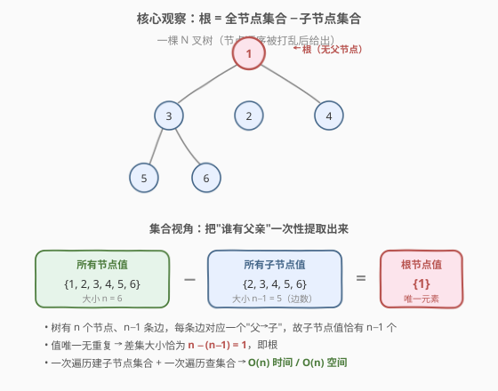
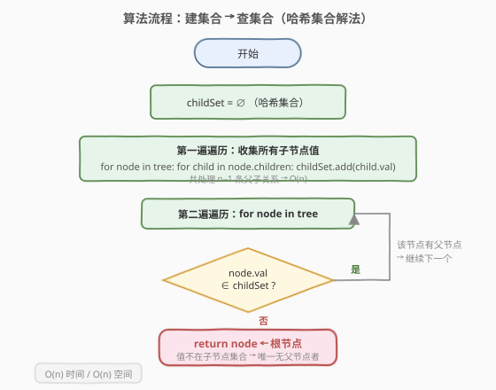
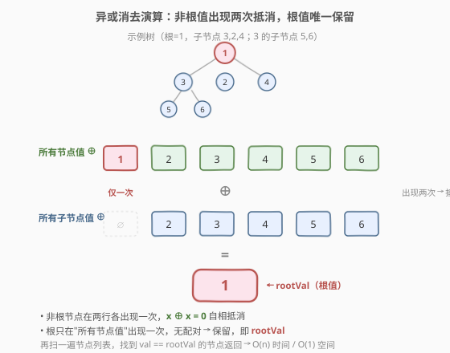

# 找到 N 叉树的根节点

- **题目名称**：找到 N 叉树的根节点
- **链接**：[1506. 找到 N 叉树的根节点](https://leetcode.cn/problems/find-root-of-n-ary-tree/)
- **难度**：中等
- **标签**：树、哈希表、位运算

## 1. 题目概述

给定一棵 **N 叉树** 的**所有节点**（节点顺序任意打乱），每个节点有一个**唯一**的整数值。请你找出并返回这棵树的**根节点**。

节点的定义如下（每个节点存储一个值 `val` 和一个子节点列表 `children`）：

```cpp
class Node {
public:
    int val;
    vector<Node*> children;
};
```

```python
class Node:
    def __init__(self, val=None, children=None):
        self.val = val
        self.children = children if children is not None else []
```

**示例 1**：

```text
输入：tree = [1,null,3,2,4,null,5,6]   // 所有节点，层序序列化形式
输出：值为 1 的节点
解释：树形结构如下，根节点是值为 1 的节点。
        1
      / | \
     3  2  4
    / \
   5   6
```

**示例 2**：

```text
输入：tree = [1,null,2,3,4,5,null,null,6,7,null,8,null,9,10,null,null,11,null,12,null,13,null,null,14]
输出：值为 1 的节点
```

**约束条件**：

- 树中节点总数在 $[1, 5 \times 10^4]$ 范围内
- 每个节点的值互不相同
- 输入的节点列表包含树中**全部**节点（顺序任意），节点间通过 `children` 指针连接成树

> 💡 本题的关键不是"如何遍历树"，而是"在所有节点被打乱后如何识别根"。根节点的本质特征是：**它是树中唯一没有父节点的节点**——即它永远不会出现在任何节点的 `children` 列表中。

---

## 2. 解题思路

### 2.1 暴力思路：逐个验证是否为根

最直观的做法：对每个候选节点 $u$，扫描所有节点的 `children` 列表，看 $u$ 是否作为某节点的子节点出现。若 $u$ 在所有 `children` 中都找不到，则 $u$ 就是根。

> ⚠️ **致命缺陷**：共 $n$ 个候选，每个候选要遍历全部 $n$ 个节点的 `children`（合计 $n - 1$ 条父子关系），总时间 $O(n^2)$。当 $n = 5 \times 10^4$ 时约 $2.5 \times 10^9$ 次操作，会超时。根本问题在于——**重复扫描**：每个候选都独立地遍历一遍全树，没有把"谁有父亲"这一信息一次性提取出来。

### 2.2 核心观察：根是唯一不出现在子节点集合中的节点



把视角从"逐个验证"切换到"批量提取信息"：

- **所有节点值**构成集合 $S_{\text{all}}$（大小 $n$）。
- **所有子节点值**构成集合 $S_{\text{child}}$（大小 $n - 1$，因为只有根没有父节点）。

根节点恰好是 $S_{\text{all}} \setminus S_{\text{child}}$ 中的唯一元素——它出现一次（作为节点），却从不作为任何节点的子节点出现。

> 💡 **为什么 $S_{\text{child}}$ 大小是 $n-1$？** 树有 $n$ 个节点、$n - 1$ 条边，每条边对应一个"父→子"关系，故子节点值恰好有 $n - 1$ 个（值唯一，无重复）。根不在其中。

因此只需两步：

1. **一次遍历**收集所有子节点的值，存入哈希集合 `childSet`。
2. **再一次遍历**所有节点，找到值不在 `childSet` 中的节点，即为根。

### 2.3 算法流程图



流程非常线性：先建集合，再查集合。决策菱形只有一处——"当前节点值是否在 `childSet` 中"。

### 2.4 示例演算

以示例 1 的树为例，节点值集合为 $\{1, 2, 3, 4, 5, 6\}$：

| 节点 | 值 | 它的子节点值 |
|------|----|--------------|
| 根? | 1 | 3, 2, 4 |
| ? | 3 | 5, 6 |
| ? | 2 | — |
| ? | 4 | — |
| ? | 5 | — |
| ? | 6 | — |

收集所有子节点值：`childSet = {3, 2, 4, 5, 6}`（共 $n - 1 = 5$ 个）。

逐个节点查找：

- 值 $1$：不在 `childSet` → **根节点** ✓
- 值 $3, 2, 4, 5, 6$：都在 `childSet` 中 → 非根

> 💡 **演算关键**：因为值唯一，集合查找无歧义；根恰好是那个"漏网之鱼"——它从未被任何父节点指过。

---

## 3. 参考代码

### C++

```cpp
/*
// Definition for a Node.
class Node {
public:
    int val;
    vector<Node*> children;
};
*/
class Solution {
public:
    Node* findRoot(vector<Node*>& tree) {
        unordered_set<int> childSet;
        for (Node* node : tree) {
            for (Node* child : node->children) {
                childSet.insert(child->val);
            }
        }
        for (Node* node : tree) {
            if (!childSet.count(node->val)) {
                return node;
            }
        }
        return nullptr;
    }
};
```

### Python

```python
"""
# Definition for a Node.
class Node:
    def __init__(self, val=None, children=None):
        self.val = val
        self.children = children if children is not None else []
"""
class Solution:
    def findRoot(self, tree: list['Node']) -> 'Node':
        child_set = set()
        for node in tree:
            for child in node.children:
                child_set.add(child.val)
        for node in tree:
            if node.val not in child_set:
                return node
        return None
```

> ⚠️ **细节**：题目保证树非空且连通，所以一定存在且唯一存在一个根，末尾的 `return nullptr` 永远不会真正执行，写上仅为编译器要求/防御性编程。

---

## 4. 复杂度分析

| 维度 | 复杂度 | 说明 |
|------|--------|------|
| 时间复杂度 | $O(n)$ | 两次遍历：第一次遍历所有节点的所有子节点，共 $n - 1$ 条父子关系；第二次遍历 $n$ 个节点做哈希查找，均摊 $O(1)$ |
| 空间复杂度 | $O(n)$ | 哈希集合 `childSet` 存储 $n - 1$ 个子节点值 |

> ⚠️ 本题 $n \le 5 \times 10^4$，$O(n)$ 时间与空间均轻松通过。但题目的 **follow-up** 要求 $O(1)$ 额外空间——这正是下一节要解决的进阶问题。

---

## 5. 扩展：$O(1)$ 空间解法——异或消去（Follow-up）

题目追问：能否用**常数空间**解决？答案是肯定的，思路源自一个朴素的观察——**根值 = 全部节点值之和 − 全部子节点值之和**。

### 5.1 数学原理

每个非根节点恰好出现**两次**：一次作为"节点列表中的成员"，一次作为"某个父节点的子节点"。根节点只出现**一次**：作为节点列表成员，但从不作为子节点。

因此：

$$\text{root.val} = \sum_{\text{所有节点}} \text{val} - \sum_{\text{所有子节点}} \text{val}$$

非根节点的贡献一加一减正好抵消，只剩下根的值。

### 5.2 用异或避免溢出

求和可能存在整数溢出风险，**异或（XOR）** 是更优雅的选择——同样满足"出现两次则抵消"的性质（$x \oplus x = 0$），且无溢出：

$$\text{root.val} = \bigoplus_{\text{所有节点}} \text{val} \;\oplus\; \bigoplus_{\text{所有子节点}} \text{val}$$

非根节点被异或两次抵消为 $0$，根只被异或一次保留下来。



### 5.3 代码

算出 `rootVal` 后，再扫一遍节点列表找到值匹配的节点返回即可（值唯一，无歧义）。

```cpp
class Solution {
public:
    Node* findRoot(vector<Node*>& tree) {
        int rootVal = 0;
        for (Node* node : tree) {
            rootVal ^= node->val;            // 所有节点值
            for (Node* child : node->children) {
                rootVal ^= child->val;        // 所有子节点值
            }
        }
        for (Node* node : tree) {
            if (node->val == rootVal) return node;
        }
        return nullptr;
    }
};
```

```python
class Solution:
    def findRoot(self, tree: list['Node']) -> 'Node':
        root_val = 0
        for node in tree:
            root_val ^= node.val
            for child in node.children:
                root_val ^= child.val
        for node in tree:
            if node.val == root_val:
                return node
        return None
```

| 维度 | 哈希集合解法 | 异或解法（Follow-up） |
|------|--------------|------------------------|
| 时间 | $O(n)$ | $O(n)$ |
| 空间 | $O(n)$ | $O(1)$ ✓ |
| 溢出风险 | 无 | 无（XOR 不产生溢出） |
| 可读性 | 直观，易解释 | 需解释"出现两次抵消"的数学性质 |

> 💡 **面试建议**：先讲哈希集合解法（展示对"根无父节点"特征的把握），再主动给出异或解法回答 follow-up。这种"先直观后优化"的表达在面试中加分。也可顺带提及求和法及其溢出风险，对比说明异或的优越性。

---

## 6. 面试要点

1. **根节点的本质特征是什么？**

   - 根是树中**唯一没有父节点**的节点。等价地，根的值**从不出现**在任何节点的 `children` 列表中。这一特征把"找根"问题转化为"找出集合差集"问题。

2. **为什么集合差集里恰好只有一个元素？**

   - 树有 $n$ 个节点、$n - 1$ 条边，每条边贡献一个子节点，且值唯一无重复，故子节点集合大小恰好 $n - 1$。全节点集合大小 $n$，差集大小恰为 $1$，即根。

3. **异或解法为什么能得到根值？**

   - 非根节点在"所有节点值"和"所有子节点值"中各出现一次，异或两次自相抵消（$x \oplus x = 0$）；根只在"所有节点值"中出现一次，异或一次保留。最终结果即根值。

4. **求和法和异或法的取舍？**

   - 两者原理相同（出现两次抵消）。求和法 $\sum \text{val} - \sum \text{child.val}$ 直观但有整数溢出风险（需用 `long long`）；异或法无溢出、位运算更快，是 follow-up 的首选。

5. **算出根值后为什么还要再扫一遍？**

   - 异或/求和得到的是根的**值**，而题目要求返回根**节点**对象。由于值唯一，再扫一遍列表按值匹配即可定位节点，$O(n)$ 时间、$O(1)$ 空间不变。

---

## 7. 同类练习题

- [136. 只出现一次的数字](https://leetcode.cn/problems/single-number/)：异或消去的母题，所有数出现两次唯独一个出现一次，XOR 直接得到答案，与本题 follow-up 同源
- [268. 丢失的数字](https://leetcode.cn/problems/missing-number/)：$[0, n]$ 中缺一个数，异或/求和均可定位缺失值，与本题"集合差集唯一元素"思路一致
- [429. N 叉树的层序遍历](https://leetcode.cn/problems/n-ary-tree-level-order-traversal/)：N 叉树的基本 BFS 遍历，巩固对 `children` 结构的熟悉度
- [559. N 叉树的最大深度](https://leetcode.cn/problems/maximum-depth-of-n-ary-tree/)：N 叉树的 DFS 递归，与本题共享节点定义，便于对照练习
- [310. 最小高度树](https://leetcode.cn/problems/minimum-height-trees/)：通过"逐层剥叶子"找树的中心，与本题"找根"互为图论上的拓扑特征题
