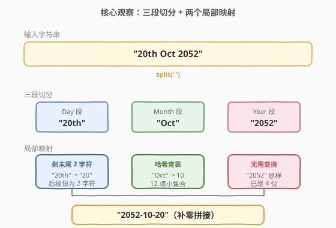
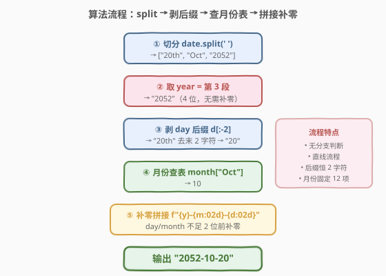
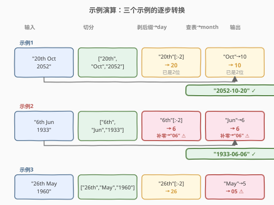

# 转变日期格式

- **题目名称**：转变日期格式
- **链接**：[1507. 转变日期格式](https://leetcode.cn/problems/reformat-date/)
- **难度**：简单
- **标签**：字符串、哈希表

## 1. 题目概述

给你一个字符串 `date`，格式为 `Day Month Year`，其中：

- `Day` 是集合 `{"1st", "2nd", "3rd", "4th", ..., "30th", "31st"}` 中的一个元素（数字 + 两个字母的英文序数后缀）。
- `Month` 是集合 `{"Jan", "Feb", "Mar", "Apr", "May", "Jun", "Jul", "Aug", "Sep", "Oct", "Nov", "Dec"}` 中的一个元素。
- `Year` 是范围在 `[1900, 2100]` 的 4 位数字。

请将字符串转变为 `YYYY-MM-DD` 格式，其中 `YYYY` 为 4 位年份、`MM` 为 2 位月份、`DD` 为 2 位天数（不足两位前补零）。

**示例 1**：

```text
输入：date = "20th Oct 2052"
输出："2052-10-20"
```

**示例 2**：

```text
输入：date = "6th Jun 1933"
输出："1933-06-06"
```

**示例 3**：

```text
输入：date = "26th May 1960"
输出："1960-05-26"
```

**约束条件**：

- 给定日期保证合法，无需处理异常输入。
- `Year ∈ [1900, 2100]`，年份本身已是 4 位，无需补零。

> 💡 本题是**字符串切分 + 查表映射**的招牌题：三段式输入天然用空格切分，难点仅在「剥掉序数后缀」与「月份缩写转数字」两个局部转换。抓住「后缀恒为 2 字符」「月份缩写固定 12 个」这两条不变量，就能用一次切分 + 哈希查表一次成型。

---

## 2. 解题思路

### 2.1 暴力思路

逐字符扫描整串，识别数字部分与字母部分：

- 累加连续数字字符得到 day、year；
- 累加连续字母字符得到 month 缩写；
- 再用一长串 `if-else`（或 `switch`）把 `"Jan"` 映射到 `1`、`"Feb"` 映射到 `2`……

虽然能出结果，但代码冗长、易写错分支，且没有利用「输入格式严格固定」这一关键前提——`Day Month Year` 三段以空格分隔，直接 `split(' ')` 即可拆成三段，无需手写状态机逐字符扫描。

> ⚠️ 暴力思路的根本问题：**把简单的「按分隔符切分」复杂化成了「逐字符 DFA 解析」**。输入格式既然固定，应该让标准库的字符串切分工具做粗粒度拆分，自己只处理「后缀剥离」与「月份查表」两个细粒度映射。

### 2.2 核心观察：切分 + 后缀剥离 + 月份哈希



**三条关键不变量**把问题彻底简化：

1. **格式固定为三段**：`Day Month Year` 以空格分隔 → 一次 `split` 得到三段，无需复杂解析。
2. **序数后缀恒为 2 字符**：`"st" / "nd" / "rd" / "th"` 全部恰好 2 个字母，且后缀紧跟在数字后。因此 **剥掉 day 段末尾 2 字符**即可还原数字部分（如 `"20th"` → `"20"`、`"1st"` → `"1"`），无需识别具体是哪种后缀。
3. **月份缩写固定 12 个**：`Jan..Dec` 与数字 `1..12` 是一一对应的小集合 → 用**哈希表**（或数组）一次查表即可，无需 `if-else` 长链。

> 💡 **为什么不用识别后缀种类？** 序数后缀有 `"st"/"nd"/"rd"/"th"` 四种，对应规则还随个位数变化（11th 例外）。但题目只需要**还原数字**，与后缀种类无关——后缀的全部作用是「占位」，剥掉就完事。识别后缀是「过度建模」：把无关的语义信息强行引入求解路径。

> ⚠️ **位数补零**：day 与 month 都需输出 2 位（`06`、`02`）。年份已是 4 位无需补零。C++ 可用 `sprintf("%02d", x)` 或 `std::setw(2) << std::setfill('0')`；Python 直接用 f-string `f"{x:02d}"`。

### 2.3 算法流程图



整体流程为一条直线，无分支判断：

| 步骤 | 操作 | 示例（输入 `"20th Oct 2052"`）|
|------|------|------------------------------|
| ① 切分 | `split(' ')` 得到三段 | `["20th", "Oct", "2052"]` |
| ② 取年份 | 第 3 段即 year | `"2052"` |
| ③ 剥天数后缀 | day 段去掉末尾 2 字符 | `"20th"` → `"20"` → `20` |
| ④ 月份查表 | 月份缩写 → 数字 | `"Oct"` → `10` |
| ⑤ 拼接补零 | `YYYY-MM-DD` 格式 | `"2052-10-20"` |

### 2.4 示例演算



以三个示例对照「切分 → 剥后缀 → 查表 → 拼接」四步：

| 输入 | 切分 | 剥后缀得 day | 查表得 month | year | 补零拼接 → 输出 |
|------|------|--------------|--------------|------|-----------------|
| `"20th Oct 2052"` | `["20th","Oct","2052"]` | `20` | `10` | `2052` | `"2052-10-20"` |
| `"6th Jun 1933"` | `["6th","Jun","1933"]` | `6` → `06` | `6` → `06` | `1933` | `"1933-06-06"` |
| `"26th May 1960"` | `["26th","May","1960"]` | `26` | `5` → `05` | `1960` | `"1960-05-26"` |

> 💡 注意示例 2 中 day=6 与 month=6 都不足两位，必须前补零得到 `06`。这是本题最易踩的坑——忘记补零会输出 `"1933-6-6"` 导致格式不符。

---

## 3. 参考代码

### C++

```cpp
class Solution {
  public:
    string reformatDate(string date) {
        unordered_map<string, string> monthMap = {
            {"Jan", "01"}, {"Feb", "02"}, {"Mar", "03"}, {"Apr", "04"},
            {"May", "05"}, {"Jun", "06"}, {"Jul", "07"}, {"Aug", "08"},
            {"Sep", "09"}, {"Oct", "10"}, {"Nov", "11"}, {"Dec", "12"}
        };

        istringstream iss(date);
        string dayStr, monStr, yearStr;
        iss >> dayStr >> monStr >> yearStr;

        string dd = dayStr.substr(0, dayStr.size() - 2);
        if (dd.size() == 1) dd = "0" + dd;

        return yearStr + "-" + monthMap[monStr] + "-" + dd;
    }
};
```

> 💡 **写法要点**：
> - **`istringstream` 按空格切分**：比手写 `split` 更简洁，自动跳过连续空格，依次读入三段。
> - **`dayStr.substr(0, size-2)`**：剥掉末尾 2 字符序数后缀，得到纯数字字符串（保留为字符串可省一次 `stoi`）。
> - **月份直接映射到 2 位字符串**：哈希表的 value 已是 `"01".."12"` 形式，省去运行时补零。
> - **day 补零**：`substr` 后若长度为 1（即 1~9 号），手动前补 `"0"`。
> - **year 不补零**：题目保证 `[1900, 2100]` 已是 4 位。

### Python

```python
class Solution:
    def reformatDate(self, date: str) -> str:
        month = {
            "Jan": 1, "Feb": 2, "Mar": 3, "Apr": 4,
            "May": 5, "Jun": 6, "Jul": 7, "Aug": 8,
            "Sep": 9, "Oct": 10, "Nov": 11, "Dec": 12,
        }
        d, m, y = date.split()
        return f"{y}-{month[m]:02d}-{int(d[:-2]):02d}"
```

> 💡 **Python 写法精髓**：
> - **`date.split()`**：默认按任意空白切分，返回三段列表，直接解包到 `d, m, y`。
> - **`d[:-2]`**：切片去掉末尾 2 字符后缀，比 `d.rstrip('stndrth')` 更稳（`rstrip` 是按字符集删，会误删 `"1st"` 的数字 `1`）。
> - **`f"{y}-{month[m]:02d}-{int(d[:-2]):02d}"`**：f-string 的 `:02d` 格式说明符自动前补零到 2 位，无需手动拼 `"0"`。`int(d[:-2])` 把 `"6"` 转 `6`，再 `:02d` 得 `"06"`。
> - 整体一行表达式完成全部转换，可读性远超逐段 if-else。

> ⚠️ **避免 `str.rstrip` 的陷阱**：`"1st".rstrip('stndrth')` 会返回空串——因为 `rstrip` 把参数当作**字符集合**而非子串，会从右向左删除所有出现在集合 `{s,t,n,d,r,h}` 中的字符，连 `"1"` 里的 `1`... 实际上 `1` 不在集合里，但 `"2nd".rstrip('stndrth')` 会变成 `"2"`，`"1st"` 变 `""`（`1` 不在集合，但 `s`、`t` 都在，全删完）。正确做法是**按固定长度 2 截断**（`d[:-2]` 或 `substr(0, len-2)`），不依赖后缀内容。

---

## 4. 复杂度分析

| 维度 | 复杂度 | 说明 |
|------|--------|------|
| 时间复杂度 | $O(n)$ | 切分扫描整串 $O(n)$；后缀剥离 $O(1)$（固定截 2 字符）；哈希查表 $O(1)$（12 个键的表）；字符串拼接 $O(n)$。$n$ 为输入字符串长度（题中至多约 15 字符） |
| 空间复杂度 | $O(1)$ | 哈希表固定 12 项 $O(1)$；切分产生的三段子串总长 $O(n)$，但 $n$ 为常数级。若不计输出占用，额外空间 $O(1)$ |

> 💡 本题输入规模极小（日期串最长约 15 字符），任何合理解法都能瞬间跑完。复杂度分析的价值在于**确认没有引入不必要的对数因子或大表扫描**——哈希表 $O(1)$ 查询是关键，若改用线性 `if-else` 链比对 12 个月份，最坏 12 次比较仍是常数，但哈希表更优雅且可扩展。

---

## 5. 扩展：一行解与跨语言对照

### 5.1 Python 一行解（datetime 模块）

利用 `datetime.strptime` 自动解析带序数后缀的日期：

```python
from datetime import datetime

class Solution:
    def reformatDate(self, date: str) -> str:
        return datetime.strptime(date, "%dth %b %Y").strftime("%Y-%m-%d")
```

> ⚠️ **此解法在 LeetCode 上不可用**：`strptime` 的 `%d` 说明符**不识别** `"20th"` 这样的序数后缀（它只认纯数字 `"20"`）。`%d` 在不同 Python 版本对后缀的容忍度不一，部分环境会抛 `ValueError`。这里仅作为「标准库能否自动处理」的对照参考——结论是**不能**，必须手动剥后缀。这恰恰说明本题的考点正在于「后缀剥离」这一步，标准库没有现成工具。

### 5.2 跨语言写法对照

| 语言 | 切分 | 剥后缀 | 查月份 | 补零 |
|------|------|--------|--------|------|
| **C++** | `istringstream >>` | `substr(0, len-2)` | `unordered_map` | 手动 `"0"+` 或 `setw` |
| **Python** | `str.split()` | `d[:-2]` 切片 | `dict` | `f"{x:02d}"` |
| **Java** | `String.split(" ")` | `substring(0, len-2)` | `Map<String,String>` | `String.format("%02d", x)` |
| **Go** | `strings.Fields` | `s[:len-2]` | `map[string]string` | `fmt.Sprintf("%02d", x)` |

> 💡 各语言写法结构高度一致：**切分 → 截前缀 → 查表 → 格式化**。这反映本题本质是「固定格式字符串的结构化转换」，与语言特性无关。面试时先讲清四步骨架，再落到具体语言，体现抽象与实现分层。

---

## 6. 面试要点

1. **为什么用 `d[:-2]` 而不是 `rstrip` 剥后缀？**

   > 序数后缀 `"st"/"nd"/"rd"/"th"` 恒为 2 字符，按固定长度截断最稳。`str.rstrip(chars)` 把参数当**字符集合**而非子串，会从右向左删除所有出现在集合中的字符——`"1st".rstrip('stndrth')` 会返回空串（`s`、`t` 都在集合中被删光）。固定长度截断不依赖后缀内容，正确性与后缀种类解耦。

2. **为什么用哈希表存月份映射，而不用 `if-else` 链？**

   > 12 个月份缩写与数字是一一对应的小集合，哈希表 $O(1)$ 查询且代码紧凑。`if-else` 链最坏需 12 次比较（虽仍常数），且新增月份需改代码、易写错分支。哈希表把「映射关系」从「控制流」抽离为「数据」，符合数据驱动优于控制流驱动的工程原则。

3. **day 和 month 为什么都要补零，year 不用？**

   > 输出格式 `YYYY-MM-DD` 规定 `MM`、`DD` 各 2 位，不足前补零（如 6 月 → `06`、6 号 → `06`）。`YYYY` 规定 4 位，而题目保证 year ∈ `[1900, 2100]` 已是 4 位，无需补零。若题目允许 year < 1000，则需前补零到 4 位——本题无此情况。

4. **输入保证合法，是否需要容错？**

   > 题目明确「给定日期保证合法」，故无需校验 day ∈ [1,31]、month ∈ [Jan,Dec]、year ∈ [1900,2100]。若面试官追问「生产环境如何鲁棒处理」，可加：切分后检查段数==3、剥后缀后 `isdigit` 校验、月份查表前 `count` 校验存在性、day 范围 [1,31] 校验——但本题不加这些，避免过度设计。

5. **若改用 `sscanf` 风格解析，怎么写？**

   > C 中可用 `sscanf(date, "%d%*[^ ] %3s %d", &day, mon, &year)`——`%d` 读数字部分、`%*[^ ]` 跳过非空格（即后缀）、`%3s` 读月份缩写、`%d` 读年份。C++ 也能用 `sscanf`，但 `istringstream + substr` 更符合 C++ 风格。`sscanf` 的优势是一次调用完成切分+剥后缀，劣势是格式串可读性差、类型不安全。

> 💡 **一句话总结**：1507 是「固定格式字符串结构化转换」招牌题——四步骨架 `split → 截前缀剥后缀 → 哈希查表 → 补零拼接`，所有考点集中在「后缀恒 2 字符」「月份 12 项小表」两条不变量。易错点：误用 `rstrip` 剥后缀、忘记补零、把简单切分复杂化为逐字符 DFA。

---

## 7. 同类练习题

- [1408. 数组中的字符串匹配](https://leetcode.cn/problems/string-matching-in-an-array/)：字符串切分与子串判断，巩固字符串处理基本功
- [1662. 检查两个字符串数组是否相等](https://leetcode.cn/problems/check-if-two-string-arrays-are-equivalent/)：字符串切分与拼接对照，与本题「split + join」骨架同源
- [58. 最后一个单词的长度](https://leetcode.cn/problems/length-of-last-word/)：从右向左扫描跳过尾随空格 + 数单词，同为「固定格式字符串的结构化遍历」
- [125. 验证回文串](https://leetcode.cn/problems/valid-palindrome/)：字符串过滤 + 双指针对照，巩固字符级处理
- [13. 罗马数字转整数](https://leetcode.cn/problems/roman-to-integer/)：哈希表 + 逐字符映射，与本题「月份缩写查表」同属「小集合符号 → 数值」映射套路
