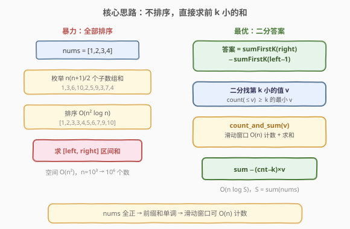
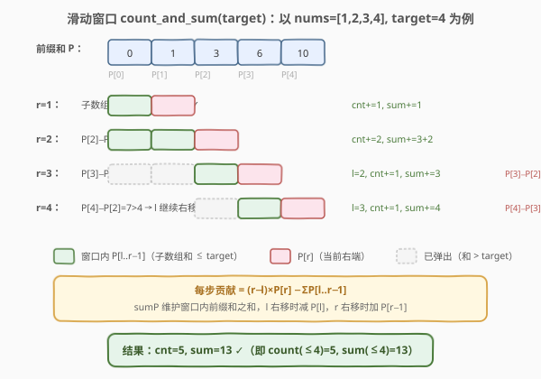
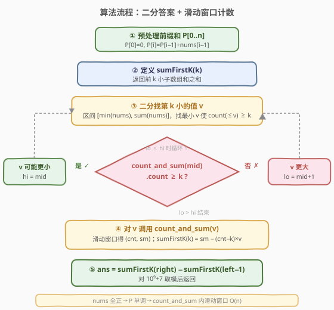
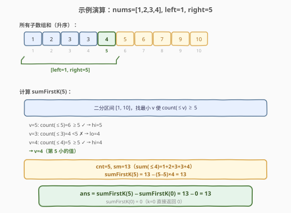

# LeetCode 子数组和排序后的区间和 题解

## 1. 题目概述

- **标题 / 题号**：子数组和排序后的区间和（#1508，medium）
- **链接**：https://leetcode.cn/problems/range-sum-of-sorted-subarray-sums/
- **难度**：中等
- **标签**：数组、二分查找、前缀和、滑动窗口

**题意**：给你一个正整数数组 `nums`（长度为 `n`），计算**所有非空连续子数组的和**，将它们**升序排序**得到一个长度为 $n(n+1)/2$ 的新数组。返回新数组中下标从 `left` 到 `right`（**1-indexed**，含两端）的元素之和，并对 $10^9+7$ 取模。

**示例 1**：

```text
输入：nums = [1,2,3,4], n = 4, left = 1, right = 5
输出：13
解释：所有子数组和 = [1,3,6,10,2,5,9,3,7,4]
      升序排序后   = [1,2,3,3,4,5,6,7,9,10]
      下标 1..5 的和 = 1+2+3+3+4 = 13
```

**示例 2**：

```text
输入：nums = [1,2,3,4], n = 4, left = 3, right = 4
输出：6
解释：排序后 [1,2,3,3,4,...]，下标 3..4 的和 = 3+3 = 6
```

**示例 3**：

```text
输入：nums = [1,2,3,4], n = 4, left = 1, right = 10
输出：50
解释：全部 10 个子数组和之和 = 1+2+3+3+4+5+6+7+9+10 = 50
```

**约束**：

- `1 <= nums.length <= 10^3`
- `nums.length == n`
- `1 <= nums[i] <= 100`
- `1 <= left <= right <= n * (n + 1) / 2`

> ⚠️ 注意两点：① 子数组**非空**且**连续**；② `nums[i]` **全为正**——这是后续用滑动窗口 $O(n)$ 计数的关键（保证前缀和单调递增）。

## 2. 解题思路

### 2.1 暴力思路：枚举 + 排序

最直接的做法：用前缀和 $O(n^2)$ 枚举出所有 $n(n+1)/2$ 个子数组和，排序后取区间和。

> ⚠️ **复杂度**：枚举 $O(n^2)$，排序 $O(n^2 \log n^2) = O(n^2 \log n)$，空间 $O(n^2)$。当 $n = 10^3$ 时 $n^2 = 10^6$，排序约 $2 \times 10^7$ 次操作——能 AC，但空间要存 $10^6$ 个数，且**完全没有利用「只要前 k 小之和、不必全排序」的性质**。

**关键观察**：题目只要 `[left, right]` 这一段的和，等价于「前 `right` 小之和」减「前 `left-1` 小之和」。定义 $\text{sumFirstK}(k)$ = 前 $k$ 小子数组和之和，则：

$$\text{ans} = \text{sumFirstK}(\text{right}) - \text{sumFirstK}(\text{left}-1)$$

于是问题归约为：**不求全部排序，只求前 $k$ 小之和**。

### 2.2 核心观察：二分答案 + 滑动窗口计数



**思路**：要算前 $k$ 小之和，先二分定位**第 $k$ 小的值 $v$**，再用一次线性扫描统计「$\le v$ 的子数组和个数与总和」。

#### 第一步：count_and_sum(target) —— 滑动窗口 $O(n)$

给定阈值 `target`，统计**子数组和 $\le$ target 的个数 `cnt` 与总和 `sm`**。由于 `nums` 全正，前缀和 $P$ 单调递增，可用滑动窗口：

- 固定右端 $r$（$1 \le r \le n$），子数组和 $= P[r] - P[l]$，随 $l$ 增大而**单调递减**；
- 维护左指针 $l$（最小满足 $P[r] - P[l] \le \text{target}$ 的下标），$r$ 增大时 $l$ **只增不减**；
- 对每个 $r$，合法 $l \in [l_0, r-1]$，共 $r - l_0$ 个，其和为：

$$\text{贡献} = (r - l_0) \cdot P[r] - \sum_{l=l_0}^{r-1} P[l]$$

- 用 `sumP` 滚动维护窗口内 $\sum P[l]$：$r$ 右移时 `sumP += P[r-1]`，$l$ 右移时 `sumP -= P[l]`。



#### 第二步：二分定位第 k 小的值 v

在值域 $[\min(\text{nums}), \sum \text{nums}]$ 上二分，找**最小的 $v$ 使 $\text{count}(v) \ge k$**。由于「$\le v$ 的个数」随 $v$ 单调递增，满足二段性。

#### 第三步：sumFirstK(k) 拼装

设二分得到 $v$，调用 `count_and_sum(v)` 得 `(cnt, sm)`。由于 $\text{count}(\le v-1) < k \le \text{count}(\le v)$，前 $k$ 小 = 「所有 $\le v-1$ 的和」+「$k - \text{count}(\le v-1)$ 个等于 $v$ 的」。化简为：

$$\text{sumFirstK}(k) = \text{sm} - (\text{cnt} - k) \cdot v$$

> 💡 **直观理解**：`sm` 包含了 `cnt` 个 $\le v$ 的和，但只要前 $k$ 个，多出的 `cnt - k` 个全部等于 $v$（否则 $v$ 还能更小），逐个减去即可。

### 2.3 算法流程图



### 2.4 示例演算

以 `nums = [1,2,3,4], left = 1, right = 5` 为例，演算 `sumFirstK(5)`：



二分过程：值域 $[1, 10]$，目标 $k = 5$：

| 中点 $v$ | $\text{count}(\le v)$ | 判定 | 区间调整 |
|----------|----------------------|------|----------|
| 5 | 6 | $\ge 5$ ✓ | `hi = 5` |
| 3 | 4 | $< 5$ ✗ | `lo = 4` |
| 4 | 5 | $\ge 5$ ✓ | `hi = 4` |

最终 $v = 4$，`count_and_sum(4) = (cnt=5, sm=13)`，`sumFirstK(5) = 13 - (5-5)×4 = 13`。又 `sumFirstK(0) = 0`，故 `ans = 13 - 0 = 13` ✓。

> 💡 验证 `count_and_sum(4)`：所有子数组和 $\le 4$ 的为 $1,2,3,3,4$，共 5 个、和 13，与演算一致。

## 3. 参考代码

### C++

```cpp
class Solution {
    static constexpr int MOD = 1'000'000'007;
    using ll = long long;

    // 统计子数组和 <= target 的个数 cnt 与总和 sm（滑动窗口 O(n)）
    pair<ll, ll> countAndSum(const vector<int>& nums, const vector<ll>& P, ll target) {
        ll cnt = 0, sm = 0, sumP = 0;  // sumP = Σ P[l..r-1]
        int l = 0, n = nums.size();
        for (int r = 1; r <= n; ++r) {
            sumP += P[r - 1];            // P[r-1] 进入窗口
            while (P[r] - P[l] > target) { // 左端不合法则弹出
                sumP -= P[l];
                ++l;
            }
            cnt += (r - l);
            sm += (ll)(r - l) * P[r] - sumP;
        }
        return {cnt, sm};
    }

    // 前 k 小子数组和之和
    ll sumFirstK(const vector<int>& nums, const vector<ll>& P, ll k) {
        if (k == 0) return 0;
        ll lo = *min_element(nums.begin(), nums.end());
        ll hi = P.back();                // sum(nums)
        while (lo < hi) {                // 找最小 v 使 count(<=v) >= k
            ll mid = (lo + hi) / 2;
            if (countAndSum(nums, P, mid).first >= k) hi = mid;
            else lo = mid + 1;
        }
        auto [cnt, sm] = countAndSum(nums, P, lo);
        return sm - (cnt - k) * lo;      // 减去多出的 (cnt-k) 个 v
    }

  public:
    int rangeSum(vector<int>& nums, int n, int left, int right) {
        vector<ll> P(n + 1, 0);
        for (int i = 0; i < n; ++i) P[i + 1] = P[i] + nums[i];
        ll ans = sumFirstK(nums, P, right) - sumFirstK(nums, P, left - 1);
        return (int)((ans % MOD + MOD) % MOD);
    }
};
```

### Python

```python
class Solution:
    def rangeSum(self, nums: List[int], n: int, left: int, right: int) -> int:
        MOD = 10**9 + 7
        P = [0] * (n + 1)
        for i in range(n):
            P[i + 1] = P[i] + nums[i]

        def count_and_sum(target: int) -> tuple[int, int]:
            """子数组和 <= target 的 (个数, 总和)，滑动窗口 O(n)"""
            cnt = sm = sum_p = 0  # sum_p = Σ P[l..r-1]
            l = 0
            for r in range(1, n + 1):
                sum_p += P[r - 1]                 # P[r-1] 进入窗口
                while P[r] - P[l] > target:       # 左端不合法则弹出
                    sum_p -= P[l]
                    l += 1
                cnt += (r - l)
                sm += (r - l) * P[r] - sum_p
            return cnt, sm

        def sum_first_k(k: int) -> int:
            """前 k 小子数组和之和"""
            if k == 0:
                return 0
            lo, hi = min(nums), P[-1]             # 值域 [min(nums), sum(nums)]
            while lo < hi:                        # 找最小 v 使 count(<=v) >= k
                mid = (lo + hi) // 2
                if count_and_sum(mid)[0] >= k:
                    hi = mid
                else:
                    lo = mid + 1
            cnt, sm = count_and_sum(lo)
            return sm - (cnt - k) * lo            # 减去多出的 (cnt-k) 个 v

        ans = sum_first_k(right) - sum_first_k(left - 1)
        return ans % MOD
```

> 💡 **取模细节**：`sumFirstK` 内部中间结果可能很大（$n^2$ 个和，每个 $\le 10^5$，总和 $\sim 10^{11}$），但二分只需比较**个数**与大小关系，不取模；只在最终相减后对 $10^9+7$ 取模。C++ 用 `long long` 承载，Python 原生大整数无溢出。

## 4. 复杂度分析

| 维度 | 复杂度 | 说明 |
|------|--------|------|
| 时间复杂度 | $O(n \log S)$ | 二分 $O(\log S)$ 轮（$S = \sum \text{nums} \le 10^5$），每轮 `count_and_sum` 滑动窗口 $O(n)$；调用两次 `sumFirstK` |
| 空间复杂度 | $O(n)$ | 前缀和数组 $P$，滑动窗口只用常数额外变量 |

> 💡 对比暴力 $O(n^2 \log n)$ 时间 + $O(n^2)$ 空间：$n = 10^3$ 时暴力约 $2 \times 10^7$ 次操作、存 $10^6$ 个数；最优解约 $10^3 \times 17 \times 2 \approx 3.4 \times 10^4$ 次操作、空间仅 $10^3$。

## 5. 扩展：暴力枚举 + 排序 $O(n^2 \log n)$

$n \le 10^3$ 时暴力完全够用，且代码极简，面试中可先写出再优化。

### C++

```cpp
class Solution {
    static constexpr int MOD = 1'000'000'007;
  public:
    int rangeSum(vector<int>& nums, int n, int left, int right) {
        vector<int> sums;
        for (int i = 0; i < n; ++i) {
            int s = 0;
            for (int j = i; j < n; ++j) {
                s += nums[j];
                sums.push_back(s);
            }
        }
        sort(sums.begin(), sums.end());
        long long ans = 0;
        for (int i = left - 1; i < right; ++i) ans += sums[i];
        return ans % MOD;
    }
};
```

### Python

```python
class Solution:
    def rangeSum(self, nums: List[int], n: int, left: int, right: int) -> int:
        MOD = 10**9 + 7
        sums = []
        for i in range(n):
            s = 0
            for j in range(i, n):
                s += nums[j]
                sums.append(s)
        sums.sort()
        return sum(sums[left - 1:right]) % MOD
```

| 维度 | 暴力 $O(n^2 \log n)$ | 二分+滑窗 $O(n \log S)$ |
|------|----------------------|-------------------------|
| 时间 | $O(n^2 \log n)$ | $O(n \log S)$ |
| 空间 | $O(n^2)$ | $O(n)$ |
| $n = 10^3$ 实测 | 能过（$\sim 2 \times 10^7$） | **更优**（$\sim 3 \times 10^4$） |
| 可读性 | 极简直观 | 需理解二分 + 滑窗计数 |

> 💡 **面试建议**：先讲暴力（展示把问题拆成「枚举-排序-区间和」的能力），再点出「只需前 k 小之和」引出二分答案优化。若面试官追问「$n = 10^5$ 怎么办」，二分+滑窗方案直接登场。

## 6. 面试要点

1. **为什么能把区间和转化成 sumFirstK 相减？**

   - 排序后数组中 `[left, right]` 的和 = 前 `right` 个之和 − 前 `left-1` 个之和。这是前缀和思想在「排序后序列」上的直接应用，把任意区间查询归约为两个前缀查询。

2. **count_and_sum 为什么能用滑动窗口？**

   - `nums` 全正 → 前缀和 $P$ 严格递增 → 固定右端 $r$ 时，子数组和 $P[r] - P[l]$ 随 $l$ 增大而**单调递减**。因此合法 $l$ 构成一段后缀 $[l_0, r-1]$，且 $r$ 增大时 $l_0$ **只增不减**，满足滑窗双指针的移动单调性，总移动 $O(n)$。

3. **二分为什么有二段性？**

   - 令 $f(v) = \text{count}(\le v)$，因元素非负，$f$ 关于 $v$ 单调不减。故「$f(v) \ge k$」在值域上是一段前缀（true 区间），「$f(v) < k$」是一段后缀（false 区间），可二分找分界点 $v$。

4. **sumFirstK 公式 `sm - (cnt-k)*v` 怎么来的？**

   - $v$ 是最小使 $\text{count}(\le v) \ge k$ 的值，故 $\text{count}(\le v-1) < k \le \text{count}(\le v)$。前 $k$ 个 = 所有 $\le v-1$ 的（其和 $= \text{sm} - \text{count}(=v)\cdot v$）+ 若干个 $v$。化简即 $\text{sm} - (\text{cnt} - k)\cdot v$，其中多出的 $\text{cnt} - k$ 个全等于 $v$。

5. **为什么要对 $10^9+7$ 取模？中间过程能取模吗？**

   - 答案最大 $\sim n^2 \cdot \max(\text{nums}) = 10^6 \times 10^2 = 10^8$，看似不超，但 `right` 可达 $n(n+1)/2 \approx 5 \times 10^5$、单和可达 $10^5$，总和 $\sim 5 \times 10^{10}$ 超过 `int`。**二分比较阶段不能取模**（会破坏大小关系），只在 `sumFirstK` 返回后、最终相减时取模；C++ 全程用 `long long`，Python 天然大整数。

## 同类练习题

| # | 题目 | 与本题的关联 |
|---|------|-------------|
| 378 | [有序矩阵中第K小的元素](https://leetcode.cn/problems/kth-smallest-element-in-a-sorted-matrix/) | 同为「第 k 小 + 二分值域计数」范式，矩阵行列有序对应本题前缀和单调 |
| 719 | [找出第 K 小的数对距离](https://leetcode.cn/problems/find-k-th-smallest-pair-distance/) | 二分答案 + 双指针计数模板，与本题 count_and_sum 同构 |
| 410 | [分割数组的最大值](https://leetcode.cn/problems/split-array-largest-sum/) | 二分答案 + 贪心验证的招牌题，与本题「二分值域 + 线性计数」同构 |
| 209 | [长度最小的子数组](https://leetcode.cn/problems/minimum-size-subarray-sum/) | 正数子数组的滑动窗口基础题，理解本题窗口单调性的前置 |
| 53 | [最大子数组和](https://leetcode.cn/problems/maximum-subarray-sum/) | 子数组与前缀和的另一经典应用，对照「求最值」与本题「求第 k 小之和」 |
