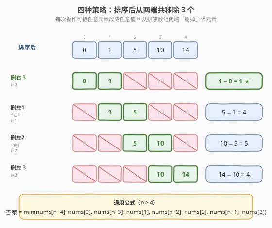
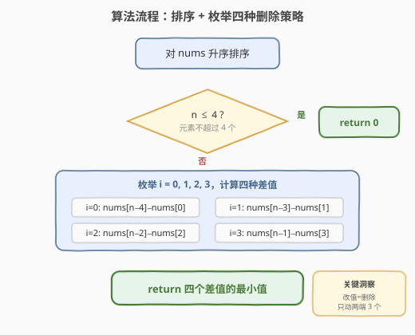

# 三次操作后最大值与最小值的最小差

- **题目名称**：三次操作后最大值与最小值的最小差
- **链接**：[1509. 三次操作后最大值与最小值的最小差](https://leetcode.cn/problems/minimum-difference-between-largest-and-smallest-value-in-three-moves/)
- **难度**：中等
- **标签**：数组、排序、贪心

## 1. 题目概述

给你一个数组 `nums`。每次操作可以选择 `nums` 中的任意一个元素并将它改成**任意值**。在**执行最多三次操作后**，返回 `nums` 中最大值与最小值的最小差值。

**示例 1**：

```text
输入：nums = [5,3,2,4]
输出：0
解释：3 次操作可将所有元素改为 3，差值为 0。
```

**示例 2**：

```text
输入：nums = [1,5,0,10,14]
输出：1
解释：改 5→0, 10→0, 14→1，得到 [1,0,0,0,1]，差值为 1。
```

**示例 3**：

```text
输入：nums = [3,100,20]
输出：0
解释：只有 3 个元素，3 次操作可全部改成同一个值。
```

**约束条件**：

- `1 <= nums.length <= 10^5`
- `-10^9 <= nums[i] <= 10^9`

> 💡 「改成任意值」意味着我们可以把一个元素彻底「消除」——改成和某个保留元素相同的值，让它不再影响最大值或最小值。因此**一次操作等价于从数组中删除一个元素**（对极值差而言），三次操作 = 最多删 3 个。

---

## 2. 解题思路

### 2.1 暴力思路

枚举所有可能的操作组合：从 `n` 个元素中选最多 3 个修改，每个可改为任意值。这等于枚举删 0/1/2/3 个元素后剩余数组的极值差。对于删 3 个的情况，组合数为 $C(n, 3)$，再对每种组合求极值差 $O(n)$，总体 $O(n^4)$，当 $n = 10^5$ 时完全不可行。

> 💡 转换视角：我们真正关心的只是**剩余数组的最大值和最小值之差**。而最大值和最小值一定来自排序数组的两端——所以只需决定从两端各删几个。

### 2.2 核心观察：排序 + 枚举四种删除策略



关键洞察分两步：

1. **排序**后，数组的最大值和最小值分别在两端。改一个元素等价于「删掉」它（改成和邻居一样），而删掉中间元素不影响极值——**只有删两端的元素才会缩小极值差**。

2. 三次操作最多删 3 个元素，且**只删两端的才有意义**。设从左端删 $i$ 个、从右端删 $3-i$ 个（$i = 0,1,2,3$），共 4 种策略。每种策略保留的连续段为 `nums[i .. n-4+i]`，极值差为：

$$\text{diff}_i = \text{nums}[n-4+i] - \text{nums}[i], \quad i = 0,1,2,3$$

展开即四种情况：

| $i$ | 删左 | 删右 | 保留区间 | 极值差 |
|-----|------|------|----------|--------|
| 0 | 0 | 3 | `nums[0 .. n-4]` | `nums[n-4] - nums[0]` |
| 1 | 1 | 2 | `nums[1 .. n-3]` | `nums[n-3] - nums[1]` |
| 2 | 2 | 1 | `nums[2 .. n-2]` | `nums[n-2] - nums[2]` |
| 3 | 3 | 0 | `nums[3 .. n-1]` | `nums[n-1] - nums[3]` |

> ⚠️ **为什么删中间元素没意义？** 删中间元素既不改变当前最小值（左端）也不改变当前最大值（右端），极值差不变——纯属浪费一次操作。因此最优策略一定是从两端删。

> ⚠️ **边界 $n \le 4$**：若元素不超过 4 个，3 次操作可以把它们全部改成同一个值，差值必然为 0。公式中 `nums[n-4]` 在 $n = 4$ 时为 `nums[0]`，四种差值都为 0，自然正确；$n < 4$ 时需提前返回 0（避免下标越界）。

### 2.3 算法流程图



流程非常简洁：排序 → 判 $n \le 4$ → 计算 4 个差值 → 取最小。

### 2.4 示例演算

![示例演算：nums = [1, 5, 0, 10, 14]](../images/mindiff_three_moves_walkthrough.svg)

以示例 2 `nums = [1, 5, 0, 10, 14]` 为例：

- **排序**后得到 `[0, 1, 5, 10, 14]`，$n = 5$。
- 四种策略的极值差分别为 $1, 4, 5, 4$。
- 最小值为 $1$（删右端 3 个，保留 `[0, 1]`）。

---

## 3. 参考代码

### C++

```cpp
class Solution {
  public:
    int minDifference(vector<int>& nums) {
        int n = nums.size();
        if (n <= 4) return 0;
        sort(nums.begin(), nums.end());
        int ans = INT_MAX;
        for (int i = 0; i <= 3; ++i) {
            ans = min(ans, nums[n - 4 + i] - nums[i]);
        }
        return ans;
    }
};
```

### Python

```python
class Solution:
    def minDifference(self, nums: list[int]) -> int:
        n = len(nums)
        if n <= 4:
            return 0
        nums.sort()
        return min(nums[n - 4 + i] - nums[i] for i in range(4))
```

> 💡 **循环写法 vs 展开写法**：循环 `for i in range(4)` 和直接写 `min(nums[n-4]-nums[0], nums[n-3]-nums[1], nums[n-2]-nums[2], nums[n-1]-nums[3])` 完全等价。循环版更简洁且不易写错下标，推荐使用。

---

## 4. 复杂度分析

| 维度 | 复杂度 | 说明 |
|------|--------|------|
| 时间复杂度 | $O(n \log n)$ | 排序主导 $O(n \log n)$，枚举 4 种策略 $O(1)$ |
| 空间复杂度 | $O(\log n)$ | 排序所需栈空间（C++ `std::sort` 为内省排序；Python `list.sort` 为 TimSort） |

> 💡 本题 $n \le 10^5$，$O(n \log n)$ 完全可接受。排序是唯一的瓶颈，4 次比较是常数时间。

---

## 5. 扩展：推广到 $k$ 次操作

若将「最多 3 次操作」推广为「最多 $k$ 次操作」，算法结构不变——排序后枚举 $i = 0, 1, \ldots, k$，取：

$$\min_{i=0}^{k} \big(\text{nums}[n - k - 1 + i] - \text{nums}[i]\big)$$

时间复杂度仍为 $O(n \log n + k)$。当 $k \ge n - 1$ 时可将所有元素改为同一值，差值为 0。

> 💡 [1984. 学生分数的最小差值](https://leetcode.cn/problems/minimum-difference-between-highest-and-lowest-of-k-scores/) 正是这一推广：从数组中选 $k$ 个元素使极值差最小。解法完全同构——排序后枚举所有长度为 $k$ 的连续段，取极值差最小值。

---

## 6. 面试要点

1. **为什么「改成任意值」等价于「删除」？**

   - 极值差只取决于最大值和最小值。把一个元素改成和某个保留元素相同，它既不成为新的最大也不成为新的最小——等价于它不存在。因此一次操作 = 删一个元素（对极值差而言）。

2. **为什么只需考虑删两端的元素？**

   - 排序后，极值在两端。删中间元素不改变当前最小值和最大值，极值差不变，纯属浪费操作次数。所以最优策略一定是从两端删，共 4 种分配方式（左 $i$ 个 + 右 $3-i$ 个）。

3. **$n \le 4$ 时为什么直接返回 0？**

   - 4 个元素用 3 次操作可以把其中 3 个改成和第 4 个相同，全部相等，差值为 0。少于 4 个同理。代码中需提前判断以避免 `nums[n-4]` 下标越界。

4. **能否不排序做到更优？**

   - 排序的目的是快速拿到两端的极值。实际上只需排序后数组的**最小的 4 个值**和**最大的 4 个值**（共 8 个），用 `nth_element` 或维护两个大小为 4 的堆可以在 $O(n)$ 时间完成。但实现复杂度高，$O(n \log n)$ 已足够，面试中不必追求。

5. **与 1984. 学生分数的最小差值的联系？**

   - 1984 是选 $k$ 个元素最小化极值差，等价于「删 $n-k$ 个元素」。本题 $k = n - 3$（删 3 个）是 1984 的特例。两者解法完全同构：排序 + 枚举连续段。

---

## 7. 同类练习题

- [1984. 学生分数的最小差值](https://leetcode.cn/problems/minimum-difference-between-highest-and-lowest-of-k-scores/)：本题的泛化版，选 k 个元素最小化极值差，排序 + 滑动窗口
- [561. 数组拆分](https://leetcode.cn/problems/array-partition/)：排序后贪心配对取每对最小值之和，同为「排序后利用有序性」的贪心
- [414. 第三大的数](https://leetcode.cn/problems/third-maximum-number/)：一次遍历维护前三大极值，与「只需排序后两端各 4 个」的优化思路同源
- [2144. 打折购买糖果的最小费用](https://leetcode.cn/problems/minimum-cost-of-buying-candies-with-discounts/)：排序 + 贪心选免费糖果，同属排序后贪心决策模式
