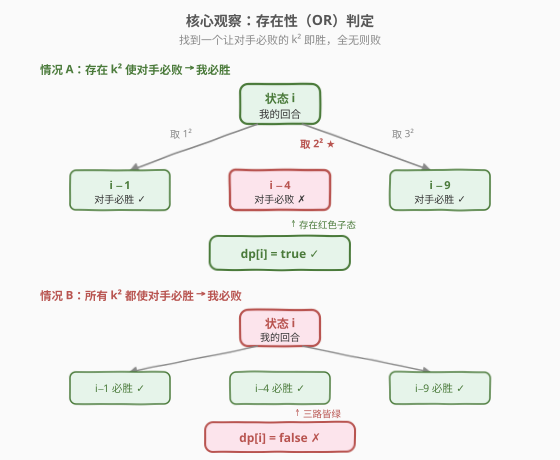
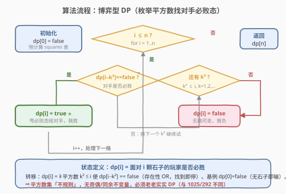

# LeetCode 石子游戏 IV 题解

## 1. 题目概述

- **标题 / 题号**：石子游戏 IV（#1510，hard）
- **链接**：https://leetcode.cn/problems/stone-game-iv/
- **难度**：困难
- **标签**：博弈、动态规划、数学、记忆化搜索

**题意**：Alice 和 Bob 轮流玩一个游戏，**Alice 先手**。一开始有 `n` 个石子堆在一起。每一轮，正在操作的玩家可以从石子堆里拿走**任意非零平方数**个石子（即 $1, 4, 9, 16, \ldots$ 个）。若石子堆没有石子了，则无法操作的玩家**输**。已知两人都采取**最优策略**，返回 Alice 是否获胜。

**示例 1**：

```text
输入：n = 1
输出：true
解释：Alice 拿走 1 个石子（1²），剩 0，Bob 无法操作，Alice 胜。
```

**示例 2**：

```text
输入：n = 2
输出：false
解释：Alice 只能拿 1 个，剩 1；Bob 拿走最后 1 个，Alice 输（2 → 1 → 0）。
```

**示例 3**：

```text
输入：n = 4
输出：true
解释：4 本身是平方数，Alice 一次拿完 4 个（2²），直接胜（4 → 0）。
```

**示例 4**：

```text
输入：n = 7
输出：false
解释：Alice 拿 4（2²）剩 3 → Bob 拿 1 剩 2 → Alice 拿 1 剩 1 → Bob 拿走最后 1 个胜（7 → 3 → 2 → 1 → 0）。
       Alice 拿 1 剩 6 → Bob 拿 4 剩 2 → Alice 拿 1 剩 1 → Bob 拿走最后 1 个胜（7 → 6 → 2 → 1 → 0）。两路皆负。
```

**示例 5**：

```text
输入：n = 17
输出：false
解释：Bob 采取最优策略时 Alice 无法获胜。
```

**约束**：

- $1 \leq n \leq 10^5$

> 💡 本题是「公平组合博弈」的招牌题，骨架与 [1025. 除数博弈](../1001-1100/1025_除数博弈.md) 几乎一致——都是「轮流把 $n$ 减小、减不动者输」。差别只在「可减的数集」：1025 是 $n$ 的真因数，本题是平方数。然而正是这一差别让结局截然不同：1025 的真因数集隐藏了奇偶不变量，可一步化简为 `n%2==0`；平方数集却「足够不规则」，**没有任何简单的解析结论**，必须老老实实做博弈型 DP。

## 2. 解题思路

### 2.1 暴力思路：DFS 枚举所有合法操作

最直接的写法是递归：对当前石子数 $n$，枚举每个平方数 $k^2 \leq n$，递归到 $n - k^2$。若存在某个 $k^2$ 使**对手在 $n - k^2$ 必败**，则我在 $n$ 必胜；否则必败。

```python
@lru_cache(None)
def win(n):
    if n == 0:
        return False
    k = 1
    while k * k <= n:
        if not win(n - k * k):
            return True
        k += 1
    return False
```

未加记忆化时递归树指数爆炸（每步可选 $\sqrt n$ 个平方数）。加上 `lru_cache` 后状态数为 $n$、每状态枚举 $O(\sqrt n)$ 个平方数，总复杂度 $O(n\sqrt n)$，$n=10^5$ 时约 $2\times 10^7$ 完全可接受——这就是正解。与 1025 不同的是，**这里没有可提炼的解析不变量**，DP 不是「绕了一圈」而是「别无选择」。

> 💡 转机本来应该是「把 `win(n)` 真值表列出来找规律」（像 1025 那样）。列出来确实会看到一个**诱人的周期**——但它是假的（见 2.4）。这道题的最大价值恰恰在于教会你「小样本周期性须验证到大数后再下结论」。

### 2.2 核心观察：博弈型 DP（存在性 OR 判定）



定义一维布尔状态：

> $\text{dp}[i]$ = 面对恰好 $i$ 颗石子的玩家，在双方最优策略下是否必胜。

合法操作是「取 $k^2$ 颗」（$k \geq 1,\ k^2 \leq i$），取完后剩 $i - k^2$ 颗交给对手。于是：

- **若存在**某个 $k^2$ 使对手在 $i - k^2$ **必败**（$\text{dp}[i - k^2] = \text{false}$），则我能把必败态甩给对手，**我必胜**；
- **若所有**合法 $k^2$ 都使对手必胜（$\text{dp}[i - k^2] = \text{true}$），则无论怎么走对手都赢，**我必败**。

这正是典型的**存在性（OR）判定**——找到一条通向对手必败态的转移即停（短路）：

$$
\text{dp}[i] = \bigvee_{\substack{k \geq 1 \\ k^2 \leq i}} \neg\, \text{dp}\!\left[i - k^2\right]
$$

- **基例**：$\text{dp}[0] = \text{false}$（无石子可取，无法操作即输）。
- **答案**：$\text{dp}[n]$（Alice 先手面对 $n$ 颗）。

> ⚠️ **易错点**：判定条件是「对手在 $i-k^2$ 必败」即 $\text{dp}[i-k^2]=\text{false}$，不是 `true`。若写反成「通向对手必胜态才胜」，逻辑完全颠倒。另外内层一旦命中即 `break`，是**存在性短路**，不必枚举所有 $k$。

### 2.3 算法流程图



外层按 $i = 1 \ldots n$ 顺序递推（$\text{dp}[i]$ 只依赖更小的 $\text{dp}[i-k^2]$，天然无环）；内层枚举 $k = 1, 2, \ldots$ 直到 $k^2 > i$。平方数表可在递推前预生成，也可直接用 `k*k` 现算（$k$ 上界 $\lfloor\sqrt i\rfloor$）。

### 2.4 示例演算

以 $n = 0 \ldots 17$ 为例逐格递推（恰好覆盖全部 5 个示例）：

![示例演算：dp[0..17] 逐格递推](../images/stonegame_iv_walkthrough.svg)

| $n$ | 可取 $k^2$ | $\text{dp}[n-k^2]$ 取值 | 是否存在 F | $\text{dp}[n]$ | 制胜 $k^2$ |
|-----|-----------|------------------------|-----------|----------------|-----------|
| 0 | —（无） | — | 否 | **F** | — |
| 1 | 1 | $\text{dp}[0]=\text{F}$ | 是 | **T** | 1 |
| 2 | 1 | $\text{dp}[1]=\text{T}$ | 否 | **F** | — |
| 3 | 1 | $\text{dp}[2]=\text{F}$ | 是 | **T** | 1 |
| 4 | 1, 4 | $\text{dp}[3]=\text{T},\ \text{dp}[0]=\text{F}$ | 是（$k=2$） | **T** | 4 |
| 5 | 1, 4 | $\text{dp}[4]=\text{T},\ \text{dp}[1]=\text{T}$ | 否 | **F** | — |
| 6 | 1, 4 | $\text{dp}[5]=\text{F},\ldots$ | 是（$k=1$） | **T** | 1 |
| 7 | 1, 4 | $\text{dp}[6]=\text{T},\ \text{dp}[3]=\text{T}$ | 否 | **F** | — |
| 8 | 1, 4 | $\text{dp}[7]=\text{F},\ldots$ | 是（$k=1$） | **T** | 1 |
| 9 | 1, 4, 9 | $\text{dp}[8]=\text{T},\ \text{dp}[5]=\text{F},\ldots$ | 是（$k=2$） | **T** | 4 |
| 10 | 1, 4, 9 | $\text{dp}[9]=\text{T},\ \text{dp}[6]=\text{T},\ \text{dp}[1]=\text{T}$ | 否 | **F** | — |
| 17 | 1, 4, 9, 16 | $\text{dp}[16]=\text{T},\ \text{dp}[13]=\text{T},\ \text{dp}[8]=\text{T},\ \text{dp}[1]=\text{T}$ | 否 | **F** | — |

> 💡 5 个示例逐一落点：$n=1,4$ → T（示例 1、3）；$n=2,7,17$ → F（示例 2、4、5）。

> ⚠️ **当心「假周期」**：观察 $n \leq 24$ 的败位 $0,2,5,7,10,12,15,17,20,22$，它们恰好 $\equiv 0$ 或 $2 \pmod 5$，制胜操作也漂亮地循环 `1,1,4`。看起来像 1025 那样的不变量呼之欲出——**但这是小样本巧合**。原因在于：当 $n < 25$ 时，可选平方数只有 $1,4,9,16$（全是 $\equiv 0,1,4 \pmod 5$ 的数），恰好让模 5 结构稳定。一旦 $n \geq 25$，$5^2=25$ 进入可选集（$25 \equiv 0 \pmod 5$，且取 25 可一步清零），模 5 推理立刻失效：$\text{dp}[25] = \text{true}$（并非败位），而真正的下一个败位是 **34** 而非 25。
>
> 这正是「减平方数博弈」（subtract-a-square）的著名性质：其败位序列 $0,2,5,7,10,12,15,17,20,22,34,39,44,52,\ldots$ **不是最终周期的**（non-periodic），密度趋零、无闭式。所以本题**不能**像 1025/292 那样化简为 $O(1)$，DP 是必经之路。

## 3. 参考代码

### C++

```cpp
class Solution {
  public:
    bool winnerSquareGame(int n) {
        vector<bool> dp(n + 1, false);
        for (int i = 1; i <= n; ++i) {
            for (int k = 1; k * k <= i; ++k) {
                if (!dp[i - k * k]) {
                    dp[i] = true;
                    break;          // 存在性判定，找到即停
                }
            }
        }
        return dp[n];
    }
};
```

### Python

```python
class Solution:
    def winnerSquareGame(self, n: int) -> bool:
        dp = [False] * (n + 1)
        for i in range(1, n + 1):
            k = 1
            while k * k <= i:
                if not dp[i - k * k]:
                    dp[i] = True
                    break        # 存在性判定，找到即停
                k += 1
        return dp[n]
```

**记忆化 DFS 写法**（思路等价，更贴近「博弈」直觉，面试可先写此版再转迭代）：

```python
class Solution:
    def winnerSquareGame(self, n: int) -> bool:
        @lru_cache(None)
        def dp(i: int) -> bool:
            if i == 0:
                return False
            k = 1
            while k * k <= i:
                if not dp(i - k * k):
                    return True
                k += 1
            return False
        return dp(n)
```

> 💡 **迭代 vs 记忆化**：$n=10^5$ 时 Python 的 `lru_cache` 递归版本深度可达 $10^5$，可能触发 `RecursionError`（默认上限 1000），需 `sys.setrecursionlimit`。迭代版本无此顾虑、常数更小，是稳妥首选。C++ 两版皆可。

## 4. 复杂度分析

| 维度 | 复杂度 | 说明 |
|------|--------|------|
| 时间复杂度 | $O(n\sqrt n)$ | 状态数 $O(n)$，每状态枚举 $\lfloor\sqrt i\rfloor \leq \sqrt n$ 个平方数；总和 $\sum_{i=1}^{n}\sqrt i \approx \tfrac{2}{3}n^{3/2}$ |
| 空间复杂度 | $O(n)$ | 一维 dp 数组（$\sqrt n$ 个平方数可现算或预存，$O(\sqrt n)$ 可忽略） |

$n=10^5$ 时 $\tfrac{2}{3}n^{3/2} \approx 2.1\times 10^7$ 次内层判断，C++ 稳过；Python 纯循环也可在时限内 AC（存在性短路使实际常数远小于上界）。

## 5. 扩展：为什么没有 $O(1)$ 结论？

[1025. 除数博弈](../1001-1100/1025_除数博弈.md) 与 [292. Nim 游戏](../0201-0300/292_Nim游戏.md) 都能从 DP 真值表提炼出「一步化简」的数学结论（分别是 `n%2==0` 与 `n%4!=0`）。本题看似同形，为何不行？

**关键在于「可选数集」的结构**：

| 博弈 | 可减数集 | 集合性质 | 是否有不变量 |
|------|----------|----------|--------------|
| 1025 除数博弈 | $n$ 的真因数 | 含 $1$；奇数的真因数全奇 | 有：奇偶不变量 |
| 292 Nim | $1\sim3$（或推广为 $1\sim m$） | 连续小区间 | 有：模 $(m+1)$ 不变量 |
| 1510 石子游戏 IV | $1,4,9,16,25,\ldots$ | 平方数，间隔越来越大、模任意数都不均匀 | **无**：败位序列非最终周期 |

- 1025 的「命门」是「奇数的真因数全为奇」——这把整棵博弈树压成一条奇偶交替链。
- 1510 没有这样的命门：平方数 $1,4,9,16,25,\ldots$ 模 5 分别是 $1,4,4,1,0,\ldots$，模 4 分别是 $1,0,1,0,1,\ldots$，模任意 $m$ 都不构成「把对手锁死在单一剩余类」的结构。新平方数（如 $25, 36, \ldots$）的不断加入会反复「解锁」之前被锁的败位，使周期无法稳定。

> 💡 **可证明的结论**：减平方数博弈的败位（cold position）序列已知**不是最终周期的**，且密度趋于 0。这是组合博弈论中「subtraction game」的经典反例——当减数集本身不是「最终周期」的（平方数集的差分 $1,3,5,7,\ldots$ 趋于无穷，集合非最终周期），败位序列也一般不最终周期。所以任何「小样本看出的周期」都必须用大数验证，否则极易踩坑。

## 6. 面试要点

1. **状态怎么定义？为什么是一维而不是区间 DP？**
   - $\text{dp}[i]$ = 面对 $i$ 颗石子是否必胜。游戏状态只由「剩余石子数」单一变量决定，不涉及区间两端或位置，所以是一维 DP，比 [877 石子游戏](../0801-0900/877_石子游戏.md) 的区间 DP 更简单。

2. **转移方程怎么写？为什么是「存在性 OR」？**
   - $\text{dp}[i] = \exists\, k^2 \leq i,\ \text{dp}[i-k^2]=\text{false}$。当前玩家只要找到**一条**通向对手必败态的转移即胜，是存在性判定，找到即 `break` 短路，不必枚举所有 $k$。

3. **基例为什么是 $\text{dp}[0]=\text{false}$ 而不是 $\text{dp}[1]$？**
   - 本题「无法操作」发生在「石子数为 0」时（没有非零平方数 $\leq 0$），所以败态基例在 $i=0$。这与 1025 不同——1025 的「无法操作」发生在 $n=1$（1 没有真因数），基例在 $n=1$。基例位置由「何时无可操作」决定。

4. **能不能像 1025/292 那样找规律做到 $O(1)$？**
   - 不能。平方数集「足够不规则」，败位序列非最终周期。小样本下看似有「败位 $\equiv 0,2\pmod 5$」的规律，但 $n=25$ 起 $5^2$ 进入可选集后即被打破（$\text{dp}[25]=\text{true}$，下一个败位是 34）。这是博弈题「切忌归纳过快」的典型教训。

5. **时间复杂度 $O(n\sqrt n)$ 在 $n=10^5$ 够吗？**
   - $\sum_{i=1}^{n}\sqrt i \approx \tfrac{2}{3}n^{3/2} \approx 2.1\times 10^7$，加上存在性短路使常数远小于上界，C++/Python 均可 AC。若 $n$ 大到 $10^9$，则需转向博弈论结论或打表找稀疏败位（本题数据范围未到此程度）。

## 同类练习题

| # | 题目 | 与本题的关联 |
|---|------|-------------|
| 1025 | [除数博弈](https://leetcode.cn/problems/divisor-game/)（[题解](../1001-1100/1025_除数博弈.md)） | 同骨架「轮流减小 $n$」，但可减数是真因数，隐藏奇偶不变量可化简为 `n%2==0`——对比本题「无不变量」的差异 |
| 292 | [Nim 游戏](https://leetcode.cn/problems/nim-game/)（[题解](../0201-0300/292_Nim游戏.md)） | 可减数是连续 $1\sim3$，模 4 不变量秒杀，对比平方数集「非周期」为何无法同样化简 |
| 877 | [石子游戏](https://leetcode.cn/problems/stone-game/)（[题解](../0801-0900/877_石子游戏.md)） | 石子游戏系列母模板，区间 DP + Minimax 净赚差，对比本题一维布尔博弈 DP 的状态降阶 |
| 1406 | [石子游戏 III](https://leetcode.cn/problems/stone-game-iii/) | 石子游戏系列一维后缀 DP + 负值，对比本题「取数减量」与「取堆前进」两种一维视角 |
| 294 | [翻转游戏 II](https://leetcode.cn/problems/flip-game-ii/)（[题解](../0201-0300/294_翻转游戏II.md)） | 记忆化搜索博弈，状态空间大、无解析规律，同为「必须搜索/DP」的博弈家族 |
