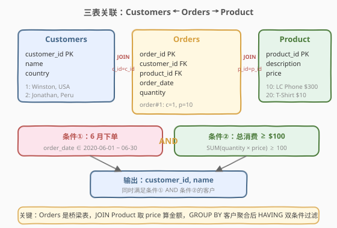
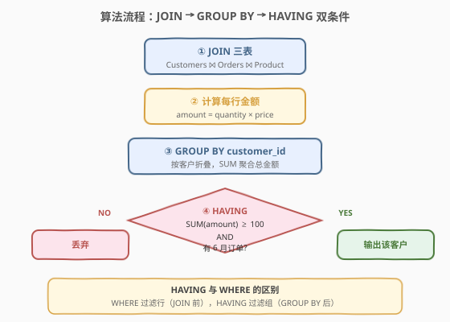
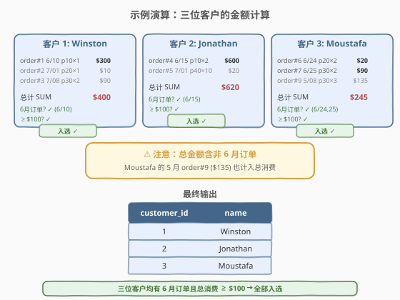

# 消费者下单频率

- **题目名称**：消费者下单频率
- **链接**：[1511. 消费者下单频率](https://leetcode.cn/problems/customer-order-frequency/)
- **难度**：简单
- **标签**：SQL、多表 JOIN、GROUP BY、HAVING 聚合过滤、日期筛选

## 1. 题目概述

给定 `Customers`、`Product`、`Orders` 三张表，编写 SQL 查询，返回**同时满足以下两个条件**的客户的 `customer_id` 和 `name`：

1. **在 2020 年 6 月至少下过一单**（`order_date` 在 `2020-06-01` 至 `2020-06-30` 之间）。
2. **所有订单的总消费金额 ≥ $100**（总消费 = $\sum \text{quantity} \times \text{price}$，涵盖全部时间的订单，不限于 6 月）。

**表结构**：

```text
Table: Customers
+-------------+---------+
| Column Name | Type    |
+-------------+---------+
| customer_id | int     |  ← 主键
| name        | varchar |
| country     | varchar |
+-------------+---------+

Table: Product
+-------------+---------+
| Column Name | Type    |
+-------------+---------+
| product_id  | int     |  ← 主键
| description | varchar |
| price       | int     |
+-------------+---------+

Table: Orders
+-------------+------+
| Column Name | Type |
+-------------+------+
| order_id    | int  |  ← 主键
| customer_id | int  |  → Customers.customer_id
| product_id  | int  |  → Product.product_id
| order_date  | date |
| quantity    | int  |
+-------------+------+
```

**示例 1**：

```text
输入：
Customers 表:
+-------------+----------+---------+
| customer_id | name     | country |
+-------------+----------+---------+
| 1           | Winston  | USA     |
| 2           | Jonathan | Peru    |
| 3           | Moustafa | Egypt   |
+-------------+----------+---------+

Product 表:
+------------+-------------+-------+
| product_id | description | price |
+------------+-------------+-------+
| 10         | LC Phone    | 300   |
| 20         | LC T-Shirt  | 10    |
| 30         | LC Book     | 45    |
| 40         | LC Keychain | 2     |
+------------+-------------+-------+

Orders 表:
+----------+-------------+------------+------------+----------+
| order_id | customer_id | product_id | order_date | quantity |
+----------+-------------+------------+------------+----------+
| 1        | 1           | 10         | 2020-06-10 | 1        |
| 2        | 1           | 20         | 2020-07-01 | 1        |
| 3        | 1           | 30         | 2020-07-08 | 2        |
| 4        | 2           | 10         | 2020-06-15 | 2        |
| 5        | 2           | 40         | 2020-07-01 | 10       |
| 6        | 3           | 20         | 2020-06-24 | 2        |
| 7        | 3           | 30         | 2020-06-25 | 2        |
| 9        | 3           | 30         | 2020-05-08 | 3        |
+----------+-------------+------------+------------+----------+

输出:
+-------------+----------+
| customer_id | name     |
+-------------+----------+
| 1           | Winston  |
| 2           | Jonathan |
| 3           | Moustafa |
+-------------+----------+
```

**解释**：

| 客户 | 6 月订单 | 各订单金额 | 总消费 | 条件① | 条件② | 入选 |
|------|----------|-----------|--------|-------|-------|------|
| Winston (id=1) | order#1 (6/10) | $300 + $10 + $90 | $400 | ✓ | ✓ | ✓ |
| Jonathan (id=2) | order#4 (6/15) | $600 + $20 | $620 | ✓ | ✓ | ✓ |
| Moustafa (id=3) | order#6 (6/24), #7 (6/25) | $20 + $90 + $135 | $245 | ✓ | ✓ | ✓ |

> ⚠️ 注意 Moustafa 的 order#9 在 **5 月**（非 6 月），但金额 $135 仍计入总消费——条件②统计的是**全部订单**，不仅限 6 月。

**约束条件**：

- `order_id` 是 `Orders` 表的主键
- `customer_id` 是 `Customers` 表的主键
- `product_id` 是 `Product` 表的主键
- 结果可按任意顺序返回

> 💡 本题是 SQL **"多表 JOIN + 聚合 + HAVING 双条件"入门招牌题**——核心三步：① `JOIN` 三表取 `price`；② `GROUP BY customer_id` 聚合总金额；③ `HAVING` 同时校验"6 月有单"和"总消费 ≥ $100"两个条件。难点在于理解 `HAVING` 与 `WHERE` 的分工，以及"总消费涵盖全部订单"的统计口径。

---

## 2. 解题思路

### 2.1 暴力思路：逐客户扫描

最直觉的过程式思路：对每个客户，遍历 `Orders` 找出其所有订单，同时关联 `Product` 取价格算金额；再单独检查是否有 6 月的订单。伪代码：

```text
for each customer c:
    orders = SELECT * FROM Orders WHERE customer_id = c.id
    has_june = any(o.order_date in June for o in orders)
    total = sum(o.quantity * product_price(o.product_id) for o in orders)
    if has_june and total >= 100:
        result.append((c.customer_id, c.name))
```

但**纯 SQL 没有显式逐行循环**——"按客户分组聚合 + 组级条件过滤"需换成集合式表达：用 `GROUP BY customer_id` 把订单按客户折叠成一行，再用 `HAVING` 对聚合结果施加条件。

### 2.2 核心观察：JOIN 取价 + GROUP BY 聚合 + HAVING 双条件



**问题拆解为三个子问题**：

1. **取价格**：`Orders` 表只有 `product_id` 和 `quantity`，没有 `price`——需 `JOIN Product` 取价格，才能算每行金额 `quantity × price`。

2. **按客户聚合**：`GROUP BY customer_id` 把每个客户的所有订单行折叠成一行，`SUM(quantity × price)` 得到该客户的总消费。

3. **双条件过滤**：两个条件性质不同，需用不同手段：
   - **条件①（6 月有单）**：是"存在性"判断——聚合后检查该客户是否有至少一行 6 月订单。用 `SUM(CASE WHEN ... THEN 1 ELSE 0 END) > 0` 或 `MAX(order_date LIKE '2020-06%')` 在 `HAVING` 中判断。
   - **条件②（总消费 ≥ $100）**：是"聚合值"判断——直接 `HAVING SUM(quantity × price) >= 100`。

> 💡 **为何两个条件都放 `HAVING` 而非 `WHERE`？** `WHERE` 在 `GROUP BY` 之前执行，过滤的是**行**（单条订单）；条件②是聚合后的**组级**判断（总消费），必须用 `HAVING`。条件①虽可转化为"存在性"用 `WHERE` 预过滤，但如果先用 `WHERE order_date IN June` 过滤行，会把非 6 月订单丢掉，导致 `SUM` 只算 6 月金额——与题意"总消费涵盖全部订单"矛盾。故两个条件都必须在 `HAVING` 中判断。

> ⚠️ **最易错点**：把条件①写成 `WHERE order_date BETWEEN '2020-06-01' AND '2020-06-30'`。这会把非 6 月的订单行过滤掉，导致 `SUM` 只算 6 月金额。正确做法是 `JOIN` 时保留全部订单行，在 `HAVING` 中用 `CASE WHEN` 检查"是否存在 6 月订单"。

### 2.3 算法流程图



**逻辑执行步骤**：

| 步骤 | 子句 | 作用 |
|------|------|------|
| ① | `FROM Orders JOIN Product ON ... JOIN Customers ON ...` | 三表关联，每行订单获得 `price` 与 `name` |
| ② | 每行计算 `quantity × price` | 得到该订单的金额 |
| ③ | `GROUP BY customer_id` | 按客户折叠，`SUM` 聚合总金额 |
| ④ | `HAVING SUM(amount) >= 100 AND 有6月订单` | 组级双条件过滤，同时满足才输出 |

> 💡 **SQL 子句执行顺序**：`FROM`（含 `JOIN`/`ON`）→ `WHERE` → `GROUP BY` → `HAVING` → `SELECT` → `ORDER BY` → `LIMIT`。步骤 ① 的 `JOIN` 在 `FROM` 阶段完成，产出"订单 × 价格 × 客户名"的明细行集；步骤 ③ 的 `GROUP BY` 把明细按客户折叠；步骤 ④ 的 `HAVING` 在 `GROUP BY` 之后对聚合结果施加条件。本题**不使用 `WHERE`**——所有过滤都在 `HAVING` 中完成。

### 2.4 示例演算

以示例 1 数据为例，观察「JOIN 取价 → 按客户聚合 → HAVING 过滤」的逐步过程：



**步骤 ①②：JOIN 三表并计算每行金额**

`Orders JOIN Product ON product_id` 后，每条订单获得 `price`，金额 = `quantity × price`：

| order_id | customer | product | date | qty | price | 金额 |
|----------|----------|---------|------|-----|-------|------|
| 1 | Winston | LC Phone | 6/10 | 1 | 300 | $300 |
| 2 | Winston | T-Shirt | 7/01 | 1 | 10 | $10 |
| 3 | Winston | LC Book | 7/08 | 2 | 45 | $90 |
| 4 | Jonathan | LC Phone | 6/15 | 2 | 300 | $600 |
| 5 | Jonathan | Keychain | 7/01 | 10 | 2 | $20 |
| 6 | Moustafa | T-Shirt | 6/24 | 2 | 10 | $20 |
| 7 | Moustafa | LC Book | 6/25 | 2 | 45 | $90 |
| 9 | Moustafa | LC Book | 5/08 | 3 | 45 | $135 |

**步骤 ③：GROUP BY customer_id + SUM**

| 客户 | 各订单金额 | 总消费 | 6 月有单? |
|------|-----------|--------|----------|
| Winston | 300, 10, 90 | $400 | ✓ (6/10) |
| Jonathan | 600, 20 | $620 | ✓ (6/15) |
| Moustafa | 20, 90, 135 | $245 | ✓ (6/24, 6/25) |

**步骤 ④：HAVING 双条件过滤**

| 客户 | 总消费 ≥ $100? | 6 月有单? | 入选? |
|------|---------------|----------|-------|
| Winston | $400 ✓ | ✓ | ✓ |
| Jonathan | $620 ✓ | ✓ | ✓ |
| Moustafa | $245 ✓ | ✓ | ✓ |

三位客户全部入选。

> 💡 Moustafa 的 order#9 在 5 月（非 6 月），但其 $135 金额仍计入总消费 $245。若误用 `WHERE` 过滤 6 月订单，总消费只算 $20 + $90 = $110，虽仍 ≥ $100 巧合通过，但语义错误——换一组数据（如 5 月金额更大时）就会出错。

---

## 3. 参考代码

### SQL（解法 A：`HAVING + CASE WHEN`，推荐）

```sql
SELECT c.customer_id, c.name
FROM Customers c
JOIN Orders o ON c.customer_id = o.customer_id
JOIN Product p ON o.product_id = p.product_id
GROUP BY c.customer_id, c.name
HAVING SUM(o.quantity * p.price) >= 100
   AND SUM(CASE WHEN DATE_FORMAT(o.order_date, '%Y-%m') = '2020-06' THEN 1 ELSE 0 END) > 0;
```

> 💡 **写法要点**：
> - **`JOIN Product`**：`Orders` 只有 `product_id`，需关联 `Product` 取 `price` 才能算金额 `quantity × price`。
> - **`GROUP BY customer_id, name`**：按客户折叠，`SUM(quantity × price)` 得到总消费。`name` 放入 `GROUP BY` 是因 `SELECT` 中引用了它（SQL 标准要求非聚合列出现在 `GROUP BY` 中）。
> - **`HAVING` 两个条件用 `AND` 连接**：
>   - `SUM(quantity × price) >= 100`：总消费门槛（聚合值判断）。
>   - `SUM(CASE WHEN ... '2020-06' ... THEN 1 ELSE 0 END) > 0`：6 月订单存在性判断（每行 6 月订单记 1，否则 0，求和 > 0 即存在）。
> - **`DATE_FORMAT(order_date, '%Y-%m')`**：取年月前缀，与 `'2020-06'` 比较。也可用 `order_date BETWEEN '2020-06-01' AND '2020-06-30'`。
> - ✓ **最推荐**：`CASE WHEN` 在 `HAVING` 中判断存在性，不干扰 `SUM` 的全量统计，语义最清晰。

### SQL（解法 B：`EXISTS` 子查询版）

```sql
SELECT c.customer_id, c.name
FROM Customers c
JOIN Orders o ON c.customer_id = o.customer_id
JOIN Product p ON o.product_id = p.product_id
GROUP BY c.customer_id, c.name
HAVING SUM(o.quantity * p.price) >= 100
   AND EXISTS (
       SELECT 1 FROM Orders o2
       WHERE o2.customer_id = c.customer_id
         AND o2.order_date BETWEEN '2020-06-01' AND '2020-06-30'
   );
```

> 💡 **与解法 A 的区别**：把"6 月有单"的存在性判断从 `CASE WHEN` 换成 `EXISTS` 子查询。`EXISTS` 更直观地表达"存在性"语义，但引入了相关子查询（每组执行一次）。MySQL 8.x 优化器通常能将 `EXISTS` 优化为半连接（Semi-Join），性能与解法 A 相当。两种写法语义等价，按团队风格选择。

### SQL（解法 C：`WHERE` 预筛 + 子查询聚合）

```sql
SELECT c.customer_id, c.name
FROM Customers c
WHERE c.customer_id IN (
    SELECT customer_id
    FROM Orders
    WHERE order_date BETWEEN '2020-06-01' AND '2020-06-30'
)
AND c.customer_id IN (
    SELECT o.customer_id
    FROM Orders o
    JOIN Product p ON o.product_id = p.product_id
    GROUP BY o.customer_id
    HAVING SUM(o.quantity * p.price) >= 100
);
```

> 💡 **解法 C 的思路**：把两个条件拆成两个独立子查询，各自用 `IN` 过滤。条件①用 `WHERE order_date IN June` 过滤（子查询内只取 `customer_id`，不影响外层 `SUM`）；条件②单独聚合。两个 `IN` 取交集即同时满足的客户。写法更长但逻辑解耦清晰，适合复杂条件场景。

### Python（pandas）

```python
import pandas as pd

def customer_order_frequency(customers: pd.DataFrame, product: pd.DataFrame, orders: pd.DataFrame) -> pd.DataFrame:
    merged = orders.merge(product, on='product_id')
    merged['amount'] = merged['quantity'] * merged['price']
    grouped = merged.groupby('customer_id').agg(
        total=('amount', 'sum'),
        has_june=('order_date', lambda x: x.dt.to_period('M').eq(pd.Period('2020-06')).any())
    ).reset_index()
    qualified = grouped[(grouped['total'] >= 100) & (grouped['has_june'])]
    result = qualified.merge(customers[['customer_id', 'name']], on='customer_id')
    return result[['customer_id', 'name']]
```

> 💡 **pandas 对照**：
> - `orders.merge(product, on='product_id')` 对应 SQL 的 `JOIN Product`。
> - `merged['amount'] = quantity * price` 对应每行金额计算。
> - `.groupby('customer_id').agg(...)` 对应 `GROUP BY customer_id + SUM`。
> - `x.dt.to_period('M').eq(pd.Period('2020-06')).any()` 对应 `CASE WHEN ... '2020-06' ... > 0`——把日期转为年月 Period，判断是否有等于 `2020-06` 的。
> - 布尔索引 `total >= 100 & has_june` 对应 `HAVING` 双条件。
> - 最后 `.merge(customers)` 取 `name`，对应 `JOIN Customers`。

---

## 4. 复杂度分析

| 维度 | 解法 A（`HAVING + CASE WHEN`） | 解法 B（`EXISTS` 子查询） | 解法 C（双 `IN` 子查询） |
|------|-------------------------------|--------------------------|--------------------------|
| **时间** | $O(n)$ | $O(n)$ | $O(n \log n)$ |
| **空间** | $O(k)$ | $O(k)$ | $O(k)$ |
| **过滤位置** | `HAVING`（聚合后） | `HAVING` + 子查询 | `WHERE` + 子查询 |
| **语义清晰度** | ✓ 最清晰 | ✓ 直观（`EXISTS` 表存在性） | ✓ 解耦（条件独立） |
| **推荐度** | ✓ **首选** | ✓ 备选 | ✓ 复杂条件场景 |

> - $n$ = `Orders` 表行数，$k$ = 去重客户数
> - **时间**：解法 A/B 的 `JOIN` 在 `product_id`（主键）上探测 $O(1)$，$n$ 次探测 $O(n)$；`GROUP BY + SUM` 扫描 $n$ 行 $O(n)$。解法 C 的两个子查询各扫一次 `Orders`，第二个子查询还需 `JOIN + GROUP BY`，总计 $O(n)$，但 `IN` 去重可能引入排序 $O(n \log n)$
> - **空间**：`GROUP BY` 哈希表存储 $k$ 个客户的聚合中间结果 $O(k)$
> - **索引优化**：在 `Orders(customer_id)`、`Orders(product_id)` 上建索引可加速 `JOIN` 与 `GROUP BY`

---

## 5. 扩展：`HAVING` vs `WHERE` 的边界

### 5.1 本题为何不能用 `WHERE` 过滤 6 月

| 方案 | 6 月条件位置 | `SUM` 统计范围 | 结果 |
|------|-------------|---------------|------|
| ✅ `HAVING` | 聚合后 | **全部订单** | 总消费正确 |
| ❌ `WHERE` | 聚合前 | **仅 6 月订单** | 总消费偏小（漏算非 6 月金额） |

若误用 `WHERE order_date IN June`，`SUM(quantity × price)` 只累加 6 月订单的金额。以 Moustafa 为例：

| 方案 | 计入订单 | 总消费 | 是否 ≥ $100 |
|------|---------|--------|------------|
| ✅ `HAVING`（全部订单） | #6, #7, #9 | $20 + $90 + $135 = $245 | ✓ |
| ❌ `WHERE`（仅 6 月） | #6, #7 | $20 + $90 = $110 | ✓（巧合通过） |

> ⚠️ 本示例中 `WHERE` 误写恰好也通过（$110 ≥ $100），但这是数据巧合。若把 order#9 的金额从 $135 调大（如 $500），正确总消费 $610 远超 $100，但 `WHERE` 误写只算 $110 仍通过——看似没问题。真正的危险在于反向：若 6 月金额小而非 6 月金额大（如 6 月只买了 $10 的 T 恤、5 月买了 $500 的手机），`WHERE` 误写会算出 $10 < $100 错误淘汰该客户。**必须用 `HAVING` 保证 `SUM` 涵盖全部订单**。

### 5.2 何时该用 `WHERE` vs `HAVING`

| 条件类型 | 示例 | 用哪个 | 原因 |
|---------|------|--------|------|
| **行级过滤**（不涉及聚合） | `price > 50` | `WHERE` | 在 `GROUP BY` 前过滤行，减少聚合输入 |
| **组级过滤**（涉及聚合函数） | `SUM(amount) >= 100` | `HAVING` | 聚合后才能判断 |
| **存在性判断**（组内有某行满足） | "有 6 月订单" | `HAVING` + `CASE WHEN` | 不能用 `WHERE` 否则影响 `SUM` 范围 |

> 💡 **口诀**：`WHERE` 管"哪些行参与聚合"，`HAVING` 管"哪些组输出"。如果过滤条件会影响 `SUM` 的统计范围，就必须放 `HAVING`。

---

## 6. 面试要点

1. **为什么条件①（6 月有单）不能放在 `WHERE` 中？**

   > `WHERE` 在 `GROUP BY` 之前执行，会把非 6 月的订单行过滤掉，导致 `SUM(quantity × price)` 只累加 6 月金额——与题意"总消费涵盖全部订单"矛盾。必须把 6 月存在性判断放在 `HAVING` 中，用 `CASE WHEN` 检查，这样 `SUM` 的输入仍是全部订单行。

2. **`HAVING` 和 `WHERE` 的执行顺序与区别？**

   > SQL 执行顺序：`FROM` → `WHERE` → `GROUP BY` → `HAVING` → `SELECT` → `ORDER BY`。`WHERE` 过滤的是**行**（聚合前的明细），`HAVING` 过滤的是**组**（聚合后的结果）。`HAVING` 可以使用聚合函数（`SUM`/`COUNT`/`AVG`），`WHERE` 不可以。

3. **`SUM(CASE WHEN ... THEN 1 ELSE 0 END) > 0` 是什么意思？**

   > 这是 SQL 中判断"组内是否存在满足某条件的行"的惯用写法。对每行订单，若是 6 月则记 1 否则记 0；`SUM` 后 > 0 表示至少有一行 6 月订单。等价于 `EXISTS` 子查询或 `MAX(CASE WHEN ... THEN 1 ELSE 0 END) = 1`，但比 `EXISTS` 更紧凑，且与另一个 `HAVING` 条件写在同一子句中更统一。

4. **为什么 `GROUP BY` 中要写 `name`？**

   > SQL 标准要求 `SELECT` 中的非聚合列必须出现在 `GROUP BY` 中。本题 `SELECT c.customer_id, c.name`，`name` 不是聚合函数的参数，故需放入 `GROUP BY`。由于 `customer_id` 是主键、`name` 函数依赖于 `customer_id`，MySQL 在 `ONLY_FULL_GROUP_BY` 模式下允许只 `GROUP BY customer_id`，但写入 `name` 更符合标准 SQL 且可移植。

5. **如果题目改为"6 月消费 ≥ $100"（只算 6 月），该怎么写？**

   > 此时该用 `WHERE order_date BETWEEN '2020-06-01' AND '2020-06-30'` 预过滤行，再 `GROUP BY + HAVING SUM(quantity × price) >= 100`。因为总消费只算 6 月，`WHERE` 不会影响正确性，反而能减少 `GROUP BY` 的输入行数、提升性能。这正体现了"先想清楚 `SUM` 的统计范围，再决定过滤位置"的原则。

> 💡 **一句话总结**：1511 是 SQL **"多表 JOIN + 聚合 + HAVING 双条件"入门招牌题**——核心模板「`JOIN Product` 取 price → `GROUP BY customer_id` 聚合 → `HAVING SUM(amount) >= 100 AND CASE WHEN 6月 > 0`」。最大要点：**涉及聚合的过滤条件必须放 `HAVING`**，尤其当条件①的存在性判断不能干扰条件②的 `SUM` 统计范围时。

---

## 7. 同类练习题

- [586. 订单最多的客户](https://leetcode.cn/problems/customer-placing-the-largest-number-of-orders/)：`GROUP BY + COUNT + ORDER BY LIMIT 1`，同为「聚合 + 组级过滤」骨架，比 1511 更简单（单条件）
- [511. 游戏玩法分析 I](https://leetcode.cn/problems/game-play-analysis-i/)：`GROUP BY + MIN` 求首次登录，共享 1511 的「`GROUP BY customer_id` 聚合」模板
- [1068. 产品销售分析 I](https://leetcode.cn/problems/product-sales-analysis-i/)：多表 `JOIN` 关联销售表与产品表取详情，共享 1511 的「`JOIN Product` 取价格」骨架
- [1174. 即时食物配送 II](https://leetcode.cn/problems/immediate-food-delivery-ii/)：`GROUP BY + MIN` 求首次订单 → `JOIN` 回原表 → `AVG(布尔)` 算比例，在 1511 基础上叠加子查询关联
- [550. 游戏玩法分析 IV](https://leetcode.cn/problems/game-play-analysis-iv/)：首次登录次日留存比例，同为「聚合 + 条件筛选 + 均值」结构，难度递进
