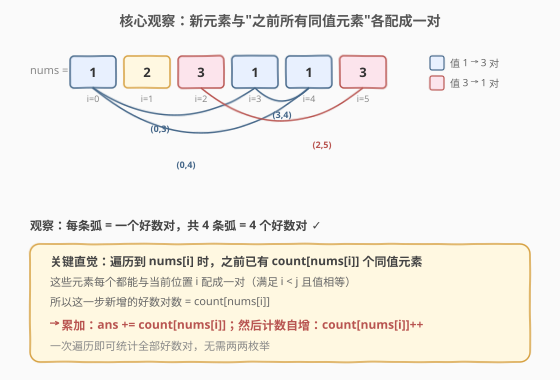
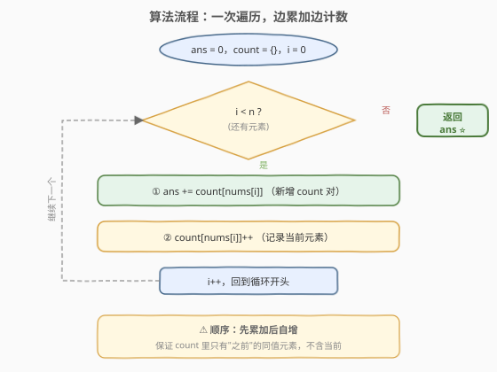

# 好数对的数目

- **题目名称**：好数对的数目
- **链接**：[1512. 好数对的数目](https://leetcode.cn/problems/number-of-good-pairs/)
- **难度**：简单
- **标签**：数组、哈希表、计数

## 1. 题目概述

给你一个整数数组 `nums`。如果一组下标 `(i, j)` 满足 `nums[i] == nums[j]` 且 `i < j`，就称这组下标为一个**好数对**。返回数组中好数对的数目。

**示例 1**：

```text
输入：nums = [1,2,3,1,1,3]
输出：4
解释：共有 4 个好数对：(0,3)、(0,4)、(3,4)、(2,5)，下标从 0 开始。
```

**示例 2**：

```text
输入：nums = [1,1,1,1]
输出：6
解释：数组中任意两个下标都构成好数对，共 C(4,2) = 6 个。
```

**示例 3**：

```text
输入：nums = [1,2,3]
输出：0
解释：没有两个元素相等，无好数对。
```

**约束条件**：

- `1 <= nums.length <= 100`
- `1 <= nums[i] <= 100`

> 💡 数据规模很小（$n \leq 100$），暴力 $O(n^2)$ 完全可过。但"好数对"本质是「同值元素的组合计数」，用哈希表一次遍历可做到 $O(n)$，是更体现思维深度的解法。

---

## 2. 解题思路

### 2.1 暴力思路：两层循环枚举所有数对

最直观的做法是用两层循环枚举所有 `(i, j)`（`i < j`），判断 `nums[i] == nums[j]` 则计数加一。

```text
for i in 0..n-1:
    for j in i+1..n-1:
        if nums[i] == nums[j]: ans += 1
```

时间复杂度 $O(n^2)$，对 $n = 100$ 仅约 $5000$ 次比较，轻松通过。问题在于：对每个 `nums[i]`，找"后面有多少个同值元素"用了重复的线性扫描——同值的元素被反复配对统计。如果能**按值分组**，一次性算出每组内部的配对数，就无需两两枚举。

### 2.2 核心观察：边遍历边计数，用哈希表累计配对



关键直觉：当好数对 $(i, j)$ 要求 `i < j` 且值相等时，**固定右端点 $j$** 看更高效——遍历到位置 $j$ 时，只需知道"在 $j$ 之前有多少个元素等于 `nums[j]`"，这些位置每个都能和 $j$ 配成一对。

用一个哈希表 `count` 记录"已经遍历过的每个值的出现次数"，遍历到 `nums[i]` 时：

- `count[nums[i]]` 就是**当前位置能新增的好数对数**（之前所有同值元素各配一对）。
- 把它累加进 `ans`，然后 `count[nums[i]]++` 记录当前元素，继续遍历。

> 💡 **为什么固定右端点而不是左端点？** 因为遍历是自左向右的，"之前出现过的元素"天然已记录在哈希表里，查 `count[nums[i]]` 即可得到左端点个数；若固定左端点则需预知"右边有多少个同值元素"，要么反向遍历、要么先全量统计。固定右端点让"查"和"存"在同一次遍历中完成。

> ⚠️ **顺序必须是"先累加后自增"**：若先 `count[nums[i]]++` 再 `ans += count[nums[i]]`，会把当前元素自己也算进去（自己和自己配对，违反 `i < j`）。先累加时 `count` 里只有"之前"的元素，正是合法的左端点。

### 2.3 算法流程图



整个流程是单层循环：查 `count[nums[i]]` 累加进 `ans` → `count[nums[i]]++` → 下一个。每个元素只查一次、存一次，总时间 $O(n)$。

### 2.4 示例演算

![示例演算：nums = [1,2,3,1,1,3]](../images/ngp_example_walkthrough.svg)

以 `nums = [1,2,3,1,1,3]` 为例：

- **i=0, nums[0]=1**：`count[1]=0`，新增 0 对。`ans=0`。存入 `count[1]=1`。
- **i=1, nums[1]=2**：`count[2]=0`，新增 0 对。`ans=0`。存入 `count[2]=1`。
- **i=2, nums[2]=3**：`count[3]=0`，新增 0 对。`ans=0`。存入 `count[3]=1`。
- **i=3, nums[3]=1**：`count[1]=1`，新增 1 对（与 i=0 配）。`ans=1`。存入 `count[1]=2`。
- **i=4, nums[4]=1**：`count[1]=2`，新增 2 对（与 i=0、i=3 各配）。`ans=3`。存入 `count[1]=3`。
- **i=5, nums[5]=3**：`count[3]=1`，新增 1 对（与 i=2 配）。`ans=4`。存入 `count[3]=2`。

最终 `ans = 0+0+0+1+2+1 = 4`，与示例一致 ⭐。

---

## 3. 参考代码

### C++（哈希表一次遍历）

```cpp
class Solution {
  public:
    int numIdenticalPairs(vector<int>& nums) {
        unordered_map<int, int> count;
        int ans = 0;
        for (int num : nums) {
            ans += count[num];      // 之前有多少个同值元素，就新增多少对
            count[num]++;           // 记录当前元素
        }
        return ans;
    }
};
```

### Python

```python
class Solution:
    def numIdenticalPairs(self, nums: list[int]) -> int:
        count = {}
        ans = 0
        for num in nums:
            ans += count.get(num, 0)  # 之前同值元素个数 = 新增对数
            count[num] = count.get(num, 0) + 1
        return ans
```

> 💡 **值域很小可换定长数组**：题目保证 `1 <= nums[i] <= 100`，可用 `int count[101] = {0};` 替代哈希表，省去哈希开销，常数更小。这是"值域小→用数组代替哈希表"的通用优化，与 [448. 找到所有数组中消失的数字](https://leetcode.cn/problems/find-all-numbers-disappeared-in-an-array/) 的下标当哈希键思路同源。

```cpp
// 定长数组版（值域 1..100）
int numIdenticalPairs(vector<int>& nums) {
    int count[101] = {0}, ans = 0;
    for (int num : nums) ans += count[num]++;
    return ans;
}
```

> ⚠️ 上面 `ans += count[num]++` 利用了后置 `++` 返回旧值的特性，正好实现"先累加旧值再自增"，一行搞定。可读性见仁见智，面试时建议先写清晰版，再提及此简写。

---

## 4. 复杂度分析

| 维度 | 复杂度 | 说明 |
|------|--------|------|
| 时间复杂度 | $O(n)$ | 遍历一次数组，每次哈希表操作 $O(1)$ |
| 空间复杂度 | $O(n)$ | 最坏情况所有元素互异，哈希表存 $n$ 个键；值域受限于 100 时实际为 $O(\min(n, 100)) = O(1)$ |

---

## 5. 扩展：分组 + 组合公式 $C(c, 2)$

如果不需要"边遍历边算"，可先统计每个值的出现次数，再用组合数一次性求和：值为 $v$ 的元素出现 $c$ 次，则它们内部能配成 $C(c, 2) = \frac{c(c-1)}{2}$ 个好数对。

```cpp
int numIdenticalPairs(vector<int>& nums) {
    unordered_map<int, int> count;
    for (int num : nums) count[num]++;
    int ans = 0;
    for (auto& [v, c] : count) ans += c * (c - 1) / 2;
    return ans;
}
```

| 维度 | 复杂度 | 说明 |
|------|--------|------|
| 时间复杂度 | $O(n)$ | 一次遍历统计 + 一次遍历求和 |
| 空间复杂度 | $O(n)$ | 哈希表存储频率 |

> 💡 **两种解法等价**：边遍历边累加的本质，是把 $C(c, 2) = 0+1+2+\cdots+(c-1)$ 拆成增量——每来一个新元素就加上"当前的左端点数"。两者数学结果相同：$\sum_{i} \text{count}[\text{nums}[i]]_{\text{遍历前}} = \sum_{v} C(c_v, 2)$。组合公式版更适合"已知全量频率"的场景（如 [2001. 可互换矩形的数目](https://leetcode.cn/problems/number-of-pairs-of-interchangeable-rectangles-in-a-matrix/)）。

---

## 6. 面试要点

1. **为什么用哈希表？它把哪一步从 $O(n)$ 降到了 $O(1)$？**

   - 暴力法对每个右端点 $j$，向左线性扫描统计同值元素个数，这一步 $O(n)$。哈希表把"查之前有多少个同值元素"优化到 $O(1)$ 平均，整体从 $O(n^2)$ 降到 $O(n)$。

2. **为什么必须"先累加后自增"？**

   - 先自增会把当前元素自己也计入 `count`，导致 `ans += count[num]` 时多算了一个"自己和自己"的对，违反 `i < j`。先累加时 `count` 里只有当前元素**之前**的元素，正好是合法的左端点。

3. **值域很小时有什么优化？**

   - 本题 `1 <= nums[i] <= 100`，可用 `int count[101]` 定长数组替代哈希表，省去哈希函数开销，空间也降为 $O(1)$。这是"值域小→数组代替哈希"的通用技巧。

4. **边遍历边累加和组合公式法有什么关系？**

   - 数学等价。边遍历版把 $C(c, 2) = 0+1+\cdots+(c-1)$ 拆成增量逐步累加；组合公式版先统计频率再一次性求 $C(c, 2)$。前者只需一次遍历、流式处理；后者需要先拿到全量频率，适合数据已分组或需多次查询的场景。

5. **如果题目改成"统计三元组 $(i,j,k)$ 满足 $i<j<k$ 且值相等"呢？**

   - 同值元素出现 $c$ 次时，三元组数为 $C(c, 3) = \frac{c(c-1)(c-2)}{6}$。也可用类似"边遍历边累加"的增量思路：维护每个值的"已配对数" `pairs[v]`，遍历时 `ans += pairs[num]`，再 `pairs[num] += count[num]`、`count[num]++`。把"组合数"拆成逐层增量是 $k$ 元组计数的通用套路。

---

## 7. 同类练习题

- [1. 两数之和](https://leetcode.cn/problems/two-sum/)（[题解](../0001-0100/1_两数之和.md)）：哈希表一次遍历查补数，同为"边查边存"范式
- [2001. 可互换矩形的数目](https://leetcode.cn/problems/number-of-pairs-of-interchangeable-rectangles-in-a-matrix/)：分组 + $C(c,2)$ 组合计数，与本题扩展解法同源
- [242. 有效的字母异位词](https://leetcode.cn/problems/valid-anagram/)：字符频率计数，哈希表统计出现次数的基础应用
- [1394. 找出数组中的幸运数](https://leetcode.cn/problems/find-lucky-integer-in-an-array/)：哈希频率统计 + 按值筛选，巩固计数思维
- [2341. 数组能形成多少数对](https://leetcode.cn/problems/maximum-number-of-pairs-in-array/)：同值配对计数，本题的变体（每组留一个）
