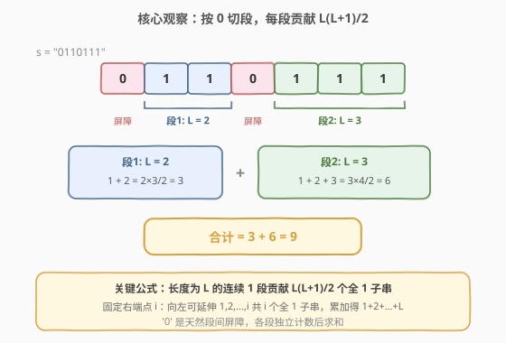
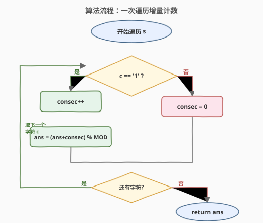
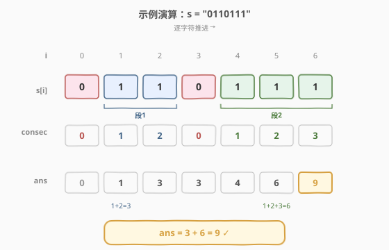

# LeetCode 仅含 1 的子串数 题解

## 1. 题目概述

- **标题 / 题号**：仅含 1 的子串数（#1513，medium）
- **链接**：https://leetcode.cn/problems/number-of-substrings-with-only-1s/
- **难度**：中等
- **标签**：字符串、数学

**题意**：给定一个二进制字符串 `s`（仅由 `'0'` 和 `'1'` 组成），返回所有字符都为 `'1'` 的**子字符串**数目。由于答案可能很大，将其对 $10^9 + 7$ 取模后返回。

**示例 1**：

```text
输入：s = "0110111"
输出：9
解释：共有 9 个子字符串仅由 '1' 组成
  "1"   -> 5 次
  "11"  -> 3 次
  "111" -> 1 次
```

**示例 2**：

```text
输入：s = "101"
输出：2
解释：子字符串 "1" 在 s 中共出现 2 次
```

**示例 3**：

```text
输入：s = "111111"
输出：21
解释：每个子字符串都仅由 '1' 组成
```

**示例 4**：

```text
输入：s = "000"
输出：0
```

**约束**：

- `s[i] == '0'` 或 `s[i] == '1'`
- `1 <= s.length <= 10^5`

> 💡 关键在于「全 1 子串」**不能跨越 `'0'`**——任何含 `'0'` 的子串都不合法。因此 `'0'` 把字符串切成若干个**互不相干的连续 1 段**，每段独立计数后求和即可。

## 2. 解题思路

### 2.1 暴力思路：枚举所有子串

枚举所有 $\Theta(n^2)$ 个子串 $s[l..r]$，逐个检查是否全为 `'1'`（内部再 $O(n)$ 扫描），总计 $O(n^3)$；即便用前缀和优化到 $O(n^2)$，对 $n = 10^5$ 仍不可行。

> ⚠️ **致命缺陷**：暴力枚举没有利用「全 1 子串必然落在同一段连续 1 内」这一结构——合法子串的起点和终点被 `'0'` 天然隔离，根本不需要跨段枚举。

### 2.2 核心观察：连续 1 段 + 等差数列求和



**第一步：按 `'0'` 切分。** 字符串被 `'0'` 分隔成若干个**极大连续 1 段**。任一全 1 子串必定完全落在某一段内部（跨段必含 `'0'`），因此各段独立计数、最后求和。

**第二步：单段计数公式。** 设某段长度为 $L$，则该段内全 1 子串数为：

$$\text{count}(L) = 1 + 2 + \cdots + L = \frac{L(L+1)}{2}$$

> 💡 **为什么是 $1+2+\cdots+L$？** 固定子串的**右端点**在该段内从左到右移动：右端点在第 1 个字符时，只有长度为 1 的 1 个子串；右端点在第 2 个字符时，有长度 1、2 共 2 个子串；……；右端点在第 $L$ 个字符时，有长度 $1, 2, \ldots, L$ 共 $L$ 个子串。累加即得等差数列和。

以示例 1 `s = "0110111"` 为例：两段连续 1 分别长 2 和 3，贡献 $\frac{2 \times 3}{2} + \frac{3 \times 4}{2} = 3 + 6 = 9$。

**第三步：取模。** 由于 $n \le 10^5$，单段最大贡献 $\frac{10^5 \times (10^5+1)}{2} \approx 5 \times 10^9$ 超出 32 位整数范围，需用 64 位整数并在累加时取模 $10^9 + 7$。

### 2.3 算法流程图：一次遍历增量计数



上面「分段求 $L(L+1)/2$」的公式可以等价地用**一次遍历**完成：维护当前连续 1 计数 `consec`，遇到 `'1'` 就 `consec++` 并把 `consec` 累加到答案，遇到 `'0'` 就把 `consec` 清零。

> 💡 **等价性**：在一次连续 1 段内，`consec` 依次取 $1, 2, \ldots, L$，每步累加的正是 $1 + 2 + \cdots + L = L(L+1)/2$。遇到 `'0'` 清零后下一段重新从 1 开始——与分段公式完全一致，但无需显式切段。

### 2.4 示例演算

以 `s = "0110111"` 演示一次遍历过程：



| 步骤 | `s[i]` | `consec` | 累加到 `ans` | `ans` | 说明 |
|------|--------|----------|-------------|-------|------|
| 0 | `'0'` | 0 | 0 | 0 | 遇 0，consec 清零 |
| 1 | `'1'` | 1 | 1 | 1 | 新段开始，1 个长度为 1 的子串 |
| 2 | `'1'` | 2 | 2 | 3 | 2 个新子串（`"1"`、`"11"`）|
| 3 | `'0'` | 0 | 0 | 3 | 段结束，consec 清零 |
| 4 | `'1'` | 1 | 1 | 4 | 新段开始 |
| 5 | `'1'` | 2 | 2 | 6 | |
| 6 | `'1'` | 3 | 3 | 9 | 段内累计 $1+2+3=6$ |

**总计** $= 3 + 6 = 9$ ✓

## 3. 参考代码

### C++

```cpp
class Solution {
  public:
    int numSub(string s) {
        const int MOD = 1e9 + 7;
        long long ans = 0;
        int consec = 0;
        for (char c : s) {
            if (c == '1') {
                ++consec;
                ans = (ans + consec) % MOD;
            } else {
                consec = 0;
            }
        }
        return ans;
    }
};
```

### Python

```python
class Solution:
    def numSub(self, s: str) -> int:
        MOD = 10**9 + 7
        ans = 0
        consec = 0
        for c in s:
            if c == '1':
                consec += 1
                ans = (ans + consec) % MOD
            else:
                consec = 0
        return ans
```

> ⚠️ **溢出注意**：C++ 中若用 `int` 存 `ans`，单步 `ans + consec` 不会溢出（`ans < MOD`、`consec ≤ 10^5`，和小于 $2 \times 10^9$ 仍在 `int` 范围内）。但若改用「分段求 $L(L+1)/2$」的写法，$L(L+1)$ 可达 $10^{10}$，必须用 `long long` 中间变量。本实现每步取模，安全且简洁。

## 4. 复杂度分析

| 维度 | 复杂度 | 说明 |
|------|--------|------|
| 时间复杂度 | $O(n)$ | 单趟扫描字符串，每个字符 $O(1)$ 处理 |
| 空间复杂度 | $O(1)$ | 仅用 `consec`、`ans` 两个变量 |

## 5. 扩展：分段求和实现

如果想更直观地对应「按 0 切段 + 公式」的思路，可以显式找出每段长度再用求和公式：

```cpp
class Solution {
  public:
    int numSub(string s) {
        const int MOD = 1e9 + 7;
        long long ans = 0;
        int n = s.size(), i = 0;
        while (i < n) {
            if (s[i] == '0') { ++i; continue; }
            int L = 0;
            while (i < n && s[i] == '1') { ++L; ++i; }
            ans = (ans + (long long)L * (L + 1) / 2) % MOD;
        }
        return ans;
    }
};
```

| 维度 | 一次遍历增量 | 分段求和公式 |
|------|-------------|-------------|
| 时间 | $O(n)$ | $O(n)$ |
| 空间 | $O(1)$ | $O(1)$ |
| 思路 | 累加 `consec`，自然对应 $1+2+\cdots+L$ | 显式切段，套 $L(L+1)/2$ |
| 溢出风险 | 低（每步取模） | 需 `long long` 算 $L(L+1)$ |

> 💡 两种写法本质相同：增量法是公式法的「在线版」，边读边累加；公式法是「离线版」，先收集段长再套公式。面试中先讲公式法（展示数学洞察），再给出增量法（展示代码简洁性），层层递进。

## 6. 面试要点

1. **为什么全 1 子串不能跨越 `'0'`？**

   - 子串要求字符连续。任何跨过 `'0'` 的子串必然包含 `'0'`，不满足「全 1」条件。所以 `'0'` 是天然的段间屏障，各连续 1 段独立计数。

2. **长度为 $L$ 的连续 1 段为什么贡献 $L(L+1)/2$？**

   - 固定右端点从左到右数：右端在第 $i$ 个字符时，可向左延伸 $1, 2, \ldots, i$ 共 $i$ 个全 1 子串。总和 $1 + 2 + \cdots + L = L(L+1)/2$。

3. **一次遍历的增量法为什么和公式等价？**

   - 增量法在一段内 `consec` 依次为 $1, 2, \ldots, L$，累加值恰为 $1 + 2 + \cdots + L$；遇 `'0'` 清零，下段重新累加。等价于对每段套 $L(L+1)/2$ 再求和。

4. **为什么需要取模，C++ 如何避免溢出？**

   - $n \le 10^5$，最坏单段贡献 $\approx 5 \times 10^9$，超出 `int` 上界 $2.1 \times 10^9$。增量法每步 `ans = (ans + consec) % MOD`，`ans + consec < 10^9 + 10^5` 不溢出；公式法 $L(L+1)$ 可达 $10^{10}$，必须用 `long long`。

5. **和 1759（统计同质子字符串）的关系？**

   - 1759 把「全 1」泛化为「全相同字符」：对任意由相同字符组成的段，长度 $L$ 同样贡献 $L(L+1)/2$。本题是 1759 在「字符只有 0/1 且只数 1」时的特例，公式与实现完全同构。

## 同类练习题

| # | 题目 | 与本题的关联 |
|---|------|-------------|
| 1759 | [统计同质子字符串的数目](https://leetcode.cn/problems/count-number-of-homogenous-substrings/) | 本题的直接泛化，把「全 1」放宽为「全相同字符」，同样是 $L(L+1)/2$ 求和 |
| 1358 | [包含所有三种字符的子串数](https://leetcode.cn/problems/number-of-substrings-containing-all-three-characters/) | 另一类子串计数，用滑动窗口维护「至少包含 a/b/c 各一个」 |
| 1248 | [统计「优美子数组」](https://leetcode.cn/problems/count-number-of-nice-subarrays/) | 子数组计数经典题，「至多 K」转化思想，与本题同为「按段计数」家族 |
| 713 | [乘积小于 K 的子数组](https://leetcode.cn/problems/subarray-product-less-than-k/) | 滑动窗口计数子数组，`right−left+1` 的增量计数与本题 `consec` 思路同源 |
