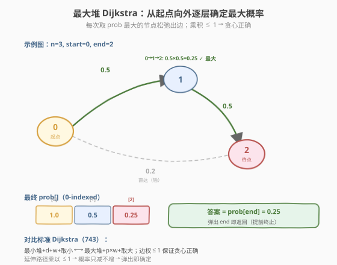
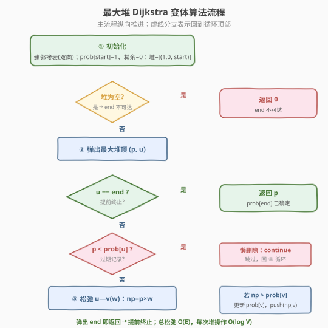
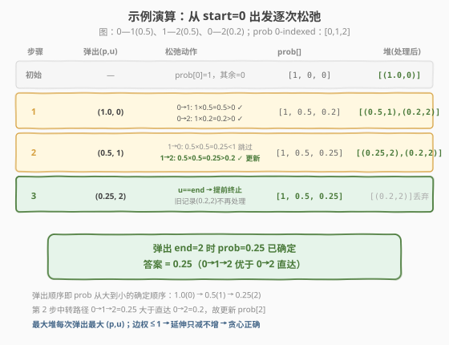

# LeetCode 概率最大的路径 题解

## 1. 题目概述

- **标题 / 题号**：概率最大的路径（#1514，medium）
- **链接**：https://leetcode.cn/problems/path-with-maximum-probability/
- **难度**：中等
- **标签**：图、最短路径、Dijkstra 变体、堆/优先队列

**题意**：给定 `n` 个节点（下标从 `0` 开始）组成的**无向加权图**，边列表 `edges[i] = [a, b]` 连接节点 `a` 和 `b`，该边遍历成功的概率为 `succProb[i]`（取值 $[0, 1]$）。指定起点 `start` 和终点 `end`，找出从起点到终点**成功概率最大**的路径，返回其成功概率。若不存在路径返回 `0`。答案与标准答案误差不超过 $10^{-5}$ 即视为正确。

> 💡 路径的成功概率 = 路径上所有边概率的**乘积**。因为每条边独立成功，全部成功才整条路径成功。所以「最大概率路径」=「边概率乘积最大的路径」。

**示例 1**：

```text
输入：n = 3, edges = [[0,1],[1,2],[0,2]], succProb = [0.5,0.5,0.2], start = 0, end = 2
输出：0.25000
解释：从 0 到 2 有两条路径：
  0→2 直达：0.2
  0→1→2：0.5 × 0.5 = 0.25
取较大者 0.25。
```

**示例 2**：

```text
输入：n = 3, edges = [[0,1],[1,2],[0,2]], succProb = [0.5,0.5,0.3], start = 0, end = 2
输出：0.30000
解释：0→2 直达 0.3 > 0→1→2 的 0.25，取 0.3。
```

**示例 3**：

```text
输入：n = 3, edges = [[0,1]], succProb = [0.5], start = 0, end = 2
输出：0.00000
解释：节点 0 与 2 不连通，返回 0。
```

**约束**：

- `2 <= n <= 10^4`
- `0 <= start, end < n`，`start != end`
- `0 <= a, b < n`，`a != b`
- `0 <= succProb.length == edges.length <= 2 * 10^4`
- `0 <= succProb[i] <= 1`
- 每两个节点之间最多一条边

## 2. 解题思路

### 2.1 暴力思路：枚举所有路径？

无向图上两个节点间的路径数量可能指数级爆炸（尤其是含环时），枚举所有路径再算乘积完全不可行。

> 💡 转换视角：本题求的是「**乘积最大**」的路径，与 [743. 网络延迟时间](../0701-0800/743_网络延迟时间.md) 求「**距离之和最小**」的路径**结构完全同构**——只是把「`+` 求和、取最小、最小堆」换成了「`×` 求积、取最大、最大堆」。这正是 **Dijkstra 的变体**。

一个朴素基线是 **SPFA / Bellman-Ford 式松弛**：反复用每条边尝试更新 `prob[v] = max(prob[v], prob[u] * w)`，直到不再变化。最坏 $O(V \cdot E)$，当 $n = 10^4$、$E = 2 \times 10^4$ 时达 $2 \times 10^8$，偏慢。用**堆优化 Dijkstra 变体**可降到 $O(E \log V)$。

### 2.2 核心观察：堆优化 Dijkstra 变体（最大堆 + 乘积松弛）



核心思路：

- 维护 `prob[]` 表示「从 `start` 到各节点的当前最大概率估计」，初始 `prob[start] = 1`（起点自身成功概率为 1），其余为 `0`。
- 用**最大堆**存放 `(概率, 节点)`，每次取出**概率最大**的节点 `u`。
- **松弛** `u` 的每条出边 `u—v`（权 `w`）：若 `prob[u] * w > prob[v]`，更新 `prob[v]` 并入堆。
- 当 `end` 被弹出堆时，`prob[end]` 即为答案（**提前终止**）。

> 💡 **贪心正确性**：所有边权 $w \in [0, 1]$，因此**延伸路径只会让概率不变或变小**（乘以 $\le 1$ 的数）。当 `u` 以当前最大概率被弹出时，任何「绕道」到 `u` 的路径都要先经过某个概率 $\le \text{prob}[u]$ 的节点再乘以 $\le 1$ 的边权，结果必然 $\le \text{prob}[u]$——所以 `u` 的最大概率已确定。这与标准 Dijkstra「非负权保证取出最小者已确定」的论证完全对称。
>
> ⚠️ 若存在 $> 1$ 的边权，乘积可能越走越大，贪心假设失效——此时应取 $-\log w$ 转为求最短路（Bellman-Ford / Dijkstra）。

### 2.3 算法流程图



### 2.4 示例演算

以示例 1 `n=3, edges=[[0,1],[1,2],[0,2]], succProb=[0.5,0.5,0.2], start=0, end=2` 为例。邻接关系（无向，双向）：`0—1(0.5)`、`1—2(0.5)`、`0—2(0.2)`。



| 步骤 | 弹出 (p, u) | 松弛出边 | prob 变化 | 堆（处理后） |
|------|------------|---------|----------|--------------|
| 初始 | — | prob[0]=1 | [1, 0, 0] | [(1.0, 0)] |
| 1 | (1.0, 0) | 0→1: 1×0.5=0.5>0；0→2: 1×0.2=0.2>0 | [1, 0.5, 0.2] | [(0.5, 1), (0.2, 2)] |
| 2 | (0.5, 1) | 1→0: 0.5×0.5=0.25<1 跳过；1→2: 0.5×0.5=0.25>0.2 更新 | [1, 0.5, 0.25] | [(0.25, 2), (0.2, 2)] |
| 3 | (0.25, 2) | u==end，**提前终止** | [1, 0.5, 0.25] | — |

返回 `0.25`。

> 💡 第 2 步是关键：从节点 1 中转到 2 的概率 `0.25` 大于直达的 `0.2`，堆中节点 2 出现两条记录 `(0.25, 2)` 和 `(0.2, 2)`。最大堆先弹出更大的 `(0.25, 2)`，此时 `end` 被确定，直接返回。旧记录 `(0.2, 2)` 留在堆中不再处理（懒删除）。

## 3. 参考代码

### C++

```cpp
class Solution {
  public:
    double maxProbability(int n, vector<vector<int>>& edges,
                          vector<double>& succProb, int start, int end) {
        // 邻接表：graph[u] = {(v, prob), ...}
        vector<vector<pair<int, double>>> graph(n);
        for (int i = 0; i < edges.size(); ++i) {
            int a = edges[i][0], b = edges[i][1];
            double w = succProb[i];
            graph[a].push_back({b, w});
            graph[b].push_back({a, w});      // 无向边
        }

        vector<double> prob(n, 0.0);
        prob[start] = 1.0;

        // 最大堆：(概率, 节点)，默认 priority_queue 是最大堆
        priority_queue<pair<double, int>> pq;
        pq.push({1.0, start});

        while (!pq.empty()) {
            auto [p, u] = pq.top(); pq.pop();
            if (u == end) return p;             // 提前终止
            if (p < prob[u]) continue;          // 懒删除：旧记录已失效
            for (auto& [v, w] : graph[u]) {
                double np = p * w;
                if (np > prob[v]) {
                    prob[v] = np;
                    pq.push({np, v});
                }
            }
        }
        return 0.0;                             // end 不可达
    }
};
```

### Python

```python
class Solution:
    def maxProbability(self, n: int, edges: List[List[int]],
                       succProb: List[float], start: int, end: int) -> float:
        graph = [[] for _ in range(n)]
        for (a, b), w in zip(edges, succProb):
            graph[a].append((b, w))
            graph[b].append((a, w))            # 无向边

        prob = [0.0] * n
        prob[start] = 1.0

        # 最大堆：存 (-概率, 节点)，用最小堆模拟最大堆
        pq = [(-1.0, start)]
        while pq:
            neg_p, u = heapq.heappop(pq)
            p = -neg_p
            if u == end:
                return p                       # 提前终止
            if p < prob[u]:
                continue                       # 懒删除
            for v, w in graph[u]:
                np = p * w
                if np > prob[v]:
                    prob[v] = np
                    heapq.heappush(pq, (-np, v))

        return 0.0
```

> 💡 **三个关键改动**（对比 [743. 网络延迟时间](../0701-0800/743_网络延迟时间.md) 标准版 Dijkstra）：
> 1. **最大堆**取代最小堆（C++ 默认 `priority_queue` 即最大堆；Python 用负数模拟）。
> 2. **乘积松弛** `np = p * w` 取代加法 `nd = d + w`；比较方向由 `<` 翻转为 `>`。
> 3. **提前终止**：弹出 `end` 即返回，无需处理完整个堆——因为 `end` 一旦被弹出，其概率已被确定为最大。

## 4. 复杂度分析

| 维度 | 复杂度 | 说明 |
|------|--------|------|
| 时间复杂度 | $O(E \log V)$ | 每条边最多触发一次松弛入堆，共 $E$ 次入堆，每次堆操作 $O(\log V)$；提前终止通常更快 |
| 空间复杂度 | $O(V + E)$ | 邻接表 $O(E)$、`prob` 数组 $O(V)$、堆最坏 $O(E)$ |

> ⚠️ 本题 $n \le 10^4$、$E \le 2 \times 10^4$，$E \log V \approx 2 \times 10^4 \times 14 \approx 2.8 \times 10^5$，远低于时限。朴素 $O(V \cdot E)$ 的 Bellman-Ford 式松弛约 $2 \times 10^8$ 也能过但偏慢，堆版本更稳。

## 5. 扩展：对数转化与负对数最短路

概率乘积最大化可以转化为**最短路求和最小化**：对每条边权取**负对数** $w' = -\log(\text{prob})$（$w \in (0, 1] \Rightarrow w' \in [0, +\infty)$），则

$$
\prod_{e \in \text{path}} \text{prob}_e = \exp\left(-\sum_{e \in \text{path}} (-\log \text{prob}_e)\right)
$$

最大化乘积 $\iff$ 最小化 $\sum w'$。转化后边权非负，可直接套标准最小堆 Dijkstra。

| 方法 | 堆方向 | 松弛操作 | 比较 |
|------|--------|---------|------|
| 本题直接变体 | 最大堆 | `p * w` | `>` 取大 |
| 对数转化 + 标准 Dijkstra | 最小堆 | `d + (-log w)` | `<` 取小 |

> 💡 **何时用对数转化？** 当边权可能 $> 1$（乘积不单调递减，贪心失效）或题目本身更适合加法语义时。本题 $w \le 1$，直接变体更简洁、无浮点对数误差，推荐直接写。

## 6. 面试要点

1. **为什么 Dijkstra 变体在本题正确？**

   - 所有边权 $w \in [0, 1]$，延伸路径只会让概率**不变或变小**。当某节点以最大概率被弹出，任何绕道到它的路径概率都 $\le$ 当前值——贪心假设成立。论证与标准 Dijkstra 的「非负权」对称。

2. **如果存在 $> 1$ 的边权怎么办？**

   - 乘积可能越走越大，弹出的"最大"节点仍可能被后续更大的路径超越，贪心失效。应取 $-\log w$ 转为非负权最短路，用标准 Dijkstra。

3. **为什么要提前终止（弹出 end 即返回）？**

   - `end` 被弹出时其概率已被确定为最大值（贪心保证），无需继续处理剩余节点。这是本题相对 [743](../0701-0800/743_网络延迟时间.md)（需等所有节点确定后取 `max(dist)`）的优化点。

4. **无向边建图要注意什么？**

   - 每条边要**双向**加入邻接表：`graph[a].push({b,w})` 和 `graph[b].push({a,w})`。漏掉反向边会导致漏路径。

5. **懒删除如何工作？**

   - 堆中同一节点可能有多条记录（先入小概率后入大概率）。弹出时若 `p < prob[u]` 说明是过期记录，`continue` 跳过。无需真正从堆中删除，写法简洁且仍 $O(E \log V)$。

## 同类练习题

| # | 题目 | 与本题的关联 |
|---|------|-------------|
| 743 | [网络延迟时间](https://leetcode.cn/problems/network-delay-time/) | 标准堆优化 Dijkstra（最小堆 + 加法），本题的母题，骨架完全一致 |
| 1631 | [最小体力消耗路径](https://leetcode.cn/problems/path-with-minimum-effort/) | Dijkstra 变体，路径代价 = 边上最大权差，松弛用 `max` 而非加法 |
| 778 | [水位上升的游泳池游泳](https://leetcode.cn/problems/swim-in-rising-water/) | Dijkstra 变体 + 二分答案，路径代价 = 路径上最大格子值 |
| 1976 | [到达目的地的方案数](https://leetcode.cn/problems/number-of-ways-to-arrive-at-destination/) | Dijkstra 求最短路 + 统计最短路条数 |
| 787 | [K 站中转内最便宜的航班](https://leetcode.cn/problems/cheapest-flights-within-k-stops/) | 限制步数的 Bellman-Ford，对比 Dijkstra 的适用边界 |
