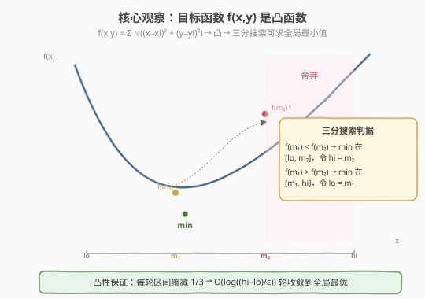
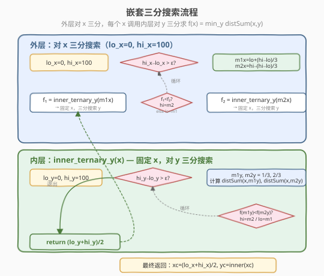
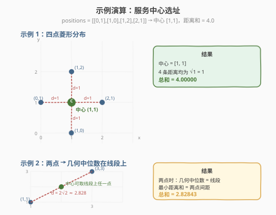

# LeetCode 服务中心的最佳位置 题解

## 1. 题目概述

- **标题 / 题号**：服务中心的最佳位置（#1515，hard）
- **链接**：https://leetcode.cn/problems/best-position-for-a-service-centre/
- **难度**：困难
- **标签**：几何、三分搜索、凸优化、数值方法

**题意**：给定平面上 `n` 个客户的位置 `positions[i] = [xi, yi]`，求一个服务中心坐标 `[xcentre, ycentre]`，使该中心**到所有客户的欧几里得距离之和最小**：

$$f(x, y) = \sum_{i=1}^{n} \sqrt{(x - x_i)^2 + (y - y_i)^2}$$

返回这个**最小距离总和**。与真实值误差在 $10^{-5}$ 以内的答案视为正确。

**示例 1**：

```text
输入：positions = [[0,1],[1,0],[1,2],[2,1]]
输出：4.00000
解释：中心选 [1, 1]，到 4 个客户的距离均为 1，总和为 4。
```

**示例 2**：

```text
输入：positions = [[1,1],[3,3]]
输出：2.82843
解释：中心选线段上任一点，最小距离和 = √2 + √2 = 2√2 ≈ 2.82843
```

**约束**：

- `1 <= positions.length <= 50`
- `positions[i].length == 2`
- `0 <= xi, yi <= 100`

## 2. 解题思路

### 2.1 暴力思路：枚举所有坐标？

服务中心的坐标是**连续实数**，无法枚举。即使只考虑整数点，$100 \times 100 = 10^4$ 个候选点中逐一计算 $O(n)$ 距离和，共 $10^4 \times 50 = 5 \times 10^5$ 次操作——但这只能找到**整数最优解**，而真正最优的中心可能在非整数坐标（如示例 2 的 $\sqrt{2}$）。

> 💡 转换视角：这不是一个**离散搜索**问题，而是一个**连续凸优化**问题。关键在于识别目标函数的**凸性**，从而用三分搜索求解。

### 2.2 核心观察：目标函数是凸函数 → 三分搜索



**凸性证明**：

1. 每个欧几里得距离 $d_i(x, y) = \sqrt{(x - x_i)^2 + (y - y_i)^2}$ 是一个**范数函数**——仿射变换的 $\ell_2$ 范数，天然**凸**。
2. 凸函数之和仍为凸函数，因此 $f(x, y) = \sum d_i(x, y)$ 是**联合凸函数**。
3. 定义 $g(x) = \min_y f(x, y)$（固定 $x$，对 $y$ 取最优），由凸分析知：**联合凸函数的 inf-projection 仍是凸函数**。因此 $g(x)$ 也是凸的。

> 💡 **三分搜索原理**：对于凸函数 $h(t)$，在区间 $[lo, hi]$ 内取 $m_1 = lo + \frac{hi - lo}{3}$，$m_2 = hi - \frac{hi - lo}{3}$：
> - 若 $h(m_1) < h(m_2)$，最小值在 $[lo, m_2]$（舍弃右 1/3）
> - 若 $h(m_1) \ge h(m_2)$，最小值在 $[m_1, hi]$（舍弃左 1/3）
>
> 每轮区间缩减为原来的 $2/3$，迭代 $k$ 轮后区间长度为 $(hi - lo) \cdot (2/3)^k$。

### 2.3 算法流程图：嵌套三分搜索



核心结构是**两层三分搜索嵌套**：

- **外层**：对 $x \in [0, 100]$ 三分搜索。每次取 $m_{1x}, m_{2x}$，分别调用内层求 $f_1 = g(m_{1x})$、$f_2 = g(m_{2x})$，比较后缩小区间。
- **内层**：`inner_ternary_y(x)` —— 固定 $x$，对 $y \in [0, 100]$ 三分搜索，返回 $\min_y f(x, y)$。

每层迭代约 100 次（$(2/3)^{100} \approx 2.5 \times 10^{-18}$，精度远超 $10^{-5}$ 要求），总计算量 $100 \times 100 \times 50 = 5 \times 10^5$ 次距离计算。

### 2.4 示例演算



**示例 1**：`positions = [[0,1],[1,0],[1,2],[2,1]]`

4 个点形成菱形，中心 $(1, 1)$ 到每个点的距离均为 $\sqrt{0^2 + 1^2} = 1$，总和 $= 4.0$。由于 $f$ 是凸函数，$(1, 1)$ 即为全局最优点。

**示例 2**：`positions = [[1,1],[3,3]]`

两点情况：几何中位数是**线段上任意一点**。最小距离和 $= $ 两点间距 $= \sqrt{(3-1)^2 + (3-1)^2} = 2\sqrt{2} \approx 2.82843$。

## 3. 参考代码

### 方法一：嵌套三分搜索（推荐）

### C++

```cpp
class Solution {
  public:
    double getMinDistSum(vector<vector<int>>& positions) {
        auto distSum = [&](double x, double y) {
            double sum = 0;
            for (auto& p : positions) {
                double dx = x - p[0], dy = y - p[1];
                sum += sqrt(dx * dx + dy * dy);
            }
            return sum;
        };

        auto ternaryY = [&](double x) {
            double lo = 0, hi = 100;
            for (int i = 0; i < 100; ++i) {
                double m1 = lo + (hi - lo) / 3;
                double m2 = hi - (hi - lo) / 3;
                if (distSum(x, m1) < distSum(x, m2))
                    hi = m2;
                else
                    lo = m1;
            }
            return distSum(x, (lo + hi) / 2);
        };

        double lo = 0, hi = 100;
        for (int i = 0; i < 100; ++i) {
            double m1 = lo + (hi - lo) / 3;
            double m2 = hi - (hi - lo) / 3;
            if (ternaryY(m1) < ternaryY(m2))
                hi = m2;
            else
                lo = m1;
        }
        return ternaryY((lo + hi) / 2);
    }
};
```

### Python

```python
class Solution:
    def getMinDistSum(self, positions: List[List[int]]) -> float:
        def dist_sum(x, y):
            return sum(
                math.hypot(x - px, y - py) for px, py in positions
            )

        def ternary_y(x):
            lo, hi = 0.0, 100.0
            for _ in range(100):
                m1 = lo + (hi - lo) / 3
                m2 = hi - (hi - lo) / 3
                if dist_sum(x, m1) < dist_sum(x, m2):
                    hi = m2
                else:
                    lo = m1
            return dist_sum(x, (lo + hi) / 2)

        lo, hi = 0.0, 100.0
        for _ in range(100):
            m1 = lo + (hi - lo) / 3
            m2 = hi - (hi - lo) / 3
            if ternary_y(m1) < ternary_y(m2):
                hi = m2
            else:
                lo = m1
        return ternary_y((lo + hi) / 2)
```

> 💡 `math.hypot(dx, dy)` 等价于 `sqrt(dx*dx + dy*dy)`，但内部用更稳定的算法避免溢出。迭代 100 轮使区间缩到 $(100) \cdot (2/3)^{100} \approx 2.5 \times 10^{-18}$，远超 $10^{-5}$ 精度要求。

## 4. 复杂度分析

| 维度 | 复杂度 | 说明 |
|------|--------|------|
| 时间复杂度 | $O(n \cdot K^2)$ | 外层 $K$ 轮 × 内层 $K$ 轮 × 每次 $O(n)$ 距离计算；$K = 100$ 轮足够 $10^{-5}$ 精度 |
| 空间复杂度 | $O(1)$ | 仅用常数个变量，原地计算 |

> ⚠️ 本题 $n \le 50$、坐标范围 $[0, 100]$，嵌套三分搜索完全够用。若 $n$ 更大或坐标范围更广，可改用下方的 Weiszfeld 迭代法（收敛更快）。

## 5. 扩展：Weiszfeld 迭代法

嵌套三分搜索虽然简单直观，但每层 100 轮迭代有些浪费。对于几何中位数问题，有专门的**Weiszfeld 算法**（1937 年），采用**迭代重加权最小二乘**思想，收敛速度为超线性（比三分搜索快得多）。

### 5.1 算法原理

对 $f(x, y) = \sum d_i$ 求梯度并令其为零：

$$\frac{\partial f}{\partial x} = \sum \frac{x - x_i}{d_i} = 0 \quad \Rightarrow \quad x = \frac{\sum \frac{x_i}{d_i}}{\sum \frac{1}{d_i}}$$

由此得到**不动点迭代公式**：

$$x_{k+1} = \frac{\sum \frac{x_i}{d_i^{(k)}}}{\sum \frac{1}{d_i^{(k)}}}, \qquad y_{k+1} = \frac{\sum \frac{y_i}{d_i^{(k)}}}{\sum \frac{1}{d_i^{(k)}}}$$

其中 $d_i^{(k)} = \sqrt{(x_k - x_i)^2 + (y_k - y_i)^2}$。

> ⚠️ **奇点处理**：若迭代点恰好与某个客户点重合（$d_i = 0$），分母为零。此时该点本身就是几何中位数的候选，可直接返回。实践中从**质心**（坐标均值）出发，几乎不会命中奇点。

### 5.2 参考代码

### C++

```cpp
class Solution {
  public:
    double getMinDistSum(vector<vector<int>>& positions) {
        int n = positions.size();
        double x = 0, y = 0;
        for (auto& p : positions) { x += p[0]; y += p[1]; }
        x /= n; y /= n;

        auto totalDist = [&](double cx, double cy) {
            double s = 0;
            for (auto& p : positions)
                s += hypot(cx - p[0], cy - p[1]);
            return s;
        };

        double prev = totalDist(x, y);
        for (int iter = 0; iter < 200; ++iter) {
            double numX = 0, numY = 0, denom = 0;
            for (auto& p : positions) {
                double d = hypot(x - p[0], y - p[1]);
                if (d < 1e-8) continue;
                numX += p[0] / d;
                numY += p[1] / d;
                denom += 1.0 / d;
            }
            if (denom < 1e-12) break;
            x = numX / denom;
            y = numY / denom;
            double cur = totalDist(x, y);
            if (fabs(cur - prev) < 1e-8) break;
            prev = cur;
        }
        return totalDist(x, y);
    }
};
```

### Python

```python
class Solution:
    def getMinDistSum(self, positions: List[List[int]]) -> float:
        n = len(positions)
        x = sum(p[0] for p in positions) / n
        y = sum(p[1] for p in positions) / n

        def total_dist(cx, cy):
            return sum(math.hypot(cx - px, cy - py) for px, py in positions)

        prev = total_dist(x, y)
        for _ in range(200):
            num_x = num_y = denom = 0.0
            for px, py in positions:
                d = math.hypot(x - px, y - py)
                if d < 1e-8:
                    continue
                num_x += px / d
                num_y += py / d
                denom += 1.0 / d
            if denom < 1e-12:
                break
            x = num_x / denom
            y = num_y / denom
            cur = total_dist(x, y)
            if abs(cur - prev) < 1e-8:
                break
            prev = cur
        return total_dist(x, y)
```

| 方法 | 时间 | 收敛 | 优势 |
|------|------|------|------|
| 嵌套三分搜索 | $O(n \cdot K^2)$ | 线性（每轮缩 $2/3$） | 实现简单，无需处理奇点 |
| Weiszfeld 迭代 | $O(n \cdot K)$ | 超线性 | 收敛快，$K \approx 50$ 足够 |

> 💡 **面试建议**：优先写嵌套三分搜索——思路清晰、不易出错、无需处理除零奇点。若面试官追问更优解法，再提 Weiszfeld 迭代。

## 6. 面试要点

1. **为什么不能用质心（坐标均值）？**

   - 质心最小化的是**平方距离之和** $\sum d_i^2$（对 $x$ 求导令零即得 $x = \bar{x}$）。
   - 本题最小化的是**距离之和** $\sum d_i$，两者在点分布不对称时差异显著（异常值对质心影响更大）。
   - 质心有闭式解，几何中位数一般**没有闭式解**（$n > 3$ 时），只能数值迭代。

2. **为什么三分搜索对连续凸函数有效？**

   - 凸函数的单变量切片仍是凸函数。对 $f(x, y)$ 固定 $x$，$f(x, \cdot)$ 对 $y$ 凸；固定 $y$，$f(\cdot, y)$ 对 $x$ 凸。
   - 更进一步，$g(x) = \min_y f(x, y)$ 也是凸的（inf-projection 保持凸性），所以外层三分搜索也成立。
   - 三分搜索每轮比较两个探针点的函数值，舍弃较劣的一侧，保证区间始终包含最小值。

3. **三分搜索需要迭代多少轮？**

   - 每轮区间乘以 $2/3$，$k$ 轮后区间长度 $= (hi - lo) \cdot (2/3)^k$。
   - 要求 $100 \cdot (2/3)^k < 10^{-5}$，解得 $k > \log(10^{-7}) / \log(2/3) \approx 40$。
   - 取 $k = 100$ 留足余量，精度达 $10^{-18}$。

4. **Weiszfeld 算法的奇点问题如何处理？**

   - 当迭代点与某个数据点重合时，$d_i = 0$ 导致除零。解法：检测到 $d_i < \epsilon$ 时跳过该项（或直接判定当前点为最优）。
   - 从质心出发初始化可大幅降低命中奇点的概率（质心只在所有点重合时才与数据点重合）。

5. **二分搜索 vs 三分搜索的区别？**

   - **二分搜索**用于**单调函数**找满足某条件的边界点（如 lower_bound）。
   - **三分搜索**用于**凸/凹函数**找极值点。
   - 二分每次缩 $1/2$，三分每次缩 $1/3$（区间剩 $2/3$），所以三分需要更多轮但能处理非单调的极值问题。

## 同类练习题

| # | 题目 | 与本题的关联 |
|---|------|-------------|
| 852 | [山脉数组的峰顶索引](https://leetcode.cn/problems/peak-index-in-a-mountain-array/) | 离散三分搜索入门（单峰数组找极大值，与本题凸函数找极小值形成对偶） |
| 1584 | [连接所有点的最小费用](https://leetcode.cn/problems/min-cost-to-connect-all-points/) | 同为平面点集距离优化，但用 MST（离散组合）而非几何中位数（连续优化） |
| 875 | [爱吃香蕉的珂珂](https://leetcode.cn/problems/koko-eating-bananas/) | 二分答案，对比单调性二分（求满足条件的边界）vs 凸性三分（求极值点） |
| 410 | [分割数组的最大值](https://leetcode.cn/problems/split-array-largest-sum/) | 二分答案 + 贪心验证，对比二分与三分的适用场景 |
| 149 | [直线上最多的点数](https://leetcode.cn/problems/max-points-on-a-line/) | 计算几何 + 哈希，平面点集问题另一经典思路 |
