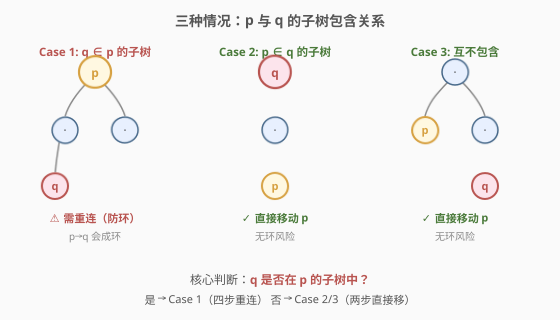
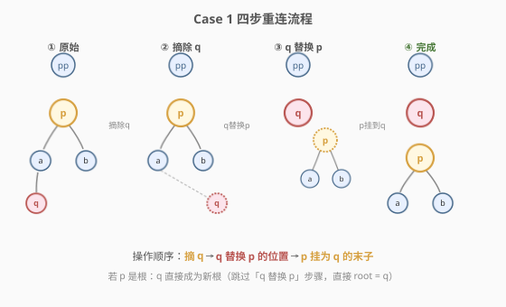
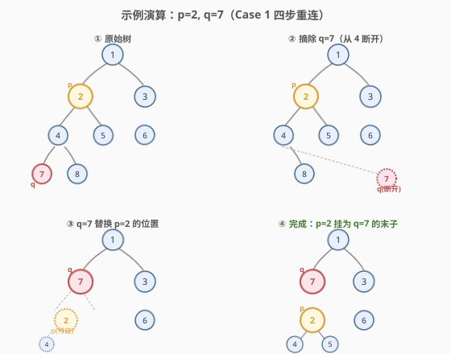

# LeetCode 移动 N 叉树的子树 题解

## 1. 题目概述

- **标题 / 题号**：移动 N 叉树的子树（#1516，hard）
- **链接**：https://leetcode.cn/problems/move-sub-tree-of-n-ary-tree/
- **难度**：困难
- **标签**：树、N 叉树、深度优先搜索

**题意**：给定一棵**节点值唯一**的 N 叉树的根节点 `root`，以及树中两个不同节点 `p` 和 `q`。你需要将 `p` 的子树移动为 `q` 的**最后一个直接子节点**。如果 `p` 已经是 `q` 的直接子节点，则不做任何改变。

节点的定义如下：

```cpp
class Node {
public:
    int val;
    vector<Node*> children;
};
```

```python
class Node:
    def __init__(self, val=None, children=None):
        self.val = val
        self.children = children if children is not None else []
```

根据 `p` 和 `q` 在树中的相对位置，存在三种情况：

| 情况 | 描述 | 难度 |
|------|------|------|
| **Case 1** | `q` 在 `p` 的子树中 | 需重连（直接移会成环） |
| **Case 2** | `p` 在 `q` 的子树中 | 直接移即可 |
| **Case 3** | 互不包含 | 直接移即可 |

**示例 1**（Case 2）：

```text
输入：root = [1,null,2,3,null,4,5,null,6,null,7,8], p = 4, q = 1
输出：[1,null,2,3,4,null,5,null,6,null,7,8]

      1                    1
     / \                 / | \
    2   3       →       2  3  4
   / \   \             / \   \  \
  4   5   6           5   6   7  8
 / \
7   8

p=4 在 q=1 的子树中，直接把 4（带子树 7,8）移为 1 的末子。
```

**示例 4**（Case 1）：

```text
输入：root = [1,null,2,3,null,4,5,null,6,null,7,8], p = 2, q = 7
输出：[1,null,7,3,null,2,null,6,null,4,5,null,null,8]

      1                    1
     / \                 /   \
    2   3       →       7     3
   / \   \               \     \
  4   5   6               2     6
 / \                     / \
7   8                   4   5
                         \
                          8

q=7 在 p=2 的子树中。先摘除 7，再让 7 替换 2 的位置，最后把 2 挂为 7 的末子。
```

**示例 5**（Case 1，p 为根）：

```text
输入：root = [1,null,2,3,null,4,5,null,6,null,7,8], p = 1, q = 2
输出：[2,null,4,5,1,null,7,8,null,null,3,null,null,null,6]

      1                    2
     / \                 / | \
    2   3       →       4  5  1
   / \   \             / \   \
  4   5   6           7   8   3
 / \                           \
7   8                            6

q=2 在 p=1 的子树中，且 p 是根。摘除 2 后，2 成为新根，1 挂为 2 的末子。
```

**约束**：

- 树中节点总数在 $[2, 1000]$ 范围内
- 每个节点有**唯一**的值
- `p != null`，`q != null`，`p != q`

> 💡 本题的难点不在"移动子树"本身，而在**Case 1 的成环问题**——当 `q` 在 `p` 的子树中时，直接把 `p` 挂到 `q` 下面会产生循环引用（`p → ... → q → p`），树被破坏。必须先"摘除 `q`"打破包含关系，再完成替换与挂载。

## 2. 解题思路

### 2.1 暴力思路：直接移动 + 事后修环

最直觉的做法：不管三七二十一，先把 `p` 从原父节点摘下，挂到 `q` 的末尾。如果发现产生了环（`q` 原本在 `p` 子树中），再事后检测并修复。

> ⚠️ **致命缺陷**：事后修环的逻辑极其复杂——你需要检测环的存在、找到环的断点、重新连接 `q` 到 `p` 原父节点的位置……每一步都容易出错。更糟的是，如果 `p` 是根节点，"摘下 `p`"本身就丢失了根的引用。根本问题在于**没有提前分类**——先判断 `p`、`q` 的子树包含关系，再按情况选择操作序列，远比"先做后修"清晰。

### 2.2 核心观察：三情况分类 + Case 1 四步重连



**关键洞察**：移动 `p` 到 `q` 是否会产生环，完全取决于一个判断——**`q` 是否在 `p` 的子树中**：

- **否（Case 2/3）**：`q` 不在 `p` 的子树中，`p` 挂到 `q` 下不会成环。只需两步：从 `p` 的父节点摘下 `p` → 挂到 `q` 末尾。
- **是（Case 1）**：`q` 在 `p` 的子树中，直接挂会成环。需要**四步重连**：先摘除 `q` 打破包含关系，再让 `q` 替换 `p` 的位置，最后把 `p` 挂到 `q` 末尾。

> 💡 **为什么"摘除 `q`"能打破成环？** 摘除 `q` 后，`p` 的子树不再包含 `q`，此时 `p`（带剩余子树）挂到 `q` 下就是安全的单方向链接，不构成环。而 `q` 替换 `p` 的位置保证了树的连通性不被破坏。

Case 1 的四步操作如下：

1. **摘除 `q`**：从 `q` 的父节点 `q_parent` 的 `children` 列表中移除 `q`。此时 `p` 的子树不再包含 `q`。
2. **`q` 替换 `p`**：在 `p` 的父节点 `p_parent` 的 `children` 列表中，用 `q` 替换 `p` 的位置（保持索引）。若 `p` 是根（`p_parent` 为空），则 `q` 直接成为新根。
3. **`p` 挂到 `q`**：将 `p`（带其剩余子树）添加为 `q` 的 `children` 列表的最后一个元素。

> ⚠️ **顺序至关重要**：必须**先摘 `q`** 再**替换 `p`**。如果先替换 `p`（从 `p_parent` 摘下 `p`），此时 `q` 仍在 `p` 的子树中，`q` 也就跟着 `p` 一起脱离了树，后续无法通过 `p_parent` 找回位置。先摘 `q` 保证 `p` 的子树"瘦身"后再移动，逻辑清晰无歧义。

### 2.3 算法流程图



整体算法的决策流程：

1. **特判**：如果 `p` 已经是 `q` 的直接子节点，直接返回 `root`。
2. **DFS 找父节点**：一次遍历找到 `p_parent` 和 `q_parent`。
3. **判断 `q` 是否在 `p` 的子树中**：从 `p` 出发 DFS 搜索 `q`。
4. **按情况执行**：
   - **Case 1**（`q ∈ p` 子树）：四步重连。
   - **Case 2/3**（否则）：两步直接移——从 `p_parent` 摘 `p`，挂到 `q` 末尾。

### 2.4 示例演算

以示例 4（`p=2, q=7`，Case 1）为例，原始树结构：

```text
        1
      /   \
     2     3
    / \      \
   4   5      6
  / \
 7   8
```

`q=7` 在 `p=2` 的子树中（路径 `2→4→7`），触发四步重连：



| 步骤 | 操作 | 树状态 |
|------|------|--------|
| ① 原始 | — | `1→{2,3}`, `2→{4,5}`, `3→{6}`, `4→{7,8}` |
| ② 摘除 `q=7` | 从 `q_parent=4` 的 children 移除 7 | `4→{8}`，`7` 脱离 |
| ③ `q=7` 替换 `p=2` | 在 `p_parent=1` 中用 7 替换 2 的位置 | `1→{7,3}`, `2`（带 4,5,8）脱离 |
| ④ `p=2` 挂到 `q=7` | 2 追加为 7 的末子 | `7→{2}`, `2→{4,5}`, `4→{8}` |

最终树：`1→{7,3}`, `7→{2}`, `3→{6}`, `2→{4,5}`, `4→{8}`，对应序列化 `[1,null,7,3,null,2,null,6,null,4,5,null,null,8]`，与预期一致 ✓。

> 💡 **注意步骤③的"替换"不是"追加"**：`q` 接管 `p` 在 `p_parent.children` 中的**原始索引位置**，而非追加到末尾。这保证了 `q=7` 出现在 `1` 的 children 列表中 `3` 之前（原 `2` 的位置），与预期输出的 `[1,null,7,3,...]` 一致。

## 3. 参考代码

### C++

```cpp
/*
// Definition for a Node.
class Node {
public:
    int val;
    vector<Node*> children;
};
*/
class Solution {
public:
    Node* moveSubTree(Node* root, Node* p, Node* q) {
        // 特判：p 已经是 q 的直接子节点
        if (find(q->children.begin(), q->children.end(), p) != q->children.end()) {
            return root;
        }

        // 一次 DFS 找 p_parent 和 q_parent
        Node* p_parent = nullptr;
        Node* q_parent = nullptr;
        findParents(root, nullptr, p, q, p_parent, q_parent);

        // 判断 q 是否在 p 的子树中
        bool q_in_p = isInSubtree(p, q);

        if (q_in_p) {
            // Case 1: 四步重连
            // ① 摘除 q（从 q_parent 的 children 移除）
            q_parent->children.erase(
                find(q_parent->children.begin(), q_parent->children.end(), q));
            // ② q 替换 p 的位置（或成为新根）
            if (p_parent) {
                auto it = find(p_parent->children.begin(), p_parent->children.end(), p);
                *it = q;                    // 原地替换，保持索引
            } else {
                root = q;                   // p 是根，q 接管
            }
            // ③ p 挂为 q 的末子
            q->children.push_back(p);
        } else {
            // Case 2/3: 两步直接移
            p_parent->children.erase(
                find(p_parent->children.begin(), p_parent->children.end(), p));
            q->children.push_back(p);
        }

        return root;
    }

private:
    void findParents(Node* node, Node* parent, Node* p, Node* q,
                     Node*& p_parent, Node*& q_parent) {
        if (!node) return;
        if (node == p) p_parent = parent;
        if (node == q) q_parent = parent;
        for (Node* child : node->children) {
            findParents(child, node, p, q, p_parent, q_parent);
        }
    }

    bool isInSubtree(Node* node, Node* target) {
        if (!node) return false;
        if (node == target) return true;
        for (Node* child : node->children) {
            if (isInSubtree(child, target)) return true;
        }
        return false;
    }
};
```

### Python

```python
"""
# Definition for a Node.
class Node:
    def __init__(self, val=None, children=None):
        self.val = val
        self.children = children if children is not None else []
"""
class Solution:
    def moveSubTree(self, root: 'Node', p: 'Node', q: 'Node') -> 'Node':
        # 特判：p 已经是 q 的直接子节点
        for child in q.children:
            if child is p:
                return root

        # 一次 DFS 找 p_parent 和 q_parent
        p_parent = None
        q_parent = None
        stack = [(root, None)]
        while stack:
            node, parent = stack.pop()
            if node is p:
                p_parent = parent
            if node is q:
                q_parent = parent
            for child in node.children:
                stack.append((child, node))

        # 判断 q 是否在 p 的子树中
        def is_in_subtree(node, target):
            if node is target:
                return True
            for child in node.children:
                if is_in_subtree(child, target):
                    return True
            return False

        q_in_p = is_in_subtree(p, q)

        if q_in_p:
            # Case 1: 四步重连
            # ① 摘除 q
            q_parent.children.remove(q)
            # ② q 替换 p 的位置（或成为新根）
            if p_parent:
                idx = p_parent.children.index(p)
                p_parent.children[idx] = q      # 原地替换，保持索引
            else:
                root = q                        # p 是根，q 接管
            # ③ p 挂为 q 的末子
            q.children.append(p)
        else:
            # Case 2/3: 两步直接移
            p_parent.children.remove(p)
            q.children.append(p)

        return root
```

> ⚠️ **节点比较用 `is` 不用 `==`**：题目说值唯一，但 `==` 可能被 `Node.__eq__` 按值比较（如果 LeetCode 定义了），导致逻辑错误。用 `is` 保证**引用同一性**比较，符合"两个不同节点"的语义。C++ 中指针比较天然是地址比较，无此问题。

> 💡 **`list.remove(x)` vs `list.index(p)` + 赋值**：Python 的 `list.remove` 按值（`==`）查找并删除首个匹配元素。由于我们用 `is` 确认了节点身份，且值唯一，`remove` 在此处安全。替换步骤用 `index(p)` + `[idx] = q` 保证原地替换而非追加。

## 4. 复杂度分析

| 维度 | 复杂度 | 说明 |
|------|--------|------|
| 时间复杂度 | $O(n)$ | `findParents` 一次 DFS 遍历全树 $O(n)$；`isInSubtree` 最坏遍历 `p` 的子树 $O(n)$；`children.remove` / `index` 在 `children` 列表中线性查找，所有列表长度之和为 $n-1$，摊还 $O(n)$ |
| 空间复杂度 | $O(h)$ | DFS 递归栈 / 显式栈深度等于树高 $h$；最坏退化为链时 $h = O(n)$，平衡时 $h = O(\log n)$ |

> ⚠️ 本题 $n \le 1000$，$O(n)$ 时间轻松通过。空间方面，C++ 递归版栈深度最大 1000 层，不会爆栈；若需进一步优化可改为迭代式 BFS/DFS（Python 版已用显式栈找父节点，`isInSubtree` 仍为递归）。

## 5. 扩展：合并为单次 DFS 的优化解法

上述解法做了三次独立遍历：找父节点、判断包含关系、执行移动。能否合并？

**思路**：在一次 DFS 中同时完成"找父节点"和"判断 `q` 是否在 `p` 子树中"。具体做法是从 `p` 出发 DFS，如果找到 `q` 则 `q_in_p = True`；同时从 `root` 出发 DFS 找父节点。但由于两个 DFS 起点不同，合并需要巧妙设计。

更实用的优化是**将 `isInSubtree` 融入 `findParents`**：在从 `root` 遍历到 `p` 时标记路径，再从 `p` 继续向下搜索 `q`。但这会让代码可读性下降。对于 $n \le 1000$ 的规模，三次 $O(n)$ 遍历（总 $O(n)$）完全足够，不建议为常数优化牺牲清晰度。

> 💡 **面试建议**：保持三次遍历的清晰版本作为主解，在被追问时口头描述合并思路即可。面试官看重的是 Case 1 四步重连的逻辑正确性，而非常数因子的优化。

## 6. 面试要点

1. **为什么 Case 1 不能直接移动 `p` 到 `q`？**

   > `q` 在 `p` 的子树中，直接把 `p` 挂到 `q` 下面会形成 `p → ... → q → p` 的循环引用，树结构被破坏，后续遍历会死循环。必须先摘除 `q` 打破包含关系。

2. **四步重连的顺序能否调整？**

   > 不能。必须**先摘 `q`** 再**替换 `p`**。如果先替换 `p`（从 `p_parent` 摘下 `p`），`q` 仍在 `p` 子树中会跟着脱离，后续无法通过 `p_parent` 找回挂载位置。先摘 `q` 保证 `p` 子树"瘦身"后再移动。

3. **`q` 替换 `p` 时为什么是"原地替换"而非"追加"？**

   > 题目要求 `p` 是 `q` 的**末子**，但没说 `q` 在 `p_parent` 中的位置。从示例 4 的预期输出 `[1,null,7,3,...]` 可以看出，`q=7` 接管了 `p=2` 的原始索引位置（`3` 之前）。原地替换（`children[idx] = q`）保证了这一顺序。

4. **`p` 是根节点时如何处理？**

   > `p_parent` 为 `null`，无法做"替换"操作。此时 `q` 直接成为新根（`root = q`），其余步骤不变：先摘 `q`，`q` 成新根，`p` 挂为 `q` 末子。示例 5 展示了这一场景。

5. **节点比较为什么要用 `is` 而非 `==`？**

   > `==` 可能触发值比较（如果 `Node` 类定义了 `__eq__`），而题目保证值唯一但要求按**节点身份**操作。`is` 比较对象引用同一性，确保操作的是正确的节点对象。C++ 指针比较天然是地址比较，无此问题。

> 💡 **一句话总结**：1516 的灵魂是「**三情况分类 + Case 1 四步重连**」——先用一次 DFS 判断 `q` 是否在 `p` 子树中，是则走"摘 `q` → `q` 替换 `p` → `p` 挂到 `q`"的四步安全路径，否则两步直接移。关键纪律是**先摘 `q` 再替换 `p`**，避免子树脱离后丢失挂载点。

## 同类练习题

| # | 题目 | 与本题的关联 |
|---|------|-------------|
| 1506 | [找到 N 叉树的根节点](https://leetcode.cn/problems/find-root-of-n-ary-tree/)（[题解](1506_找到N叉树的根节点.md)） | 同样基于 N 叉树节点定义，通过"根无父节点"的特征识别根，巩固对 `children` 列表操作的熟悉度 |
| 226 | [翻转二叉树](https://leetcode.cn/problems/invert-binary-tree/) | 原地修改树结构入门，逐节点交换左右孩子，对照本题的"子树级移动 + 重连" |
| 156 | [上下翻转二叉树](https://leetcode.cn/problems/binary-tree-upside-down/)（[题解](../0101-0200/156_上下翻转二叉树.md)） | 另一种原地树指针重构，沿左脊逐层重连三指针，同套"先存后改 + 游标"思路 |
| 114 | [二叉树展开为链表](https://leetcode.cn/problems/flatten-binary-tree-to-linked-list/) | 原地修改树指针把树压成右链，反向后序 + `prev` 头插，与本题共享"指针重连"范式 |
| 429 | [N 叉树的层序遍历](https://leetcode.cn/problems/n-ary-tree-level-order-traversal/) | N 叉树 BFS 基础，巩固对 `children` 结构的遍历操作 |
