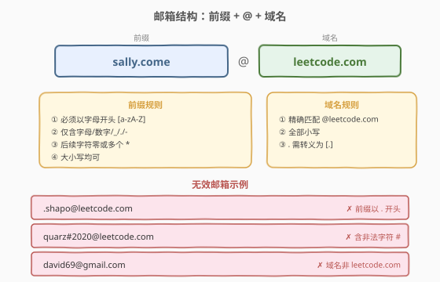
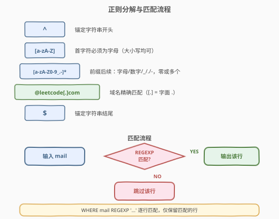
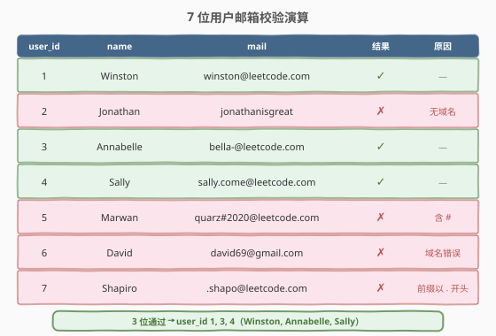

# LeetCode 查找拥有有效邮箱的用户 题解

## 1. 题目概述

- **标题 / 题号**：查找拥有有效邮箱的用户（#1517，easy）
- **链接**：https://leetcode.cn/problems/find-users-with-valid-e-mails/
- **难度**：简单
- **标签**：SQL、正则表达式、WHERE 过滤

**题意**：给定 `Users` 表，编写 SQL 查询，查找具有**有效电子邮件**的用户。一个有效的电子邮件具有前缀名称和域，其中：

1. **前缀**名称是一个字符串，可以包含字母（大写或小写）、数字、下划线 `'_'`、点 `'.'` 和（或）破折号 `'-'`。前缀名称**必须**以字母开头。
2. **域**必须是小写的 `'@leetcode.com'`。

以任何顺序返回结果表。

**表结构**：

```text
Table: Users
+---------------+---------+
| Column Name   | Type    |
+---------------+---------+
| user_id       | int     |  ← 主键
| name          | varchar |
| mail          | varchar |
+---------------+---------+
```

**示例 1**：

```text
输入：
Users 表:
+---------+-----------+-------------------------+
| user_id | name      | mail                    |
+---------+-----------+-------------------------+
| 1       | Winston   | winston@leetcode.com    |
| 2       | Jonathan  | jonathanisgreat         |
| 3       | Annabelle | bella-@leetcode.com     |
| 4       | Sally     | sally.come@leetcode.com |
| 5       | Marwan    | quarz#2020@leetcode.com |
| 6       | David     | david69@gmail.com       |
| 7       | Shapiro   | .shapo@leetcode.com     |
+---------+-----------+-------------------------+

输出：
+---------+-----------+-------------------------+
| user_id | name      | mail                    |
+---------+-----------+-------------------------+
| 1       | Winston   | winston@leetcode.com    |
| 3       | Annabelle | bella-@leetcode.com     |
| 4       | Sally     | sally.come@leetcode.com |
+---------+-----------+-------------------------+
```

**解释**：

| user_id | mail | 有效? | 原因 |
|---------|------|-------|------|
| 1 | `winston@leetcode.com` | ✓ | 前缀以字母开头，域名正确 |
| 2 | `jonathanisgreat` | ✗ | 无 `@` 及域名 |
| 3 | `bella-@leetcode.com` | ✓ | 前缀以字母开头，`-` 允许 |
| 4 | `sally.come@leetcode.com` | ✓ | 前缀以字母开头，`.` 允许 |
| 5 | `quarz#2020@leetcode.com` | ✗ | `#` 不在允许字符集中 |
| 6 | `david69@gmail.com` | ✗ | 域名非 `@leetcode.com` |
| 7 | `.shapo@leetcode.com` | ✗ | 前缀以 `.` 开头，非字母 |

> 💡 本题是 SQL **"正则表达式行级过滤"招牌题**——邮箱有效性本质是「前缀满足字符集规则 + 域名精确匹配」，一条 `REGEXP` 即可完整表达全部规则。核心考点在于将自然语言规则翻译为正确的正则模式，尤其注意 `.` 转义与大小写敏感性。

## 2. 解题思路

### 2.1 暴力思路：逐字符扫描

最直觉的过程式思路：对每个邮箱字符串，先找到 `@` 分割前缀与域名，再逐字符校验：

```text
for each row in Users:
    mail = row.mail
    at_pos = find '@' in mail
    if at_pos not found: → 无效
    prefix = mail[:at_pos]
    domain = mail[at_pos+1:]
    if prefix is empty: → 无效
    if prefix[0] not in [a-zA-Z]: → 无效（首字符非字母）
    for ch in prefix[1:]:
        if ch not in [a-zA-Z0-9_-.]: → 无效（含非法字符）
    if domain != 'leetcode.com': → 无效（域名不匹配）
    → 有效，加入结果
```

虽然逻辑正确，但**纯 SQL 没有显式逐字符循环**——字符集校验与精确匹配需用模式匹配工具表达。逐字符 DFA 扫描在 SQL 中既冗长又不可读。

> ⚠️ 暴力思路的根本问题：**把正则表达式的天然场景复杂化成了「手写状态机」**。邮箱格式校验本质是「字符串是否匹配某个模式」，这正是正则表达式的招牌用途——一条 `REGEXP` 即可替代上面全部循环与分支。

### 2.2 核心观察：正则表达式一行搞定



**将自然语言规则逐条翻译为正则片段**：

| 自然语言规则 | 正则片段 | 说明 |
|-------------|---------|------|
| 从字符串开头开始 | `^` | 锚定开头，防止子串匹配 |
| 前缀首字符必须是字母 | `[a-zA-Z]` | 字符类，大小写均可 |
| 前缀后续字符：字母/数字/`_`/`.`/`-` | `[a-zA-Z0-9_.-]*` | `*` 允许零或多个（前缀可仅 1 字符） |
| 域名精确匹配 `@leetcode.com` | `@leetcode[.]com` | `[.]` 转义为字面点号 |
| 到字符串结尾 | `$` | 锚定结尾，防止尾部多余字符 |

拼接后得到完整模式：

```
^[a-zA-Z][a-zA-Z0-9_.-]*@leetcode[.]com$
```

> 💡 **三条关键不变量**把问题彻底简化：
> 1. **前缀首字符是字母** → `[a-zA-Z]` 一个字符类搞定，无需 `if-else` 判范围。
> 2. **前缀后续字符集固定** → `[a-zA-Z0-9_.-]` 一个字符类枚举全部合法字符，`*` 量词覆盖任意长度。
> 3. **域名是固定字符串** → `@leetcode[.]com` 精确匹配，唯一需注意 `.` 转义。

> ⚠️ **`.` 转义是本题最易踩的坑**：在正则中 `.` 匹配**任意单个字符**。若写 `@leetcode.com`，则 `@leetcodexcom`、`@leetcode0com` 等非法域名也会匹配。必须用 `[.]` 或 `\.` 将其转义为字面量点号。字符类 `[...]` 内的 `.` 天然是字面量，故 `[.]` 最简洁。

> ⚠️ **`^` 和 `$` 不可省略**：省略 `^` 会导致子串匹配（如 `xx.winston@leetcode.com` 中 `.winston@leetcode.com` 子串匹配通过）；省略 `$` 会导致尾部多余字符也通过（如 `winston@leetcode.comx`）。两个锚定符确保**整个字符串从头到尾完全匹配**。

### 2.3 算法流程图



**逻辑执行步骤**：

| 步骤 | 操作 | 说明 |
|------|------|------|
| ① | `FROM Users` | 逐行扫描表 |
| ② | `WHERE mail REGEXP '...'` | 对每行 `mail` 应用正则匹配 |
| ③ | 正则引擎尝试匹配 | `^` 锚开头 → `[a-zA-Z]` 验首字符 → `[a-zA-Z0-9_.-]*` 吃前缀 → `@leetcode[.]com` 验域名 → `$` 锚结尾 |
| ④ | 匹配成功 → 保留；失败 → 跳过 | `WHERE` 过滤行级结果 |
| ⑤ | `SELECT user_id, name, mail` | 输出匹配行 |

> 💡 **SQL 子句执行顺序**：`FROM` → `WHERE` → `SELECT` → `ORDER BY` → `LIMIT`。本题仅需 `FROM + WHERE + SELECT`，无 `GROUP BY`、`HAVING`、`JOIN`——是 SQL 行级过滤的最简形态。

### 2.4 示例演算

以示例 1 的 7 位用户为例，观察正则匹配的逐步判定过程：



**逐行分析**：

| # | mail | 正则匹配过程 | 结果 |
|---|------|-------------|------|
| 1 | `winston@leetcode.com` | `w`∈`[a-zA-Z]` ✓ → `inston`∈`[a-zA-Z0-9_.-]*` ✓ → `@leetcode[.]com` ✓ → `$` ✓ | ✓ 有效 |
| 2 | `jonathanisgreat` | 无 `@`，`[a-zA-Z]*` 吃完后不到 `@leetcode[.]com` | ✗ 无域名 |
| 3 | `bella-@leetcode.com` | `b`✓ → `ella-`∈`[a-zA-Z0-9_.-]*` ✓（`-` 允许）→ 域名 ✓ | ✓ 有效 |
| 4 | `sally.come@leetcode.com` | `s`✓ → `ally.come`✓（`.` 允许）→ 域名 ✓ | ✓ 有效 |
| 5 | `quarz#2020@leetcode.com` | `q`✓ → `uarz`✓ → `#`∉`[a-zA-Z0-9_.-]` ✗ | ✗ 含 `#` |
| 6 | `david69@gmail.com` | `d`✓ → `avid69`✓ → `@gmail[.]com` ≠ `@leetcode[.]com` ✗ | ✗ 域名错误 |
| 7 | `.shapo@leetcode.com` | `.`∉`[a-zA-Z]`（首字符非字母）✗ | ✗ 前缀以 `.` 开头 |

> 💡 注意 user 5 的 `#` 在前缀中间被拒绝——正则引擎在 `#` 处匹配失败，不会继续尝试后续部分。这是 `^...$` 全字符串锚定的效果：任何一个位置不匹配，整条即失败。

## 3. 参考代码

### SQL（解法 A：`REGEXP`，推荐）

```sql
SELECT user_id, name, mail
FROM Users
WHERE mail REGEXP '^[a-zA-Z][a-zA-Z0-9_.-]*@leetcode[.]com$';
```

> 💡 **写法要点**：
> - **`REGEXP`**：MySQL 正则匹配运算符，返回布尔值。`WHERE mail REGEXP 'pattern'` 保留匹配的行。
> - **`[.]` 转义**：字符类内的 `.` 是字面量点号，比 `\\.` 更清晰（MySQL 字符串中 `\\` 需双重转义，易出错）。
> - **`^` 和 `$`**：首尾锚定，确保整个 `mail` 字符串完全匹配，而非子串匹配。
> - **`[a-zA-Z0-9_.-]`**：字符类内 `.` 是字面点、`-` 在末尾是字面减号，无需额外转义。
> - ✓ **最推荐**：一条 `REGEXP` 完整表达全部规则，简洁可读。

### SQL（解法 B：`REGEXP BINARY`，严格大小写）

```sql
SELECT user_id, name, mail
FROM Users
WHERE mail REGEXP BINARY '^[a-zA-Z][a-zA-Z0-9_.-]*@leetcode[.]com$';
```

> 💡 **与解法 A 的区别**：加上 `BINARY` 关键字，使正则匹配变为**大小写敏感**（按字节比较）。
> - **前缀** `[a-zA-Z]`：`BINARY` 下仍匹配大小写两种（因为显式列出了 `a-z` 和 `A-Z` 两个范围），符合"前缀大小写均可"的要求。
> - **域名** `leetcode`：`BINARY` 下只匹配小写 `leetcode`，不会匹配 `LeetCode` 或 `LEETCODE`，符合"域名必须全小写"的要求。
> - **为何解法 A 也能通过 LeetCode**：测试集未包含大小写混合的域名（如 `Winston@LeetCode.com`），故非 `BINARY` 版本也能通过。但生产环境应加 `BINARY` 以严格满足"域名必须小写"的约束。

### SQL（解法 C：PostgreSQL `~` 运算符）

```sql
SELECT user_id, name, mail
FROM Users
WHERE mail ~ '^[a-zA-Z][a-zA-Z0-9_.-]*@leetcode[.]com$';
```

> 💡 **PostgreSQL 写法**：`~` 是大小写敏感的正则匹配运算符（`~*` 才是大小写不敏感）。由于 PostgreSQL 默认大小写敏感，`leetcode` 只匹配小写——恰好满足题目要求，无需额外修饰符。MySQL 需要 `BINARY`，PostgreSQL 天然正确。

### Python（pandas）

```python
import pandas as pd

def find_valid_emails(users: pd.DataFrame) -> pd.DataFrame:
    mask = users['mail'].str.contains(r'^[a-zA-Z][a-zA-Z0-9_.-]*@leetcode\.com$', regex=True)
    return users.loc[mask, ['user_id', 'name', 'mail']]
```

> 💡 **pandas 写法要点**：
> - **`str.contains(pattern, regex=True)`**：对 Series 每个元素应用正则匹配，返回布尔 Series。`^` 和 `$` 锚定确保全字符串匹配。
> - **`r'...'` 原始字符串**：Python 字符串中 `\` 是转义符，用 `r` 前缀避免 `\. ` 被解释为 `\.` → 报错。原始字符串直接传给 `re` 模块。
> - **`\. ` 转义**：Python `re` 模块中 `\.` 匹配字面点号。也可用 `[.]`，与 SQL 写法一致。
> - **大小写敏感**：pandas `str.contains` 默认大小写敏感（`flags=0`），`leetcode` 只匹配小写，天然满足题目要求。
> - **`users.loc[mask, ['user_id', 'name', 'mail']]`**：布尔索引过滤行 + 选择列，等价于 SQL 的 `WHERE + SELECT`。

## 4. 复杂度分析

| 维度 | 复杂度 | 说明 |
|------|--------|------|
| 时间复杂度 | $O(n \cdot m)$ | $n$ = `Users` 表行数，$m$ = `mail` 字段平均长度。每行对长度 $m$ 的字符串做正则匹配 $O(m)$（本模式无回溯风险，线性扫描） |
| 空间复杂度 | $O(k)$ | $k$ = 有效用户数（输出结果集大小）。正则引擎内部状态 $O(1)$ |

> 💡 本题正则模式 `[a-zA-Z][a-zA-Z0-9_.-]*@leetcode[.]com` 不含嵌套量词或交替分支，**无回溯风险**——引擎从左到右线性扫描，最坏 $O(m)$。若模式含 `(a|b)*` 类结构，最坏可达指数级回溯，需注意。实际邮箱长度通常 < 50 字符，性能不是瓶颈。

> ⚠️ **索引优化**：`WHERE mail REGEXP '...'` 无法利用 B+ 树索引（正则非前缀匹配）。若 `Users` 表巨大且需频繁查询，可考虑：(1) 增加 `is_valid_email` 布尔列预处理；(2) 对域名部分 `WHERE mail LIKE '%@leetcode.com' AND mail REGEXP '...'` 先用 `LIKE` 缩小范围（`LIKE` 的后缀匹配仍不走索引，但可结合函数索引）。本题数据量小，无需优化。

## 5. 扩展：MySQL `REGEXP` 大小写敏感性详解

### 5.1 为何需要 `BINARY`

MySQL `REGEXP` 的匹配行为取决于列的**字符集排序规则（collation）**：

| 排序规则后缀 | 大小写敏感性 | 示例 |
|-------------|-------------|------|
| `_ci`（case-insensitive） | ✗ 不敏感 | `utf8mb4_general_ci`、`utf8mb4_0900_ai_ci` |
| `_cs` / `_bin`（case-sensitive） | ✓ 敏感 | `utf8mb4_bin` |

LeetCode 的 MySQL 环境默认使用 `_ci` 排序规则，故 `REGEXP 'leetcode'` 会同时匹配 `LeetCode`、`LEETCODE` 等。题目要求域名**必须全小写**，严格来说应加 `BINARY`。

### 5.2 `BINARY` 对正则各部分的影响

| 正则片段 | 不加 `BINARY`（`_ci`） | 加 `BINARY` |
|---------|----------------------|-------------|
| `[a-zA-Z]`（前缀首字符） | 匹配大小写 ✓ | 匹配大小写 ✓（两范围显式列出） |
| `[a-zA-Z0-9_.-]*`（前缀后续） | 匹配大小写 ✓ | 匹配大小写 ✓ |
| `leetcode`（域名） | 匹配 `LeetCode` 等 ✗ | **只匹配小写** ✓ |

> 💡 **巧妙之处**：`BINARY` 使 `leetcode` 只匹配小写（满足域名要求），同时 `[a-zA-Z]` 仍匹配两种大小写（满足前缀要求）——因为字符类显式列出了 `a-z` 和 `A-Z` 两个范围，`BINARY` 只是让范围边界精确化，不影响"两范围都匹配"的语义。这正是题目"前缀大小写均可、域名必须小写"的精确表达。

### 5.3 `LIKE` 替代方案（不推荐）

理论上可用 `LIKE` + 多个条件替代 `REGEXP`，但极为繁琐：

```sql
SELECT user_id, name, mail
FROM Users
WHERE mail LIKE '%@leetcode.com'
  AND LEFT(mail, 1) REGEXP '[a-zA-Z]'
  AND mail NOT REGEXP '[^a-zA-Z0-9_@.-]';
```

`LIKE` 只有 `%`（任意字符串）和 `_`（单个任意字符）两个通配符，无法表达"首字符为字母""后续字符属于特定集合"等规则，需组合多个 `REGEXP`/`LIKE` 条件。正则表达式是此类模式匹配的天然工具。

## 6. 面试要点

1. **正则中为什么要用 `[.]` 而不是 `.`？**

   > 在正则表达式中，`.` 匹配**任意单个字符**。`@leetcode.com` 中的 `.` 若不转义，会匹配 `@leetcodexcom`、`@leetcode0com` 等非法域名。用 `[.]`（字符类内的 `.` 是字面量）或 `\.` 将其转义为字面点号，确保只匹配 `leetcode.com`。`[.]` 比 `\\.` 更清晰——MySQL 字符串中 `\\` 需双重转义，容易出错。

2. **`^` 和 `$` 锚定符可以省略吗？**

   > 不可以。省略 `^` 会导致子串匹配——如 `invalid.winston@leetcode.com` 中 `.winston@leetcode.com` 子串会匹配通过。省略 `$` 会导致尾部多余字符通过——如 `winston@leetcode.com.evil` 会匹配。两个锚定符确保整个字符串从头到尾**完全匹配**，是"全字符串校验"的关键。

3. **`*` 量词改为 `+` 会有什么区别？**

   > `[a-zA-Z0-9_.-]*` 允许前缀后续字符为零个或多个，即 `w@leetcode.com`（前缀仅一个字母 `w`）也合法。若改为 `+`，要求前缀至少两个字符（首字母 + 至少一个后续字符），`w@leetcode.com` 会被错误淘汰。题目未限制前缀最小长度，故用 `*`。

4. **MySQL `REGEXP` 默认大小写不敏感，如何确保域名全小写？**

   > MySQL `REGEXP` 在 `_ci` 排序规则下大小写不敏感，`leetcode` 也会匹配 `LeetCode`。题目要求域名必须全小写，正确做法是使用 `REGEXP BINARY` 强制大小写敏感匹配。此时 `[a-zA-Z]` 仍匹配两种大小写（显式列出两范围），而 `leetcode` 只匹配小写——恰好满足"前缀大小写均可、域名必须小写"。LeetCode 测试集未测此边界，非 `BINARY` 也能通过，但生产环境应加 `BINARY`。

5. **字符类 `[a-zA-Z0-9_.-]` 中的 `.` 和 `-` 需要转义吗？**

   > 不需要。在字符类 `[...]` 内部，`.` 天然是字面量点号（不再是"任意字符"）。`-` 在字符类末尾（或开头）也是字面减号——只有在两个字符之间（如 `a-z`）才表示范围。故 `[a-zA-Z0-9_.-]` 安全地枚举了字母、数字、`_`、`.`、`-` 全部合法字符，无需额外转义。

> 💡 **一句话总结**：1517 是 SQL **"正则表达式行级过滤"招牌题**——核心模板「`WHERE mail REGEXP '^[a-zA-Z][a-zA-Z0-9_.-]*@leetcode[.]com$'`」。三大考点：① `.` 转义为 `[.]`；② `^`/`$` 全字符串锚定；③ `BINARY` 保证域名大小写敏感。是"将自然语言规则翻译为正则模式"的入门练手题。

## 同类练习题

| # | 题目 | 与本题的关联 |
|---|------|-------------|
| 1527 | [患者没用药](https://leetcode.cn/problems/patients-with-a-condition/) | SQL + `LIKE`/`REGEXP` 过滤诊断条件，同为正则/模式匹配过滤行，巩固 `REGEXP` 用法 |
| 595 | [大的国家](https://leetcode.cn/problems/big-countries/) | SQL `WHERE` 多条件过滤，比 1517 更简单的入门级行级过滤 |
| 1757 | [可回收且低脂的产品](https://leetcode.cn/problems/recyclable-and-low-fat-products/) | SQL `WHERE` 条件过滤，入门级过滤题，巩固 `WHERE` 骨架 |
| 584 | [寻找用户推荐人](https://leetcode.cn/problems/find-customer-referee/) | SQL `WHERE` 条件过滤 + `NULL` 处理，同为行级过滤但增加 `IS NULL` 边界 |
| 197 | [上升的温度](https://leetcode.cn/problems/rising-temperature/) | SQL `WHERE` + 日期比较 + 自连接，在行级过滤基础上叠加表间比较 |
