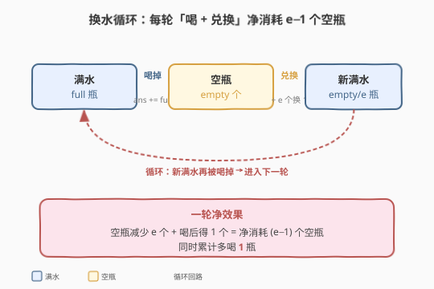
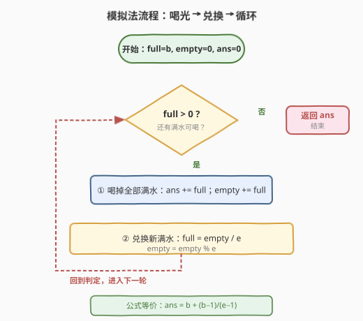
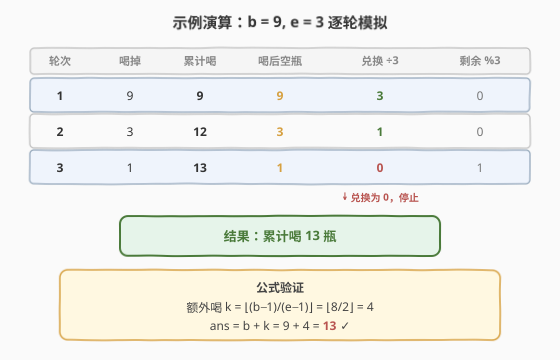

# LeetCode 换水问题 题解

## 1. 题目概述

- **标题 / 题号**：换水问题（#1518，easy）
- **链接**：https://leetcode.cn/problems/water-bottles/
- **难度**：简单
- **标签**：数学、模拟、贪心

**题意**：给定 `numBottles` 瓶满水，喝掉一瓶满水后会得到一个空瓶。可以用 `numExchange` 个空瓶兑换 1 瓶满水。问：最多能喝多少瓶水？

**示例 1**：

```text
输入：numBottles = 9, numExchange = 3
输出：13
解释：先喝 9 瓶得 9 个空瓶；9 个空瓶换 3 瓶满水；喝 3 瓶得 3 个空瓶；
     3 个空瓶换 1 瓶满水；喝 1 瓶得 1 个空瓶。1 < 3 无法再换。
     共喝 9 + 3 + 1 = 13 瓶。
```

**示例 2**：

```text
输入：numBottles = 15, numExchange = 4
输出：19
解释：喝 15 得 15 空 → 换 3 瓶剩 3 空 → 喝 3 得 3+3=6 空 → 换 1 瓶剩 2 空
     → 喝 1 得 2+1=3 空 < 4，停止。共喝 15 + 3 + 1 = 19 瓶。
```

**约束**：

- `1 <= numBottles <= 100`
- `2 <= numExchange <= 100`

## 2. 解题思路

### 2.1 暴力思路：逐轮模拟

最直白的做法是**按轮模拟**整个过程：每轮先把当前所有满水喝掉（累加到答案、满水变为空瓶），再用空瓶尽量兑换新满水（`empty // numExchange` 瓶），剩余空瓶为 `empty % numExchange`。若兑换出新的满水则进入下一轮，否则结束。

这种写法直观、不易错，循环次数等于「兑换轮数」。由于每轮满水数量至少除以 `numExchange`（下取整），轮数为 $O(\log_{e} b)$，本题规模下极小。

### 2.2 核心观察：兑换的「净消耗」是 $e - 1$



把一次「兑换 + 喝掉」看作一个**完整循环**：

1. 拿 $e$ 个空瓶换 1 瓶满水（空瓶 $-e$）；
2. 喝掉这瓶满水（满水 $-1$，空瓶 $+1$）。

一轮结束后，空瓶**净减少** $e - 1$ 个，且**累计多喝了 1 瓶**。换句话说：

> 💡 **每多喝 1 瓶，就「消耗」$e - 1$ 个空瓶**（而非 $e$ 个，因为喝完又吐回 1 个空瓶）。

初始喝完 `numBottles` 瓶后手里有 `numBottles` 个空瓶。此后每次额外兑换净消耗 $e - 1$ 个空瓶。但注意——**最后必须留至少 1 个空瓶无法再换**（即手里的空瓶数始终 $\ge 1$，因为每次喝完都会产生 1 个空瓶）。因此能额外兑换的次数为：

$$
k = \left\lfloor \frac{\text{numBottles} - 1}{\text{numExchange} - 1} \right\rfloor
$$

最终答案为：

$$
\text{ans} = \text{numBottles} + \left\lfloor \frac{\text{numBottles} - 1}{\text{numExchange} - 1} \right\rfloor
$$

> ⚠️ **为什么分子是 $b - 1$ 而不是 $b$**？因为最后一次兑换后手里必剩 $\ge 1$ 个空瓶无法继续用——这「保底的 1 个空瓶」不能参与兑换消耗，所以可消耗的空瓶上限是 $b - 1$，而非 $b$。若直接用 $\lfloor b / (e-1) \rfloor$ 会多算一次（例如 $b=3, e=3$ 时会错误地认为还能多喝 $\lfloor 3/2 \rfloor = 1$ 瓶，但实际喝完 3 瓶得 3 个空瓶，换 1 瓶喝掉剩 1 个空瓶无法再换，确实多喝 1 瓶——这里巧合相等，但 $b=2,e=3$ 时 $\lfloor 2/2 \rfloor=1$ 错误，实际喝完 2 瓶得 2 个空瓶 $<3$ 无法兑换，多喝 0 瓶）。

**代入验证**：

- $b=9, e=3$：$k = \lfloor (9-1)/(3-1) \rfloor = \lfloor 8/2 \rfloor = 4$，ans $= 9 + 4 = 13$ ✓
- $b=15, e=4$：$k = \lfloor (15-1)/(4-1) \rfloor = \lfloor 14/3 \rfloor = 4$，ans $= 15 + 4 = 19$ ✓

### 2.3 算法流程图



模拟法用 `while` 循环重复「喝光 + 兑换」两步，直到某轮兑换不出新满水（`full == 0`）即终止。数学法则只需一行公式，直接返回结果。

### 2.4 示例演算

以 `numBottles = 9, numExchange = 3` 为例，逐轮模拟：



| 轮次 | 喝掉满水 | 累计喝 | 喝后空瓶 | 兑换（÷3） | 剩余空瓶（%3） | 新满水 |
|------|---------|--------|---------|-----------|---------------|--------|
| 1 | 9 | 9 | 9 | 3 | 0 | 3 |
| 2 | 3 | 12 | 3 | 1 | 0 | 1 |
| 3 | 1 | 13 | 1 | 0 | 1 | 0（停止） |

第 3 轮兑换出新满水 0 瓶，循环结束，累计喝了 **13** 瓶。可对照公式：$\lfloor (9-1)/2 \rfloor = 4$，$9 + 4 = 13$，结果一致。

## 3. 参考代码

### 方法一：模拟（直观）

### C++

```cpp
class Solution {
  public:
    int numWaterBottles(int numBottles, int numExchange) {
        int ans = 0, empty = 0, full = numBottles;
        while (full > 0) {
            ans += full;            // 喝掉所有满水
            empty += full;          // 满水变空瓶
            full = empty / numExchange;
            empty = empty % numExchange;
        }
        return ans;
    }
};
```

### Python

```python
class Solution:
    def numWaterBottles(self, numBottles: int, numExchange: int) -> int:
        ans = 0
        empty = 0
        full = numBottles
        while full > 0:
            ans += full
            empty += full
            full, empty = divmod(empty, numExchange)
        return ans
```

> 💡 Python 用 `divmod` 一行同时取商和余，比分开 `/` 和 `%` 更简洁。

### 方法二：数学公式（$O(1)$）

### C++

```cpp
class Solution {
  public:
    int numWaterBottles(int numBottles, int numExchange) {
        return numBottles + (numBottles - 1) / (numExchange - 1);
    }
};
```

### Python

```python
class Solution:
    def numWaterBottles(self, numBottles: int, numExchange: int) -> int:
        return numBottles + (numBottles - 1) // (numExchange - 1)
```

> ⚠️ C++ 中 `numExchange >= 2`，分母 `numExchange - 1 >= 1`，不会除零；`numBottles >= 1`，分子 `numBottles - 1 >= 0`，整数除法结果非负，安全。

## 4. 复杂度分析

| 维度 | 模拟法 | 数学法 |
|------|--------|--------|
| 时间复杂度 | $O(\log_{e} b)$ | $O(1)$ |
| 空间复杂度 | $O(1)$ | $O(1)$ |
| 说明 | 每轮满水数至少除以 $e$（下取整），轮数对数级 | 一次除法直接出结果 |

其中 $b = \text{numBottles}$，$e = \text{numExchange}$。本题数据规模 $b, e \le 100$，两种方法都瞬间完成；面试中**先讲模拟建立直觉，再推出公式展示数学化简**是最佳节奏。

## 5. 扩展：模拟与公式如何互相验证

模拟法和公式法本质描述同一过程，可以互相推导：

1. **模拟 → 公式**：设初始 $b$ 瓶，喝完得 $b$ 个空瓶。每轮「兑换 + 喝掉」净消耗 $e-1$ 个空瓶、多喝 1 瓶。能进行第 $k$ 轮兑换的条件是「第 $k-1$ 轮结束后空瓶数 $\ge e$」，等价于 $b - (k-1)(e-1) \ge e$，即 $b - k(e-1) \ge 1$，解得 $k \le (b-1)/(e-1)$。故额外喝 $k = \lfloor (b-1)/(e-1) \rfloor$ 瓶。

2. **公式 → 模拟**：公式给出的 $k$ 正是模拟循环会执行的兑换次数，每轮模拟恰好净消耗 $e-1$ 个空瓶，直到剩余空瓶不足以再换——与公式上界严格对应。

> 💡 **面试技巧**：当遇到「重复兑换 / 重复使用」类问题（如盖印章、集瓶盖换饮料），先写模拟确保正确，再尝试化简为公式——既能保证 AC，又能展示数学洞察。若数据规模极大（如 $b$ 到 $10^9$），公式法的 $O(1)$ 优势才真正显现。

## 6. 面试要点

1. **为什么公式里是 $b - 1$ 而不是 $b$？**

   - 每次喝完都会产生 1 个空瓶，**最后一轮兑换后手里必剩 $\ge 1$ 个空瓶**无法继续参与兑换。所以可被「净消耗」的空瓶上限是 $b - 1$（初始 $b$ 个空瓶里要留 1 个保底），而非 $b$。

2. **模拟法的循环何时终止？**

   - 当某轮 `empty / numExchange == 0`，即兑换不出新满水（`full == 0`）时，`while (full > 0)` 条件不满足，循环退出。此时 `empty` 中残留的空瓶已不足 `numExchange` 个。

3. **公式法会不会除零？**

   - 不会。约束保证 `numExchange >= 2`，故 `numExchange - 1 >= 1`，分母非零。同时 `numBottles >= 1`，分子 `numBottles - 1 >= 0`，整数除法非负。

4. **如果允许借空瓶（如向老板借 1 个空瓶凑够兑换再还），答案会变吗？**

   - 会。借 1 个空瓶可能让最后一轮凑够 $e$ 个再兑换一次，喝完还回 1 个空瓶。此时答案变为 $b + \lfloor b / (e-1) \rfloor$（若 $b \bmod (e-1) == 0$ 则可多换 1 次，否则与不借相同）。这是「[3210. 找出最高奖励](https://leetcode.cn/)」类带借贷变体的思路来源。

5. **模拟法和公式法在工程中如何选？**

   - 数据小（如本题 $b \le 100$）：模拟更直观、可读性高，便于和产品/测试对齐逻辑。
   - 数据大（$b$ 到 $10^9$）：必须用公式，模拟会 TLE。
   - 面试推荐：先模拟 AC，再口述公式化简，展示两种思维。

## 同类练习题

| # | 题目 | 与本题的关联 |
|---|------|-------------|
| 3318 | [计算子数组中的 X 元素 I](https://leetcode.cn/problems/find-x-sum-of-all-k-long-subarrays-i/) | 同为「逐步消耗 + 兑换」的模拟思路，规模更大时需化简 |
| 258 | [各位相加](https://leetcode.cn/problems/add-digits/)（[题解](../0201-0300/258_各位相加.md)） | 反复迭代化简为 $O(1)$ 数学公式的同类套路，模拟 $O(\log n)$ → 公式 $O(1)$ |
| 292 | [Nim 游戏](https://leetcode.cn/problems/nim-game/) | 模拟博弈化简为「能否被 4 整除」的 $O(1)$ 判定，体现「模拟找规律 → 数学公式」范式 |
| 7 | [整数反转](https://leetcode.cn/problems/reverse-integer/) | 逐位模拟 + 数学化简，同为「按位/按轮处理」类问题 |
| 12 | [整数转罗马数字](https://leetcode.cn/problems/integer-to-roman/)（[题解](../0001-0100/12_整数转罗马数字.md)） | 贪心配面值的「不断减 + 拼接」模拟，与本题「不断兑换 + 累加」同构 |
