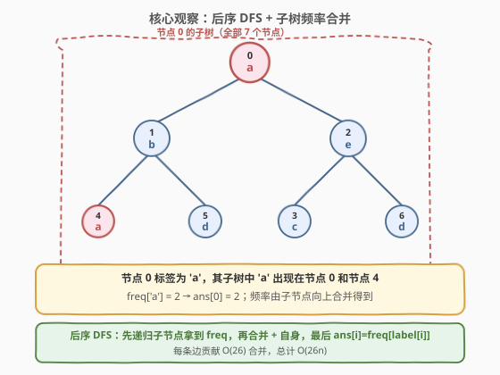
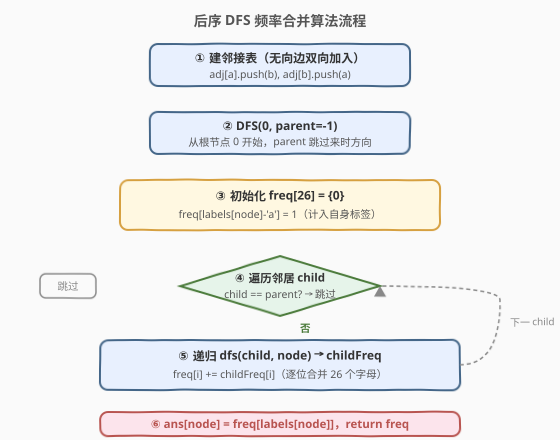
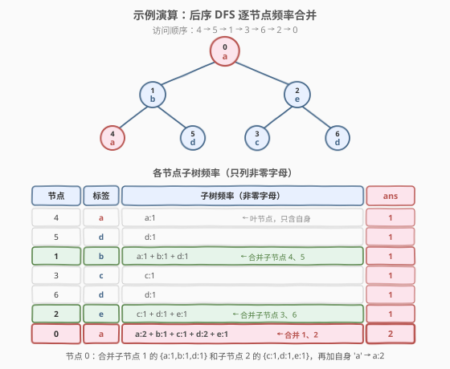

# 带给定标签的二叉树中的节点数

- **题目名称**：带给定标签的二叉树中的节点数
- **链接**：[1519. 带给定标签的二叉树中的节点数](https://leetcode.cn/problems/number-of-nodes-with-a-given-label-in-a-binary-tree/)
- **难度**：中等
- **标签**：树、深度优先搜索、后序遍历、哈希表

## 1. 题目概述

给定一棵 **`n` 个节点**的树（无向无环连通图），节点编号 `0` 到 `n - 1`，以节点 `0` 为根。树用边列表 `edges[i] = [ai, bi]` 表示一条无向边，每个节点 `i` 有一个小写字母标签 `labels[i]`。

对每个节点 `i`，统计其**子树**中与 `i` 标签相同的节点个数，返回长度为 `n` 的数组 `ans`。

> 💡 这是一棵**一般树**（不限于二叉），由无向边给出。需要先以节点 `0` 为根「定向」成有根树，再对每个节点统计子树内的标签频率。

**示例 1**：

```text
输入：n = 7, edges = [[0,1],[0,2],[1,4],[1,5],[2,3],[2,6]], labels = "abaedcd"
输出：[2,1,1,1,1,1,1]
解释：树结构如下（节点编号:标签）：
         0:a
        /   \
      1:b    2:e
      / \    / \
    4:a 5:d 3:c 6:d
节点 0 的子树含全部 7 个节点，其中标签 'a' 出现 2 次（节点 0 和 4），故 ans[0]=2。
其余节点子树中各自标签都只出现 1 次。
```

**示例 2**：

```text
输入：n = 4, edges = [[0,1],[1,2],[0,3]], labels = "bbbb"
输出：[4,2,1,1]
解释：全部标签均为 'b'。节点 0 子树 4 个节点全为 'b'，ans[0]=4；
节点 1 子树含节点 1、2 共 2 个 'b'，ans[1]=2。
```

**示例 3**：

```text
输入：n = 5, edges = [[0,1],[0,2],[1,3],[0,4]], labels = "aabab"
输出：[3,2,1,1,1]
解释：节点 0 子树标签序列为 a,a,b,a,b，'a' 出现 3 次，ans[0]=3；
节点 1 子树含节点 1、3 标签均为 'a'，ans[1]=2。
```

**约束条件**：

- `1 <= n <= 10^5`
- `edges.length == n - 1`
- `labels.length == n`
- `labels[i]` 为小写英文字母
- `edges` 构成一棵有效的树

---

## 2. 解题思路

### 2.1 暴力思路：对每个节点独立 DFS

最直观的做法：对每个节点 `i`，从 `i` 出发 DFS 遍历其子树，数一遍标签等于 `labels[i]` 的节点数。

- 共 `n` 个节点，每次 DFS 遍历子树 $O(n)$，总计 $O(n^2)$。
- 当 $n = 10^5$ 时达 $10^{10}$，**超时**。

> 💡 问题在于：父子节点的子树高度重叠——父节点的子树 = 自身 + 所有子节点的子树。逐个独立 DFS 做了大量重复计算。应该让子节点把统计结果**向上传递**给父节点，避免重复。

### 2.2 核心观察：后序 DFS + 子树频率合并



核心思路：

- 每个节点维护一个**长度为 26 的频率数组** `freq[0..25]`，记录其子树中每个字母出现的次数。
- **后序遍历**：先递归处理所有子节点，拿到它们的 `freq`，然后**合并**（逐位相加）到当前节点的 `freq` 中。
- 最后给自己 `+1`：`freq[labels[node]] += 1`。
- 此时 `freq[labels[node]]` 就是当前节点子树中与自身标签相同的节点数，写入 `ans[node]`。

> 💡 **为什么后序？** 子节点的子树是父节点子树的子集，必须先算完子节点才能得到父节点的完整频率。后序 DFS 天然保证「先子后父」的计算顺序。

**把无向图定向为有根树**：`edges` 给的是无向边。DFS 时传入 `parent` 参数，访问邻居时跳过 `parent`，即可把图定向为以 `0` 为根的树。

### 2.3 算法流程图



### 2.4 示例演算

以示例 1 为例：`n=7, edges=[[0,1],[0,2],[1,4],[1,5],[2,3],[2,6]], labels="abaedcd"`。

后序 DFS 的访问顺序（左子树优先）：`4 → 5 → 1 → 3 → 6 → 2 → 0`。



| 步骤 | 节点 | 标签 | 合并来源 | freq（a-z 关键位） | ans[i] |
|------|------|------|---------|-------------------|--------|
| 1 | 4 | a | 叶节点 | a:1 | 1 |
| 2 | 5 | d | 叶节点 | d:1 | 1 |
| 3 | 1 | b | 合并 4、5 + 自身 | a:1, b:1, d:1 | 1 |
| 4 | 3 | c | 叶节点 | c:1 | 1 |
| 5 | 6 | d | 叶节点 | d:1 | 1 |
| 6 | 2 | e | 合并 3、6 + 自身 | c:1, d:1, e:1 | 1 |
| 7 | 0 | a | 合并 1、2 + 自身 | a:2, b:1, c:1, d:2, e:1 | **2** |

节点 0 合并了子节点 1 的 `{a:1, b:1, d:1}` 和子节点 2 的 `{c:1, d:1, e:1}`，再加上自身标签 `a`，得到 `a:2`——这就是 `ans[0] = 2` 的来源。

> 💡 频率数组的合并是**逐位相加**（26 个字母各加一次），每条边贡献 $O(26)$ 的工作量，共 $n-1$ 条边，总计 $O(26n)$。

---

## 3. 参考代码

### C++

```cpp
class Solution {
public:
    vector<int> countSubTrees(int n, vector<vector<int>>& edges, string labels) {
        vector<vector<int>> adj(n);
        for (auto& e : edges) {
            adj[e[0]].push_back(e[1]);
            adj[e[1]].push_back(e[0]);
        }

        vector<int> ans(n, 0);
        dfs(0, -1, adj, labels, ans);
        return ans;
    }

private:
    vector<int> dfs(int node, int parent,
                    vector<vector<int>>& adj, string& labels,
                    vector<int>& ans) {
        vector<int> freq(26, 0);
        freq[labels[node] - 'a'] = 1;

        for (int child : adj[node]) {
            if (child == parent) continue;
            vector<int> childFreq = dfs(child, node, adj, labels, ans);
            for (int i = 0; i < 26; ++i)
                freq[i] += childFreq[i];
        }

        ans[node] = freq[labels[node] - 'a'];
        return freq;
    }
};
```

### Python

```python
class Solution:
    def countSubTrees(self, n: int, edges: List[List[int]],
                      labels: str) -> List[int]:
        adj = [[] for _ in range(n)]
        for a, b in edges:
            adj[a].append(b)
            adj[b].append(a)

        ans = [0] * n

        def dfs(node: int, parent: int) -> List[int]:
            freq = [0] * 26
            freq[ord(labels[node]) - ord('a')] = 1

            for child in adj[node]:
                if child == parent:
                    continue
                child_freq = dfs(child, node)
                for i in range(26):
                    freq[i] += child_freq[i]

            ans[node] = freq[ord(labels[node]) - ord('a')]
            return freq

        dfs(0, -1)
        return ans
```

> 💡 **两个要点**：
> 1. **`parent` 参数**：无向边建图后，DFS 需要跳过来时的父节点，否则会重复访问甚至死循环。
> 2. **返回 `freq` 数组**：子节点把完整的 26 位频率返回给父节点合并。每个节点创建一个新数组，共 $n$ 个，总空间 $O(26n)$。

---

## 4. 复杂度分析

| 维度 | 复杂度 | 说明 |
|------|--------|------|
| 时间复杂度 | $O(26n)$ | 每条边触发一次子节点 DFS 返回，合并 26 个字母频率 $O(26)$；共 $n-1$ 条边 |
| 空间复杂度 | $O(26n)$ | 每个节点一个 26 元素频率数组 + 递归栈 $O(n)$；频率数组总计 $O(26n)$ |

> ⚠️ $n \le 10^5$，$26n \approx 2.6 \times 10^6$，远在时限内。若需进一步优化空间，可改为全局单个 `freq[n][26]` 二维数组或传引用原地合并（减去子节点贡献），但代码复杂度增加，本题无此必要。

---

## 5. 扩展：空间优化——单全局频率数组

上述解法每个节点创建并返回一个新的 26 元素数组，总分配 $n$ 次。可以改为**全局单个 `freq[26]`**配合「先记录、后还原」的增量法：

1. DFS 进入节点 `u` 前，记录 `before = freq[labels[u]]`。
2. 递归所有子节点（它们会修改全局 `freq`）。
3. `freq[labels[u]]` 加上自身 `+1`（或先加自身再递归）。
4. `ans[u] = freq[labels[u]] - before`。

这样空间降到 $O(n)$（递归栈）+ $O(26)$（全局频率），但代码不如返回数组直观。在 $n \le 10^5$、字母表仅 26 的情况下，两种写法性能差异可忽略。

---

## 6. 面试要点

1. **为什么用后序遍历？**

   - 子节点的子树是父节点子树的子集。必须先算出所有子节点的频率，父节点才能合并出完整子树频率。后序 DFS 保证「先子后父」的计算顺序。

2. **无向边如何定向为有根树？**

   - DFS 时传入 `parent` 参数，遍历邻居时跳过 `parent`。这样从根节点 `0` 出发，每条无向边只朝「远离根」的方向走，自然形成有根树。

3. **为什么频率数组大小是 26？**

   - 标签只有小写字母（`'a'` 到 `'z'`），用 26 元素数组即可 $O(1)$ 查询和更新每个字母的计数。比通用哈希表更紧凑、无哈希开销。

4. **暴力解法为什么超时？**

   - 对每个节点独立 DFS 数标签，共 $n$ 次 DFS 每次 $O(n)$，总计 $O(n^2)$。$n = 10^5$ 时约 $10^{10}$ 次操作。频率合并把重复计算消除：每条边只贡献一次 $O(26)$ 合并。

5. **如果标签是任意字符串而非单字符怎么做？**

   - 把频率数组换成哈希表 `HashMap<String, Integer>`，合并时遍历子节点哈希表逐键相加。最坏情况每条边合并 $O(\text{子树不同标签数})$，总复杂度取决于标签种类数。

---

## 7. 同类练习题

- [236. 二叉树的最近公共祖先](https://leetcode.cn/problems/lowest-common-ancestor-of-a-binary-tree/)（[题解](../0201-0300/236_二叉树的最近公共祖先.md)）：后序 DFS 返回信息给父节点决策，同样是「先子后父」的递归结构
- [508. 出现次数最多的子树元素和](https://leetcode.cn/problems/most-frequent-subtree-sum/)：后序 DFS 统计子树和并向上传递，与本题频率合并同构
- [124. 二叉树中的最大路径和](https://leetcode.cn/problems/binary-tree-maximum-path-sum/)：后序 DFS 返回子树最优值给父节点拼接，后序聚合思想的进阶应用
- [971. 翻转二叉树以匹配前序遍历](https://leetcode.cn/problems/flip-binary-tree-to-match-preorder-traversal/)：树的 DFS 遍历 + 子树操作，对比本题的后序信息传递
- [1448. 统计二叉树中好节点的数目](https://leetcode.cn/problems/count-good-nodes-in-binary-tree/)：DFS 沿路径传递信息（前序），与本题后序聚合形成对照
