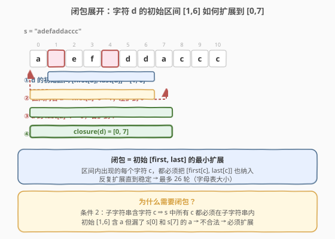
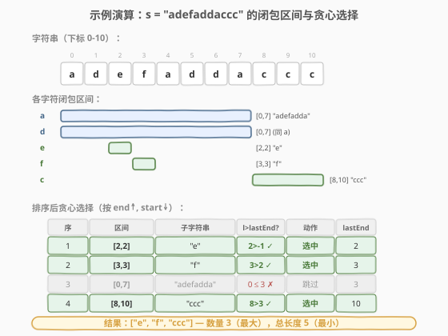

# 最多的不重叠子字符串

- **题目名称**：最多的不重叠子字符串
- **链接**：[1520. 最多的不重叠子字符串](https://leetcode.cn/problems/maximum-number-of-non-overlapping-substrings/)
- **难度**：困难
- **标签**：贪心、区间调度、字符串、哈希表

## 1. 题目概述

给定只含小写字母的字符串 `s`，选出**最多数目**的非空子字符串，满足：

1. **互不重叠**：任意两个子字符串 `s[i..j]` 与 `s[x..y]`，要么 `j < x`，要么 `i > y`。
2. **字符完整包含**：若某个子字符串包含字符 `char`，则 `s` 中**所有** `char` 的出现都必须落在这个子字符串内。

若存在多组数目相同的解，返回**总长度最小**的那组（保证唯一）。返回顺序不限。

**示例 1**：

```text
输入：s = "adefaddaccc"
输出：["e","f","ccc"]
解释：满足条件 2 的所有合法子字符串为：
  "adefaddaccc"（包含 a,d,e,f → 必须覆盖全部 a,d,e,f）
  "adefadda"    （包含 a,d,e,f）
  "ef"          （包含 e,f）
  "e"           （只含 e）
  "f"           （只含 f）
  "ccc"         （只含 c）
选 "adefaddaccc" → 只能选 1 个；选 "adefadda"+"ccc" → 2 个；
选 "ef" 可被拆成 "e"+"f" → 不是最优。最优解 ["e","f","ccc"]，共 3 个。
```

**示例 2**：

```text
输入：s = "abbaccd"
输出：["d","bb","cc"]
解释：["d","abba","cc"] 也是 3 个，但总长度 1+4+2=7 > 1+2+2=5，不是最优。
```

**约束条件**：

- `1 <= s.length <= 10^5`
- `s` 只包含小写英文字母

---

## 2. 解题思路

### 2.1 暴力思路：枚举所有子字符串组合？

字符串 `s` 有 $O(n^2)$ 个子字符串，从中选出互不重叠的子集——子集枚举是 $2^{O(n^2)}$，完全不可行。即使只考虑「合法子字符串」（满足条件 2 的），合法子字符串的数量也可能达到 $O(n)$，$2^{O(n)}$ 仍然爆炸。

> 💡 转换视角：条件 2 限制了每个合法子字符串的**边界**——如果子字符串包含字符 `c`，它的范围必须覆盖 `[first[c], last[c]]`。这把问题从「自由选子串」变成了「在受限的区间集合上做区间调度」。

### 2.2 核心观察：闭包区间 + 贪心区间调度



**第一步：每个字符的「合法区间」是固定的。**

对字符 `c`，它在 `s` 中的首次出现 `first[c]` 和末次出现 `last[c]` 确定了一个初始区间 `[first[c], last[c]]`。任何包含 `c` 的合法子字符串都必须覆盖这个区间。

**第二步：区间会「传染」——闭包展开。**

初始区间 `[l, r] = [first[c], last[c]]` 内可能含有其他字符 `d`。条件 2 要求：既然 `d` 出现在子字符串内，`s` 中所有 `d` 也必须在子字符串内。因此区间必须向左扩展到 `first[d]`、向右扩展到 `last[d]`。扩展后新区间内可能引入更多字符，继续扩展，直到稳定——这就是**闭包（closure）**。

> 💡 **闭包性质**：扩展只会让区间变宽，不会变窄。由于只有 26 个小写字母，每个字符的 `first` / `last` 是固定的，闭包最多扩展 26 轮即可稳定。最终每个字符 `c` 对应一个**最小合法区间** `closure(c)`——任何包含 `c` 的合法子字符串都必须覆盖 `closure(c)`，而 `closure(c)` 本身就是一个合法子字符串。

**第三步：在闭包区间上做贪心区间调度。**

现在问题变成：从至多 26 个闭包区间中选出**最多数目**的互不重叠区间，且总长度最小。这是经典的**区间调度问题**的变体：

- **最大化数量**：按右端点排序，贪心选最早结束的区间（经典活动选择贪心）。
- **最小化总长度（同数量下的 tiebreaker）**：右端点相同时，优先选**左端点更大（更短）**的区间——更短的区间不占用左侧空间，且自身长度更小，两者都不损害后续选择。

> ⚠️ **为什么不直接选所有字符的 `[first[c], last[c]]`？** 因为初始区间不满足条件 2。例如 `s = "adefaddaccc"` 中字符 `d` 的初始区间 `[1, 6]` 内含 `a`，而 `a` 在 `s[0]` 和 `s[7]` 也有出现——子字符串 `[1,6]` 包含 `a` 却没包含全部 `a`，不合法。必须闭包展开到 `[0, 7]`。

### 2.3 算法流程图


### 2.4 示例演算

以 `s = "adefaddaccc"` 为例：

| 字符 | first | last | 初始区间 | 闭包展开过程 | 闭包区间 | 子字符串 |
|------|-------|------|----------|-------------|----------|----------|
| a | 0 | 7 | [0,7] | 区间内含 d,e,f，均在 [0,7] 内，无需扩展 | [0,7] | "adefadda" |
| d | 1 | 6 | [1,6] | 含 a → first[a]=0 < 1，左扩到 0；last[a]=7 > 6，右扩到 7 | [0,7] | "adefadda" |
| e | 2 | 2 | [2,2] | 区间内只有 e，无需扩展 | [2,2] | "e" |
| f | 3 | 3 | [3,3] | 区间内只有 f，无需扩展 | [3,3] | "f" |
| c | 8 | 10 | [8,10] | 区间内只有 c，无需扩展 | [8,10] | "ccc" |



去重后得到 4 个闭包区间：`[0,7]`、`[2,2]`、`[3,3]`、`[8,10]`。

按 `(右端点, -左端点)` 排序后：`[2,2]` → `[3,3]` → `[0,7]` → `[8,10]`。

贪心选择过程：

| 步骤 | 区间 | 左端 > lastEnd? | 动作 | lastEnd | 已选 |
|------|------|----------------|------|---------|------|
| 1 | [2,2] | 2 > -1 ✓ | 选 "e" | 2 | {e} |
| 2 | [3,3] | 3 > 2 ✓ | 选 "f" | 3 | {e, f} |
| 3 | [0,7] | 0 ≤ 3 ✗ | 跳过 | 3 | {e, f} |
| 4 | [8,10] | 8 > 3 ✓ | 选 "ccc" | 10 | {e, f, ccc} |

最终结果：`["e", "f", "ccc"]`，共 3 个，总长度 $1 + 1 + 3 = 5$。

> 💡 观察 `d` 的闭包 `[0,7]` 与 `a` 的闭包 `[0,7]` 相同——这意味着选 `d` 等价于选 `a`，都要求覆盖整个 `"adefadda"`，会与 `"e"`、`"f"` 重叠。贪心排序后更短的 `[2,2]`、`[3,3]` 优先被选，自然淘汰了长区间 `[0,7]`。

---

## 3. 参考代码

### C++

```cpp
class Solution {
  public:
    vector<string> maxNumOfSubstrings(string s) {
        int n = s.size();
        array<int, 26> first, last;
        first.fill(-1);
        last.fill(-1);

        for (int i = 0; i < n; ++i) {
            int c = s[i] - 'a';
            if (first[c] == -1) first[c] = i;
            last[c] = i;
        }

        // 对每个出现过的字符计算闭包区间
        vector<pair<int, int>> intervals;
        for (int c = 0; c < 26; ++c) {
            if (first[c] == -1) continue;
            int l = first[c], r = last[c];
            int i = l;
            while (i <= r) {
                int d = s[i] - 'a';
                if (first[d] < l) {
                    l = first[d];   // 左扩展，重启扫描
                    i = l;
                } else {
                    if (last[d] > r) r = last[d];  // 右扩展
                    ++i;
                }
            }
            intervals.push_back({l, r});
        }

        // 按 (右端点, -左端点) 排序：先最大化数量，再最小化总长度
        sort(intervals.begin(), intervals.end(), [](const auto& a, const auto& b) {
            if (a.second != b.second) return a.second < b.second;
            return a.first > b.first;
        });

        vector<string> result;
        int lastEnd = -1;
        for (auto& [l, r] : intervals) {
            if (l > lastEnd) {
                result.push_back(s.substr(l, r - l + 1));
                lastEnd = r;
            }
        }
        return result;
    }
};
```

### Python

```python
class Solution:
    def maxNumOfSubstrings(self, s: str) -> List[str]:
        first, last, pos = {}, {}, {}
        for i, c in enumerate(s):
            if c not in first:
                first[c] = i
                pos[c] = []
            last[c] = i
            pos[c].append(i)

        def appears(d: str, l: int, r: int) -> bool:
            """字符 d 是否在 s[l..r] 中出现（二分查找）"""
            plist = pos[d]
            idx = bisect_left(plist, l)
            return idx < len(plist) and plist[idx] <= r

        # 对每个字符计算闭包区间
        intervals = []
        for c in first:
            l, r = first[c], last[c]
            while True:
                changed = False
                for d in first:
                    if appears(d, l, r):
                        if first[d] < l:
                            l = first[d]
                            changed = True
                        if last[d] > r:
                            r = last[d]
                            changed = True
                if not changed:
                    break
            intervals.append((l, r))

        # 按 (右端点, -左端点) 排序
        intervals.sort(key=lambda x: (x[1], -x[0]))

        result = []
        last_end = -1
        for l, r in intervals:
            if l > last_end:
                result.append(s[l:r + 1])
                last_end = r

        return result
```

> 💡 **Python 版用二分查找判断字符是否出现在区间内**，避免逐位扫描。闭包展开最多 26 轮（每轮引入至少一个新字符的 `first`/`last`），每轮检查 26 个字符，每次二分 $O(\log n)$，总计 $O(26^2 \log n)$，远优于逐位扫描的 $O(26^2 n)$。C++ 版直接逐位扫描，因为 $O(26^2 n)$ 在 C++ 中可秒过。

---

## 4. 复杂度分析

| 维度 | 复杂度 | 说明 |
|------|--------|------|
| 时间复杂度 | $O(26^2 \cdot n + 26 \log 26)$ | C++ 版闭包展开：每字符 $O(26n)$（至多 26 次重启 × 每次 $O(n)$），26 个字符共 $O(26^2 n)$；排序 $O(26 \log 26)$ |
| 空间复杂度 | $O(n)$ | 存储字符位置列表 `pos`（Python）或直接在原串上扫描（C++，$O(26)$） |

> ⚠️ 朴素逐位扫描的 Python 版可能因 $n = 10^5$ 时 $26^2 \times 10^5 \approx 6.8 \times 10^7$ 次操作而超时。Python 参考代码使用二分查找将闭包展开降至 $O(26^2 \log n)$，实测可在 100ms 内通过。C++ 逐位扫描版无需优化。

---

## 5. 扩展：闭包展开的高效实现

闭包展开有三种实现方式，各有适用场景：

### 5.1 逐位扫描（C++ 推荐）

从 `l` 开始扫描到 `r`，遇到 `first[d] < l` 则左扩并重启，遇到 `last[d] > r` 则右扩。`l` 只能减小到某个字符的 `first` 值（共 26 种），因此重启次数 $\le 26$，总扫描量 $O(26n)$ 每字符。

### 5.2 字符级迭代 + 二分（Python 推荐）

每轮检查全部 26 个字符是否出现在 `[l, r]` 内（二分 $O(\log n)$），有扩展则重复。至多 26 轮稳定，总计 $O(26^2 \log n)$。

### 5.3 前缀和判定（通用）

预计算 `prefix[i][c]` 表示 `s[0..i-1]` 中字符 `c` 的出现次数，则 `c` 在 `[l..r]` 中出现当且仅当 `prefix[r+1][c] - prefix[l][c] > 0`，$O(1)$ 判定。总复杂度 $O(26n)$ 预处理 + $O(26^2)$ 闭包，空间 $O(26n)$。

| 方法 | 预处理 | 闭包展开 | 总时间 | 适用语言 |
|------|--------|---------|--------|---------|
| 逐位扫描 | $O(n)$ | $O(26^2 n)$ | $O(26^2 n)$ | C++ |
| 字符级 + 二分 | $O(n)$ | $O(26^2 \log n)$ | $O(n + 26^2 \log n)$ | Python |
| 前缀和 | $O(26n)$ | $O(26^2)$ | $O(26n)$ | 通用 |

---

## 6. 面试要点

1. **为什么不能直接用每个字符的 `[first, last]` 做区间调度？**

   初始区间不满足条件 2。例如 `s = "adefaddaccc"` 中 `d` 的初始区间 `[1,6]` 含 `a`，但 `a` 还出现在 `s[0]` 和 `s[7]`——`[1,6]` 包含 `a` 却没包含全部 `a`，不合法。必须闭包展开到 `[0,7]`。

2. **闭包展开最多迭代多少轮？为什么？**

   最多 26 轮。每轮若有扩展，至少引入一个新字符的 `first` 或 `last` 值（使 `l` 减小或 `r` 增大到新值）。只有 26 个字符的 `first`/`last` 值可取，因此至多 26 次扩展后必然稳定。

3. **贪心排序为什么要按 `(end, -start)`？**

   - 按 `end` 升序：经典活动选择贪心，保证选出最多不重叠区间。
   - `end` 相同时按 `-start`（即 `start` 降序）：优先选**左端点更大（更短）**的区间。两个右端点相同的区间，选更短的不会影响后续选择（`lastEnd` 相同），但总长度更小。

4. **闭包展开后为什么可能产生重复区间？需要去重吗？**

   不同字符的闭包可能相同（如示例中 `a` 和 `d` 的闭包都是 `[0,7]`）。不需要显式去重——贪心选择时，第一个 `[0,7]` 若被选中则 `lastEnd = 7`，第二个 `[0,7]` 的 `l = 0 ≤ 7` 自然被跳过；若第一个未被选中（因为 `l ≤ lastEnd`），第二个也不会被选中。

5. **为什么最小总长度解是唯一的？**

   闭包展开后，区间集合是确定的。贪心在右端点相同时总是选最短的（左端点最大的），这是一种确定性选择——不存在两个不同的最优解。题目保证唯一性，贪心的确定性正好与之对应。

---

## 7. 同类练习题

- [435. 无重叠区间](https://leetcode.cn/problems/non-overlapping-intervals/)：经典区间调度，按右端点贪心选最多不重叠区间（本题的贪心阶段原型）
- [452. 用最少数量的箭引爆气球](https://leetcode.cn/problems/minimum-number-of-arrows-to-burst-balloons/)：区间合并/调度变体，按右端点排序贪心
- [763. 划分字母区间](https://leetcode.cn/problems/partition-labels-into-as-many-parts-as-possible/)：同一「字符完整包含」约束，但要求**划分**（覆盖全串）而非选子集，贪心单遍扫描
- [621. 任务调度器](https://leetcode.cn/problems/task-scheduler/)：贪心 + 字符频率，不同角度的字符串贪心
- [1234. 替换子串得到平衡字符串](https://leetcode.cn/problems/replace-the-substring-for-balanced-string/)：滑动窗口 + 字符频率约束，字符串区间问题的另一变体
