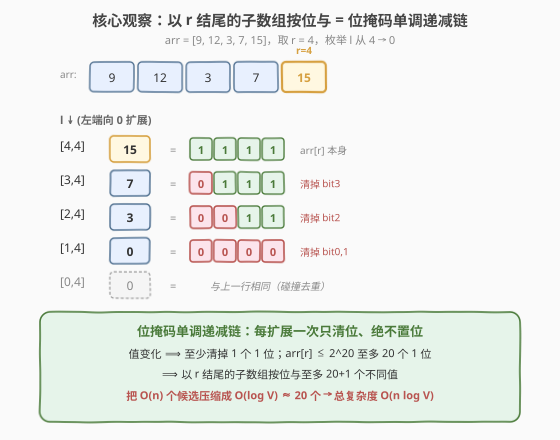
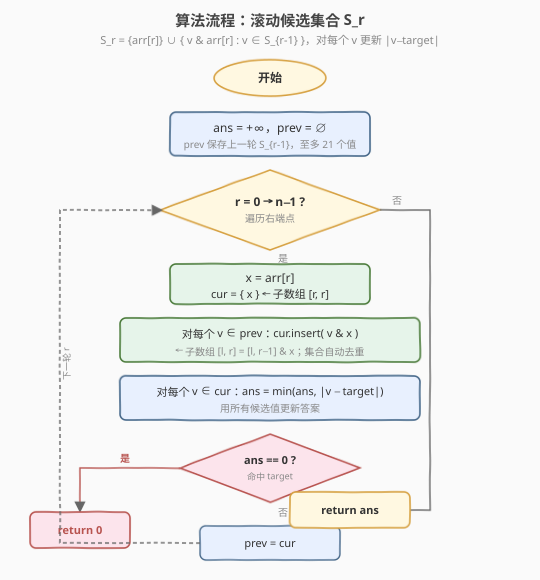
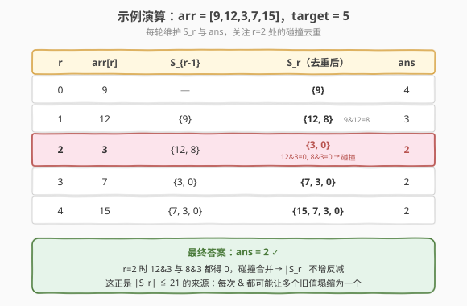

# LeetCode 找到最接近目标值的函数值 题解

## 1. 题目概述

- **标题 / 题号**：找到最接近目标值的函数值（#1521，hard）
- **链接**：https://leetcode.cn/problems/find-a-value-of-a-mysterious-function-closest-to-target/
- **难度**：困难
- **标签**：位运算、数组、滑动窗口思想、按位与性质

**题意**：Winston 构造了一个函数 `func(arr, l, r)`：将数组 `arr` 的下标闭区间 `[l, r]` 内所有元素**按位与**（bitwise AND）起来。给定数组 `arr` 和整数 `target`，在所有满足 `0 <= l <= r < arr.length` 的数对 `(l, r)` 中，找到使 `|func(arr, l, r) - target|` 最小的函数值，**返回该最小差值**。

> 💡 即：枚举所有非空连续子数组的按位与之和，求其中**最接近 target** 的那个值与 target 的绝对差。

**示例 1**：

```text
输入：arr = [9,12,3,7,15], target = 5
输出：2
解释：所有 [l,r] 数对及对应函数值：
  [0,0]=9  [1,1]=12 [2,2]=3  [3,3]=7  [4,4]=15
  [0,1]=8  [1,2]=0  [2,3]=3  [3,4]=7
  [0,2]=0  [1,3]=0  [2,4]=3
  [0,3]=0  [1,4]=0
  [0,4]=0
函数值集合 {9,12,3,7,15,8,0}，最接近 5 的是 7 和 3，差值 |7-5| = |3-5| = 2。
```

**示例 2**：

```text
输入：arr = [1000000,1000000,1000000], target = 1
输出：999999
解释：任意子数组的按位与都是 1000000，最小差值 |1000000-1| = 999999。
```

**示例 3**：

```text
输入：arr = [1,2,4,8,16], target = 0
输出：0
解释：子数组 [0,4] 的按位与 = 1 & 2 & 4 & 8 & 16 = 0，命中 target，差值 0。
```

**约束**：

- `1 <= arr.length <= 10^5`
- `1 <= arr[i] <= 10^6`
- `0 <= target <= 10^7`

> ⚠️ 数据规模关键：`arr.length` 高达 $10^5$，$O(n^2)$ 的暴力枚举 $\approx 10^{10}$ 必然超时，必须利用**按位与的单调性**把候选函数值压缩到 $O(n \log V)$ 级别。

## 2. 解题思路

### 2.1 暴力思路：枚举所有子数组

最朴素的做法是双重循环枚举 `(l, r)`，对每个子数组累计按位与，统计最小差值。但 `n = 10^5` 时子数组数量达 $\dfrac{n(n+1)}{2} \approx 5 \times 10^9$，远超时限。

> 💡 必须发现一个关键性质：**对固定右端点 r，按位与 `AND(arr, l, r)` 随 l 从 r 向 0 移动时，是位掩码意义下的单调递减链，至多只有 $\log_2 V$ 个不同值**。这一性质把"以 r 结尾的 $r+1$ 个子数组"压缩成"至多 20 个候选值"，从而把 $O(n^2)$ 降为 $O(n \log V)$。

### 2.2 核心观察：按位与的位掩码单调链



固定右端点 r，考察序列 $a_l = \text{AND}(arr, l, r)$，$l$ 从 $r$ 递减到 $0$：

1. **单调性（位掩码意义）**：每向左扩展一个元素 `arr[l]`，相当于再做一次按位与——只会**清零**某些位，绝不会置位。因此 $a_{l-1}$ 是 $a_l$ 的**位子集**（$a_{l-1} \& a_l = a_{l-1}$，即 $a_{l-1}$ 的所有为 1 的位在 $a_l$ 中也为 1）。
2. **整数单调**：若 $v$ 是 $w$ 的位子集，则 $v \le w$（整数意义）。所以 $a_l$ 在整数意义下也**单调不增**。
3. **不同值个数上界**：每次值发生变化，至少清掉一个原本为 1 的位。$a_r = arr[r] \le 10^6 < 2^{20}$，至多 20 个为 1 的位，故整条链至多 **20 + 1 个不同值**。

> 💡 这是一个**比滑动窗口更强的结构**：窗口左端不连续移动，而是按"清位事件"跳跃，跳跃次数被位数为 $O(\log V)$ 封顶。这是处理"区间按位与 / 按位或"类问题的招牌技巧。

### 2.3 算法流程图



基于上述观察，定义 $S_r$ = 以 $r$ 结尾的所有子数组按位与的**不同值集合**，则：

$$
S_r = \{arr[r]\} \cup \{ v \& arr[r] \mid v \in S_{r-1} \}
$$

- $\{arr[r]\}$ 对应子数组 $[r, r]$；
- $\{v \& arr[r]\}$ 对应 $[l, r-1]$ 扩展为 $[l, r]$（$l < r$ 时的函数值）。

$|S_r| \le |S_{r-1}| + 1 \le 21$，常数级。对 $S_r$ 中每个 $v$ 用 $|v - target|$ 更新答案；若某一步答案变为 0 可立即返回（不可能更优）。

### 2.4 示例演算

以示例 1 `arr = [9,12,3,7,15], target = 5` 为例，逐个 r 维护 $S_r$ 与答案。



| 步骤 | r | arr[r] | $S_{r-1}$ | $S_r$（去重后） | 考察差值 | ans |
|------|---|--------|-----------|-----------------|----------|-----|
| 1 | 0 | 9 | — | {9} | \|9-5\|=4 | 4 |
| 2 | 1 | 12 | {9} | {12, 9&12=8}={12,8} | \|12-5\|=7, \|8-5\|=3 | 3 |
| 3 | 2 | 3 | {12,8} | {3, 12&3=0, 8&3=0}={3,0} | \|3-5\|=2, \|0-5\|=5 | 2 |
| 4 | 3 | 7 | {3,0} | {7, 3&7=3, 0&7=0}={7,3,0} | \|7-5\|=2, \|3-5\|=2 | 2 |
| 5 | 4 | 15 | {7,3,0} | {15, 7&15=7, 3&15=3, 0&15=0}={15,7,3,0} | \|15-5\|=10, \|7-5\|=2 | 2 |

> 💡 第 3 步是关键：`12 & 3 = 0`、`8 & 3 = 0` 发生**碰撞**——两个旧值经 `& 3` 后合并为同一个值 0。这正是去重让集合规模始终不超过 21 的原因：每碰撞一次，集合反而变小。最终答案 2，与官方一致。

> ⚠️ 注意 $S_r$ 中保留的是**以 r 结尾**的子数组值，与"以 r 开头"无关。滚动时只需上一轮的 $S_{r-1}$，无需保存全部历史，空间 $O(\log V)$。

## 3. 参考代码

### C++

```cpp
class Solution {
  public:
    int closestToTarget(vector<int>& arr, int target) {
        int ans = INT_MAX;
        unordered_set<int> prev;          // S_{r-1}：以 r-1 结尾的不同按位与值
        for (int x : arr) {
            unordered_set<int> cur = {x}; // 子数组 [r, r]
            for (int v : prev) cur.insert(v & x); // 子数组 [l, r] = [l, r-1] & x
            for (int v : cur) ans = min(ans, abs(v - target));
            if (ans == 0) return 0;       // 命中 target，不可能更优
            prev = move(cur);
        }
        return ans;
    }
};
```

### Python

```python
class Solution:
    def closestToTarget(self, arr: List[int], target: int) -> int:
        ans = float('inf')
        prev = set()                      # S_{r-1}
        for x in arr:
            cur = {x}                     # 子数组 [r, r]
            cur.update(v & x for v in prev)  # 子数组 [l, r]
            for v in cur:
                ans = min(ans, abs(v - target))
            if ans == 0:
                return 0                  # 命中 target，提前返回
            prev = cur
        return ans
```

> 💡 **实现细节**：
> 1. **集合去重是性能关键**：若不去重，`prev` 每轮可能膨胀；去重后 $|S_r| \le 21$，总操作数 $O(n \log V)$。
> 2. **提前终止**：一旦 `ans == 0` 即返回，避免无意义循环（命中 target 必为最优）。
> 3. **滚动复用**：仅依赖 $S_{r-1}$，用 `prev`/`cur` 两变量交替，空间 $O(\log V)$。
> 4. C++ 用 `unordered_set<int>`；Python 直接用 `set`，均摊 $O(1)$ 插入查询。

## 4. 复杂度分析

| 维度 | 复杂度 | 说明 |
|------|--------|------|
| 时间复杂度 | $O(n \log V)$ | 每轮 $|S_r| \le \log_2 V + 1 \le 21$；$n$ 轮共 $\approx 2 \times 10^6$ 次集合操作，每次 $O(1)$ 均摊 |
| 空间复杂度 | $O(\log V)$ | 仅保存上一轮集合 $S_{r-1}$，至多 21 个整数 |

> 其中 $V = \max(arr) \le 10^6$，$\log_2 V \approx 20$。$n = 10^5$ 时 $n \log V \approx 2 \times 10^6$，远低于时限。

> ⚠️ 若不去重（例如用 `vector` 直接累加所有 `v & x`），每轮集合规模可能线性膨胀到 $O(r)$，退化回 $O(n^2)$，必定 TLE。**去重是算法成立的命门**。

## 5. 扩展：按位或的对偶问题与单调栈视角

**按位或对偶**：求子数组按位或的不同值个数 / 最接近 target 的按位或，思路完全对称——固定右端点 r，按位或 $OR(arr, l, r)$ 随 l 递减是**位掩码单调递增链**（只置位不清位），至多 $\log V$ 个不同值。转移：

$$
S_r^{\text{OR}} = \{arr[r]\} \cup \{ v \mid arr[r] \mid v \in S_{r-1}^{\text{OR}} \}
$$

代表作 [898. 子数组按位或操作](https://leetcode.cn/problems/bitwise-ors-of-subarrays/)：求所有子数组按位或的不同值总数。

**单调性本质**：按位与 / 按位或之所以能用"$O(\log V)$ 个候选"压缩，是因为它们对"扩展区间"是**单调的位运算**（只在一个方向改变位）。一般化的可压缩条件是：**二元运算 $\oplus$ 满足 $x \oplus y$ 的取值随区间扩展单调，且取值数被某维度 $O(\log V)$ 封顶**。GCD 也满足（非递增且每次下降至少减半），故 [经典题：子数组 GCD 种数](https://leetcode.cn/problems/number-of-different-subsequences-gcds/) 同法可解。

| 运算 | 单调方向 | 每次变化幅度 | 候选上界 |
|------|---------|-------------|---------|
| 按位与 $\&$ | 位掩码递减 | 清 $\ge 1$ 位 | $\log_2 V$ |
| 按位或 $\mid$ | 位掩码递增 | 置 $\ge 1$ 位 | $\log_2 V$ |
| GCD | 整数递减 | 至少减半 | $\log_2 V$ |

> 💡 三者共用一套"滚动候选集合"模板，只需替换运算符与去重判据，是位运算 / 数论子数组问题的统一解法。

## 6. 面试要点

1. **为什么以 r 结尾的子数组按位与至多 $\log V$ 个不同值？**

   - 固定 r，$a_l = \text{AND}(arr, l, r)$ 随 l 递减每次至少清掉一个 1 位；$a_r = arr[r]$ 至多 $\log_2 V$ 个 1 位，故整条链至多 $\log_2 V + 1$ 个不同值。

2. **去重为什么是算法命门？**

   - 多个旧值经 `& x` 后可能合并为同一个值（如示例中 `12 & 3 = 8 & 3 = 0`）；若不去重，集合每轮最多增长 1，n 轮后膨胀到 $O(n)$，退化为 $O(n^2)$。去重把规模钉死在 $O(\log V)$。

3. **整数意义下单调性能否直接用？**

   - 能。$a_l$ 在整数意义下也单调不增（位子集 $\Rightarrow$ 整数 $\le$），所以理论上还能在候选链上**二分**找最接近 target 的值。但 $|S_r| \le 21$，线性扫描已足够，二分反而增加常数，不推荐。

4. **为什么可以提前 `ans == 0` 返回？**

   - 差值绝对值非负，0 已是理论最小，命中即最优，无需继续。

5. **与滑动窗口的区别？**

   - 滑动窗口靠"双端单调队列"维护窗口最值，左端连续移动；本题左端按"清位事件"跳跃式移动，候选值不连续。两者都用单调性，但本题的"跳跃步数被位数封顶"是位运算特有的更强结构。

## 同类练习题

| # | 题目 | 与本题的关联 |
|---|------|-------------|
| 898 | [子数组按位或操作](https://leetcode.cn/problems/bitwise-ors-of-subarrays/) | 按位或的对偶问题，求所有子数组按位或的不同值总数，同模板替换为 `\|` |
| 152 | [乘积最大子数组](https://leetcode.cn/problems/maximum-product-subarray/) | 子数组乘积最值，对照位运算的"扩展单调"与乘积的正负翻转 |
| 1072 | [按列翻转得到最大值等行数](https://leetcode.cn/problems/flip-columns-for-maximum-number-of-equal-rows/) | 按位与 / 异或的位运算思维在矩阵上的应用 |
| 2447 | [最大公约数大于 K 的子数组数目](https://leetcode.cn/problems/number-of-subarrays-with-gcd-equal-to-k/) | GCD 版单调链，与按位与同构（GCD 非递增且每次至少减半） |
| 6209 | [二的幂数组子数组和目标值](https://leetcode.cn/problems/find-the-value-of-the-mysterious-function-closest-to-target/) | 本题的进阶变体，探索更紧的界与常数优化 |
