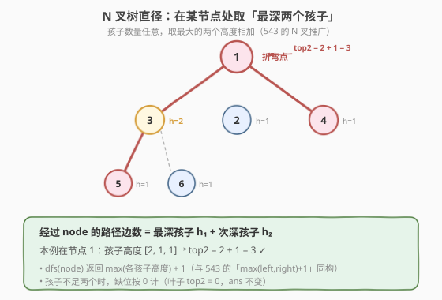
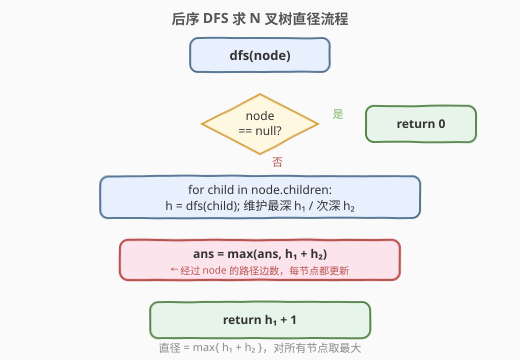

# N 叉树的直径

- **题目名称**：N 叉树的直径
- **链接**：[1522. N 叉树的直径](https://leetcode.cn/problems/diameter-of-n-ary-tree/)
- **难度**：中等
- **标签**：树、N叉树、深度优先搜索、树形动态规划

## 1. 题目概述

给定一棵 **N 叉树**的根节点 `root`，返回该树的**直径**。直径是树中**任意两个节点之间最长路径**的长度，这条路径**可能经过也可能不经过根节点**。两节点之间路径的长度由它们之间的**边数**表示。

N 叉树的节点定义如下（每个节点有任意个孩子）：

```cpp
class Node {
public:
    int val;
    vector<Node*> children;
    Node() {}
    Node(int _val) : val(_val) {}
    Node(int _val, vector<Node*> _children) : val(_val), children(_children) {}
};
```

**示例 1**：

```text
输入：root = [1,null,3,2,4,null,5,6]
输出：3
解释：最长路径为 5 → 3 → 1 → 4（或 6 → 3 → 1 → 4），长度（边数）为 3。
```

**示例 2**：

```text
输入：root = [1,null,2,null,3,4,null,5,null,6]
输出：4
解释：最长路径为 6 → 5 → 3 → 2 → 4，长度（边数）为 4。
```

**约束条件**：

- 树中节点总数在范围 `[1, 10^4]` 内
- N 叉树的深度不超过 `1000`
- `0 <= Node.val <= 10^4`

---

## 2. 解题思路

### 2.1 暴力思路

枚举所有节点对，对每对节点用 BFS/DFS 求距离再取最大值。节点数 $10^4$ 时为 $O(n^2)$，会超时。

### 2.2 核心观察：直径 = 某节点的「最深孩子 + 次深孩子」



本题是 [543. 二叉树的直径](../0501-0600/543_二叉树的直径.md) 的 N 叉推广。任意两节点路径一定在某个**最高点（LCA）**处「折弯」——从该节点向下走到两个不同的孩子子树。

- **二叉树**：只有左右两个孩子，经过 `node` 的路径边数 = $dfs(left) + dfs(right)$。
- **N 叉树**：孩子数量任意，经过 `node` 的路径边数 = **最深孩子高度 $h_1$ + 次深孩子高度 $h_2$**。

> 💡 关键转换：把二叉的「左 + 右」推广为「最大的两个」。只需在遍历孩子时维护 **top-2 高度** $h_1 \ge h_2$，其余孩子不会产生更长的折弯路径。

定义 `dfs(node)` 返回以 `node` 为根的子树**高度**（按节点数计，空节点为 0，叶子为 1）。它满足：

$$
\text{从 } node \text{ 向下到最远叶子的边数} = dfs(node)
$$

> 💡 因为「高度（节点数）$- 1 =$ 向下边数」，而 `node` 到孩子那条边正好补上「$-1$」。所以 `dfs(child)` 数值上等于「从 `node` 经该孩子向下走的边数」。

于是经过 `node` 的最长路径边数为：

$$
path(node) = h_1 + h_2
$$

其中 $h_1, h_2$ 是所有孩子 `dfs` 返回值中最大的两个。在 DFS 返回前用它更新全局直径 `ans`，递归返回 $h_1 + 1$。

### 2.3 算法流程图



### 2.4 示例演算

![示例 [1,null,3,2,4,null,5,6] 的递归过程](../images/diameter_nary_example_walkthrough.svg)

以示例 1 `root = [1,null,3,2,4,null,5,6]` 为例，每个节点标注 `(孩子高度列表, h₁, h₂) → 更新直径 ans, 返回高度`：

```text
节点 5 (叶子): []        → h1=0, h2=0 → ans=max(0,0)=0,  return 1
节点 6 (叶子): []        → h1=0, h2=0 → ans=max(0,0)=0,  return 1
节点 3:        [1,1]     → h1=1, h2=1 → ans=max(0,2)=2,  return 2
节点 2 (叶子): []        → h1=0, h2=0 → ans=max(2,0)=2,  return 1
节点 4 (叶子): []        → h1=0, h2=0 → ans=max(2,0)=2,  return 1
节点 1 (根):   [2,1,1]   → h1=2, h2=1 → ans=max(2,3)=3,  return 3
最终直径 ans = 3
```

> 💡 直径在节点 1 处折弯：$h_1 = 2$ 来自子树 3（路径 5→3→1），$h_2 = 1$ 来自子树 4（路径 1→4），合起来 $2 + 1 = 3$ 条边。

---

## 3. 参考代码

### C++

```cpp
class Solution {
  public:
    int diameter(Node* root) {
        int ans = 0;
        dfs(root, ans);
        return ans;
    }

  private:
    int dfs(Node* node, int& ans) {
        if (node == nullptr) return 0;
        int h1 = 0, h2 = 0;          // 最深、次深孩子高度
        for (Node* child : node->children) {
            int h = dfs(child, ans);
            if (h > h1) {
                h2 = h1;
                h1 = h;
            } else if (h > h2) {
                h2 = h;
            }
        }
        ans = max(ans, h1 + h2);     // 经过 node 的路径边数
        return h1 + 1;               // 返回子树高度（节点数计）
    }
};
```

### Python

```python
class Solution:
    def diameter(self, root: 'Node') -> int:
        ans = 0

        def dfs(node: 'Node') -> int:
            nonlocal ans
            if node is None:
                return 0
            h1 = h2 = 0               # 最深、次深孩子高度
            for child in node.children:
                h = dfs(child)
                if h > h1:
                    h2, h1 = h1, h
                elif h > h2:
                    h2 = h
            ans = max(ans, h1 + h2)   # 经过 node 的路径边数
            return h1 + 1             # 返回子树高度（节点数计）

        dfs(root)
        return ans
```

> 💡 **与 543 的差异仅在「取 top-2」**：543 直接用 `dfs(left)` 和 `dfs(right)` 两个返回值；N 叉版遍历所有孩子，用 `if/else` 维护最大的两个。叶子节点（无孩子）$h_1 = h_2 = 0$，`ans` 不变，返回 1，与二叉版空孩子返回 0 的逻辑自洽。

---

## 4. 复杂度分析

| 维度 | 复杂度 | 说明 |
|------|--------|------|
| 时间复杂度 | $O(n)$ | 每个节点访问一次；遍历所有孩子累计触达每条父→子边一次 |
| 空间复杂度 | $O(h)$ | 递归栈深度等于树高 $h$；约束给出 $h \le 1000$，退化为链时 $O(n)$ |

---

## 5. 扩展：top-2 的其他求法与直径性质

### 5.1 收集后排序（更直观，多一个 $\log$）

把所有孩子高度收集到列表，排序后取最大的两个。代码更短但每节点 $O(k \log k)$（$k$ 为孩子数），总体仍为 $O(n \log k)$：

```cpp
int dfs(Node* node, int& ans) {
    if (node == nullptr) return 0;
    vector<int> hs;
    for (Node* child : node->children) hs.push_back(dfs(child, ans));
    sort(hs.rbegin(), hs.rend());          // 降序
    int h1 = hs.size() > 0 ? hs[0] : 0;
    int h2 = hs.size() > 1 ? hs[1] : 0;
    ans = max(ans, h1 + h2);
    return h1 + 1;
}
```

> ⚠️ 当孩子数 $k$ 很大时，单次排序 $O(k \log k)$ 略劣于维护 top-2 的 $O(k)$。面试推荐维护 top-2 的写法（参考代码），既快又体现对「只需最大两个」的精准把握。

### 5.2 直径不一定经过根

与 543 同理：最长路径可能在任意子树内部折弯，因此必须**在每个节点**处用 $h_1 + h_2$ 更新答案，而非只在根处算一次。例如根只有一个孩子时，直径完全落在该子树内，根本不经过根的「折弯」。

---

## 6. 面试要点

1. **和 543 二叉树直径的区别是什么？**

   - 仅在「取最深两个孩子」这一步不同：二叉树直接用左右两个返回值；N 叉树遍历所有孩子，用 `if/else` 维护 top-2 高度 $h_1 \ge h_2$。整体仍是「返回单边高度、内部用双边更新全局」的后序 DFS 模板。

2. **`dfs` 返回高度（节点数），为何 $h_1 + h_2$ 恰好是边数？**

   - `dfs(child)` 数值上等于「从 `node` 经该孩子向下走的边数」（高度 $-1 =$ 边数，而 `node→child` 那条边补上了 $-1$）。两个最深孩子相加即经过 `node` 折弯的路径边数。

3. **孩子不足两个时怎么办？**

   - $h_1, h_2$ 初值均为 0。只有一个孩子时 $h_2 = 0$，$h_1 + h_2 = h_1$（路径只向下不折弯）；叶子节点两者都为 0，`ans` 不变。

4. **为什么必须在每个节点更新答案？**

   - 直径可能在任意子树内部折弯，不必然经过根。只在根处计算会漏掉子树内部的更长路径。

5. **退化为链状时空间如何？**

   - 树高 $h = n$，递归栈 $O(n)$。本题约束 $h \le 1000$，可接受；若需进一步优化空间，可用迭代后序遍历改写为 $O(1)$ 额外空间（Morris 风格）。

---

## 7. 同类练习题

- [543. 二叉树的直径](../0501-0600/543_二叉树的直径.md)：本题的「父题」，二叉版用 `dfs(left)+dfs(right)`，N 叉推广为 top-2
- [559. N 叉树的最大深度](../0501-0600/559_N叉树的最大深度.md)：同一套 N 叉后序 DFS 骨架，返回 `max(各孩子高度)+1`，是 1522 的「单边返回值」基础
- [124. 二叉树中的最大路径和](../0101-0200/124_二叉树中的最大路径和.md)：同一套「返回单边、内部更新全局」模板，把边数换成路径和
- [687. 最长同值路径](../0601-0700/687_最长同值路径.md)：543 加「同值」约束的直径变体，仍用后序 DFS 求最长路径
- [1245. 树的直径](../1201-1300/1245_树的直径.md)：无根树（图）上的直径，用两次 BFS 或拓扑剥叶，可与树形 DP 思路对照
