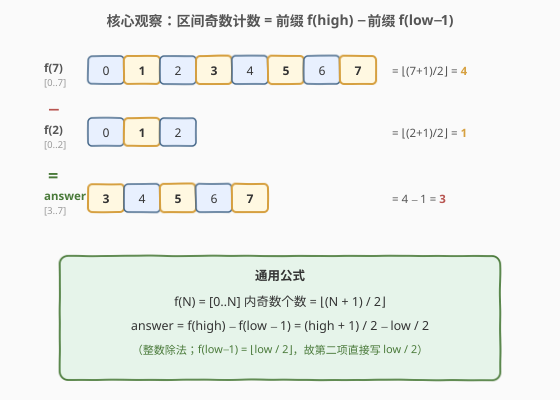
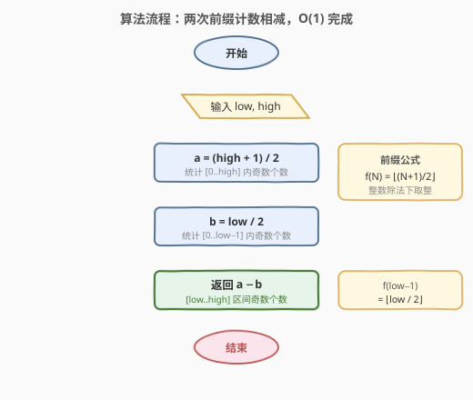
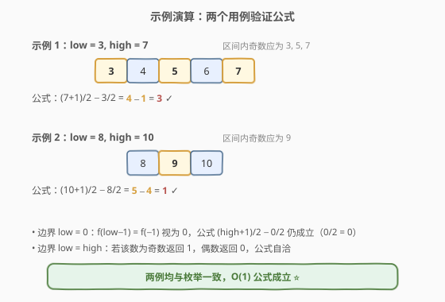

# 在区间范围内统计奇数数目

- **题目名称**：在区间范围内统计奇数数目
- **链接**：[1523. 在区间范围内统计奇数数目](https://leetcode.cn/problems/count-odd-numbers-in-an-interval-range/)
- **难度**：简单
- **标签**：数学

## 1. 题目概述

给你两个非负整数 `low` 和 `high`。请你返回 `low` 和 `high` 之间（包括二者）奇数的数目。

**示例 1**：

```text
输入：low = 3, high = 7
输出：3
解释：3 到 7 之间的奇数有 [3, 5, 7]。
```

**示例 2**：

```text
输入：low = 8, high = 10
输出：1
解释：8 到 10 之间的奇数有 [9]。
```

**约束条件**：

- `0 <= low <= high <= 10^9`

> 💡 区间长度可达 $10^9$，任何逐元素遍历的 $O(\text{high} - \text{low})$ 解法都会超时。这暗示必须用**数学公式**在 $O(1)$ 时间内直接算出答案——把"数奇数"转化为"前缀计数相减"。

---

## 2. 解题思路

### 2.1 暴力思路：逐个枚举

最直观的做法是从 `low` 到 `high` 逐个判断每个数是否为奇数（`x & 1 == 1` 则计数加一）。

```text
ans = 0
for x in low..high:
    if x % 2 == 1: ans += 1
return ans
```

时间复杂度 $O(\text{high} - \text{low})$。当 `high - low` 接近 $10^9$ 时，单线程要在数秒内跑完上亿次循环，必然超时。根本问题在于——**没有利用奇数的周期性结构**：奇偶交替意味着每连续两个数中恰有一个奇数，完全可以批量计算，无需逐个扫。

### 2.2 核心观察：前缀计数相减



关键直觉是经典的「**前缀和**」思想：要算区间 $[\text{low}, \text{high}]$ 上的奇数个数，只需算「$[0, \text{high}]$ 的奇数个数」减去「$[0, \text{low}-1]$ 的奇数个数」。

设 $f(N)$ 表示 $[0, N]$ 内的奇数个数。在 $0$ 到 $N$ 这 $N+1$ 个数里，奇偶严格交替，因此：

$$f(N) = \left\lfloor \frac{N + 1}{2} \right\rfloor$$

> 💡 **为什么是 $\lfloor (N+1)/2 \rfloor$？** $0$ 到 $N$ 共 $N+1$ 个数。若 $N+1$ 为偶数，奇偶各半，奇数恰 $(N+1)/2$ 个；若 $N+1$ 为奇数（即 $N$ 为偶数），从 $0$（偶）开始的前 $N$ 个数里奇偶各 $N/2$ 个，再加上末尾的偶数 $N$，奇数仍是 $N/2 = \lfloor (N+1)/2 \rfloor$ 个。两种情况统一为向下取整。

于是答案为：

$$\text{answer} = f(\text{high}) - f(\text{low} - 1) = \left\lfloor \frac{\text{high} + 1}{2} \right\rfloor - \left\lfloor \frac{\text{low}}{2} \right\rfloor$$

注意 $f(\text{low} - 1) = \lfloor \text{low}/2 \rfloor$（把 $\text{low}-1$ 代入 $N+1$ 即 $\text{low}$），所以第二项直接写成 `low / 2`。

> ⚠️ **边界 `low = 0`**：此时 $\text{low} - 1 = -1$，前缀 $f(-1)$ 在数学上为 $0$（$[-1, -1]$ 无非负奇数）。但代码里不显式构造 $-1$，而是用 `low / 2` 计算：`0 / 2 = 0`，恰好等于 $f(-1)$ 的应有值 $0$，公式天然成立，无需特判。

### 2.3 算法流程图



整个流程只有两次整数除法和一次减法，与区间长度无关，时间 $O(1)$。

### 2.4 示例演算



以两个官方示例验证：

- **示例 1**：`low = 3, high = 7`。$f(7) = \lfloor 8/2 \rfloor = 4$，$f(2) = \lfloor 3/2 \rfloor = 1$。答案 $= 4 - 1 = 3$，对应奇数 $\{3, 5, 7\}$ ✓。
- **示例 2**：`low = 8, high = 10`。$f(10) = \lfloor 11/2 \rfloor = 5$，$f(7) = \lfloor 8/2 \rfloor = 4$。答案 $= 5 - 4 = 1$，对应奇数 $\{9\}$ ✓。

---

## 3. 参考代码

### C++

```cpp
class Solution {
  public:
    int countOdds(int low, int high) {
        return (high + 1) / 2 - low / 2;
    }
};
```

### Python

```python
class Solution:
    def countOdds(self, low: int, high: int) -> int:
        return (high + 1) // 2 - low // 2
```

> 💡 **整数除法的语言差异**：C++ 中 `/` 对非负整数即向下取整，直接使用；Python 中 `//` 本身为向下取整。由于 `low, high >= 0`，两语言行为一致。若推广到负数区间需注意 C++ 对负数的除法向零取整，需改用 `floor`。

---

## 4. 复杂度分析

| 维度 | 复杂度 | 说明 |
|------|--------|------|
| 时间复杂度 | $O(1)$ | 仅两次整数除法 + 一次减法，与区间长度无关 |
| 空间复杂度 | $O(1)$ | 只用常数个整型变量 |

---

## 5. 扩展：从区间长度推导的另一公式

除了前缀相减，还可直接从「区间长度」切入。设 $\text{len} = \text{high} - \text{low} + 1$：

- 若 $\text{len}$ 为偶数，区间内奇偶各半，奇数个数 $= \text{len} / 2$。
- 若 $\text{len}$ 为奇数，多出的一个数与 `low` 同奇偶：`low` 为奇则奇数多一个，`low` 为偶则偶数多一个。

两种情况可统一为：

$$\text{answer} = \left\lfloor \frac{\text{len} + (\text{low} \bmod 2)}{2} \right\rfloor = \frac{\text{high} - \text{low} + 1 + (\text{low} \& 1)}{2}$$

```cpp
int countOdds(int low, int high) {
    int len = high - low + 1;
    return (len + (low & 1)) / 2;
}
```

| 维度 | 复杂度 | 说明 |
|------|--------|------|
| 时间复杂度 | $O(1)$ | 常数次算术运算 |
| 空间复杂度 | $O(1)$ | 常数空间 |

> 💡 **两种公式等价**：展开前缀版 $(\text{high}+1)/2 - \text{low}/2$，利用整数除法性质可推出与长度版相同的结果。前缀版思路更通用（适配任意"按周期计数"的区间问题，如区间内能被 $k$ 整除的数的个数 $= \lfloor \text{high}/k \rfloor - \lfloor (\text{low}-1)/k \rfloor$）；长度版更直观地刻画了"奇偶各半"的结构。

---

## 6. 面试要点

1. **为什么不能用循环遍历？**

   - 区间长度可达 $10^9$，$O(\text{high} - \text{low})$ 的遍历会执行上亿次循环，必然超时。题目刻意给出大范围，就是考查能否识别出"奇偶交替"的周期性，用 $O(1)$ 公式替代逐个枚举。

2. **前缀公式 $f(N) = \lfloor (N+1)/2 \rfloor$ 是怎么来的？**

   - $[0, N]$ 共 $N+1$ 个数，奇偶严格交替。若 $N+1$ 为偶数，奇偶各半；若为奇数（$N$ 为偶数），末尾多一个偶数，奇数仍是 $\lfloor (N+1)/2 \rfloor$ 个。两种情况统一为向下取整。

3. **为什么第二项是 `low / 2` 而不是 `(low - 1 + 1) / 2`？**

   - $f(\text{low}-1) = \lfloor ((\text{low}-1)+1)/2 \rfloor = \lfloor \text{low}/2 \rfloor$，正好就是 `low / 2`（非负整数除法）。直接写 `low / 2` 更简洁，且天然处理 `low = 0` 的边界（`0/2 = 0`）。

4. **`low = 0` 时公式还成立吗？**

   - 成立。此时 $\text{low}-1 = -1$，数学上 $f(-1) = 0$。代码不显式构造 $-1$，而用 `low / 2 = 0 / 2 = 0` 代替，结果一致，无需特判。这是用 `low / 2` 而非显式写 `f(low - 1)` 的额外好处。

5. **如何推广到「区间内能被 $k$ 整除的数的个数」？**

   - 完全相同的"前缀相减"套路：$[0, N]$ 内 $k$ 的倍数有 $\lfloor N/k \rfloor$ 个，故 $[\text{low}, \text{high}]$ 内有 $\lfloor \text{high}/k \rfloor - \lfloor (\text{low}-1)/k \rfloor$ 个。本题是 $k = 2$ 的特例，把"奇数"换成"满足某周期性条件的数"即可套用同一框架。

---

## 7. 同类练习题

- [1492. n 的第 k 个因子](https://leetcode.cn/problems/the-kth-factor-of-n/)：利用整除性质计数/枚举因子，巩固「按整除关系批量计数」的思维
- [258. 各位相加](https://leetcode.cn/problems/add-digits/)：用数学性质（数位根公式 $O(1)$）替代逐位模拟，同为「识别数学结构避开循环」的简单题
- [29. 两数相除](https://leetcode.cn/problems/divide-two-integers/)（[题解](../0001-0100/29_两数相除.md)）：位运算模拟整数除法，与本题对整数除法向下取整的理解互为补充
- [7. 整数反转](https://leetcode.cn/problems/reverse-integer/)：边界与整数运算的细节处理，巩固对整数除法/取模行为的把握
- [504. 七进制数](https://leetcode.cn/problems/base-7/)：用整除和取模进行进制转换，与「$\lfloor N/k \rfloor$ 计数」同源于整除性质
