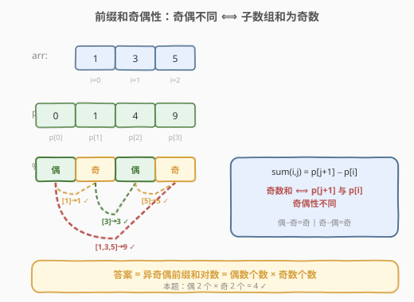
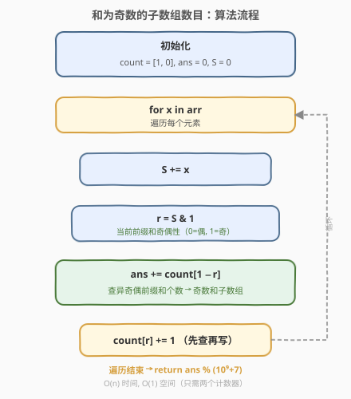
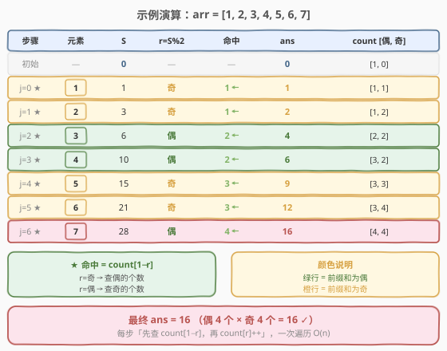

# 和为奇数的子数组数目

- **题目名称**：和为奇数的子数组数目
- **链接**：[1524. 和为奇数的子数组数目](https://leetcode.cn/problems/number-of-sub-arrays-with-odd-sum/)
- **难度**：中等
- **标签**：数组、前缀和、数学

## 1. 题目概述

给定一个整数数组 `arr`，返回其中元素之和为**奇数**的、**连续且非空**的子数组数目。由于答案可能很大，将结果对 $10^9 + 7$ 取余后返回。

**示例 1**：

```text
输入：arr = [1,3,5]
输出：4
解释：所有子数组为 [[1],[1,3],[1,3,5],[3],[3,5],[5]]。
      各子数组和为 [1,4,9,3,8,5]，奇数和包括 [1,9,3,5]，答案为 4。
```

**示例 2**：

```text
输入：arr = [2,4,6]
输出：0
解释：所有子数组和均为偶数，答案为 0。
```

**示例 3**：

```text
输入：arr = [1,2,3,4,5,6,7]
输出：16
```

**约束条件**：

- `1 <= arr.length <= 10^5`
- `1 <= arr[i] <= 100`

> ⚠️ 注意：`n` 最大 $10^5$，暴力枚举所有子数组 $O(n^2)$ 会超时；需借助**前缀和奇偶性**将问题转化为计数问题，一次遍历 $O(n)$ 解决。

---

## 2. 解题思路

### 2.1 暴力思路

枚举所有子数组 `[i, j]`，逐个求和判断是否为奇数。两重循环 + 求和共 $O(n^3)$；用前缀和优化到 $O(n^2)$，在 $n = 10^5$ 时仍会超时。

### 2.2 核心观察：前缀和奇偶性



定义前缀和 `prefix[i]` 为 `arr[0..i-1]` 的和（`prefix[0] = 0`），则子数组 `arr[i..j]` 的和为：

$$
\text{sum}(i, j) = \text{prefix}[j+1] - \text{prefix}[i]
$$

一个整数减法的奇偶性规律：

$$
\text{奇} - \text{偶} = \text{奇}, \quad \text{偶} - \text{奇} = \text{奇}, \quad \text{奇} - \text{奇} = \text{偶}, \quad \text{偶} - \text{偶} = \text{偶}
$$

> 💡 **关键转化**：子数组和为**奇数**，当且仅当前缀和 `prefix[j+1]` 与 `prefix[i]` 的**奇偶性不同**。于是问题变成——对每个结束位置，之前有多少个起点的前缀和与当前前缀和**奇偶性相反**。由于奇偶性只有两种取值（偶 0 / 奇 1），只需维护两个计数器即可 $O(1)$ 查询。

这与 [974. 和可被 K 整除的子数组](../0901-1000/974_和可被K整除的子数组.md) 的思路一脉相承：974 查的是「余数**相同**」（差是 K 的倍数），本题查的是「奇偶性**不同**」（差为奇数）。本质都是**前缀和 + 分桶计数**，只是匹配条件从「同桶」变为「异桶」。

### 2.3 算法流程图



**一次遍历**边走边查：

1. 维护两个计数器 `cnt[0]`（偶数前缀和个数）和 `cnt[1]`（奇数前缀和个数）。
2. 维护当前前缀和 `S`，每加入一个元素后计算奇偶性 `r = S & 1`。
3. 初始时 `cnt = [1, 0]`，表示「前缀和为 0（偶数）出现过一次」（空前缀，对应从下标 0 开始的子数组）。
4. 每步先把 `cnt[1 - r]`（**异奇偶**前缀和的个数）累加到答案，再把 `cnt[r]` 加一。

> 💡 **为什么是 `cnt[1-r]` 而非 `cnt[r]`？** 当前前缀和奇偶性为 `r`，要使差为奇数，需要之前的奇偶性**不同**，即查 `1 - r` 那一桶的计数。这与 974 查「同余」恰好相反。

### 2.4 示例演算

以 `arr = [1, 2, 3, 4, 5, 6, 7]` 为例：



| 步骤 | 元素 | 前缀和 S | r = S&1 | 命中 cnt[1−r] | 累计 ans | cnt [偶, 奇] |
|------|------|----------|---------|---------------|----------|--------------|
| 初始 | — | 0 | — | — | 0 | [1, 0] |
| j=0 | 1 | 1 | 奇 | 1 | 1 | [1, 1] |
| j=1 | 2 | 3 | 奇 | 1 | 2 | [1, 2] |
| j=2 | 3 | 6 | 偶 | 2 | 4 | [2, 2] |
| j=3 | 4 | 10 | 偶 | 2 | 6 | [3, 2] |
| j=4 | 5 | 15 | 奇 | 3 | 9 | [3, 3] |
| j=5 | 6 | 21 | 奇 | 3 | 12 | [3, 4] |
| j=6 | 7 | 28 | 偶 | 4 | 16 | [4, 4] |

最终答案为 `16`。遍历结束后偶数前缀和 4 个、奇数前缀和 4 个，答案恰好等于 $4 \times 4 = 16$——因为每对「一偶一奇」的前缀和恰好对应一个奇数和子数组。

---

## 3. 参考代码

### C++

```cpp
class Solution {
  public:
    int numOfSubarrays(vector<int>& arr) {
        const int MOD = 1e9 + 7;
        int cnt[2] = {1, 0};  // cnt[0]=偶前缀和个数, cnt[1]=奇前缀和个数
        int ans = 0, s = 0;
        for (int x : arr) {
            s += x;
            int r = s & 1;
            ans = (ans + cnt[1 - r]) % MOD;
            cnt[r]++;
        }
        return ans;
    }
};
```

### Python

```python
class Solution:
    def numOfSubarrays(self, arr: List[int]) -> int:
        MOD = 10**9 + 7
        cnt = [1, 0]  # cnt[0]=偶前缀和个数, cnt[1]=奇前缀和个数
        ans = s = 0
        for x in arr:
            s += x
            r = s & 1
            ans = (ans + cnt[1 - r]) % MOD
            cnt[r] += 1
        return ans
```

> 💡 **优化**：由于只关心前缀和的**奇偶性**而非具体数值，可用 XOR 替代加法——`s ^= (x & 1)`，只跟踪奇偶位的翻转，避免前缀和增长，逻辑等价但更精简。数组元素均为正数，无需处理负数取模问题。

---

## 4. 复杂度分析

| 维度 | 复杂度 | 说明 |
|------|--------|------|
| 时间复杂度 | $O(n)$ | 只遍历数组一次，每步计数器查询 / 写入均为 $O(1)$ |
| 空间复杂度 | $O(1)$ | 只需两个计数器 `cnt[0]`、`cnt[1]`，常数空间 |

---

## 5. 扩展：奇偶性计数的三种视角

本题本质是「前缀和 + 分桶计数」家族的一员，奇偶性是 $K = 2$ 的特例。从不同视角理解同一问题：

- **前缀和视角（本题主解）**：维护前缀和奇偶性，查**异桶**计数。与 974（查**同桶**）互为镜像。
- **奇偶归约视角**：将 `arr[i]` 替换为 `arr[i] % 2`（0 或 1），问题等价于「统计含有**奇数个 1** 的子数组数目」。这正是 [1248. 统计「优美子数组」](https://leetcode.cn/problems/count-number-of-nice-subarrays/) 中「恰好 K 个」取「K 为任意奇数」的累积版本。
- **组合公式视角**：若最终有 $e$ 个偶数前缀和、$o$ 个奇数前缀和，则答案 $= e \times o$（每对一偶一奇对应一个奇数和子数组）。可先一次遍历统计 $e$、$o$，再相乘取模，时间同样 $O(n)$。

> 💡 当题目涉及「子数组和的奇偶性」「子数组中奇数元素的个数」时，优先考虑**前缀和奇偶性 + 双计数器**。

---

## 6. 面试要点

1. **为什么 `cnt` 要初始化为 `[1, 0]`？**
   - 当某个从下标 0 开始的子数组和恰为奇数时，当前前缀和为奇数，需要 `cnt[0]` 中已有的「空前缀」（和为 0，偶数）来匹配。若不初始化 `cnt[0] = 1`，这类子数组会被漏算。

2. **为什么查 `cnt[1-r]` 而不是 `cnt[r]`？**
   - 子数组和 = 两个前缀和之差。差为奇数 ⟺ 两数奇偶性**不同**。当前奇偶性为 `r`，需查**相反**奇偶性 `1-r` 那一桶。这与 974（差被 K 整除 ⟺ 同余 ⟺ 查**同桶**）恰好相反。

3. **与 974（和可被 K 整除的子数组）的联系与区别？**
   - 两者框架完全一致（前缀和 + 分桶计数 + 先查再写）。974 是 $K$ 任意、查**同余**（同桶）；本题是 $K = 2$、查**异余**（异桶）。可以认为本题是 974 的 $K = 2$ 变体，只是匹配条件从「同」变为「异」。

4. **为什么不能用滑动窗口？**
   - 虽然数组元素均为正数（窗口和有单调性），但本题要统计的是「和为奇数」的子数组**数目**，而非找一个满足条件的子数组。滑动窗口适合求「最长 / 最短 / 恰好一个」，不适合统计所有满足条件的子数组个数。前缀和 + 计数是计数型问题的通用解法。

5. **答案为什么可能很大？需要取模的地方有哪些？**
   - 最坏情况下 $n = 10^5$，子数组总数达 $\frac{n(n+1)}{2} \approx 5 \times 10^9$，超过 `int32` 范围。C++ 中 `ans` 累加时需每次取模（或用 `long long`）；Python 无溢出问题但返回时仍需取模。

---

## 7. 同类练习题

- [974. 和可被 K 整除的子数组](https://leetcode.cn/problems/subarray-sums-divisible-by-k/)（[题解](../0901-1000/974_和可被K整除的子数组.md)）：前缀和 + 同余分桶，查**同桶**；本题是其 $K=2$ 查**异桶**的镜像
- [1248. 统计「优美子数组」](https://leetcode.cn/problems/count-number-of-nice-subarrays/)（[题解](../1201-1300/1248_统计优美子数组.md)）：统计含恰好 K 个奇数的子数组，奇偶归约视角的姊妹题
- [560. 和为 K 的子数组](https://leetcode.cn/problems/subarray-sum-equals-k/)（[题解](../0501-0600/560_和为K的子数组.md)）：前缀和 + 哈希的母题，把「奇偶性不同」换成「差等于 K」
- [525. 连续数组](https://leetcode.cn/problems/contiguous-array/)（[题解](../0501-0600/525_连续数组.md)）：0 当 −1，化为前缀和为 0，奇偶性计数的另一变体
- [930. 和相同的二元子数组](https://leetcode.cn/problems/binary-subarrays-with-sum/)：0/1 数组求目标和，前缀和 + 哈希模板
