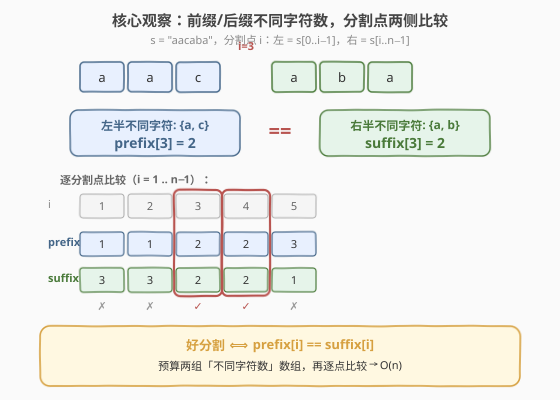
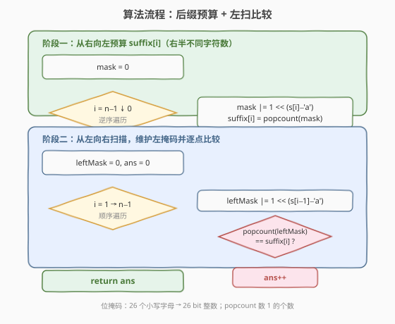
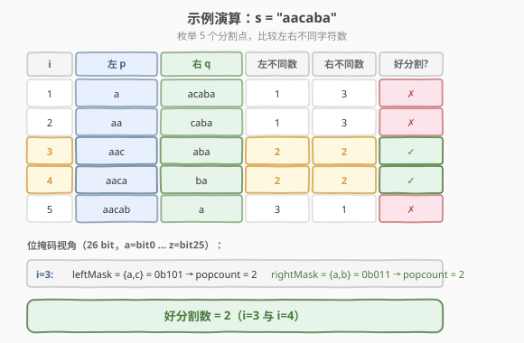

# LeetCode 字符串的好分割数目 题解

## 1. 题目概述

- **标题 / 题号**：字符串的好分割数目（#1525，medium）
- **链接**：https://leetcode.cn/problems/number-of-good-ways-to-split-a-string/
- **难度**：中等
- **标签**：字符串、位运算、前缀和

**题意**：给定一个字符串 `s`，一个分割被称为「好分割」当它满足：将 `s` 分割成两个字符串 `p` 和 `q`（`p + q = s`，`p`、`q` 均非空），且 `p` 和 `q` 中**不同字符的数目相同**。返回 `s` 中好分割的数目。

**示例 1**：

```text
输入：s = "aacaba"
输出：2
解释：5 种分割中只有 2 种是好分割：
  ("aac", "aba") 左 {a,c}=2，右 {a,b}=2 ✓
  ("aaca", "ba") 左 {a,c}=2，右 {a,b}=2 ✓
```

**示例 2**：

```text
输入：s = "abcd"
输出：1
解释：("ab", "cd") 左 {a,b}=2，右 {c,d}=2 ✓
```

**示例 3**：

```text
输入：s = "aaaaa"
输出：4
解释：所有 4 种分割都是好分割（左右不同字符数恒为 1）。
```

**约束**：

- `s` 只包含小写英文字母。
- $1 \leq \text{s.length} \leq 10^5$

> ⚠️ 注意：`n` 最大 $10^5$，若对每个分割点都用集合重新统计不同字符，单次 $O(n)$、总体 $O(n^2)$ 会超时。需要**预计算**前缀/后缀的不同字符数，将每次比较降到 $O(1)$。

## 2. 解题思路

### 2.1 暴力思路

枚举 $n - 1$ 个分割点 $i$（$1 \leq i \leq n-1$），对每个分割点用哈希集合分别统计左半 `s[0..i-1]` 与右半 `s[i..n-1]` 的不同字符数。每次统计 $O(n)$，总体 $O(n^2)$，在 $n = 10^5$ 时超时。

### 2.2 核心观察：前缀/后缀不同字符数预算



定义两个数组：

- `prefix[i]`：`s[0..i-1]`（前 $i$ 个字符）中不同字符的数目。
- `suffix[i]`：`s[i..n-1]`（从下标 $i$ 到末尾）中不同字符的数目。

则分割点 $i$ 是好分割，当且仅当：

$$
\text{prefix}[i] = \text{suffix}[i]
$$

> 💡 **关键转化**：把「对每个分割点重复统计」变成「一次性预算两张表，再 $O(1)$ 比较」。这正是**前缀思想**的典型应用——只是前缀/后缀维护的不是数值之和，而是**不同字符的集合**。

**用位掩码表示集合**：`s` 只含 26 个小写字母，可用一个 26 位整数作为掩码，第 $k$ 位为 1 表示字符 $k$ 出现过。掩码的**置位操作**（`mask |= 1 << (c - 'a')`）天然去重——重复字符再置位也无变化。比较时只需数掩码中 1 的个数（`popcount`）即可得到不同字符数。

这与 [187. 重复的 DNA 序列](../0201-0300/187_重复的DNA序列.md) 的位编码思想一致：用位运算把字符集合压缩进一个整数，以 $O(1)$ 空间承载 $O(\text{字母表})$ 的信息。

### 2.3 算法流程图



分两阶段，各遍历一次字符串：

**阶段一（从右向左预算 `suffix`）**：维护掩码 `mask`，从 $i = n-1$ 到 $0$ 逐位置位，`suffix[i] = popcount(mask)`。这样 `suffix[i]` 就记录了「从 $i$ 到末尾」的不同字符数。

**阶段二（从左向右扫描比较）**：维护左掩码 `leftMask`，从 $i = 1$ 到 $n-1$，每步把 `s[i-1]` 置入 `leftMask`，若 `popcount(leftMask) == suffix[i]` 则 `ans++`。

> 💡 **为什么先预算 `suffix` 再扫 `prefix`？** 因为 `suffix` 需要随机访问（在左扫时按当前位置 $i$ 取值），而 `prefix` 可以边扫边增量更新。若反过来先预算 `prefix`、再从右扫 `suffix` 也完全对称，本质相同。

### 2.4 示例演算

以 `s = "aacaba"`（$n = 6$）为例：



先预算 `suffix` 数组（从右向左置位）：

| $i$ | 新置字符 | mask（不同字符集合） | `suffix[i]` |
|-----|---------|---------------------|-------------|
| 6 | — | $\emptyset$ | 0 |
| 5 | a | {a} | 1 |
| 4 | b | {a, b} | 2 |
| 3 | a | {a, b} | 2 |
| 2 | c | {a, b, c} | 3 |
| 1 | a | {a, b, c} | 3 |
| 0 | a | {a, b, c} | 3 |

再从左向右扫描，维护 `leftMask` 并比较：

| $i$ | 左半 `p` | 右半 `q` | `prefix[i]` | `suffix[i]` | 好分割？ |
|-----|---------|---------|-------------|-------------|---------|
| 1 | a | acaba | 1 | 3 | ✗ |
| 2 | aa | caba | 1 | 3 | ✗ |
| 3 | aac | aba | 2 | 2 | ✓ |
| 4 | aaca | ba | 2 | 2 | ✓ |
| 5 | aacab | a | 3 | 1 | ✗ |

最终答案为 `2`。

## 3. 参考代码

### C++

```cpp
class Solution {
  public:
    int numSplits(string s) {
        int n = s.size();
        // suffix[i] = s[i..n-1] 中不同字符数
        vector<int> suffix(n + 1, 0);
        int mask = 0;
        for (int i = n - 1; i >= 0; i--) {
            mask |= 1 << (s[i] - 'a');
            suffix[i] = __builtin_popcount(mask);
        }
        int ans = 0, leftMask = 0;
        for (int i = 1; i < n; i++) {
            leftMask |= 1 << (s[i - 1] - 'a');
            if (__builtin_popcount(leftMask) == suffix[i]) ans++;
        }
        return ans;
    }
};
```

### Python

```python
class Solution:
    def numSplits(self, s: str) -> int:
        n = len(s)
        suffix = [0] * (n + 1)
        mask = 0
        for i in range(n - 1, -1, -1):
            mask |= 1 << (ord(s[i]) - 97)
            suffix[i] = mask.bit_count()
        ans = 0
        left_mask = 0
        for i in range(1, n):
            left_mask |= 1 << (ord(s[i - 1]) - 97)
            if left_mask.bit_count() == suffix[i]:
                ans += 1
        return ans
```

> 💡 **`bit_count()`**：Python 3.10+ 的 `int.bit_count()` 等价于 C++ 的 `__builtin_popcount`，内部为单条 CPU 指令，$O(1)$。低版本可用 `bin(x).count('1')` 替代（常数稍大）。

## 4. 复杂度分析

| 维度 | 复杂度 | 说明 |
|------|--------|------|
| 时间复杂度 | $O(n)$ | 两趟遍历各 $O(n)$，每步置位与 `popcount` 均为 $O(1)$ |
| 空间复杂度 | $O(n)$ | `suffix` 数组长度 $n + 1$；掩码本身 $O(1)$ |

> 💡 若将 `suffix` 也改为「从右向左边扫边比较」的在线方式，则需先预算 `prefix` 数组（对称做法），空间仍 $O(n)$。由于字母表只有 26，无法进一步低于 $O(n)$ —— 因为答案本身可能达到 $n - 1$（如 `s = "aaaaa"`），必须逐点检查。

## 5. 扩展：前缀集合的两种实现

维护「前 $i$ 个字符的不同字符集合」有两种等价实现：

- **位掩码（本题主解）**：一个 26 位整数，`|=` 置位、`popcount` 计数。适合**小字母表**（$\leq 64$），常数极小。
- **前缀计数矩阵**：`cnt[i][26]` 记录前 $i$ 个字符各字符出现次数，`suffix` 同理。比较时统计两侧计数 $> 0$ 的字符数是否相等。适合**大字母表**或需要查询具体字符频率的场景，空间 $O(26n)$。

> ⚠️ 当字母表扩大到 Unicode 时位掩码失效，应退回哈希集合 + 前缀频率表。本题 26 个小写字母正是位掩码的甜区。

## 6. 面试要点

1. **为什么不能用滑动窗口？**
   - 本题统计的是**所有**满足「左右不同字符数相等」的分割点数目，而非找一个最长/最短的窗口。滑动窗口适合在单调性下求极值，不适合计数型问题。前缀/后缀预算 + 逐点比较是计数型的通用套路。

2. **为什么用位掩码而不是哈希集合？**
   - 26 个小写字母恰好能用一个 32 位整数表示，置位（`|=`）天然去重，`popcount` 一条指令取不同字符数，比哈希集合的插入/查询/统计快得多，且空间 $O(1)$。这是「小字母表 + 集合判重」场景的经典优化。

3. **`suffix` 数组能否省掉以做到 $O(1)$ 空间？**
   - 不能直接省。左扫时 `leftMask` 可在线更新，但右侧不同字符数需要「随机访问」当前位置 $i$ 的值，必须预算。若改用「先预算 `prefix`、再从右扫在线更新 `rightMask`」的对称做法，仍需 $O(n)$ 空间存 `prefix`。由于字母表仅 26 种，有人用 26 个「字符最后出现位置」做在线判定，但逻辑复杂且仍需 $O(26)$，收益有限。

4. **分割点 $i$ 的范围为什么是 $1 \leq i \leq n-1$？**
   - $i = 0$ 时左半为空、右半为整串；$i = n$ 时左半为整串、右半为空。题目要求 `p`、`q` 均非空，故 $i$ 从 $1$ 到 $n - 1$，共 $n - 1$ 个候选分割点。

5. **与 [1524. 和为奇数的子数组数目](../1501-1600/1524_和为奇数的子数组数目.md) 的联系？**
   - 两者都是「前缀预算 + 逐点比较/计数」家族：1524 预算前缀和奇偶性、查异桶计数；本题预算前缀/后缀不同字符数、查相等。差别在于 1524 是子数组计数（双前缀做差），本题是分割点计数（两个独立数组直接比）。

## 同类练习题

| # | 题目 | 与本题的关联 |
|---|------|-------------|
| 187 | [重复的 DNA 序列](https://leetcode.cn/problems/repeated-dna-sequences/)（[题解](../0201-0300/187_重复的DNA序列.md)） | 2 位编码 + 滚动位掩码，小字母表位压缩的姊妹题 |
| 1524 | [和为奇数的子数组数目](https://leetcode.cn/problems/number-of-sub-arrays-with-odd-sum/)（[题解](../1501-1600/1524_和为奇数的子数组数目.md)） | 前缀预算 + 逐点计数，前缀思想家族的相邻题 |
| 231 | [2 的幂](https://leetcode.cn/problems/power-of-two/)（[题解](../0201-0300/231_2的幂.md)） | `n & (n-1)` 位运算技巧，`popcount` 的基础 |
| 191 | [位 1 的个数](https://leetcode.cn/problems/number-of-1-bits/)（[题解](../0201-0300/191_位1的个数.md)） | `popcount` 的母题，本题核心操作 |
| 3 | [无重复字符的最长子串](https://leetcode.cn/problems/longest-substring-without-repeating-characters/)（[题解](../0001-0100/3_无重复字符的最长子串.md)） | 滑动窗口 + 字符集合判重，对照本题的前缀集合思路 |
