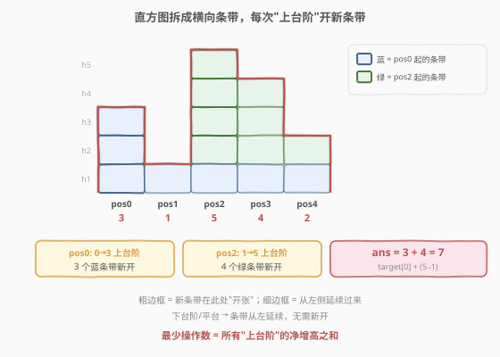
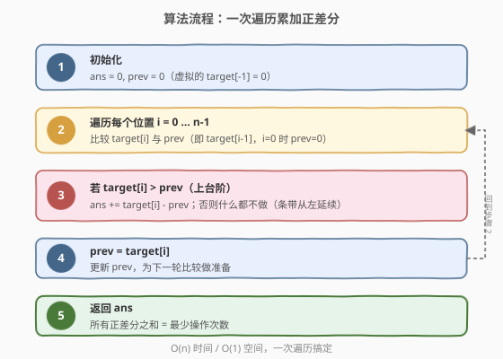

# 形成目标数组的子数组最少增加次数

- **题目名称**：形成目标数组的子数组最少增加次数
- **链接**：[1526. 形成目标数组的子数组最少增加次数](https://leetcode.cn/problems/minimum-number-of-increments-on-subarrays-to-form-a-target-array/)
- **难度**：困难
- **标签**：数组、贪心、差分、分治

## 1. 题目概述

给定一个整数数组 `target`，初始数组 `initial` 全为 0，且与 `target` 等长。每次操作可以选择 `initial` 中**任意子数组**，将其中每个元素加 1。求从全 0 数组构造出 `target` 的**最少操作次数**。

**示例 1**：

```text
输入：target = [1,2,3,2,1]
输出：3
解释：
[0,0,0,0,0] → 对 [0,4] 加 1 → [1,1,1,1,1]
            → 对 [1,3] 加 1 → [1,2,2,2,1]
            → 对 [2,2] 加 1 → [1,2,3,2,1]
```

**示例 2**：

```text
输入：target = [3,1,1,2]
输出：4
```

**示例 3**：

```text
输入：target = [3,1,5,4,2]
输出：7
```

**约束条件**：

- `1 <= target.length <= 10^5`
- `1 <= target[i] <= 10^5`
- 答案保证在 32 位整数范围内

---

## 2. 解题思路

### 2.1 暴力思路：枚举操作序列？

每次操作有 $O(n^2)$ 种子数组选择，操作总数可能高达 $\max(\text{target})$ 级别，暴力搜索空间是指数级的，完全不可行。

> 💡 转换视角：不要想"选哪个子数组"，而是从**直方图**的角度看——`target` 就是一排高低不一的柱子，每次操作给一个连续区间涂一层"高 1 的横条"。最少涂多少层？

### 2.2 核心观察：直方图条带视角 + 正差分



将 `target` 看作**直方图**：`target[i]` 是位置 `i` 的柱子高度。每次"子数组加 1"操作等价于在该区间画一条**高 1 的横向条带**。问题转化为：**最少需要多少条横向条带堆叠出这个直方图？**

**关键观察**：

- 一条条带可以从位置 `i` 向右延伸到位置 `j`，只要这段区间内每根柱子都还需要这一层。
- 条带能否从位置 `i-1` **延续**到位置 `i`，取决于位置 `i` 的柱子是否比 `i-1` **矮**：
  - 若 `target[i] <= target[i-1]`：位置 `i-1` 已有的条带足够覆盖位置 `i`（甚至有富余），**无需新开条带**。
  - 若 `target[i] > target[i-1]`：位置 `i-1` 只有 `target[i-1]` 条条带，但位置 `i` 需要 `target[i]` 条，差额 `target[i] - target[i-1]` **必须新开条带**。

> 💡 因此，**最少操作数 = 所有"上台阶"处净增高的总和**：
> $$\text{ans} = \text{target}[0] + \sum_{i=1}^{n-1} \max(0,\ \text{target}[i] - \text{target}[i-1])$$
> 其中 `target[0]` 是从 0 上到 `target[0]` 的第一个"台阶"。

### 2.3 分治视角：最小值切分（理解正差分的正确性）

换一个角度理解为什么正差分是对的。考虑区间 `[l, r]`：

1. 设区间最小值为 $m$，位于位置 $p$。要让位置 $p$ 达到 $m$，**至少**需要 $m$ 次覆盖整个 `[l, r]` 的操作（因为 $p$ 是最矮的，任何覆盖 $p$ 的操作必然也覆盖 `[l, r]` 中其他更高柱子的同一层）。
2. 这 $m$ 次操作将整个区间的"底"抬到 $m$。此后位置 $p$ 已完成，区间在 $p$ 处**断裂**，左右两段独立处理。
3. 左段 `[l, p-1]` 的柱子还需要 `target[i] - m` 的高度，递归求解；右段同理。

$$\text{solve}(l, r, \text{base}) = (m - \text{base}) + \text{solve}(l, p-1, m) + \text{solve}(p+1, r, m)$$

这个递归结构等价于一棵**笛卡尔树**（以最小值为根），每个节点贡献 `node.val - parent.val`。而所有节点贡献之和恰好等于正差分之和——因为每个"上台阶"对应一个新子树的根，其贡献正好是台阶高度差。

> 💡 **分治与差分的等价性**：分治视角揭示了"为什么最小值是切分点"，而差分公式是其在数组上的线性投影。两者殊途同归。

### 2.4 算法流程图



### 2.5 示例演算

以示例 1 `target = [1,2,3,2,1]` 为例：

![示例演算：[1,2,3,2,1] 三次操作](../images/1526_example_walkthrough.svg)

| 位置 | target[i] | prev | 差分 | 新开条带 | ans |
|------|-----------|------|------|----------|-----|
| 0 | 1 | 0 | 1-0=1 | 1（蓝） | 1 |
| 1 | 2 | 1 | 2-1=1 | 1（绿） | 2 |
| 2 | 3 | 2 | 3-2=1 | 1（橙） | 3 |
| 3 | 2 | 3 | 2-3=-1 | 0 | 3 |
| 4 | 1 | 2 | 1-2=-1 | 0 | 3 |

3 次操作分别覆盖 `[0,4]`、`[1,3]`、`[2,2]`，正好对应 3 个"上台阶"。

验证示例 3 `target = [3,1,5,4,2]`：

$$\text{ans} = 3 + \max(0, 1-3) + \max(0, 5-1) + \max(0, 4-5) + \max(0, 2-4) = 3 + 0 + 4 + 0 + 0 = 7$$

---

## 3. 参考代码

### 方法一：正差分一次遍历（推荐，$O(n)$ / $O(1)$）

### C++

```cpp
class Solution {
  public:
    int minNumberOperations(vector<int>& target) {
        int ans = 0, prev = 0;
        for (int x : target) {
            if (x > prev) ans += x - prev;
            prev = x;
        }
        return ans;
    }
};
```

### Python

```python
class Solution:
    def minNumberOperations(self, target: List[int]) -> int:
        ans = 0
        prev = 0
        for x in target:
            if x > prev:
                ans += x - prev
            prev = x
        return ans
```

**一行版**（利用 `target[0]` 是第一个正差分）：

```python
class Solution:
    def minNumberOperations(self, target: List[int]) -> int:
        return target[0] + sum(max(0, target[i] - target[i - 1])
                               for i in range(1, len(target)))
```

> 💡 `prev` 初始化为 0 相当于在 `target` 前面虚拟一个 `target[-1] = 0`，这样位置 0 的"上台阶" `target[0] - 0 = target[0]` 被自然纳入循环，无需特判。

---

## 4. 复杂度分析

| 维度 | 复杂度 | 说明 |
|------|--------|------|
| 时间复杂度 | $O(n)$ | 一次遍历，每个元素常数时间处理 |
| 空间复杂度 | $O(1)$ | 只用 `ans` 和 `prev` 两个变量 |

> ⚠️ 本题 $n \le 10^5$，$O(n)$ 时间 $O(1)$ 空间是最优解。分治 + RMQ 虽然也能 $O(n)$，但常数大、空间高，仅作为理解思路的参考。

---

## 5. 扩展：分治 + RMQ（笛卡尔树视角）

分治思路的实现：在区间 `[l, r]` 内找到最小值位置 `p`，贡献 `target[p] - base`，然后递归左右两段。

### 朴素分治（$O(n^2)$，仅当数组接近有序时退化）

```python
class Solution:
    def minNumberOperations(self, target: List[int]) -> int:
        def solve(l, r, base):
            if l > r:
                return 0
            min_val = min(target[l:r+1])
            min_idx = target.index(min_val, l, r+1)
            return (min_val - base) \
                   + solve(l, min_idx - 1, min_val) \
                   + solve(min_idx + 1, r, min_val)
        return solve(0, len(target) - 1, 0)
```

### 稀疏表 RMQ 优化（$O(n \log n)$ 预处理，$O(1)$ 查询）

用稀疏表（Sparse Table）预处理区间最小值位置，将分治中找最小值的 $O(n)$ 降为 $O(1)$：

```cpp
class Solution {
  public:
    int minNumberOperations(vector<int>& target) {
        int n = target.size();
        // 稀疏表：st[k][i] = 区间 [i, i+2^k-1] 中最小值的位置
        int K = 1;
        while ((1 << K) <= n) K++;
        vector<vector<int>> st(K, vector<int>(n));
        iota(st[0].begin(), st[0].end(), 0);
        for (int k = 1; k < K; ++k)
            for (int i = 0; i + (1 << k) <= n; ++i) {
                int a = st[k-1][i], b = st[k-1][i + (1 << (k-1))];
                st[k][i] = target[a] <= target[b] ? a : b;
            }

        function<int(int,int)> query = [&](int l, int r) {
            int k = 31 - __builtin_clz(r - l + 1);
            int a = st[k][l], b = st[k][r - (1 << k) + 1];
            return target[a] <= target[b] ? a : b;
        };

        function<int(int,int,int)> solve = [&](int l, int r, int base) -> int {
            if (l > r) return 0;
            int p = query(l, r);
            return (target[p] - base)
                   + solve(l, p - 1, target[p])
                   + solve(p + 1, r, target[p]);
        };
        return solve(0, n - 1, 0);
    }
};
```

| 方法 | 时间 | 空间 | 说明 |
|------|------|------|------|
| 正差分 | $O(n)$ | $O(1)$ | **最优**，面试首选 |
| 朴素分治 | $O(n^2)$ | $O(n)$ | 仅理解用，退化严重 |
| 分治 + 稀疏表 | $O(n \log n)$ | $O(n \log n)$ | 可过但非最优 |
| 笛卡尔树（单调栈） | $O(n)$ | $O(n)$ | 与正差分等价，结构更显式 |

> 💡 笛卡尔树用单调栈构建，每个节点的父节点是其左右两侧**最近更小值**中较小的一个。`ans = Σ (target[i] - parent_val)`，其中根节点的 `parent_val = 0`。这与正差分公式完全等价——因为 `target[i] - parent_val` 只有在 `target[i] > target[i-1]`（即 `i` 是新子树的根）时才为正，否则 `parent_val = target[i-1]` 使得贡献为 0。

---

## 6. 面试要点

1. **为什么答案是正差分之和？**

   - 每次操作是一条高 1 的横向条带。条带可以从左延续过来，只有在"上台阶"（`target[i] > target[i-1]`）时才需要新开 `target[i] - target[i-1]` 条。下台阶或平台时条带从左延续，无需新开。

2. **`prev` 为什么初始化为 0？**

   - 相当于在数组前面虚拟一个 `target[-1] = 0`，这样位置 0 的台阶 `target[0] - 0` 被自然纳入循环，无需特判。

3. **分治和差分的关系是什么？**

   - 分治以区间最小值为切分点递归处理，等价于构建笛卡尔树。每个节点贡献 `val - parent.val`，所有节点贡献之和恰好等于正差分之和。分治揭示了"最小值决定底数"的结构，差分是其线性投影。

4. **如果操作可以加任意正整数（不限于 +1）怎么做？**

   - 那就变成经典的**差分数组**问题（如 [370. 区间加法](https://leetcode.cn/problems/range-addition/)）：给定操作序列求最终数组。本题的难点在于操作次数未知且每次只能 +1，使得"最少操作"成为优化目标而非模拟目标。

5. **为什么不能用差分数组直接做？**

   - 差分数组用于"已知操作求结果"，而本题是"已知结果求最少操作"。差分数组中的正差分 `diff[i] = target[i] - target[i-1]` 恰好对应位置 `i` 需要新开的操作数，因此**正差分之和 = 最少操作数**——差分数组在这里是分析工具而非求解工具。

---

## 7. 同类练习题

- [1109. 航班预订统计](https://leetcode.cn/problems/corporate-flight-bookings/)：差分数组应用，本题的"反向"问题（给定区间加操作求最终数组）
- [84. 柱状图中最大的矩形](https://leetcode.cn/problems/largest-rectangle-in-histogram/)（[题解](../0001-0100/84_柱状图中最大的矩形.md)）：同为直方图问题，用单调栈求最大矩形面积
- [739. 每日温度](https://leetcode.cn/problems/daily-temperatures/)（[题解](../0701-0800/739_每日温度.md)）：单调栈招牌题，分治扩展中构建笛卡尔树的基础
- [456. 132 模式](https://leetcode.cn/problems/132-pattern/)：单调栈维护"最近更小"关系，与笛卡尔树同思想
- [42. 接雨水](https://leetcode.cn/problems/trapping-rain-water/)（[题解](../0001-0100/42_接雨水.md)）：直方图凹槽问题，双指针/单调栈视角，与本题共享"直方图"几何直觉
