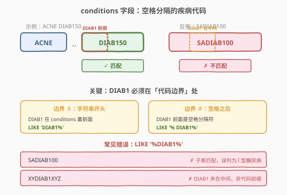
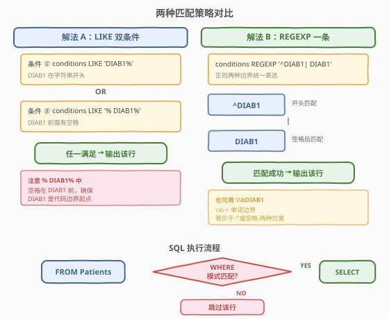
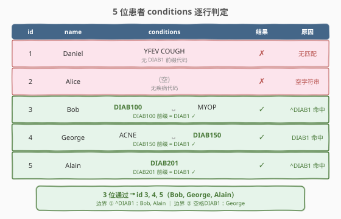

# LeetCode 患某种疾病的患者 题解

## 1. 题目概述

- **标题 / 题号**：患某种疾病的患者（#1527，easy）
- **链接**：https://leetcode.cn/problems/patients-with-a-condition/
- **难度**：简单
- **标签**：SQL、`LIKE`、`REGEXP`、模式匹配

**题意**：给定 `Patients` 表，编写 SQL 查询，查找患有 **I 类糖尿病**的患者。I 类糖尿病的疾病代码总是包含前缀 `DIAB1`。`conditions` 字段包含 0 个或多个疾病代码，以**空格分隔**。

返回结果包含 `patient_id`、`patient_name`、`conditions`，顺序任意。

**表结构**：

```text
Table: Patients
+--------------+---------+
| Column Name  | Type    |
+--------------+---------+
| patient_id   | int     |  ← 主键
| patient_name | varchar |
| conditions   | varchar |
+--------------+---------+
```

**示例 1**：

```text
输入：
Patients 表：
+------------+-----------------+--------------+
| patient_id | patient_name    | conditions   |
+------------+-----------------+--------------+
| 1          | Daniel          | YFEV COUGH   |
| 2          | Alice           |              |
| 3          | Bob             | DIAB100 MYOP |
| 4          | George          | ACNE DIAB150 |
| 5          | Alain           | DIAB201      |
+------------+-----------------+--------------+

输出：
+------------+-----------------+--------------+
| patient_id | patient_name    | conditions   |
+------------+-----------------+--------------+
| 3          | Bob             | DIAB100 MYOP |
| 4          | George          | ACNE DIAB150 |
| 5          | Alain           | DIAB201      |
+------------+-----------------+--------------+
```

**解释**：

| patient_id | conditions | 匹配? | 原因 |
|------------|-----------|-------|------|
| 1 | `YFEV COUGH` | ✗ | 无 `DIAB1` 前缀的代码 |
| 2 | `(空)` | ✗ | 无疾病代码 |
| 3 | `DIAB100 MYOP` | ✓ | `DIAB100` 前缀为 `DIAB1`（字符串开头） |
| 4 | `ACNE DIAB150` | ✓ | `DIAB150` 前缀为 `DIAB1`（空格之后） |
| 5 | `DIAB201` | ✓ | `DIAB201` 前缀为 `DIAB1`（字符串开头） |

> 💡 本题是 SQL **"模式匹配中的边界陷阱"招牌题**——`DIAB1` 必须是某个疾病代码的**前缀**，而非字符串中的任意子串。`conditions` 字段以空格分隔多个代码，因此 `DIAB1` 只有出现在**字符串开头**或**空格之后**时才算合法前缀。核心考点在于区分"子串匹配"与"代码边界匹配"。

## 2. 解题思路

### 2.1 暴力思路：子串匹配（错误！）

最直觉但**错误**的思路是直接用 `LIKE '%DIAB1%'`：

```text
WHERE conditions LIKE '%DIAB1%'    -- ⚠️ 错误！
```

这会匹配 `conditions` 中**任意位置**出现的 `DIAB1`，包括 `SADIAB100`（`DIAB1` 夹在 `SA` 和 `00` 之间）。但 `SADIAB100` 是一个整体代码，其前缀是 `SADI` 而非 `DIAB1`，**不应**判定为 I 型糖尿病。

> ⚠️ **子串匹配的根本问题**：`LIKE '%DIAB1%'` 不区分 `DIAB1` 是「代码前缀」还是「代码中间的子串」。`SADIAB100` 含 `DIAB1` 子串但代码前缀是 `SADI`，被误判。必须确保 `DIAB1` 出现在**代码边界**——即字符串开头或空格分隔符之后。

### 2.2 核心观察：代码边界 = 开头 或 空格之后



`conditions` 是空格分隔的代码串，每个代码的前缀起点只有两种位置：

| 边界类型 | 位置 | 匹配方式 |
|---------|------|---------|
| ① 字符串开头 | `^DIAB1...` | `LIKE 'DIAB1%'` |
| ② 空格之后 | `... DIAB1...` | `LIKE '% DIAB1%'` |

两种边界取**并集**（OR），即可覆盖所有合法的 `DIAB1` 前缀位置。

> 💡 **三条关键不变量**把问题彻底简化：
> 1. **代码以空格分隔** → 代码前缀只可能出现在「字符串开头」或「空格之后」，不存在第三种位置。
> 2. **`DIAB1` 必须是代码前缀** → 不能是代码中间的子串，`SADIAB100` 不算。
> 3. **两种边界用 OR 合并** → `LIKE 'DIAB1%' OR LIKE '% DIAB1%'`，或用正则 `^DIAB1| DIAB1` 一条表达。

> ⚠️ **`'% DIAB1%'` 中的空格不可省略**：空格是代码分隔符，` DIAB1`（空格+DIAB1）确保 `DIAB1` 前面是分隔符而非其他代码字符。若写成 `'%DIAB1%'`，则 `SADIAB100` 也会匹配——`DIAB1` 前面是 `SA`（代码中间），非边界。

### 2.3 算法流程图



**逻辑执行步骤**（以 LIKE 双条件为例）：

| 步骤 | 操作 | 说明 |
|------|------|------|
| ① | `FROM Patients` | 逐行扫描表 |
| ② | `WHERE conditions LIKE 'DIAB1%'` | 检查 DIAB1 是否在字符串开头 |
| ③ | `OR conditions LIKE '% DIAB1%'` | 检查 DIAB1 是否在空格之后 |
| ④ | 任一满足 → 保留；都不满足 → 跳过 | `WHERE` 过滤行级结果 |
| ⑤ | `SELECT patient_id, patient_name, conditions` | 输出匹配行 |

> 💡 **LIKE vs REGEXP 选择**：LIKE 只支持 `%` 和 `_` 两个通配符，但足以表达「开头」和「空格后」两种边界，可读性高且兼容所有数据库。REGEXP 用 `^DIAB1| DIAB1` 一条表达更简洁，也可用 `\\bDIAB1`（单词边界）等价替代，但可移植性稍差。本题推荐 LIKE 双条件作为主解法。

### 2.4 示例演算

以示例 1 的 5 位患者为例，观察匹配的逐步判定过程：



**逐行分析**：

| # | conditions | 代码切分 | DIAB1 在边界? | 结果 |
|---|-----------|---------|-------------|------|
| 1 | `YFEV COUGH` | `YFEV`, `COUGH` | 无代码以 DIAB1 开头 | ✗ |
| 2 | `(空)` | 无代码 | 无 | ✗ |
| 3 | `DIAB100 MYOP` | `DIAB100`, `MYOP` | `DIAB100` 在开头，前缀 `DIAB1` ✓ | ✓ |
| 4 | `ACNE DIAB150` | `ACNE`, `DIAB150` | `DIAB150` 在空格后，前缀 `DIAB1` ✓ | ✓ |
| 5 | `DIAB201` | `DIAB201` | `DIAB201` 在开头，前缀 `DIAB1` ✓ | ✓ |

> 💡 注意 patient 4 (George)：`DIAB150` 不是在字符串开头，而是在 `ACNE ` 之后。`LIKE 'DIAB1%'` 不匹配（不在开头），但 `LIKE '% DIAB1%'` 匹配（` DIAB1` 子串存在——`ACNE DIAB150` 含 ` DIAB1`）。这正是需要 OR 两个条件的原因。

## 3. 参考代码

### SQL（解法 A：`LIKE` 双条件，推荐）

```sql
SELECT patient_id, patient_name, conditions
FROM Patients
WHERE conditions LIKE 'DIAB1%' OR conditions LIKE '% DIAB1%';
```

> 💡 **写法要点**：
> - **`'DIAB1%'`**：`%` 匹配任意后续字符，检查 `conditions` 是否以 `DIAB1` 开头（如 `DIAB100 MYOP`）。
> - **`'% DIAB1%'`**：前导 `%` 匹配任意字符，中间空格确保 `DIAB1` 在代码边界，尾部 `%` 匹配后续字符（如 `ACNE DIAB150`）。
> - **`OR`**：两种边界取并集，覆盖所有合法位置。
> - ✓ **最推荐**：可读性高，兼容所有数据库引擎，无正则转义陷阱。

### SQL（解法 B：`REGEXP` 一条）

```sql
SELECT patient_id, patient_name, conditions
FROM Patients
WHERE conditions REGEXP '^DIAB1| DIAB1';
```

> 💡 **REGEXP 写法要点**：
> - **`^DIAB1`**：`^` 锚定字符串开头，匹配以 `DIAB1` 开头的 `conditions`。
> - **` DIAB1`**：字面空格 + `DIAB1`，匹配空格分隔符之后的 `DIAB1`（代码边界）。
> - **`|`**：正则交替（OR），两种边界一条表达。
> - **无需 `$`**：本题只关心 `DIAB1` 是否在边界出现，不关心后续内容，故不锚定结尾。

### SQL（解法 C：`REGEXP` 单词边界 `\\b`）

```sql
SELECT patient_id, patient_name, conditions
FROM Patients
WHERE conditions REGEXP '\\bDIAB1';
```

> 💡 **`\\b` 单词边界写法**：
> - **`\\b`** 是正则的「单词边界」元字符，匹配「单词字符（字母/数字/下划线）与非单词字符之间的位置」。
> - 字符串开头后接 `D` → 边界 ✓；空格后接 `D` → 边界 ✓；`SADIAB1` 中 `A` 与 `D` 之间 → 均为单词字符 → **无边界** ✗。
> - **MySQL 转义**：SQL 字符串中 `\\` 表示一个字面 `\`，故 `'\\bDIAB1'` 传给正则引擎的是 `\bDIAB1`（`\b` 为单词边界）。
> - ⚠️ 需要 MySQL 8.0+（ICU 正则引擎支持 `\\b`），旧版 MySQL 5.x 的 POSIX 正则可能不支持。LeetCode 环境为 MySQL 8.0，可放心使用。

### Python（pandas）

```python
import pandas as pd

def find_patients(patients: pd.DataFrame) -> pd.DataFrame:
    mask = patients['conditions'].str.contains(r'(^| )DIAB1', regex=True)
    return patients.loc[mask, ['patient_id', 'patient_name', 'conditions']]
```

> 💡 **pandas 写法要点**：
> - **`str.contains(pattern, regex=True)`**：对 Series 应用正则匹配，返回布尔 Series。
> - **`r'(^| )DIAB1'`**：`(^| )` 是捕获组，匹配「字符串开头 `^`」或「空格 ` `」二者之一，后接 `DIAB1`。等价于 SQL 的 `^DIAB1| DIAB1`。
> - **`r'...'` 原始字符串**：避免 Python 层面的 `\` 转义干扰，直接传给 `re` 模块。
> - **`users.loc[mask, [...]]`**：布尔索引过滤行 + 选择列。

## 4. 复杂度分析

| 维度 | 复杂度 | 说明 |
|------|--------|------|
| 时间复杂度 | $O(n \cdot m)$ | $n$ = `Patients` 表行数，$m$ = `conditions` 字段平均长度。每行对长度 $m$ 的字符串做模式匹配 $O(m)$（LIKE 和简单 REGEXP 均为线性扫描） |
| 空间复杂度 | $O(k)$ | $k$ = 匹配的患者数（输出结果集大小）。模式匹配引擎内部状态 $O(1)$ |

> 💡 本题的 LIKE 和 REGEXP 模式均为简单前缀/子串匹配，**无回溯风险**——引擎从左到右线性扫描，最坏 $O(m)$。`conditions` 字段通常较短（几个疾病代码），性能不是瓶颈。

> ⚠️ **索引优化**：`WHERE conditions LIKE '%...'`（前导 `%`）无法利用 B+ 树索引。`LIKE 'DIAB1%'`（无前导 `%`）理论上可走索引，但与 `OR` 组合后优化器通常放弃索引。本题数据量小，无需优化。生产环境若需高频查询，可增加 `has_diab1` 布尔列预处理。

## 5. 扩展：`LIKE` vs `REGEXP` 边界表达方式对比

### 5.1 三种边界表达方式

| 方式 | 写法 | 原理 | 兼容性 |
|------|------|------|--------|
| LIKE 双条件 | `LIKE 'DIAB1%' OR LIKE '% DIAB1%'` | 显式枚举两种边界位置 | ✅ 所有数据库 |
| REGEXP 交替 | `REGEXP '^DIAB1\| DIAB1'` | 正则 `^` + 字面空格 | ✅ MySQL/PostgreSQL |
| REGEXP 单词边界 | `REGEXP '\\bDIAB1'` | `\\b` 元字符自动匹配边界 | ⚠️ MySQL 8.0+/PG |

### 5.2 `\\b` 单词边界的精确语义

`\\b` 匹配「单词字符 `[a-zA-Z0-9_]`」与「非单词字符（空格/标点/开头/结尾）」之间的**零宽位置**：

```text
位置             前一字符    当前字符    \\b 匹配?
字符串开头 → D    (无)       D(单词)     ✓ 边界
空格 → D          空格(非单词) D(单词)     ✓ 边界
A → D（SADIAB1）  A(单词)    D(单词)     ✗ 无边界
```

> 💡 **巧妙之处**：疾病代码由字母数字组成（单词字符），分隔符是空格（非单词字符）。`\\bDIAB1` 自动捕捉「分隔符→代码首字符」的过渡位置，无需手动枚举「开头」和「空格后」两种情况——正则引擎自动完成。但 `\\b` 也可匹配 `_` 和 `-` 等边界（若代码含这些字符），语义可能略宽于「空格分隔」。本题代码均由字母数字组成，`\\b` 与显式空格写法等价。

### 5.3 何时选 LIKE，何时选 REGEXP

| 场景 | 推荐 | 原因 |
|------|------|------|
| 简单前缀/后缀/固定子串 | LIKE | 语法简单，兼容性好，可读性高 |
| 字符集/重复/交替/边界 | REGEXP | LIKE 的 `%`/`_` 无法表达，正则更强大 |
| 跨数据库移植 | LIKE | REGEXP 语法各数据库不同（MySQL `REGEXP`、PG `~`、SQL Server 无原生正则） |
| 性能敏感 | LIKE | 简单 LIKE 可能走索引；REGEXP 通常全表扫描 |

## 6. 面试要点

1. **为什么不能直接用 `LIKE '%DIAB1%'`？**

   > `LIKE '%DIAB1%'` 匹配 `conditions` 中任意位置的 `DIAB1` 子串，包括 `SADIAB100`——此时 `DIAB1` 夹在 `SA` 和 `00` 之间，不是代码前缀。题目要求 `DIAB1` 是**疾病代码的前缀**，代码以空格分隔，故 `DIAB1` 必须出现在「字符串开头」或「空格之后」。正确写法是 `LIKE 'DIAB1%' OR LIKE '% DIAB1%'`。

2. **`LIKE '% DIAB1%'` 中的空格有什么作用？**

   > 空格是疾病代码的分隔符。`' DIAB1'`（空格+DIAB1）确保 `DIAB1` 前面是分隔符，即 `DIAB1` 是一个新代码的起点。若省略空格写成 `'%DIAB1%'`，则 `SADIAB100` 中的 `DIAB1`（前面是 `SA`）也会匹配，造成误判。空格是「代码边界」的显式标记。

3. **REGEXP `^DIAB1| DIAB1` 中为什么不用括号？**

   > `|` 的优先级低于 `^`，`^DIAB1| DIAB1` 被解析为 `(^DIAB1) 或 ( DIAB1)` 两个分支——`^` 只作用于 `DIAB1`，不延伸到右侧。这正是我们想要的：左分支锚定开头，右分支匹配空格后的子串。若写成 `^(DIAB1| DIAB1)`，则 `^` 作用于整个组，右侧 ` DIAB1` 也被要求在开头，语义错误。`^DIAB1| DIAB1` 不加括号恰好正确。

4. **`\\bDIAB1` 与 `^DIAB1| DIAB1` 效果完全一样吗？**

   > 在本题中效果相同，因为疾病代码由字母数字组成、空格分隔，`\\b`（单词边界）恰好匹配「开头」和「空格后」两种位置。但语义上 `\\b` 更宽——它也匹配 `_`、`-` 等非单词字符边界。若代码可能含下划线（如 `PRE_DIAB100`），`\\b` 会在 `_D` 处匹配边界（误判），而 `^DIAB1| DIAB1` 不会（只认空格分隔）。本题代码不含下划线，两者等价。

5. **`conditions` 为空字符串时，LIKE 和 REGEXP 如何处理？**

   > 空字符串不匹配 `'DIAB1%'`（不以 DIAB1 开头）也不匹配 `'% DIAB1%'`（不含 ` DIAB1` 子串），故被正确排除。REGEXP 同理——空字符串不匹配 `^DIAB1` 也不匹配 ` DIAB1`。无需额外处理 NULL/空值。但若 `conditions` 为 SQL `NULL`（非空字符串），`LIKE` 返回 `NULL`（视为 false），也被排除，行为正确。

> 💡 **一句话总结**：1527 是 SQL **"模式匹配中的边界陷阱"招牌题**——核心模板「`WHERE conditions LIKE 'DIAB1%' OR conditions LIKE '% DIAB1%'`」。三大考点：① 区分子串匹配与代码前缀匹配；② 空格是代码边界的显式标记；③ `\\b` 单词边界是正则的优雅等价写法。是"将自然语言规则翻译为 SQL 模式匹配"的入门练手题。

## 同类练习题

| # | 题目 | 与本题的关联 |
|---|------|-------------|
| 1517 | [查找拥有有效邮箱的用户](https://leetcode.cn/problems/find-users-with-valid-e-mails/) | SQL + `REGEXP` 正则匹配邮箱格式，同为行级模式匹配过滤，巩固正则与 `.` 转义 |
| 595 | [大的国家](https://leetcode.cn/problems/big-countries/) | SQL `WHERE` 多条件过滤，比 1527 更简单的入门级行级过滤 |
| 1757 | [可回收且低脂的产品](https://leetcode.cn/problems/recyclable-and-low-fat-products/) | SQL `WHERE` 布尔条件过滤，入门级过滤题 |
| 584 | [寻找用户推荐人](https://leetcode.cn/problems/find-customer-referee/) | SQL `WHERE` 条件过滤 + `NULL` 处理，同为行级过滤但增加 `IS NULL` 边界 |
| 197 | [上升的温度](https://leetcode.cn/problems/rising-temperature/) | SQL `WHERE` + 日期比较 + 自连接，在行级过滤基础上叠加表间比较 |
