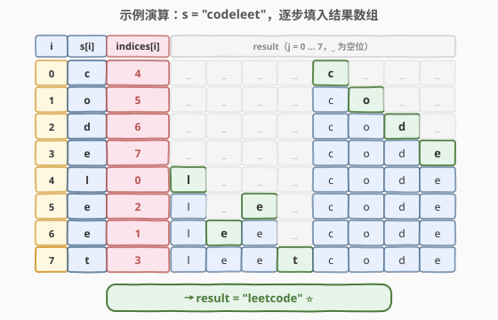

# 重新排列字符串

- **题目名称**：重新排列字符串
- **链接**：[1528. 重新排列字符串](https://leetcode.cn/problems/shuffle-string/)
- **难度**：简单
- **标签**：数组、字符串、模拟

## 1. 题目概述

给你一个字符串 `s` 和一个**长度相同**的整数数组 `indices`。请你重新排列字符串 `s`，其中第 `i` 个字符需要移动到 `indices[i]` 指示的位置。返回重新排列后的字符串。

**示例 1**：

```text
输入：s = "codeleet", indices = [4,5,6,7,0,2,1,3]
输出："leetcode"
解释：如图所示，"codeleet" 重新排列后变为 "leetcode"。
```

**示例 2**：

```text
输入：s = "abc", indices = [0,1,2]
输出："abc"
解释：重新排列后，每个字符都还留在原来的位置上。
```

**约束条件**：

- `s.length == indices.length == n`
- `1 <= n <= 100`
- `s` 仅包含小写英文字母
- `0 <= indices[i] < n`
- `indices` 的所有值都是**唯一**的

> 💡 `indices` 是一个 $0$ 到 $n-1$ 的**排列**（每个值唯一且覆盖全集），这正是「每个源字符都有唯一目标位置、每个目标位置也恰有一个源字符」的双射关系。抓住这个结构，可直接一步到位地放置每个字符。

---

## 2. 解题思路

### 2.1 暴力思路：对每个目标位置，线性查找源字符

最直观的「按输出顺序思考」做法是：要填 `result[j]`，就得知道「哪个源字符的目标是 `j`」，即找到满足 `indices[i] == j` 的 `i`，于是 `result[j] = s[i]`。

```text
for j in 0..n-1:
    for i in 0..n-1:
        if indices[i] == j:
            result[j] = s[i]
            break
```

时间复杂度 $O(n^2)$。对 $n = 100$ 仅约 $10^4$ 次比较，能过，但做了大量重复搜索——对每个目标 `j` 都要把 `indices` 扫一遍找源。根本问题在于**循环方向选错了**：我们在「按目标找源」，而题目给的信息恰好是「源→目标」的映射，应当顺着这个方向放置。

### 2.2 核心观察：反转查找方向，源直接放到目标

![核心观察：s[i] 直接放到 result[indices[i]]，一次遍历完成](../images/shuffle_concept.svg)

关键直觉是**反转查找方向**：与其「对每个目标位置 `j`，扫描找哪个 `i` 满足 `indices[i] == j`」（需要 $O(n)$ 搜索），不如「对每个源位置 `i`，直接把 `s[i]` 放到 `indices[i]`」（$O(1)$ 直达）。

由于 `indices` 是排列，每个目标位置恰被一个源命中，不会冲突、也不会遗漏：

$$\text{result}[\text{indices}[i]] = s[i], \quad i = 0, 1, \dots, n-1$$

> 💡 **为什么这是「逆置换」视角？** `indices` 给出的是「源位置 → 目标位置」的函数 $i \mapsto \text{indices}[i]$。直接放置 `result[indices[i]] = s[i]` 正是按这个函数把每个元素送到目标——无需构造逆函数。若反过来「按目标找源」则等价于求 `indices` 的逆排列，代价更高。**顺着给定的映射方向走，永远比求逆再走更省力**。

> ⚠️ **不能原地写回 `s` 吗？** 直接 `s[indices[i]] = s[i]` 会覆盖尚未处理的字符（例如 `i=0` 时 `s[4]` 还没被读取，却可能被覆盖）。因此必须用**独立的结果数组**接收，保证源数据在遍历期间不被破坏。

### 2.3 算法流程图


整个流程是单层循环：开一个长度为 $n$ 的字符数组 `res` → 对每个 `i` 执行 `res[indices[i]] = s[i]` → 拼接成字符串返回。每个字符只放一次，时间 $O(n)$。

### 2.4 示例演算



以 `s = "codeleet", indices = [4,5,6,7,0,2,1,3]` 为例（`_` 表示尚未填入的位置）：

- **i=0**：`s[0]='c'`，`indices[0]=4` → `res[4]='c'` → `____c___`
- **i=1**：`s[1]='o'`，`indices[1]=5` → `res[5]='o'` → `____co__`
- **i=2**：`s[2]='d'`，`indices[2]=6` → `res[6]='d'` → `____cod_`
- **i=3**：`s[3]='e'`，`indices[3]=7` → `res[7]='e'` → `____code`
- **i=4**：`s[4]='l'`，`indices[4]=0` → `res[0]='l'` → `l___code`
- **i=5**：`s[5]='e'`，`indices[5]=2` → `res[2]='e'` → `le_ecode`
- **i=6**：`s[6]='e'`，`indices[6]=1` → `res[1]='e'` → `lee_code`
- **i=7**：`s[7]='t'`，`indices[7]=3` → `res[3]='t'` → `leetcode`

最终 `res = "leetcode"` ⭐，与示例一致。

---

## 3. 参考代码

### C++（直接放置）

```cpp
class Solution {
  public:
    string restoreString(string s, vector<int>& indices) {
        int n = s.size();
        string res(n, '\0');
        for (int i = 0; i < n; i++) {
            res[indices[i]] = s[i];
        }
        return res;
    }
};
```

### Python

```python
class Solution:
    def restoreString(self, s: str, indices: list[int]) -> str:
        res = [''] * len(s)
        for i, ch in enumerate(s):
            res[indices[i]] = ch
        return ''.join(res)
```

> 💡 **Python 一行版**：`return ''.join(ch for _, ch in sorted(zip(indices, s)))`——按 `indices` 排序后拼接。但这引入 $O(n \log n)$ 排序，且不如直接放置直观，仅作语言趣味展示，面试建议写上面的 $O(n)$ 版。

---

## 4. 复杂度分析

| 维度 | 复杂度 | 说明 |
|------|--------|------|
| 时间复杂度 | $O(n)$ | 遍历一次，每个字符 $O(1)$ 直接放置到目标位置 |
| 空间复杂度 | $O(n)$ | 额外开辟长度为 $n$ 的结果数组（返回值本身需要 $O(n)$，无法省去） |

---

## 5. 扩展：原地置换 $O(1)$ 额外空间

如果允许修改输入，可利用 `indices` 是排列的性质做**原地置换**：把排列分解成若干个**循环**，沿每个循环把字符轮转到位，同时同步交换 `indices` 以标记「该位置已归位」。

```cpp
class Solution {
  public:
    string restoreString(string s, vector<int>& indices) {
        int n = s.size();
        for (int i = 0; i < n; i++) {
            while (indices[i] != i) {
                swap(s[i], s[indices[i]]);            // 把 s[i] 送到目标位置
                swap(indices[i], indices[indices[i]]); // 同步标记归位
            }
        }
        return s;
    }
};
```

**为什么正确？** `while` 循环沿当前 `i` 所在的循环走：只要 `indices[i] != i`，说明位置 `i` 上坐着的还不是「目标为 `i`」的字符，就把它换到它该去的位置；交换后 `indices[i]` 更新为新的值，直到 `indices[i] == i` 表示位置 `i` 已归位。每个元素至多被交换一次到达目标，总交换次数不超过 $n$。

| 维度 | 复杂度 | 说明 |
|------|--------|------|
| 时间复杂度 | $O(n)$ | 每次交换至少让一个元素归位，总交换 $\leq n$ |
| 空间复杂度 | $O(1)$ | 原地修改 `s` 与 `indices`，仅常数额外空间 |

> ⚠️ **原地版会破坏输入 `indices`**：若调用方之后还需要 `indices`，则不能采用此版本。面试中应主动说明这一取舍：用 $O(n)$ 空间换「不破坏输入」的安全性，或用 $O(1)$ 空间但牺牲输入不可变性。

> 💡 **循环置换的通用性**：把排列分解成循环、沿循环轮转元素，是所有「原地重排」问题的通用骨架——[41. 缺失的第一个正数](https://leetcode.cn/problems/first-missing-positive/) 的「元素归位」、[289. 生命游戏](https://leetcode.cn/problems/game-of-life/) 的「原地编码」都是同一思想的不同实例。

---

## 6. 面试要点

1. **为什么直接放置 `res[indices[i]] = s[i]` 是 $O(n)$，而暴力是 $O(n^2)$？**

   - 直接放置「顺着给定映射走」：每个源 `i` 的目标 `indices[i]` 已知，$O(1)$ 直达，总 $O(n)$。暴力「按目标找源」需要对每个 `j` 扫描 `indices` 求逆，单次 $O(n)$，总 $O(n^2)$。差别在于**循环方向**：沿映射方向走 vs 求逆再走。

2. **为什么不能原地 `s[indices[i]] = s[i]`？**

   - 会覆盖尚未读取的源字符。例如 `i=0, indices[0]=4` 时直接写 `s[4]`，但 `s[4]` 可能还没被读取，信息就此丢失。必须用独立结果数组，或在原地版中用「交换 + 标记归位」保证每个被覆盖的位置已经处理过。

3. **`indices` 是排列这一点为什么重要？**

   - 排列保证每个目标位置恰有一个源命中（双射），所以 `res[indices[i]] = s[i]` 不会冲突（同一目标不会被写两次）、也不会遗漏（每个目标都被写一次）。若 `indices` 有重复值，则需处理冲突策略，本题无需考虑。

4. **原地置换版的 `while` 循环会不会退化到 $O(n^2)$？**

   - 不会。每次 `swap` 都让至少一个元素到达其最终位置（`indices[i]` 变成 `i`），此后该位置不再参与交换。$n$ 个元素每个至多归位一次，故总交换次数 $\leq n$，均摊每轮 $O(1)$。关键是「交换即归位」的单调性。

5. **如果只是求「逆排列」本身（不搬字符），怎么做？**

   - 令 `inv[indices[i]] = i`，一次遍历 $O(n)$ 即得逆排列。本题的 `res[indices[i]] = s[i]` 其实就是「用 `indices` 当搬运指令」，而暴力法的「找 `indices[i]==j` 的 `i`」正是在求逆排列——理解了这层等价关系，就知道直接放置天然避开了显式求逆。

---

## 7. 同类练习题

- [1920. 基于排列构建数组](https://leetcode.cn/problems/build-array-from-permutation/)：同样的下标映射，`ans[i] = nums[nums[i]]`，对照本题 `res[indices[i]] = s[i]` 的反向映射方向
- [41. 缺失的第一个正数](https://leetcode.cn/problems/first-missing-positive/)（[题解](../0001-0100/41_缺失的第一个正数.md)）：原地循环置换把元素归位，与本题扩展解法同骨架
- [448. 找到所有数组中消失的数字](https://leetcode.cn/problems/find-all-numbers-disappeared-in-an-array/)：下标当哈希键标记存在性，原地利用位置信息的经典应用
- [289. 生命游戏](https://leetcode.cn/problems/game-of-life/)：位复用原地编码状态，$O(1)$ 空间原地修改的思路同源
- [1929. 数组串联](https://leetcode.cn/problems/concatenation-of-array/)：按下标构造新数组的最基础练习，巩固「索引映射重排」基本功
