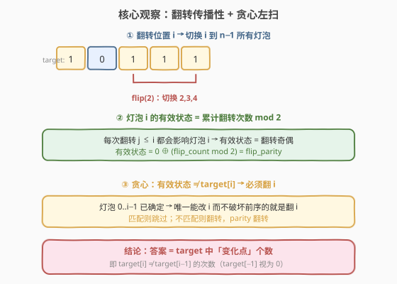
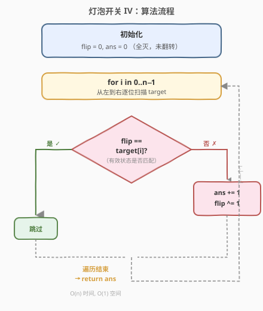
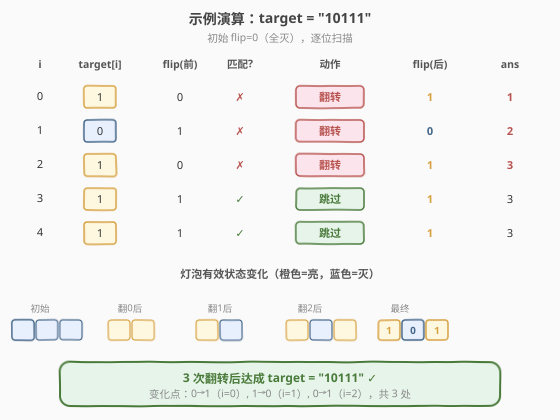

# 灯泡开关 IV

- **题目名称**：灯泡开关 IV
- **链接**：[1529. 灯泡开关 IV](https://leetcode.cn/problems/bulb-switcher-iv/)
- **难度**：中等
- **标签**：贪心、字符串、位运算

## 1. 题目概述

房间中有 `n` 个灯泡，编号 `0` 到 `n−1`，从左到右排成一行。**初始全部关闭**。给定长度为 `n` 的二进制字符串 `target`，其中 `target[i]` 为 `'1'` 表示灯泡 `i` 需要打开，`'0'` 表示关闭。

一次**翻转操作**定义为：选择任意下标 `i`，将 `i` 到 `n−1` 的**所有灯泡**状态切换（开→关，关→开）。返回使所有灯泡达到 `target` 配置所需的**最少操作次数**。

**示例 1**：

```text
输入：target = "10111"
输出：3
解释：初始 00000
  翻转 i=2 → 00111
  翻转 i=1 → 01000
  翻转 i=0 → 10111  ✓
```

**示例 2**：

```text
输入：target = "101"
输出：3
解释：初始 000 → 翻 i=2 得 001 → 翻 i=1 得 010 → 翻 i=0 得 101 ✓
```

**示例 3**：

```text
输入：target = "00000"
输出：0
解释：初始即为目标，无需操作。
```

**约束条件**：

- `1 <= n <= 10^5`
- `target` 仅含 `'0'` 和 `'1'`

> ⚠️ `n` 最大 $10^5$，暴力枚举翻转组合（$2^n$ 种）完全不可行；需利用翻转的**传播性**将问题化为 $O(n)$ 贪心。

---

## 2. 解题思路

### 2.1 暴力思路

每个位置可以「翻」或「不翻」，共 $2^n$ 种组合——`n = 10^5` 时天文数字，不可行。需要发现翻转操作的结构性质来贪心。

### 2.2 核心观察：翻转传播性 + 贪心左扫



**关键性质 1——翻转传播**：翻转位置 `i` 会影响 `i` 到 `n−1` 的**所有灯泡**。因此灯泡 `i` 的**有效状态**取决于「所有 `j ≤ i` 的翻转次数」的奇偶性：

$$
\text{有效状态}(i) = 0 \oplus \left(\sum_{j=0}^{i} \text{flip}(j) \bmod 2\right) = \text{flip\_parity}
$$

其中 `flip_parity` 是从位置 `0` 到当前位置累计翻转次数对 2 取模。

**关键性质 2——贪心选择**：从左到右扫描时，位置 `0..i−1` 的状态已经确定（无法再改变而不破坏前序）。要改变灯泡 `i` 的状态，**唯一不破坏 `0..i−1` 的操作就是翻转 `i`**（因为翻转任何 `j > i` 不影响灯泡 `i`，翻转任何 `j < i` 会破坏已确定的前序灯泡）。

> 💡 **贪心策略**：维护当前翻转奇偶 `flip`（初始 0）。逐位扫描 `target`：若 `flip` 与 `target[i]` **不匹配**，则必须在此翻转——`ans++`，`flip ^= 1`；否则跳过。

**等价结论**：答案等于 `target` 中「变化点」的个数——即 `target[i] ≠ target[i−1]` 的次数，其中 `target[−1]` 视为 `'0'`（初始全灭）。

### 2.3 算法流程图



**一次遍历**：

1. 初始化 `flip = 0`（当前有效状态，全灭）、`ans = 0`。
2. 逐位扫描 `target[i]`：
   - 若 `flip == target[i]`：匹配，跳过。
   - 若 `flip != target[i]`：不匹配，`ans++`，`flip ^= 1`（翻转传播到后续所有灯泡）。
3. 返回 `ans`。

### 2.4 示例演算

以 `target = "10111"` 为例：



| 步骤 | target[i] | flip（前） | 匹配? | 动作 | flip（后） | ans |
|------|-----------|-----------|-------|------|-----------|-----|
| i=0  | 1         | 0         | ✗     | 翻转 | 1         | 1   |
| i=1  | 0         | 1         | ✗     | 翻转 | 0         | 2   |
| i=2  | 1         | 0         | ✗     | 翻转 | 1         | 3   |
| i=3  | 1         | 1         | ✓     | 跳过 | 1         | 3   |
| i=4  | 1         | 1         | ✓     | 跳过 | 1         | 3   |

最终答案为 `3`。变化点出现在 `i=0`（0→1）、`i=1`（1→0）、`i=2`（0→1），共 3 处，与翻转次数一致。

---

## 3. 参考代码

### 方法一：贪心 + 翻转奇偶标记（推荐）

### C++

```cpp
class Solution {
public:
    int minFlips(string target) {
        int flip = 0, ans = 0;
        for (char c : target) {
            int cur = (c - '0') ^ flip;   // 当前有效状态
            if (cur == 0) {                // 有效状态为灭，但 target 要亮
                ans++;
                flip ^= 1;                 // 翻转，传播到后续
            }
            // 等价写法：if ((c - '0') != flip) { ans++; flip ^= 1; }
        }
        return ans;
    }
};
```

### Python

```python
class Solution:
    def minFlips(self, target: str) -> int:
        flip = ans = 0
        for c in target:
            if int(c) != flip:
                ans += 1
                flip ^= 1
        return ans
```

> 💡 **更简洁的写法**：直接统计「变化点」个数——遍历时若 `target[i] != target[i-1]`（`target[-1]` 视为 `'0'`），则 `ans++`。逻辑完全等价，无需显式维护 `flip` 变量。

### 方法二：统计变化点（一行版）

### Python

```python
class Solution:
    def minFlips(self, target: str) -> int:
        return sum(c != prev for c, prev in zip('0' + target, target))
```

### C++

```cpp
class Solution {
public:
    int minFlips(string target) {
        int ans = 0;
        char prev = '0';
        for (char c : target) {
            if (c != prev) {
                ans++;
                prev = c;
            }
        }
        return ans;
    }
};
```

> 💡 两种写法本质相同：`flip` 的值恰好等于「上一个变化点的 target 值」，因此 `flip != target[i]` 等价于 `target[i] != target[i-1]`（含起始 `'0'`）。

---

## 4. 复杂度分析

| 维度 | 复杂度 | 说明 |
|------|--------|------|
| 时间复杂度 | $O(n)$ | 只遍历字符串一次，每步 $O(1)$ 比较 |
| 空间复杂度 | $O(1)$ | 只需 `flip` 和 `ans` 两个变量 |

---

## 5. 扩展：翻转传播问题的通用范式

「翻转一段后缀/区间」是一类经典贪心模型。核心思路统一为：**从影响范围的一端开始扫描，维护累计翻转奇偶，不匹配就翻**。

- **后缀翻转（本题）**：翻转 `i..n−1`，从左到右扫，维护 `flip` 奇偶，不匹配则翻当前位置。
- **前缀翻转**：翻转 `0..i`，从右到左扫，同理维护 `flip`。
- **区间翻转 `[l, r]`**：用差分数组记录翻转次数，扫描时维护前缀和奇偶。代表题 [1284. 转化为全零矩阵的最少反转次数](../1201-1300/1284_转化为全零矩阵的最少反转次数.md)（二维版，每个格子翻转十字区域）。

> 💡 **识别信号**：看到「翻转影响一段连续区间」「求最少翻转次数」时，优先考虑贪心 + 翻转奇偶标记，而非 BFS 或暴力搜索。

---

## 6. 面试要点

1. **为什么贪心是正确的？**

   - 灯泡 `i` 的状态由所有 `j ≤ i` 的翻转决定。从左到右扫描到 `i` 时，`0..i−1` 已确定，唯一能改 `i` 而不破坏前序的操作就是翻转 `i` 本身。因此每一步的「翻或不翻」是**唯一确定**的，没有选择空间——这正是贪心正确性的来源。

2. **为什么不需要回溯或 DP？**

   - 因为每步的选择是**被迫的**：匹配则不翻（翻反而出错），不匹配则必须翻（没有替代方案）。不存在「当前翻但后续更优」的情况，所以无需回溯。

3. **`flip` 变量的物理含义是什么？**

   - `flip` 表示「当前灯泡的有效状态」——即初始状态 `0` 经过前面所有翻转后的结果。它等于「到目前为止的翻转次数 mod 2」。每次翻转 `i`，`flip` 取反，表示从 `i` 开始所有后续灯泡的状态都被翻转。

4. **两种写法（`flip` 标记 vs 变化点统计）为什么等价？**

   - `flip` 的值恰好在每次 `target` 发生变化时翻转，因此 `flip` 始终等于「上一个变化点的 target 值」。`flip != target[i]` 当且仅当 `target[i]` 与前一个值不同——即变化点。

5. **与 319（灯泡开关）的区别？**

   - [319](../0301-0400/319_灯泡开关.md) 是「第 `i` 轮切换所有 `i` 的倍数」，答案为 $\lfloor\sqrt{n}\rfloor$（完全平方数因子个数为奇）；本题是「翻转后缀」，答案为变化点个数。两者同属灯泡系列但模型完全不同——319 考数学性质，本题考贪心传播。

---

## 7. 同类练习题

- [319. 灯泡开关](https://leetcode.cn/problems/bulb-switcher/)（[题解](../0301-0400/319_灯泡开关.md)）：灯泡系列母题，数学性质（因子个数奇偶→完全平方数），与本题贪心模型不同
- [672. 灯泡开关 Ⅱ](https://leetcode.cn/problems/bulb-switcher-ii/)（[题解](../0601-0700/672_灯泡开关II.md)）：灯泡系列变体，受约束的开关操作枚举
- [1375. 二进制字符串前缀一致的次数](https://leetcode.cn/problems/number-of-times-binary-string-is-prefix-aligned/)（[题解](../1301-1400/1375_二进制字符串前缀一致的次数.md)）：逐位翻转灯泡，判断前缀全亮时刻，同为灯泡系列贪心
- [1284. 转化为全零矩阵的最少反转次数](https://leetcode.cn/problems/minimum-number-of-flips-to-convert-binary-matrix-to-zero-matrix/)（[题解](../1201-1300/1284_转化为全零矩阵的最少反转次数.md)）：二维翻转十字区域求最少翻转，贪心 + 差分思想的进阶版
- [995. K 连续位的最小翻转次数](https://leetcode.cn/problems/minimum-number-of-k-consecutive-bit-flips/)：翻转固定长度 K 的子数组求最少次数，本题的「窗口长度 = 后缀」推广版
