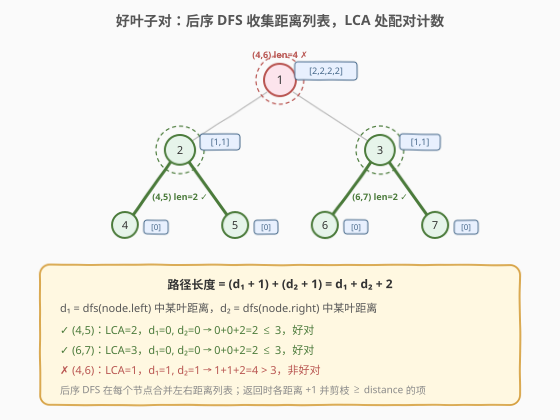
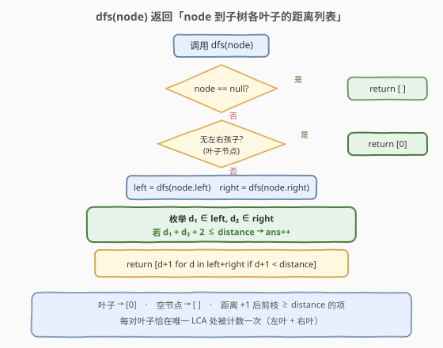
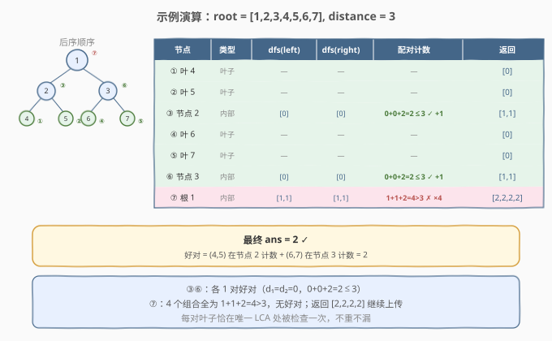

# LeetCode 好叶子节点对的数量 题解

## 1. 题目概述

- **标题 / 题号**：好叶子节点对的数量（#1530，medium）
- **链接**：https://leetcode.cn/problems/number-of-good-leaf-nodes-pairs/
- **难度**：中等
- **标签**：树、二叉树、深度优先搜索、后序遍历

**题意**：给你二叉树的根节点 `root` 和一个整数 `distance`。如果二叉树中两个**叶**节点之间的**最短路径长度**小于或等于 `distance`，那它们就可以构成一组**好叶子节点对**。返回树中好叶子节点对的数量。

**示例 1**：

```text
输入：root = [1,2,3,null,4], distance = 3
输出：1

        1
       / \
      2   3
       \
        4
```

树的叶节点是 `3` 和 `4`，它们之间的最短路径长度为 `3`（`4 → 2 → 1 → 3`），这是唯一的好叶子节点对。

**示例 2**：

```text
输入：root = [1,2,3,4,5,6,7], distance = 3
输出：2

        1
       / \
      2   3
     / \ / \
    4  5 6  7
```

好叶子节点对为 `[4,5]` 和 `[6,7]`，最短路径长度都是 `2`。但 `[4,6]` 不满足，因为路径长度为 `4`（`4 → 2 → 1 → 3 → 6`）。

**约束**：

- `tree` 的节点数在 `[1, 2^10]` 范围内。
- 每个节点值在 `[1, 100]` 之间。
- `1 <= distance <= 10`

> 💡 关键约束是 `distance ≤ 10`——这意味着每个节点向上返回的距离列表长度最多为 `distance`（0 到 `distance - 1`），单节点配对检查最多 $O(\text{distance}^2) = O(100)$ 次，总复杂度 $O(n \cdot \text{distance}^2)$ 完全可接受。

## 2. 解题思路

### 2.1 暴力思路：枚举所有叶子对 + 求 LCA

最直观的做法：遍历整棵树收集所有叶子节点，然后两两配对，对每对叶子求它们的最近公共祖先（LCA），计算路径长度 `dist(leaf1, LCA) + dist(leaf2, LCA)`，判断是否 `≤ distance`。

设叶子数为 $L$（最坏 $L = O(n)$），每对求 LCA 需 $O(n)$，总时间 $O(L^2 \cdot n) = O(n^3)$，明显超时。

### 2.2 核心观察：后序 DFS + 距离列表传递



**关键洞察**：每对叶子的最短路径**必经它们的 LCA**。而在后序 DFS 中，处理到某个节点时，左右子树的结果已经就绪——如果让 DFS 返回「当前节点到子树中各叶子的距离列表」，那么：

> 对于当前节点 `node`，**左子树距离列表** `left` 中的每个 `d₁` 表示 `node.left` 到某左叶的距离，**右子树距离列表** `right` 中的每个 `d₂` 表示 `node.right` 到某右叶的距离。这对叶子的路径长度为：

$$
\text{path} = (d_1 + 1) + (d_2 + 1) = d_1 + d_2 + 2
$$

其中 `+1` 是因为 `node` 到 `node.left`（或 `node.right`）还有一条边。若 $d_1 + d_2 + 2 \leq \text{distance}$，则这是一组好对。

> ⚠️ **为什么每对恰好被计数一次？** 一对叶子的 LCA 是唯一的。在后序遍历中，只有处理到 LCA 节点时，两个叶子才分别出现在左右子树中；在更低的节点，它们在同一个子树内（无法配对）；在更高的节点，它们虽然分属两侧，但路径长度只会更大。因此**每个好对在且仅在其 LCA 处被计数**，不重不漏。

这与 [543. 二叉树的直径](../0501-0600/543_二叉树的直径.md) 的思路一脉相承：543 在每个节点处用 `left_depth + right_depth` 更新直径，本题用 `left_dists × right_dists` 的配对计数更新答案。区别在于 543 只需最大深度（标量），本题需要完整的距离列表（向量）。

### 2.3 算法流程图



**DFS 函数 `dfs(node)` 返回距离列表**：

1. **空节点**：返回 `[]`（无叶子）；
2. **叶子节点**（无左右孩子）：返回 `[0]`（到自身距离为 0）；
3. **内部节点**：
   - 递归获取 `left = dfs(node.left)`，`right = dfs(node.right)`；
   - **配对计数**：枚举 `d₁ ∈ left`，`d₂ ∈ right`，若 $d_1 + d_2 + 2 \leq \text{distance}$，则 `ans += 1`；
   - **合并返回**：`return [d + 1 for d in left + right if d + 1 < distance]`（距离 +1 上传，剪枝 `≥ distance` 的项——它们不可能在祖先节点处形成好对）。

> 💡 **剪枝原理**：距离 `d` 的叶子传到父节点变为 `d + 1`。若 `d + 1 ≥ distance`，则即使与另一侧距离为 0 的叶子配对，路径也至少为 `(d+1) + 0 + 2 ≥ distance + 2 > distance`，不可能成为好对。因此这些项可以安全丢弃，保证列表长度 ≤ `distance`。

### 2.4 示例演算

以 `root = [1,2,3,4,5,6,7], distance = 3` 为例：



| 步骤 | 节点 | 类型 | dfs(left) | dfs(right) | 配对检查 ($d_1+d_2+2 \leq 3$) | 返回列表 |
|------|------|------|-----------|------------|-------------------------------|----------|
| ① | 叶 4 | 叶子 | — | — | — | `[0]` |
| ② | 叶 5 | 叶子 | — | — | — | `[0]` |
| ③ | 节点 2 | 内部 | `[0]` | `[0]` | $0+0+2=2 \leq 3$ ✓ → `ans=1` | `[1, 1]` |
| ④ | 叶 6 | 叶子 | — | — | — | `[0]` |
| ⑤ | 叶 7 | 叶子 | — | — | — | `[0]` |
| ⑥ | 节点 3 | 内部 | `[0]` | `[0]` | $0+0+2=2 \leq 3$ ✓ → `ans=2` | `[1, 1]` |
| ⑦ | 根 1 | 内部 | `[1,1]` | `[1,1]` | $1+1+2=4 > 3$ ✗（×4 组合全不满足） | `[2,2,2,2]` |

最终 `ans = 2` ✓。注意 ⑦ 处根节点收到 4 个距离为 1 的叶子，两两配对共 $2 \times 2 = 4$ 种组合，但路径长度均为 4，超过 `distance = 3`，因此无好对。

## 3. 参考代码

### C++

```cpp
class Solution {
  public:
    int countPairs(TreeNode* root, int distance) {
        int ans = 0;
        dfs(root, distance, ans);
        return ans;
    }

  private:
    // 返回 node 到子树中各叶子的距离列表
    vector<int> dfs(TreeNode* node, int distance, int& ans) {
        if (!node) return {};                       // 空节点：无叶子
        if (!node->left && !node->right)            // 叶子节点
            return {0};

        auto left  = dfs(node->left,  distance, ans);
        auto right = dfs(node->right, distance, ans);

        // 配对计数：左叶 + 右叶，路径 = d1 + d2 + 2
        for (int d1 : left)
            for (int d2 : right)
                if (d1 + d2 + 2 <= distance)
                    ++ans;

        // 合并并 +1 上传，剪枝 >= distance 的项
        vector<int> res;
        for (int d : left)  if (d + 1 < distance) res.push_back(d + 1);
        for (int d : right) if (d + 1 < distance) res.push_back(d + 1);
        return res;
    }
};
```

### Python

```python
class Solution:
    def countPairs(self, root: TreeNode, distance: int) -> int:
        ans = 0

        def dfs(node: Optional[TreeNode]) -> List[int]:
            nonlocal ans
            if not node:
                return []                        # 空节点：无叶子
            if not node.left and not node.right:  # 叶子节点
                return [0]

            left  = dfs(node.left)
            right = dfs(node.right)

            # 配对计数：左叶 + 右叶，路径 = d1 + d2 + 2
            for d1 in left:
                for d2 in right:
                    if d1 + d2 + 2 <= distance:
                        ans += 1

            # 合并并 +1 上传，剪枝 >= distance 的项
            return [d + 1 for d in left + right if d + 1 < distance]

        dfs(root)
        return ans
```

> 💡 **优化提示**：由于 `distance ≤ 10`，距离列表最长为 10，可以用 `Counter` / 数组替代列表，将配对从 $O(L^2)$ 降为 $O(\text{distance}^2)$（常数级）。但列表版在此数据规模下已足够高效，且代码更直观。

## 4. 复杂度分析

| 维度 | 复杂度 | 说明 |
|------|--------|------|
| 时间复杂度 | $O(n \cdot \text{distance}^2)$ | 每个节点访问一次；配对检查 $O(\text{distance}^2)$，因剪枝后列表长度 $\leq \text{distance}$ |
| 空间复杂度 | $O(n + h \cdot \text{distance})$ | 递归栈 $O(h)$，每层最多暂存 $O(\text{distance})$ 距离列表；$h$ 为树高 |
| 最坏情况 | $O(n)$ 空间 | 退化链状时 $h = n$；但链状树叶子少，实际距离列表很短 |

> ⚠️ 暴力法 $O(n^3)$ 的瓶颈在于：对每对叶子重新求 LCA 和路径长度，子树信息完全无法复用。后序 DFS 把「子树中叶子的距离分布」压缩成一个小列表向上传递，在 LCA 处直接用左右列表配对，避免了重复计算——本质是**自底向上聚合子结构信息**的通用范式。

## 5. 扩展：用计数数组替代距离列表

当 `distance` 较小（本题 $\leq 10$）时，可用长度为 `distance` 的计数数组替代距离列表：`cnt[d]` = 距离为 `d` 的叶子个数。配对计数变为：

$$
\text{ans} += \sum_{d_1 + d_2 + 2 \leq \text{distance}} \text{left\_cnt}[d_1] \times \text{right\_cnt}[d_2]
$$

合并时整体右移一位（`cnt[d+1] = left_cnt[d] + right_cnt[d]`）。

```python
class Solution:
    def countPairs(self, root: TreeNode, distance: int) -> int:
        ans = 0

        def dfs(node: Optional[TreeNode]) -> List[int]:
            # cnt[d] = 距离 node 为 d 的叶子个数
            nonlocal ans
            if not node:
                return [0] * distance
            if not node.left and not node.right:
                cnt = [0] * distance
                cnt[0] = 1
                return cnt

            left_cnt  = dfs(node.left)
            right_cnt = dfs(node.right)

            # 配对计数
            for d1 in range(distance):
                if left_cnt[d1] == 0:
                    continue
                for d2 in range(distance - d1 - 2 + 1):
                    if d1 + d2 + 2 <= distance:
                        ans += left_cnt[d1] * right_cnt[d2]

            # 合并并右移一位
            cnt = [0] * distance
            for d in range(distance - 1):
                cnt[d + 1] = left_cnt[d] + right_cnt[d]
            return cnt

        dfs(root)
        return ans
```

> 💡 两种写法等价。列表版直观简洁，数组版在 `distance` 较大时更优（避免列表拼接开销）。本题 `distance ≤ 10`，差异可忽略，**面试推荐列表版**——更能体现对「后序传递距离信息」的理解。

## 6. 面试要点

1. **为什么用后序遍历？**

   > 一对叶子的路径必经其 LCA。后序遍历在处理 LCA 节点时，左右子树的结果已就绪，可以直接用左右距离列表配对计数。前序/中序在处理父节点时尚未获取子树信息，无法在一次遍历中完成计数。

2. **为什么每对叶子恰好被计数一次？**

   > 一对叶子的 LCA 唯一。只有在 LCA 节点处，两个叶子才分别出现在左右子树中（一个在左、一个在右）。在 LCA 以下的节点，它们在同一侧子树内，不会被配对；在 LCA 以上的节点，虽然它们分属两侧，但那是在 LCA 的祖先处，该祖先并非它们的 LCA——实际上，由于剪枝和距离增长，它们在祖先处要么距离列表已被丢弃，要么路径长度更大不会产生新的好对。核心在于：**好对的判定在 LCA 处完成，祖先节点不再重复计数**。

3. **为什么要剪枝 `d + 1 < distance`？**

   > 距离为 `d` 的叶子传到父节点变为 `d + 1`。若 `d + 1 ≥ distance`，即使与另一侧距离最近的叶子（距离 0）配对，路径也至少为 `(d+1) + 0 + 2 > distance`，不可能成为好对。剪枝保证列表长度 $\leq \text{distance}$，使每节点配对检查为 $O(\text{distance}^2)$ 常数级。

4. **与 543（二叉树的直径）的联系与区别？**

   > 两者都是「后序 DFS + 在节点处合并左右信息」。543 传递的是最大深度（标量），在节点处取 `left_depth + right_depth` 更新直径；本题传递的是完整距离列表（向量），在节点处取左右列表的笛卡尔积配对计数。543 是「取最值」，本题是「枚举配对」。

5. **如果 `distance` 很大（如 $10^5$）怎么办？**

   > 列表长度不再可控，$O(n \cdot \text{distance}^2)$ 会超时。此时需换思路：对每个叶子，用 BFS/DFS 计算到其他所有叶子的距离，统计 `≤ distance` 的对数。或建图后用树形 DP + 前缀和优化。但本题 `distance ≤ 10` 是关键约束，距离列表方法是最优解。

> 💡 **一句话总结**：1530 的灵魂是「**后序 DFS 传递距离列表，在 LCA 处配对计数**」——`dfs` 返回当前节点到子树叶子的距离列表，在内部节点处枚举左右列表的配对判断好对，返回时距离 +1 并剪枝。这是「后序传递 + 节点处聚合」模板在计数场景下的应用。

## 同类练习题

| # | 题目 | 与本题的关联 |
|---|------|-------------|
| 543 | [二叉树的直径](https://leetcode.cn/problems/diameter-of-binary-tree/)（[题解](../0501-0600/543_二叉树的直径.md)） | 后序传递子树深度，在节点处取 `left + right` 更新直径，同套「后序 + 返回值 + 节点处聚合」模板的标量版 |
| 124 | [二叉树中的最大路径和](https://leetcode.cn/problems/binary-tree-maximum-path-sum/)（[题解](../0101-0200/124_二叉树中的最大路径和.md)） | 后序传递子树最大贡献，在节点处合并左右更新全局最大路径和，同套后序聚合模板 |
| 250 | [统计同值子树](https://leetcode.cn/problems/count-univalue-subtrees/)（[题解](../0201-0300/250_统计同值子树.md)） | 后序传递布尔返回值，true 时计数，同套「后序 + 返回值传递子结构结论」骨架 |
| 1522 | [N 叉树的直径](https://leetcode.cn/problems/diameter-of-n-ary-tree/)（[题解](../1501-1600/1522_N叉树的直径.md)） | 543 的 N 叉版，后序收集所有子树深度取最大两个更新直径，从二叉推广到多叉 |
| 1519 | [带给定标签的二叉树中的节点数](https://leetcode.cn/problems/number-of-nodes-in-the-sub-tree-with-the-same-label/)（[题解](../1501-1600/1519_带给定标签的二叉树中的节点数.md)） | 后序传递子树的字符频率表，在节点处合并并查询，同套「后序传递子树统计信息」模板 |
