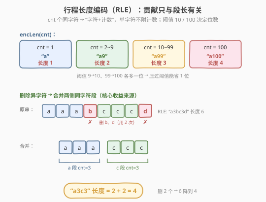
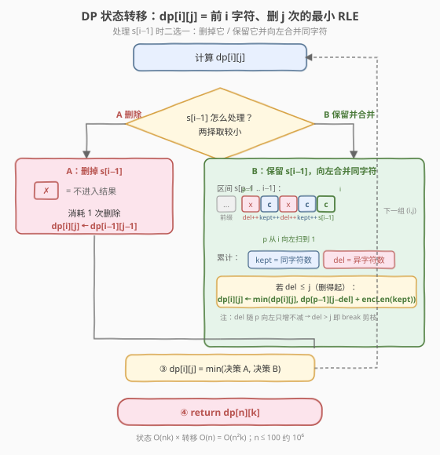
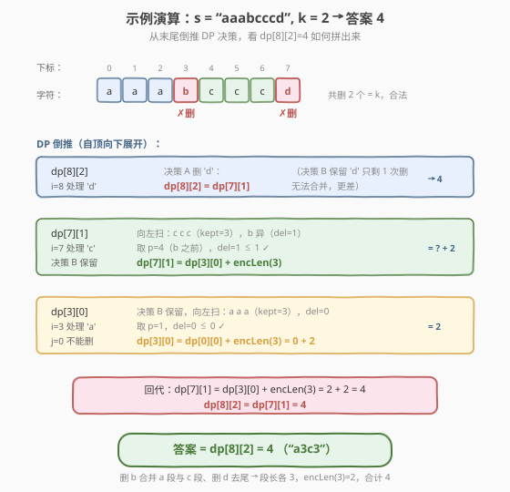

# LeetCode 压缩字符串II 题解

## 1. 题目概述

- **标题 / 题号**：压缩字符串II（#1531，hard）
- **链接**：https://leetcode.cn/problems/string-compression-ii/
- **难度**：困难
- **标签**：字符串、动态规划、区间DP

**题意**：给定字符串 `s` 和整数 `k`，可从中**删除最多 `k` 个字符**，使剩余字符串的**行程长度编码（RLE）长度最小**，返回该最小长度。

RLE 规则：连续相同字符（≥2 个）压缩为「字符 + 计数」，**单个字符不附加计数**。例如 `"aabccc"` → `"a2bc3"`。

**示例 1**：

```text
输入：s = "aaabcccd", k = 2
输出：4
解释：原串 RLE 为 "a3bc3d"（长度 6）；删去 'b' 和 'd' 后得 "aaaccc" → "a3c3"（长度 4）。
```

**示例 2**：

```text
输入：s = "aabbaa", k = 2
输出：2
解释：删去两个 'b'，得 "aaaa" → "a4"（长度 2）。
```

**示例 3**：

```text
输入：s = "aaaaaaaaaaa", k = 0
输出：3
解释：不可删除，"a11" 长度为 3。
```

**约束**：

- `1 <= s.length <= 100`
- `0 <= k <= s.length`
- `s` 仅含小写字母

## 2. 解题思路

### 2.1 暴力思路：枚举删除集合

从 `n` 个位置中选至多 `k` 个删除，方案数为 $\sum_{i=0}^{k}\binom{n}{i}$。`n=100, k=50` 时天文数字，完全不可行。

> 💡 关键转换：**不要枚举「删什么」，而要决策「保留谁」**——把问题变成「在 `s` 上选一个保留子序列，使其 RLE 最短，且删除数 ≤ k」。

### 2.2 核心观察：RLE 长度只取决于「连续同字符段」的长度

一段连续 `cnt` 个相同字符的 RLE 贡献记为 $\text{encLen}(\text{cnt})$，**只与段长有关、与字符本身无关**：

| 段长 cnt | 编码 | 贡献 |
|----------|------|------|
| 1 | `a` | 1 |
| 2 ~ 9 | `a9` | 2 |
| 10 ~ 99 | `a99` | 3 |
| 100 | `a100` | 4 |



两个直觉由此而生：

- **删字符只会让段长变小或消失**，$\text{encLen}$ 单调不增，因此「最多删 k 个」等价于「恰好删 k 个也不劣」——删得多不会更差。
- **删除中间的异字符可把两侧同字符段合并**：`"a2 b a2"` 删掉 `b` 变 `"a4"`，长度 5 → 2。这是本题收益的核心来源。

> ⚠️ 注意 `10`、`100` 两个阈值：把段长从 10 压到 9 能省 1 位，从 100 压到 99 也能省 1 位——决策时这两个「跨阈值」机会最值钱。

### 2.3 区间 DP：保留 s[i] 时向左合并同字符

定义 $dp[i][j]$ = 处理完前 $i$ 个字符 $s[0..i-1]$、**恰好用 $j$ 次删除**时的最小 RLE 长度（1-indexed，$dp[0][\cdot]=0$ 表示空串）。答案为 $dp[n][k]$。

对 $dp[i][j]$ 两种决策：



**决策 A — 删除 $s[i-1]$**：消耗 1 次删除，前 $i-1$ 个字符仍用 $j-1$ 次。

$$dp[i][j] = \min\bigl(dp[i][j],\ dp[i-1][j-1]\bigr) \quad (j \ge 1)$$

**决策 B — 保留 $s[i-1]$**：把 $s[i-1]$ 作为某个「以它结尾的同字符段」的末位。向左扫描 $p$ 从 $i$ 到 $1$，累计：

- `kept` = 区间 $s[p-1..i-1]$ 内**等于 $s[i-1]$** 的字符数（这些会被保留并合并成一段）；
- `del` = 区间内**不等于 $s[i-1]$** 的字符数（必须删除，否则会切断同字符段）。

若 `del ≤ j`，则前 $p-1$ 个字符用 $j-\text{del}$ 次删除，再接上长度为 `kept` 的同字符段：

$$dp[i][j] = \min\Bigl(dp[i][j],\ dp[p-1][j-\text{del}] + \text{encLen}(\text{kept})\Bigr)$$

> 💡 **为何能合并**：删掉区间内所有异字符后，剩下的 `kept` 个 $s[i-1]$ 在最终串中**连续**，构成一段，贡献 $\text{encLen}(\text{kept})$。前缀 $s[0..p-2]$ 与这段之间没有别的保留字符，互不影响。
>
> ⚠️ `del` 随 $p$ 向左移动**单调不增地累积**（区间只扩大不缩小，异字符数只增不减），故 `del > j` 后即可 `break` 剪枝。

### 2.4 算法流程图

```text
初始化 dp[0][*]=0, 其余 = +∞
for i = 1 .. n:
  for j = 0 .. k:
    (A) 若 j>0: dp[i][j] = min(dp[i][j], dp[i-1][j-1])     // 删 s[i-1]
    (B) kept=0, del=0
        for p = i .. 1:                                      // 保留 s[i-1]，向左合并
          若 s[p-1]==s[i-1]: kept++
          否则:              del++
          若 del>j: break                                    // 删不起了，更左只会更多
          dp[i][j] = min(dp[i][j], dp[p-1][j-del] + encLen(kept))
return dp[n][k]
```

### 2.5 示例演算

以 `s = "aaabcccd", k = 2` 为例：



最优解在 $i=8$（处理到末尾 'd'）时取到：

- **删 'd'**（决策 A）：$j$ 用 1 次，转入 $i=7$。
- 在 $i=7$（结尾 'c'）走决策 B，向左扫描到 'c' 段：$s[3]=\,$'b' 删除（del=1），$s[4..6]=\,$'ccc' kept=3，此时 del=1 ≤ 2。
  - 取 $p=4$：前缀 $s[0..2]=$ "aaa" 用 $j=2-1=1$ 次删除 → 但 'aaa' 已是同段，无需删，$dp[3][1]$ 进一步由决策 B 取 'a' 段 kept=3、del=0 得 $\text{encLen}(3)=2$。
  - 接上 'c' 段 $\text{encLen}(3)=2$，合计 $2+2=4$。
- 其中 'b' 在前缀侧被删（合并 'a' 段与 'c' 段之间的间隔），'d' 在末尾被删。

最终 $dp[8][2] = 4$。

## 3. 参考代码

### C++

```cpp
class Solution {
public:
    int getLengthOfOptimalCompression(string s, int k) {
        int n = s.size();
        const int INF = 1e9;
        // dp[i][j] = 前 i 个字符、用 j 次删除的最小 RLE 长度
        vector<vector<int>> dp(n + 1, vector<int>(k + 1, INF));
        for (int j = 0; j <= k; ++j) dp[0][j] = 0;

        for (int i = 1; i <= n; ++i) {
            for (int j = 0; j <= k; ++j) {
                // 决策 A：删除 s[i-1]
                if (j > 0) dp[i][j] = min(dp[i][j], dp[i - 1][j - 1]);
                // 决策 B：保留 s[i-1]，向左合并同字符段
                int kept = 0, del = 0;
                for (int p = i; p >= 1; --p) {
                    if (s[p - 1] == s[i - 1]) ++kept;
                    else                       ++del;
                    if (del > j) break;                 // 删不起，更左只会更多
                    dp[i][j] = min(dp[i][j], dp[p - 1][j - del] + encLen(kept));
                }
            }
        }
        return dp[n][k];
    }
private:
    static int encLen(int cnt) {
        if (cnt <= 1)  return cnt;          // 0->0, 1->1
        if (cnt <= 9)  return 2;
        if (cnt <= 99) return 3;
        return 4;                            // cnt == 100
    }
};
```

### Python

```python
class Solution:
    def getLengthOfOptimalCompression(self, s: str, k: int) -> int:
        n = len(s)

        def enc_len(cnt: int) -> int:
            if cnt <= 1:   return cnt
            if cnt <= 9:   return 2
            if cnt <= 99:  return 3
            return 4

        INF = float('inf')
        dp = [[INF] * (k + 1) for _ in range(n + 1)]
        for j in range(k + 1):
            dp[0][j] = 0

        for i in range(1, n + 1):
            for j in range(k + 1):
                # 决策 A：删除 s[i-1]
                if j > 0:
                    dp[i][j] = min(dp[i][j], dp[i - 1][j - 1])
                # 决策 B：保留 s[i-1]，向左合并同字符段
                kept = del_cnt = 0
                for p in range(i, 0, -1):
                    if s[p - 1] == s[i - 1]:
                        kept += 1
                    else:
                        del_cnt += 1
                    if del_cnt > j:
                        break
                    dp[i][j] = min(dp[i][j], dp[p - 1][j - del_cnt] + enc_len(kept))
        return dp[n][k]
```

## 4. 复杂度分析

| 维度 | 复杂度 | 说明 |
|------|--------|------|
| 时间 | $O(n^2 k)$ | 状态数 $O(nk)$，每次转移向左扫描最多 $O(n)$；`del > j` 剪枝后常数很小，`n=100` 约 $10^6$ 次基本运算 |
| 空间 | $O(nk)$ | 二维 DP 表；可滚动到 $O(k)$（依赖 $p-1$ 行，需保留全部历史行则不能滚动，但可用记搜替代） |

> 💡 `n ≤ 100` 是本题特意给的「DP 甜区」——既不让暴力过的去，又让 $O(n^2 k)$ 恰好可行。

## 5. 扩展：记忆化搜索写法

递归自顶向下更贴近状态定义，思路一致：

```cpp
class Solution {
    int dp[105][105];
    string s;
public:
    int getLengthOfOptimalCompression(string s, int k) {
        this->s = s;
        int n = s.size();
        memset(dp, -1, sizeof(dp));
        function<int(int,int)> dfs = [&](int i, int j) -> int {
            if (i < 0) return 0;          // 空前缀
            if (j < 0) return 1e9;        // 删除超额
            int &res = dp[i][j];
            if (res != -1) return res;
            // A: 删 s[i]
            res = dfs(i - 1, j - 1);
            // B: 保留 s[i]，向左合并
            int kept = 0, del = 0;
            for (int p = i; p >= 0; --p) {
                if (s[p] == s[i]) ++kept;
                else              ++del;
                if (del > j) break;
                res = min(res, dfs(p - 1, j - del) + encLen(kept));
            }
            return res;
        };
        return dfs(n - 1, k);
    }
    static int encLen(int c) {
        if (c <= 1) return c;
        if (c <= 9) return 2;
        if (c <= 99) return 3;
        return 4;
    }
};
```

## 6. 面试要点

**Q：为什么「最多删 k 个」可以直接返回 $dp[n][k]$（恰好删 k 个）？**
> 因为 $\text{encLen}$ 关于段长单调不增：从任一保留子序列再删一字符，段长只减不增，RLE 长度只减不增。所以删到 $k$ 个不会更差，$dp[n][k]$ 即为「至多 k」的最优。

**Q：决策 B 中 `del` 为什么能 `break` 而不是 `continue`？**
> 向左扩大区间时，异字符数 `del` 单调不增地累积（只增不减）。一旦 `del > j`，更左的 $p$ 只会让 `del` 更大，永不可能再 ≤ j，故可安全剪枝。

**Q：为什么不用「段」为单位做 DP，而要逐字符？**
> 段的边界在删除后会动态合并（`a2|b|a2` → `a4`），段数与段长都随删除变化，难以预先固定。逐字符定义状态 $dp[i][j]$ 把「合并」隐式交给向左扫描处理，状态干净。

**Q：`encLen` 的阈值 10 / 100 为什么重要？**
> 跨阈值能省 1 位（9→10 多一位、99→100 多一位）。反向利用：把段长从 10 压到 9、从 100 压到 99 各省 1 位，是删除收益最大的场景，DP 会自动捕捉到。

**Q：能把空间优化到 $O(k)$ 吗？**
> 决策 B 依赖 $dp[p-1][\cdot]$（$p$ 任意），即所有更小的行，故朴素二维表不可滚动。但可改记忆化搜索 + 哈希，或观察到 $p-1 < i$ 全部历史都需要——实测 $n=100$ 时 $O(nk)=10^4$ 内存完全可接受，无需优化。

## 同类练习题

| # | 题目 | 与本题的关联 |
|---|------|-------------|
| 443 | [压缩字符串](https://leetcode.cn/problems/string-compression/) | RLE 基础版，原地模拟压缩，理解 `encLen` 阈值的来源。 |
| 72 | [编辑距离](https://leetcode.cn/problems/edit-distance/) | 字符串上的二维 DP + 删除操作，状态定义范式相通。 |
| 583 | [两个字符串的删除操作](https://leetcode.cn/problems/delete-operation-for-two-strings/) | 删除使两串相等的最少步数，DP 中「删除」决策的对照练习。 |
| 1000 | [合并石头的最低成本](https://leetcode.cn/problems/minimum-cost-to-merge-stones/) | 区间 DP + 段合并，区间内累计代价的思路与本题决策 B 类似。 |
