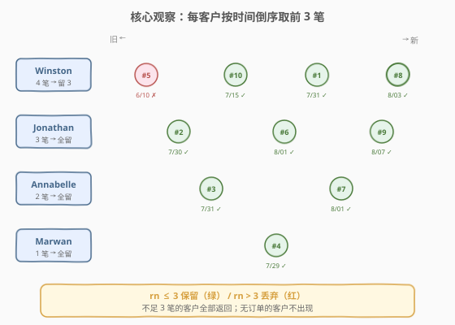
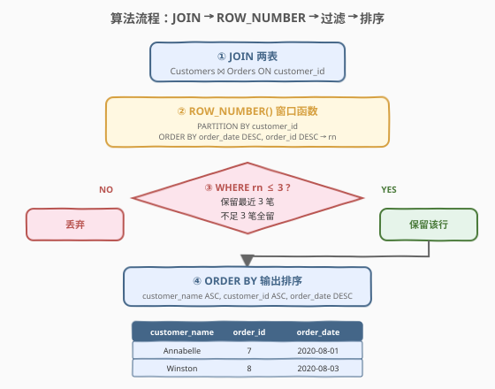
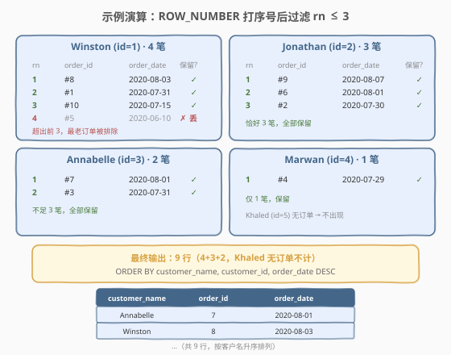

# 最近的三笔订单

- **题目名称**：最近的三笔订单
- **链接**：[1532. 最近的三笔订单 🔒](https://leetcode.cn/problems/the-most-recent-three-orders/)
- **难度**：中等
- **标签**：数据库、SQL、窗口函数、`ROW_NUMBER`、Top-N per group、自连接、`JOIN`、相关子查询、LeetCode 锁题

## 1. 题目概述

给定 `Customers` 与 `Orders` 两张表，编写 SQL 查询，找到**每个用户最近的 3 笔订单**。如果用户的订单少于 3 笔，则返回他的全部订单。

**表结构**：

```text
Table: Customers
+---------------+---------+
| Column Name   | Type    |
+---------------+---------+
| customer_id   | int     |  ← 具有唯一值
| name          | varchar |
+---------------+---------+
该表包含消费者的信息。

Table: Orders
+---------------+---------+
| Column Name   | Type    |
+---------------+---------+
| order_id      | int     |  ← 具有唯一值
| order_date    | date    |
| customer_id   | int     |
| cost          | int     |
+---------------+---------+
该表包含 id 为 customer_id 的消费者的订单信息。
每一个消费者每天一笔订单。
```

**排序要求**：结果按 `customer_name` **升序**排列；若有相同排名，按 `customer_id` **升序**；若仍相同，按 `order_date` **降序**。

**示例 1**：

```text
输入：
Customers 表:
+-------------+-----------+
| customer_id | name      |
+-------------+-----------+
| 1           | Winston   |
| 2           | Jonathan  |
| 3           | Annabelle |
| 4           | Marwan    |
| 5           | Khaled    |
+-------------+-----------+

Orders 表:
+----------+------------+-------------+------+
| order_id | order_date | customer_id | cost |
+----------+------------+-------------+------+
| 1        | 2020-07-31 | 1           | 30   |
| 2        | 2020-07-30 | 2           | 40   |
| 3        | 2020-07-31 | 3           | 70   |
| 4        | 2020-07-29 | 4           | 100  |
| 5        | 2020-06-10 | 1           | 1010 |
| 6        | 2020-08-01 | 2           | 102  |
| 7        | 2020-08-01 | 3           | 111  |
| 8        | 2020-08-03 | 1           | 99   |
| 9        | 2020-08-07 | 2           | 32   |
| 10       | 2020-07-15 | 1           | 2    |
+----------+------------+-------------+------+

输出:
+---------------+-------------+----------+------------+
| customer_name | customer_id | order_id | order_date |
+---------------+-------------+----------+------------+
| Annabelle     | 3           | 7        | 2020-08-01 |
| Annabelle     | 3           | 3        | 2020-07-31 |
| Jonathan      | 2           | 9        | 2020-08-07 |
| Jonathan      | 2           | 6        | 2020-08-01 |
| Jonathan      | 2           | 2        | 2020-07-30 |
| Marwan        | 4           | 4        | 2020-07-29 |
| Winston       | 1           | 8        | 2020-08-03 |
| Winston       | 1           | 1        | 2020-07-31 |
| Winston       | 1           | 10       | 2020-07-15 |
+---------------+-------------+----------+------------+
```

**解释**：

| 客户 | 订单数 | 处理 | 保留 |
|------|--------|------|------|
| Winston | 4 笔 | 排除最老的 `2020-06-10`（order#5） | 3 笔 |
| Annabelle | 2 笔 | 不足 3 笔，全部返回 | 2 笔 |
| Jonathan | 3 笔 | 恰好 3 笔，全部返回 | 3 笔 |
| Marwan | 1 笔 | 不足 3 笔，全部返回 | 1 笔 |
| Khaled | 0 笔 | 无订单，不出现 | 0 笔 |

**约束条件**：

- `customer_id` 是 `Customers` 表具有唯一值的列
- `order_id` 是 `Orders` 表具有唯一值的列
- 每一个消费者**每天一笔订单**（同一客户不同订单的 `order_date` 互不相同）
- 结果按 `customer_name` 升序、`customer_id` 升序、`order_date` 降序排列

> 💡 本题是 SQL **"Top-N per group"招牌题**——核心套路：用 `ROW_NUMBER() OVER (PARTITION BY customer_id ORDER BY order_date DESC)` 给每客户的订单按时间倒序打序号 `rn`，再 `WHERE rn <= 3` 过滤。难点在于理解窗口函数的「分组内排序」语义，以及「不足 N 笔全保留」天然由 `rn` 从 1 连续递增保证。

---

## 2. 解题思路

### 2.1 暴力思路：逐客户取前 3

最直觉的过程式思路：对每个客户，取出其全部订单，按 `order_date` 倒序排序，截取前 3 条。伪代码：

```text
for each customer c:
    orders = SELECT * FROM Orders WHERE customer_id = c.id ORDER BY order_date DESC
    result += orders[:3]   # 取前 3 条，不足 3 条全取
```

但**纯 SQL 没有显式逐行循环与切片**——"按客户分组 + 组内取前 N"需换成集合式表达。早期 MySQL（8.0 之前）没有窗口函数，需用**自连接 + 计数**模拟；MySQL 8.0 起可直接用 `ROW_NUMBER()` 窗口函数一行搞定。

### 2.2 核心观察：ROW_NUMBER 窗口函数 + 过滤 rn ≤ 3



**问题拆解为三个子问题**：

1. **关联客户名**：`Orders` 表只有 `customer_id`，没有 `name`——需 `JOIN Customers` 取 `name` 作为输出列 `customer_name`。

2. **组内排序打序号**：`ROW_NUMBER() OVER (PARTITION BY customer_id ORDER BY order_date DESC, order_id DESC)` 给每个客户的订单按日期倒序编号 1, 2, 3, …。`PARTITION BY customer_id` 表示「每个客户独立编号」；`ORDER BY order_date DESC` 表示「越新的订单序号越小」。

3. **过滤前 3**：`WHERE rn <= 3`。由于 `ROW_NUMBER` 从 1 开始连续递增，**不足 3 笔的客户其 `rn` 最大值即订单数**，天然全部 ≤ 3 被保留——无需额外判断"是否少于 3 笔"。

> 💡 **为何 `ORDER BY` 里加 `order_id DESC`？** 题目保证「每个消费者每天一笔订单」，故同一客户的 `order_date` 互不相同，`order_date DESC` 已能唯一确定顺序。加入 `order_id DESC` 是**防御性写法**：若数据出现同日多单（或题目变体放宽该约束），以 `order_id` 大者为"更近"作为稳定的决胜条件，保证 `ROW_NUMBER` 结果确定。

> ⚠️ **最易错点**：把过滤条件 `rn <= 3` 写在 `WHERE` 中却**直接对原表过滤**。窗口函数在 `WHERE` 之后才执行，故 `rn` 不能直接出现在与窗口函数同层的 `WHERE` 中——必须用 CTE/子查询先算出 `rn`，外层再 `WHERE rn <= 3`。

### 2.3 算法流程图



**逻辑执行步骤**：

| 步骤 | 子句 | 作用 |
|------|------|------|
| ① | `FROM Customers JOIN Orders ON ...` | 关联两表，每行订单获得 `name` |
| ② | `ROW_NUMBER() OVER (PARTITION BY customer_id ORDER BY order_date DESC, order_id DESC)` | 每客户组内按时间倒序打序号 `rn` |
| ③ | `WHERE rn <= 3` | 过滤保留每客户最近 3 笔（不足 3 笔天然全留） |
| ④ | `ORDER BY customer_name, customer_id, order_date DESC` | 按题目要求排序输出 |

> 💡 **SQL 子句执行顺序**：`FROM`（含 `JOIN`/`ON`）→ `WHERE` → `GROUP BY` → `HAVING` → `SELECT`（含窗口函数）→ `ORDER BY` → `LIMIT`。窗口函数在 `SELECT` 阶段计算，**晚于 `WHERE`**——这正是「`rn` 必须放进 CTE/子查询，外层再过滤」的根本原因。

### 2.4 示例演算

以示例 1 数据为例，观察「`ROW_NUMBER` 打序号 → 过滤 `rn ≤ 3`」的逐步过程：



**步骤 ①②：JOIN 两表 + ROW_NUMBER 打序号**

每个客户的订单按 `order_date DESC` 排序后分配 `rn`：

| 客户 | rn | order_id | order_date | 保留? |
|------|----|----------|------------|-------|
| Winston | 1 | #8 | 2020-08-03 | ✓ |
| Winston | 2 | #1 | 2020-07-31 | ✓ |
| Winston | 3 | #10 | 2020-07-15 | ✓ |
| Winston | 4 | #5 | 2020-06-10 | ✗ 丢 |
| Jonathan | 1 | #9 | 2020-08-07 | ✓ |
| Jonathan | 2 | #6 | 2020-08-01 | ✓ |
| Jonathan | 3 | #2 | 2020-07-30 | ✓ |
| Annabelle | 1 | #7 | 2020-08-01 | ✓ |
| Annabelle | 2 | #3 | 2020-07-31 | ✓ |
| Marwan | 1 | #4 | 2020-07-29 | ✓ |

**步骤 ③：WHERE rn <= 3**

Winston 的 `rn=4`（order#5）被丢弃，其余 9 行保留。

**步骤 ④：ORDER BY customer_name, customer_id, order_date DESC**

按客户名升序（Annabelle → Jonathan → Marwan → Winston），每客户内按 `order_date` 降序，得到最终 9 行输出。

> 💡 **"不足 3 笔全保留"为何自动成立？** `ROW_NUMBER` 对每客户从 1 开始连续编号，最大 `rn` 即该客户订单数。若某客户只有 2 笔订单，`rn` 取值 1、2，均 ≤ 3，自动全部保留——无需写 `IF(count < 3)` 之类的额外判断。这是窗口函数解法之所以简洁的根本原因。

---

## 3. 参考代码

### SQL（解法 A：`ROW_NUMBER` 窗口函数，推荐）

```sql
WITH T AS (
    SELECT
        c.name        AS customer_name,
        o.customer_id AS customer_id,
        o.order_id    AS order_id,
        o.order_date  AS order_date,
        ROW_NUMBER() OVER (
            PARTITION BY o.customer_id
            ORDER BY o.order_date DESC, o.order_id DESC
        ) AS rn
    FROM Customers c
    JOIN Orders o ON c.customer_id = o.customer_id
)
SELECT customer_name, customer_id, order_id, order_date
FROM T
WHERE rn <= 3
ORDER BY customer_name ASC, customer_id ASC, order_date DESC;
```

> 💡 **写法要点**：
> - **`JOIN Customers`**：`Orders` 没有 `name`，需关联 `Customers` 取客户名作为 `customer_name`。注意用 `INNER JOIN` 而非 `LEFT JOIN`——`Customers` 中存在但 `Orders` 中无订单的客户（如 Khaled）不应出现，`INNER JOIN` 天然过滤掉无订单客户。
> - **`PARTITION BY customer_id`**：每个客户独立编号，`rn` 在每个客户组内从 1 重新开始。
> - **`ORDER BY order_date DESC, order_id DESC`**：日期倒序（最近在前），`order_id` 作决胜条件。
> - **CTE 包裹 `rn` 再过滤**：窗口函数在 `SELECT` 阶段计算，晚于 `WHERE`，故必须用 CTE/子查询先算 `rn`，外层 `WHERE rn <= 3`。
> - ✓ **最推荐**：语义清晰、性能最优（一次排序），MySQL 8.0+/Pandas/PostgreSQL 通用。

### SQL（解法 B：相关子查询 COUNT，无窗口函数）

```sql
SELECT
    c.name        AS customer_name,
    o.customer_id AS customer_id,
    o.order_id    AS order_id,
    o.order_date  AS order_date
FROM Orders o
JOIN Customers c ON o.customer_id = c.customer_id
WHERE (
    SELECT COUNT(*)
    FROM Orders o2
    WHERE o2.customer_id = o.customer_id
      AND (o2.order_date > o.order_date
           OR (o2.order_date = o.order_date AND o2.order_id > o.order_id))
) < 3
ORDER BY customer_name ASC, customer_id ASC, order_date DESC;
```

> 💡 **解法 B 的思路**：对每条订单 `o`，统计**同一客户中比它更近的订单数**（`o2.order_date > o.order_date`，或同日但 `order_id` 更大）。若该计数 `< 3`，说明 `o` 排在该客户的最近 3 笔之内，保留。
>
> **与解法 A 的区别**：不依赖窗口函数，兼容 MySQL 5.7 等旧版本。但相关子查询对每行订单都执行一次 `COUNT`，最坏 $O(n^2)$；可在 `Orders(customer_id, order_date)` 上建复合索引缓解。语义上「比它近的不到 3 条 ⇔ 它是最近 3 条之一」等价于 `rn <= 3`，是 Top-N 的经典非窗口写法。

### SQL（解法 C：`LEFT JOIN` 自连接 + `GROUP BY` + `HAVING COUNT < 3`）

```sql
SELECT
    c.name        AS customer_name,
    o.customer_id AS customer_id,
    o.order_id    AS order_id,
    o.order_date  AS order_date
FROM Orders o
JOIN Customers c ON o.customer_id = c.customer_id
LEFT JOIN Orders o2
       ON o2.customer_id = o.customer_id
      AND (o2.order_date > o.order_date
           OR (o2.order_date = o.order_date AND o2.order_id > o.order_id))
GROUP BY c.name, o.customer_id, o.order_id, o.order_date
HAVING COUNT(o2.order_id) < 3
ORDER BY customer_name ASC, customer_id ASC, order_date DESC;
```

> 💡 **解法 C 的思路**：把解法 B 的相关子查询换成 `LEFT JOIN` 自连接——对每条订单 `o`，左连接所有"比它更近"的同客户订单 `o2`，按 `o` 分组后 `COUNT(o2.order_id)` 即"比它近的订单数"，`HAVING < 3` 保留最近 3 笔。`LEFT JOIN` 保证无更近订单的行（即 `rn=1` 的最新订单）`COUNT` 为 0 仍保留。写法较解法 B 更"集合化"，但自连接会产生中间笛卡尔积，行数膨胀，性能通常不如解法 A。

### Python（pandas）

```python
import pandas as pd

def the_most_recent_three_orders(customers: pd.DataFrame, orders: pd.DataFrame) -> pd.DataFrame:
    merged = orders.merge(customers, on='customer_id', how='inner')
    merged = merged.sort_values(
        ['customer_id', 'order_date', 'order_id'], ascending=[True, False, False]
    )
    merged['rn'] = merged.groupby('customer_id').cumcount() + 1
    top3 = merged[merged['rn'] <= 3]
    top3 = top3.sort_values(
        ['name', 'customer_id', 'order_date'], ascending=[True, True, False]
    )
    return top3[['name', 'customer_id', 'order_id', 'order_date']].rename(
        columns={'name': 'customer_name'}
    )
```

> 💡 **pandas 对照**：
> - `orders.merge(customers, on='customer_id', how='inner')` 对应 SQL 的 `JOIN Customers`（`inner` 过滤无订单客户）。
> - `.sort_values(['customer_id', 'order_date', 'order_id'], ascending=[True, False, False])` 对应 `PARTITION BY customer_id ORDER BY order_date DESC, order_id DESC`——先按分组键排序，再按组内排序键。
> - `.groupby('customer_id').cumcount() + 1` 对应 `ROW_NUMBER()`——`cumcount` 从 0 开始，+1 即从 1 开始的序号。
> - `merged[rn <= 3]` 对应 `WHERE rn <= 3`。
> - 最后再 `.sort_values(['name', 'customer_id', 'order_date'], ...)` 对应外层 `ORDER BY`。

---

## 4. 复杂度分析

| 维度 | 解法 A（`ROW_NUMBER`） | 解法 B（相关子查询） | 解法 C（`LEFT JOIN` 自连接） |
|------|------------------------|----------------------|-----------------------------|
| **时间** | $O(n \log n)$ | $O(n^2)$（最坏）/ $O(n \log n)$（有索引） | $O(n^2)$ |
| **空间** | $O(n)$ | $O(1)$ 额外 | $O(n^2)$ 中间结果 |
| **是否依赖窗口函数** | 是（MySQL 8.0+） | 否 | 否 |
| **可读性** | ✓ 最清晰 | ✓ 直观 | 一般（自连接易混淆） |
| **推荐度** | ✓ **首选** | ✓ 旧版本备选 | ✗ 性能差，仅作思路对照 |

> - $n$ = `Orders` 表行数
> - **时间**：解法 A 的 `JOIN` $O(n)$ + 组内排序 $O(n \log n)$（各客户订单数 $k_i$，总排序 $O(\sum k_i \log k_i) \le O(n \log n)$）+ 过滤 $O(n)$。解法 B 对每行执行一次相关子查询，最坏 $O(n^2)$；若 `Orders(customer_id, order_date)` 上有复合索引，子查询可走索引范围扫描，降到 $O(n \log n)$。解法 C 自连接中间结果最多 $O(n^2)$ 行。
> - **空间**：解法 A 的 CTE/排序需 $O(n)$ 中间存储；解法 C 的 `LEFT JOIN` 中间结果最坏 $O(n^2)$。
> - **索引优化**：在 `Orders(customer_id, order_date DESC, order_id DESC)` 上建复合索引可让解法 A 的窗口排序直接走索引顺序、解法 B 的子查询走索引范围扫描。

---

## 5. 扩展：最近 n 笔订单的通用解法（进阶）

题目进阶问：**能否写出最近 `n` 笔订单的通用解决方案？**

窗口函数解法天然支持——只需把字面量 `3` 换成参数 `n`：

```sql
WITH T AS (
    SELECT
        c.name        AS customer_name,
        o.customer_id AS customer_id,
        o.order_id    AS order_id,
        o.order_date  AS order_date,
        ROW_NUMBER() OVER (
            PARTITION BY o.customer_id
            ORDER BY o.order_date DESC, o.order_id DESC
        ) AS rn
    FROM Customers c
    JOIN Orders o ON c.customer_id = o.customer_id
)
SELECT customer_name, customer_id, order_id, order_date
FROM T
WHERE rn <= :n          -- 仅此处改动：3 → n
ORDER BY customer_name ASC, customer_id ASC, order_date DESC;
```

> 💡 **通用化要点**：
> - **窗口函数是 Top-N per group 的通用范式**：`PARTITION BY <分组键> ORDER BY <排序键> → rn <= N`。改 `N` 即可，不影响结构。
> - **MySQL 中的参数化**：LeetCode 在线判题不支持用户变量 `@n` 直接嵌入 `WHERE rn <= @n`（且 `@n` 在窗口函数上下文中行为不稳定）。生产环境建议用预处理语句（Prepared Statement）绑定参数，或应用层拼接 SQL。
> - **相关子查询解法 B 同样可通用**：把 `< 3` 改成 `< :n` 即可，但 $O(n^2)$ 复杂度随 `n` 与数据量增长很快，大规模数据仍推荐窗口函数。
> - **更一般的"分组 Top-N"**：若题目改为"每个客户消费金额最高的 3 笔"，只需把 `ORDER BY order_date DESC` 换成 `ORDER BY cost DESC`——同一套 `ROW_NUMBER` 模板适配任意"组内按某指标取前 N"。

---

## 6. 面试要点

1. **为什么 `rn <= 3` 不能直接写在含窗口函数的 `SELECT` 同层的 `WHERE` 中？**

   > SQL 执行顺序为 `WHERE` → `SELECT`（含窗口函数）。窗口函数在 `WHERE` 之后才计算，故 `WHERE` 阶段尚不存在 `rn` 这一列。必须用 CTE 或子查询先计算出 `rn`，再在外层查询的 `WHERE` 中引用 `rn <= 3`。

2. **`ROW_NUMBER` / `RANK` / `DENSE_RANK` 三者区别？本题该用哪个？**

   > - `ROW_NUMBER()`：组内严格唯一递增（1,2,3,4…），即使排序值相同也分配不同序号。
   > - `RANK()`：排序值相同则同序号，并跳过后续号（1,1,3,4…）。
   > - `DENSE_RANK()`：排序值相同则同序号，不跳号（1,1,2,3…）。
   > 本题保证「每客户每天一笔订单」，`order_date` 在组内互不相同，三者结果一致。但**语义上应选 `ROW_NUMBER`**——我们要"前 3 行"，而非"前 3 个名次"，`ROW_NUMBER` 严格保证每客户最多 3 行。若用 `DENSE_RANK` 且出现并列，可能保留超过 3 行。

3. **如何处理"不足 3 笔订单的客户"？**

   > 无需额外处理。`ROW_NUMBER` 对每客户从 1 连续递增，最大 `rn` 即该客户订单数。少于 3 笔时所有 `rn` 均 ≤ 3，自动全部保留。这正是窗口函数解法相比"先 `COUNT` 再判断"的简洁之处。

4. **为什么用 `INNER JOIN` 而非 `LEFT JOIN` 关联 `Customers`？**

   > 题目要求"每个用户的最近三笔订单"，无订单的用户（如 Khaled）没有任何订单行可输出。`INNER JOIN` 只保留有匹配订单的客户，天然排除无订单客户。若误用 `LEFT JOIN`，无订单客户会产生一行 `order_id` 为 `NULL` 的记录，`ROW_NUMBER` 给它 `rn=1`，错误地出现在结果中。

5. **解法 B 中"比它近的订单数 < 3"为何等价于"它是最近 3 笔之一"？**

   > 若某订单 `o` 的"更近订单数"为 `k`，则 `o` 在该客户按时间倒序排列中排第 `k+1` 位（前面有 `k` 个更近的）。`k < 3` ⇔ `k+1 ≤ 3` ⇔ `o` 排在前 3 位。这与 `ROW_NUMBER` 给出的 `rn = k+1`、`rn <= 3` 完全等价，是 Top-N 的经典非窗口实现。

> 💡 **一句话总结**：1532 是 SQL **"Top-N per group"招牌题**——核心模板「`JOIN` 取名 → `ROW_NUMBER() OVER (PARTITION BY customer_id ORDER BY order_date DESC)` 打 `rn` → 外层 `WHERE rn <= 3` → `ORDER BY` 输出」。最大要点：**窗口函数必须放进 CTE/子查询，外层再过滤 `rn`**；"不足 N 笔全保留"由 `rn` 从 1 连续递增天然保证。

---

## 7. 同类练习题

- [1454. 活跃用户 🔒](https://leetcode.cn/problems/active-users/)：`ROW_NUMBER` + `DATE_SUB` 判连续登录，同为窗口函数分组排序骨架，叠加"连续区间"识别
- [184. 部门工资最高的员工](https://leetcode.cn/problems/department-highest-salary/)：`ROW_NUMBER`/`RANK` 取每组最高薪，Top-1 per group 入门题（1532 的 N=1 退化版）
- [185. 部门工资前三高的所有员工 🔒](https://leetcode.cn/problems/department-top-three-salaries/)：`DENSE_RANK` 取每组前 3 高薪，与 1532 几乎同构（分组 Top-3），区别在并列处理用 `DENSE_RANK`
- [1174. 即时食物配送 II 🔒](https://leetcode.cn/problems/immediate-food-delivery-ii/)：`ROW_NUMBER` 求首次订单 → 聚合算比例，共享「`PARTITION BY` 找组内最值」骨架
- [550. 游戏玩法分析 IV 🔒](https://leetcode.cn/problems/game-play-analysis-iv/)：`ROW_NUMBER` 求首次登录 → 判次日留存，同为窗口函数分组排序应用
