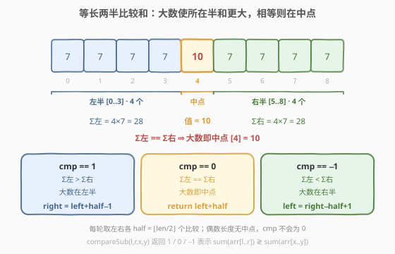
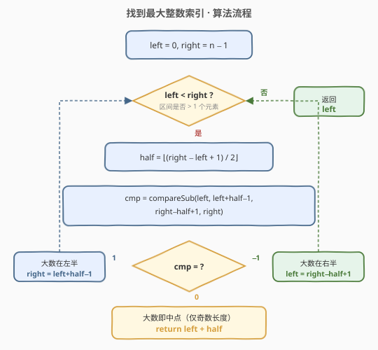
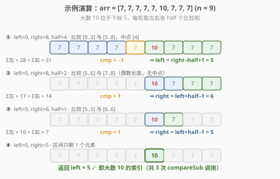

# LeetCode 找到最大整数的索引 题解

## 1. 题目概述

- **标题 / 题号**：找到最大整数的索引（#1533，medium）
- **链接**：https://leetcode.cn/problems/find-the-index-of-the-large-integer/
- **难度**：中等
- **标签**：数组、二分查找、交互

**题意**：给定一个长度为 `n` 的整数数组 `arr`，其中**恰好有一个元素严格最大**，其余 `n − 1` 个元素**彼此相等**。你**不能直接读取数组**，只能通过一个 `ArrayReader` 接口访问它，要求在**尽可能少的查询次数**内返回这个最大元素的下标。

`ArrayReader` 的接口如下：

```text
class ArrayReader {
  public:
    // 比较 arr[l..r] 的元素和 与 arr[x..y] 的元素和
    // 返回  1 : sum(arr[l..r]) > sum(arr[x..y])
    // 返回 -1 : sum(arr[l..r]) < sum(arr[x..y])
    // 返回  0 : 二者相等
    int compareSub(int l, int r, int x, int y);

    // 返回数组长度 n
    int length();
};
```

**示例 1**：

```text
输入：arr = [7, 7, 7, 7, 10, 7, 7, 7, 7]   (n = 9)
输出：4
解释：10 是唯一最大元素，位于下标 4。
```

**示例 2**：

```text
输入：arr = [7, 7, 7, 7, 7, 10, 7, 7, 7]   (n = 9)
输出：5
```

**约束**：

- $2 \le n \le 5 \times 10^5$
- 数组中**恰好一个元素严格最大**，其余元素彼此相等
- `compareSub` 的调用次数**不超过 20 次**

> ⚠️ 这是一道**交互题（Interactive）**：你拿不到整个数组，唯一的信息来源是 `compareSub` 返回的三态比较结果。约束把查询次数压到 $O(\log n)$ 量级，直接排除了线性扫描，必须**二分**。

## 2. 解题思路

### 2.1 暴力思路：逐个查询？

`compareSub` 比较的是**两段区间的元素和**。最朴素的想法是把目标下标 `i` 与每个候选逐一比较——但每次只能比较两段和，无法直接读出单个元素，且调用次数被限制在 20 以内，$O(n)$ 扫描不可行。问题转化为：**如何用一次「区间和比较」排除掉一半候选？**

### 2.2 核心观察：等长两半比较和



设数组中其余元素都等于 `v`，唯一最大元素为 `v + d`（$d > 0$）。把当前搜索区间 `[left, right]`（长度 `len`）切分成**左右各 `half = ⌊len/2⌋` 个**的两段，可能还剩一个**中点**（当 `len` 为奇数时）：

- **左半**：`[left, left+half−1]`，共 `half` 个元素
- **右半**：`[right−half+1, right]`，共 `half` 个元素
- **中点**：`left+half`（仅当 `len` 为奇数时存在，被排除在比较之外）

由于左右两半**元素个数相同**，它们的和只可能因「大数落在哪一半」而产生差异：

| 大数位置 | 左半和 | 右半和 | `compareSub` 返回 |
|----------|--------|--------|-------------------|
| 在左半 | `half·v + d` | `half·v` | `1`（左 > 右） |
| 在右半 | `half·v` | `half·v + d` | `−1`（左 < 右） |
| 在中点（奇数长度） | `half·v` | `half·v` | `0`（相等） |

> 💡 **一句话直觉**：两半元素个数相同，谁里头藏着那个「多出来的大数」，谁的和我就能感知到「重一点」。`compareSub` 返回的正负号直接指出大数在哪一半；若返回 `0`（两边一样重），那大数既不在左也不在右，只能是那个被排除的中点。

由此得到三态转移：

- `cmp == 1`：大数在左半 → `right = left + half − 1`（收缩到左半）
- `cmp == −1`：大数在右半 → `left = right − half + 1`（收缩到右半）
- `cmp == 0`：大数即中点 → 直接返回 `left + half`（仅奇数长度会触发）

> ⚠️ **为什么必须「等长」？** 若两半元素个数不等，和的差异就混入了「个数差」的干扰——左半多一个元素本身就多一份 `v`，无法区分这是大数贡献的还是个数贡献的。**强制两半等长**，使个数差归零，和的差异**唯一**归因于大数的位置。这是本题二分成立的根基。

### 2.3 算法流程图



循环不变量：**最大元素始终落在闭区间 `[left, right]` 内**。每轮把区间长度从 `len` 缩到 `half = ⌊len/2⌋`，严格折半；当 `left == right` 时区间只剩一个元素，它即为答案。

### 2.4 示例演算

以 `arr = [7, 7, 7, 7, 7, 10, 7, 7, 7]`（`n = 9`，大数在下标 5）为例：



| 轮次 | left | right | half | 比较区间 | Σ左 vs Σ右 | cmp | 动作 |
|------|------|-------|------|----------|------------|-----|------|
| 1 | 0 | 8 | 4 | `[0..3]` vs `[5..8]`，中点 `[4]` | 28 vs 31 | −1 | left = 5 |
| 2 | 5 | 8 | 2 | `[5..6]` vs `[7..8]` | 17 vs 14 | 1 | right = 6 |
| 3 | 5 | 6 | 1 | `[5..5]` vs `[6..6]` | 10 vs 7 | 1 | right = 5 |
| 结束 | 5 | 5 | — | — | — | left==right | 返回 5 |

第 1 轮 `len=9` 为奇数，中点 `[4]` 被排除；`28 < 31` 说明大数在右半，`left` 跳到 `5`。第 2、3 轮均为偶数长度（无中点），靠和的大小一路收缩到 `[5,5]`。共 **3 次** `compareSub` 调用。

> 💡 若大数恰好在奇数长度的中点（如示例 1，大数在下标 4），第 1 轮 `cmp == 0` 即直接返回，只需 **1 次** 调用。

## 3. 参考代码

### C++

```cpp
/**
 * // This is the ArrayReader's API interface.
 * // You should not implement it, or speculate about its implementation
 * class ArrayReader {
 *   public:
 *     int compareSub(int l, int r, int x, int y);
 *     int length();
 * };
 */
class Solution {
  public:
    int getIndex(ArrayReader &reader) {
        int left = 0, right = reader.length() - 1;
        while (left < right) {
            int half = (right - left + 1) / 2;
            int cmp = reader.compareSub(left, left + half - 1,
                                        right - half + 1, right);
            if (cmp == 1) {
                right = left + half - 1;      // 大数在左半
            } else if (cmp == -1) {
                left = right - half + 1;      // 大数在右半
            } else {
                return left + half;           // 大数即中点（仅奇数长度）
            }
        }
        return left;
    }
};
```

### Python

```python
# """
# This is ArrayReader's API interface.
# You should not implement it, or speculate about its implementation
# """
# class ArrayReader:
#     def compareSub(self, l: int, r: int, x: int, y: int) -> int:
#         ...
#     def length(self) -> int:
#         ...

class Solution:
    def getIndex(self, reader: 'ArrayReader') -> int:
        left, right = 0, reader.length() - 1
        while left < right:
            half = (right - left + 1) // 2
            cmp = reader.compareSub(left, left + half - 1,
                                    right - half + 1, right)
            if cmp == 1:
                right = left + half - 1       # 大数在左半
            elif cmp == -1:
                left = right - half + 1       # 大数在右半
            else:
                return left + half           # 大数即中点（仅奇数长度）
        return left
```

> 💡 **统一奇偶**：代码无需显式判断 `len` 的奇偶——`half = ⌊len/2⌋` 对奇偶都成立；奇数时中点 `left+half` 被自然排除在左右两半之外，`cmp == 0` 分支兜底返回它；偶数时两半恰好覆盖整个区间，`cmp` 不可能为 `0`，该分支不会触发。一套公式通吃两种情况。

## 4. 复杂度分析

| 维度 | 复杂度 | 说明 |
|------|--------|------|
| 时间复杂度 | $O(\log n)$ | 每轮区间长度 `len → ⌊len/2⌋` 严格折半，共 $\lceil \log_2 n \rceil$ 轮，每轮 1 次 `compareSub` |
| 空间复杂度 | $O(1)$ | 仅 `left` / `right` / `half` / `cmp` 四个变量 |
| 调用次数 | $\le \lceil \log_2 n \rceil \le 19$ | $n \le 5\times10^5$ 时 $\lceil \log_2 n \rceil = 19$，满足「不超过 20 次」的约束 |

> ⚠️ 二分的正确性依赖「大数唯一且其余相等」这一前提：它保证等长两半的和差**纯粹**来自大数位置，不会被其他不相等的元素污染。若去掉该前提（数组任意），仅凭区间和比较无法定位最大值，需要完全不同的思路。

## 5. 扩展：为什么不用「单点查询」型接口？

本题接口是**区间和比较**而非「读取单点值」。若接口改为 `int get(int i)`（直接读下标），则退化成标准二分或线性找最大值，失去交互题的趣味。`compareSub` 的精妙之处在于：**它只给你「谁更重」的方向信号，不给具体数值**，迫使你必须用「等长两半」的技巧把位置信息从和的比较中「蒸馏」出来。

> 💡 这种「用区间聚合比较代替单点读取」的交互设计，与 [374. 猜数字大小](https://leetcode.cn/problems/guess-number-higher-or-lower/) 的 `guess(x)` 返回三态信号同源——都是**用一次三态比较换掉一半搜索空间**，只是 374 比较单点与目标，本题比较两段区间和。

## 6. 面试要点

1. **为什么左右两半必须等长？**

   - 若两半元素个数不等，和差会混入「个数差」的贡献（左半多一个元素就多一份 `v`），无法区分大数贡献的增量与个数贡献的增量。**等长**让个数差归零，和差唯一归因于大数位置，二分才成立。

2. **奇数长度时中点怎么处理？**

   - 取 `half = ⌊len/2⌋`，左右两半各 `half` 个，中点 `left+half` 被**排除在比较之外**。若 `compareSub` 返回 `0`（两半和相等），说明大数既不在左半也不在右半，只能是这个中点，直接返回。返回非 `0` 则按方向收缩，中点被自动丢弃。

3. **偶数长度会出现 `cmp == 0` 吗？**

   - 不会。偶数长度无中点，两半覆盖整个区间，大数必在某一半，和必不相等。`cmp == 0` 分支只在奇数长度触发，故代码无需显式判奇偶也能正确运行。

4. **为什么不会死循环？**

   - 每轮新区间长度为 `half = ⌊len/2⌋ < len`（`len ≥ 2` 时严格缩小）。两个收缩分支 `right = left+half−1` 与 `left = right−half+1` 都把区间压到长度 `half`；`cmp == 0` 分支直接返回。不存在区间不缩小的分支，必然终止。

5. **调用次数能否卡在 20 次以内？**

   - 每轮折半，调用次数 $\le \lceil \log_2 n \rceil$。$n \le 5\times10^5$ 时为 $19 \le 20$，安全。若 $n$ 更大（如 $10^6$），$\lceil \log_2 n \rceil = 20$，恰好打平——此时算法已达信息论下界，无法更优。

## 同类练习题

| # | 题目 | 与本题的关联 |
|---|------|-------------|
| 374 | [猜数字大小](https://leetcode.cn/problems/guess-number-higher-or-lower/) | 交互式二分母题，`guess(x)` 返回三态信号缩区间，与本题 `compareSub` 同为「一次比较换一半空间」范式 |
| 278 | [第一个错误的版本](https://leetcode.cn/problems/first-bad-version/)（[题解](../0201-0300/278_第一个错误的版本.md)） | 单调布尔序列上二分找首个 `true`，三态比较的 lower_bound 谓词版 |
| 1237 | [找出给定方程的正整数解](https://leetcode.cn/problems/find-positive-integer-solution-for-a-given-equation/) | 交互题，给定 `CustomFunction` 接口，利用单调性双指针/二分求解 |
| 153 | [寻找旋转排序数组中的最小值](https://leetcode.cn/problems/find-minimum-in-rotated-sorted-array/)（[题解](../0101-0200/153_寻找旋转排序数组中的最小值.md)） | 与右端点比较缩区间的二分模板，对比「二分结构断点」与本题「二分位置」两种范式 |
| 704 | [二分查找](https://leetcode.cn/problems/binary-search/) | 闭区间二分母题，本题的 `left < right` + 区间折半骨架即源于此 |
