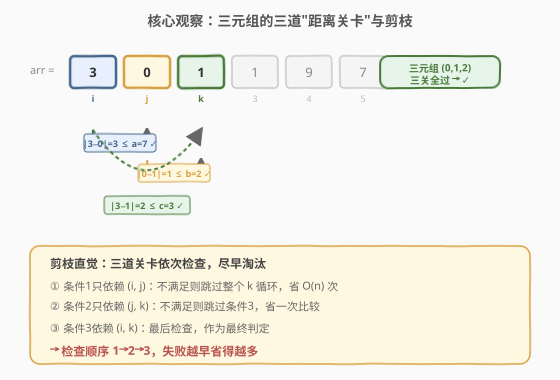
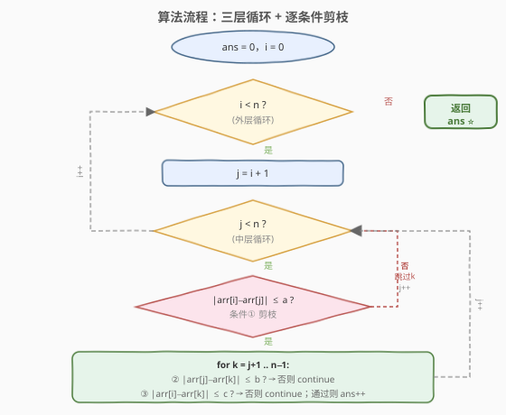

# 统计好三元组

- **题目名称**：统计好三元组
- **链接**：[1534. 统计好三元组](https://leetcode.cn/problems/count-good-triplets/)
- **难度**：简单
- **标签**：数组、枚举、暴力

## 1. 题目概述

给你一个整数数组 `arr`，以及 `a`、`b`、`c` 三个整数。如果三元组 `(arr[i], arr[j], arr[k])` 满足下列全部条件，则认为它是一个**好三元组**：

- `0 <= i < j < k < arr.length`
- `|arr[i] - arr[j]| <= a`
- `|arr[j] - arr[k]| <= b`
- `|arr[i] - arr[k]| <= c`

返回好三元组的数量。

**示例 1**：

```text
输入：arr = [3,0,1,1,9,7], a = 7, b = 2, c = 3
输出：4
解释：4 个好三元组：[(3,0,1), (3,0,1), (3,1,1), (0,1,1)]。
```

**示例 2**：

```text
输入：arr = [1,1,2,2,3], a = 0, b = 0, c = 1
输出：0
解释：不存在满足所有条件的三元组。
```

**约束条件**：

- `3 <= arr.length <= 100`
- `0 <= arr[i] <= 1000`
- `0 <= a, b, c <= 1000`

> 💡 数据规模很小（$n \leq 100$），三重循环 $O(n^3)$ 最多约 $10^6$ 次，完全可过。这是一道典型的「**有序枚举 + 逐条件剪枝**」入门题，关键在于理解三个条件之间的依赖关系，用尽早淘汰的检查顺序减少无效枚举。

---

## 2. 解题思路

### 2.1 暴力思路：三重循环枚举所有三元组

最直观的做法是用三层循环枚举所有满足 $i < j < k$ 的三元组，对每个三元组检查三个绝对值条件，全部满足则计数加一。

```text
ans = 0
for i in 0..n-1:
    for j in i+1..n-1:
        for k in j+1..n-1:
            if |arr[i]-arr[j]| <= a and |arr[j]-arr[k]| <= b and |arr[i]-arr[k]| <= c:
                ans += 1
return ans
```

时间复杂度 $O(n^3)$，对 $n = 100$ 约为 $C(100,3) \approx 1.6 \times 10^5$ 次，轻松通过。问题在于：三个条件的**依赖范围不同**——条件①只涉及 $i$ 和 $j$，与 $k$ 无关。如果把条件①的检查放在最外层（进入 $k$ 循环之前），不满足时可直接跳过整个 $k$ 循环，省去 $O(n)$ 次无效枚举。

### 2.2 核心观察：逐条件剪枝，失败越早省得越多



三个条件的依赖关系如下：

| 条件 | 依赖的下标 | 检查时机 |
|------|-----------|---------|
| ① `|arr[i]-arr[j]| <= a` | 仅 $i, j$ | 进入 $k$ 循环**之前** |
| ② `|arr[j]-arr[k]| <= b` | 仅 $j, k$ | $k$ 循环内，**先于**③ |
| ③ `|arr[i]-arr[k]| <= c` | $i, k$ | $k$ 循环内，**最后**检查 |

关键直觉：**条件越早能判定失败，就越早跳过后续工作**。

- 条件①只依赖 $(i, j)$，在枚举 $k$ 之前就能判定。不满足时直接 `continue` 跳过整个 $k$ 循环——这是最大粒度的剪枝，省 $O(n)$ 次。
- 条件②只依赖 $(j, k)$，比条件③少一个依赖（不需要 $i$），先检查它可以在条件②失败时省去条件③的比较。
- 条件③依赖 $(i, k)$，是最终判定，放在最后。

> 💡 **为什么条件②在条件③之前？** 两者都在 $k$ 循环内，都是 $O(1)$ 比较，但条件②只依赖 $j$ 和 $k$（与 $i$ 无关），逻辑上更"独立"。虽然对常数时间无影响，但遵循"依赖少的先查"的统一原则，代码结构更清晰。实际性能差异可忽略，关键是条件①的外层剪枝。

> ⚠️ **`abs` 的写法**：C++ 中 `abs` 对 `int` 参数使用 `<cstdlib>` 中的版本；若用 `cmath` 的 `fabs` 会有浮点转换开销。Python 的 `abs` 是内置函数，对整数直接返回整数，无此问题。

### 2.3 算法流程图



流程核心是三层嵌套循环，在进入最内层 $k$ 循环前先用条件①做"门禁"——不通过则直接跳到下一个 $j$。最内层依次检查条件②和条件③，任一不满足则 `continue` 跳过当前 $k$。

### 2.4 示例演算

![示例演算：arr=[3,0,1,1,9,7], a=7, b=2, c=3](../images/cgt_example_walkthrough.svg)

以 `arr = [3,0,1,1,9,7], a = 7, b = 2, c = 3` 为例，共 $C(6,3) = 20$ 个三元组：

- **条件① 剪枝**：$(i,j)$ 对 $(1,4)$、$(2,4)$、$(3,4)$ 的 $|\text{arr}[i]-\text{arr}[j]| > 7$，直接跳过各自的 $k$ 循环，省去 3 次枚举。剩余 17 个三元组进入 $k$ 循环。
- **条件② 剪枝**：12 个三元组的 $|\text{arr}[j]-\text{arr}[k]| > 2$（$b=2$ 很紧），在条件②即被淘汰，无需检查条件③。
- **条件③ 剪枝**：三元组 $(0,4,5)$ 即 $(3,9,7)$，$|9-7|=2 \leq 2$ ✓ 过条件②，但 $|3-7|=4 > 3$ ✗ 在条件③被淘汰。
- **全过**：$(0,1,2)$、$(0,1,3)$、$(0,2,3)$、$(1,2,3)$ 共 4 个好三元组 ⭐。

> 💡 本例中 $b = 2$ 非常紧（条件②淘汰了大部分候选），说明三个阈值 $a, b, c$ 的松紧程度会显著影响实际剪枝效果——这也是逐条件剪枝相比"三条件同时判断"的优势所在。

---

## 3. 参考代码

### C++（三重循环 + 逐条件剪枝）

```cpp
class Solution {
  public:
    int countGoodTriplets(vector<int>& arr, int a, int b, int c) {
        int n = arr.size(), ans = 0;
        for (int i = 0; i < n; i++) {
            for (int j = i + 1; j < n; j++) {
                if (abs(arr[i] - arr[j]) > a) continue;  // 条件①：剪掉整个 k 循环
                for (int k = j + 1; k < n; k++) {
                    if (abs(arr[j] - arr[k]) > b) continue;  // 条件②
                    if (abs(arr[i] - arr[k]) > c) continue;  // 条件③
                    ans++;
                }
            }
        }
        return ans;
    }
};
```

### Python

```python
class Solution:
    def countGoodTriplets(self, arr: list[int], a: int, b: int, c: int) -> int:
        n = len(arr)
        ans = 0
        for i in range(n):
            for j in range(i + 1, n):
                if abs(arr[i] - arr[j]) > a:  # 条件①：跳过整个 k 循环
                    continue
                for k in range(j + 1, n):
                    if abs(arr[j] - arr[k]) > b:  # 条件②
                        continue
                    if abs(arr[i] - arr[k]) > c:  # 条件③
                        continue
                    ans += 1
        return ans
```

> 💡 **Python 一行版**（利用生成器表达式，简洁但不推荐面试时首先写出）：
> ```python
> return sum(
>     abs(arr[i] - arr[j]) <= a
>     and abs(arr[j] - arr[k]) <= b
>     and abs(arr[i] - arr[k]) <= c
>     for i in range(n) for j in range(i + 1, n) for k in range(j + 1, n)
> )
> ```
> 此版本将三个条件放在同一 `and` 中，失去了逐条件剪枝的效果（Python 短路求值虽能跳过后续条件，但无法跳过 $k$ 循环本身）。$n \leq 100$ 时性能差异不大，但剪枝版思路更清晰。

---

## 4. 复杂度分析

| 维度 | 复杂度 | 说明 |
|------|--------|------|
| 时间复杂度 | $O(n^3)$ | 最坏情况三重循环，$C(n,3)$ 次枚举；剪枝降低常数但不改变渐进 |
| 空间复杂度 | $O(1)$ | 只用常数个整型变量 |

> 💡 对 $n = 100$，$C(100,3) = 161700$，每次仅 3 次绝对值比较，总计约 $5 \times 10^5$ 次运算，远在时限内。剪枝在实际数据下会将有效枚举次数进一步降低。

---

## 5. 扩展：值域树状数组优化到 $O(n^2 \log V)$

当 $n$ 更大时（如 $n \leq 10^5$），三重循环会超时。利用**值域树状数组**（Fenwick Tree）可将复杂度降到 $O(n^2 \log V)$，其中 $V$ 是值域大小。

**思路**：固定中间下标 $j$，用树状数组维护「$j$ 之前所有 $\text{arr}[i]$ 的值域频次」。对每个 $k > j$，若条件② $|\text{arr}[j]-\text{arr}[k]| \leq b$ 成立，则合法的 $\text{arr}[i]$ 必须同时满足：

$$\text{arr}[i] \in [\text{arr}[j]-a,\ \text{arr}[j]+a] \cap [\text{arr}[k]-c,\ \text{arr}[k]+c]$$

取交集区间 $[\text{lo}, \text{hi}]$，在树状数组上区间查询即可 $O(\log V)$ 得到满足条件的 $i$ 的个数。

```cpp
class Solution {
  public:
    int countGoodTriplets(vector<int>& arr, int a, int b, int c) {
        int n = arr.size(), ans = 0;
        const int V = 1001;
        int bit[V + 1] = {};
        auto update = [&](int i) {
            for (++i; i <= V; i += i & (-i)) bit[i]++;
        };
        auto query = [&](int i) {
            int s = 0;
            for (++i; i > 0; i -= i & (-i)) s += bit[i];
            return s;
        };

        for (int j = 0; j < n; j++) {
            for (int k = j + 1; k < n; k++) {
                if (abs(arr[j] - arr[k]) > b) continue;
                int lo = max({arr[j] - a, arr[k] - c, 0});
                int hi = min({arr[j] + a, arr[k] + c, 1000});
                if (lo <= hi)
                    ans += query(hi) - (lo > 0 ? query(lo - 1) : 0);
            }
            update(arr[j]);  // 把 arr[j] 加入值域，供后续 j 使用
        }
        return ans;
    }
};
```

| 维度 | 复杂度 | 说明 |
|------|--------|------|
| 时间复杂度 | $O(n^2 \log V)$ | 外层 $j$ 遍历 $n$，内层 $k$ 遍历 $n$，每次树状数组查询 $O(\log V)$，$V = 1001$ |
| 空间复杂度 | $O(V)$ | 值域树状数组，$V = 1001$ |

> 💡 **为什么固定 $j$ 而不是固定 $i$？** 条件② $|\text{arr}[j]-\text{arr}[k]| \leq b$ 只依赖 $j$ 和 $k$，固定 $j$ 后对每个 $k$ 只需 $O(1)$ 判断条件②，再用树状数组 $O(\log V)$ 查条件①③的交集。若固定 $i$，则条件②涉及 $j$ 和 $k$ 两个变量，无法用单点值域查询高效解决。**固定"中间变量"是三元组问题的常见优化套路**——中间变量的两侧约束可以分别处理。

> ⚠️ 本题 $n \leq 100$，$O(n^3)$ 完全够用，$O(n^2 \log V)$ 的优化仅作为思路扩展。面试时先写暴力版说清思路，再口头提及优化方向即可。

---

## 6. 面试要点

1. **三个条件的检查顺序为什么是 ①→②→③？**

   - 条件①只依赖 $(i, j)$，在进入 $k$ 循环之前就能判定，不满足时跳过整个 $k$ 循环，剪枝粒度最大。条件②和③都在 $k$ 循环内，条件②依赖 $(j,k)$、条件③依赖 $(i,k)$，先查条件②是因为它"更独立"（不依赖 $i$）。核心原则是**依赖少的先查，能尽早失败**。

2. **剪枝改变了时间复杂度吗？**

   - 渐进复杂度仍是 $O(n^3)$——最坏情况（如 $a, b, c$ 都很大，所有三元组都合法）三重循环照跑。剪枝降低的是**常数因子**：实际数据中条件①能跳过大量无效的 $k$ 循环。对于 $n \leq 100$ 的约束，暴力 + 剪枝已经足够。

3. **如果 $n$ 很大（如 $10^5$）怎么办？**

   - 用值域树状数组优化到 $O(n^2 \log V)$：固定中间下标 $j$，维护「$j$ 之前的值域频次」，对每个合法的 $k$ 用区间查询统计满足条件①和③交集的 $i$ 的个数。前提是值域 $V$ 不能太大（本题 $V \leq 1001$，适合树状数组）。

4. **为什么固定中间变量 $j$ 而不是 $i$ 或 $k$？**

   - 三元组 $(i, j, k)$ 中，条件② $|\text{arr}[j]-\text{arr}[k]| \leq b$ 涉及 $j$ 和 $k$，条件①涉及 $i$ 和 $j$，条件③涉及 $i$ 和 $k$。固定 $j$ 后，条件①的约束转化为对 $\text{arr}[i]$ 的值域限制（$\text{arr}[i] \in [\text{arr}[j]-a, \text{arr}[j]+a]$），条件③同理转化为对 $\text{arr}[i]$ 的值域限制——两者取交集后可用一次区间查询解决。固定 $i$ 或 $k$ 则无法将两个条件都转化为对同一变量的值域约束。

5. **这道题和「三数之和」(15 题) 的枚举有什么区别？**

   - [15. 三数之和](https://leetcode.cn/problems/3sum/) 也是固定一个下标 + 双指针枚举另外两个，但它利用的是**排序后的单调性**（双指针的移动方向由和与目标的大小关系决定）。本题的条件是绝对值不等式，排序后并不产生可直接利用的双指针单调性，因此双指针不适用。但若值域小，可以用值域数据结构（树状数组/前缀和）替代双指针的角色。

---

## 7. 同类练习题

- [15. 三数之和](https://leetcode.cn/problems/3sum/)（[题解](../0001-0100/15_三数之和.md)）：排序 + 双指针枚举三元组，对比本题的绝对值约束与三数之和的求和约束在枚举策略上的差异
- [1512. 好数对的数目](https://leetcode.cn/problems/number-of-good-pairs/)（[题解](../1501-1600/1512_好数对的数目.md)）：二元组计数，本题的退化版（从三元组降到二元组），从 $O(n^3)$ 降到 $O(n^2)$ 再到 $O(n)$ 的思路一脉相承
- [2179. 统计数组中好三元组数目](https://leetcode.cn/problems/count-good-triplets-in-an-array/)：三元组计数进阶版，结合值域树状数组，是本题扩展解法的直接应用
- [2444. 统计定界子数组的数目](https://leetcode.cn/problems/count-subarrays-with-fixed-bounds/)：固定双约束的子数组计数，同为「枚举 + 约束剪枝」范式，从三元组推广到子数组
- [1995. 统计特殊四元组](https://leetcode.cn/problems/count-special-quadruplets/)：四元组枚举 + 哈希优化，从三元组扩展到四元组，暴力 $O(n^4)$ 到 $O(n^3)$ 再到 $O(n^2)$ 的递进
