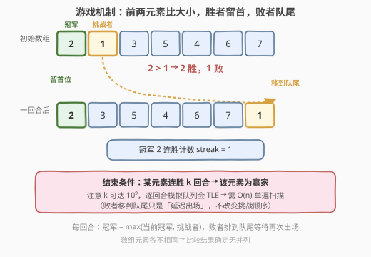
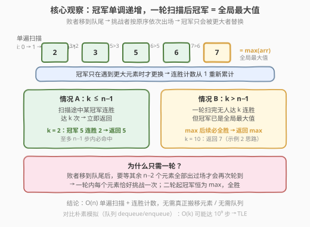
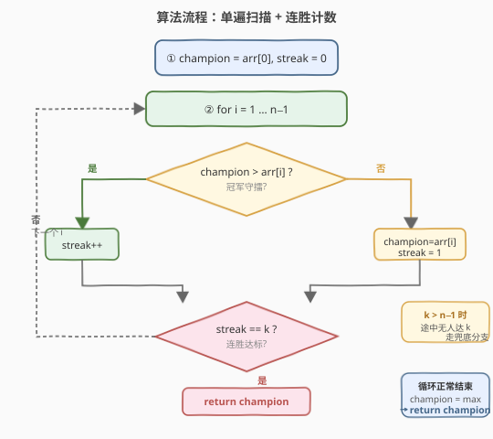

# LeetCode 找出数组游戏的赢家 题解

## 1. 题目概述

- **标题 / 题号**：找出数组游戏的赢家（#1535，medium）
- **链接**：https://leetcode.cn/problems/find-the-winner-of-an-array-game/
- **难度**：中等
- **标签**：数组、模拟、队列

**题意**：给定一个由**不同**整数组成的数组 `arr` 和一个整数 `k`。每回合比较数组前两个元素 `arr[0]` 与 `arr[1]`，较大者**留在位置 0**，较小者**移到数组末尾**。当一个整数**连续赢 `k` 个回合**时游戏结束，返回该整数。题目保证存在赢家。

**示例 1**：

```text
输入：arr = [2,1,3,5,4,6,7], k = 2
输出：5
解释：4 回合后 5 连胜 2 回合，成为赢家。
```

**示例 2**：

```text
输入：arr = [3,2,1], k = 10
输出：3
解释：3 在前 10 个回合中连续获胜。
```

**示例 3**：

```text
输入：arr = [1,9,8,2,3,7,6,4,5], k = 7
输出：9
```

**约束**：

- `2 <= arr.length <= 10^5`
- `1 <= arr[i] <= 10^6`
- `arr` 所含整数**各不相同**
- `1 <= k <= 10^9`

> ⚠️ 注意 `k` 可达 $10^9$，而数组长度至多 $10^5$——逐回合模拟队列会在 `k` 远大于 `n` 时超时，必须找到与 `k` 无关的解法。

## 2. 解题思路

### 2.1 暴力思路：队列逐回合模拟

最直白的做法是**忠实地模拟游戏**：用一个队列（或双端队列）存放数组，每回合取出前两个元素比较，胜者放回首部，败者放回尾部，并维护当前冠军的连胜计数。当连胜达到 `k` 即返回。



问题在于：当 `k` 远大于 `n`（如示例 2 的 `k = 10, n = 3`，或示例 4 的 `k = 10^9, n = 10`）时，需要模拟约 `k` 个回合，时间复杂度 $O(k)$——`k = 10^9` 必然 **TLE**。

> 💡 转换视角：不要关心「队列里元素如何搬移」，而要观察**冠军本身的变化规律**。败者搬到队尾只是「延迟出场」，并不改变挑战者出场的先后顺序——后续挑战者仍是原数组中靠后的元素依次登场。

### 2.2 核心观察：单遍扫描，冠军单调递增



关键洞察有三点：

1. **挑战顺序固定**：每回合败者移到队尾后，下一个挑战者就是原数组中**当前冠军之后、尚未出场过的下一个元素**。换言之，第一轮「扫一遍」数组时，挑战者按 `arr[1], arr[2], …, arr[n-1]` 的顺序依次登场，每个元素恰好挑战一次。

2. **冠军单调递增**：由于元素各不相同，当前冠军只有在遇到**更大**的元素时才会易主。因此冠军序列是**单调不减**的（实际上是严格递增的替换点）。

3. **一轮扫完，冠军即全局最大值**：当遍历到 `arr[n-1]` 后，所有元素都已挑战过一次，此时冠军必为 $\max(\text{arr})$。此后 max 守在首位，对所有后续（被搬到队尾的）元素**全胜**。

由此得到两种情形：

| 情形 | 条件 | 结果 |
|------|------|------|
| **A** | $k \le n - 1$ | 扫描途中某冠军连胜达 $k$，**立即返回**（至多 $n - 1$ 步内命中） |
| **B** | $k > n - 1$ | 一轮扫完无人达 $k$ 连胜，但冠军已是 $\max(\text{arr})$，后续全胜 → **返回 $\max$** |

> 💡 两种情形可统一处理：单遍扫描维护 `champion` 与 `streak`，途中 `streak == k` 就返回；若循环正常结束，直接返回 `champion`（此时它就是全局最大值）。无需显式判断 `k` 与 `n` 的大小关系。

### 2.3 算法流程图



### 2.4 示例演算

以示例 1 `arr = [2,1,3,5,4,6,7], k = 2` 为例：

![示例演算：arr = [2,1,3,5,4,6,7], k = 2](../images/1535_example_walkthrough.svg)

| 步骤 `i` | 挑战者 `arr[i]` | 比较 | 冠军 | 连胜 |
|----------|----------------|------|------|------|
| 初始 | — | `champion = arr[0]` | 2 | 0 |
| `i = 1` | 1 | $2 > 1$ → 守擂 | 2 | 1 |
| `i = 2` | 3 | $2 < 3$ → 易主 | 3 | 1 |
| `i = 3` | 5 | $3 < 5$ → 易主 | 5 | 1 |
| `i = 4` | 4 | $5 > 4$ → 守擂 | 5 | **2 = k** ✓ |

第 4 步连胜达到 `k = 2`，立即返回 `5`。注意此时还未遍历到 `arr[5] = 6`、`arr[6] = 7`——但 `5` 已先达成连胜条件，无需继续。

> 💡 若把 `k` 改为 `7`（即示例 3 的思路，$k > n - 1 = 6$）：扫描完整个数组后冠军变为 `7 = max(arr)`，连胜为 `1`（最后一个易主点），未达 `k`，走兜底返回 `7`。

## 3. 参考代码

### C++

```cpp
class Solution {
  public:
    int getWinner(vector<int>& arr, int k) {
        int champion = arr[0];
        int streak = 0;
        for (int i = 1; i < (int)arr.size(); ++i) {
            if (champion > arr[i]) {
                ++streak;                 // 守擂成功，连胜 +1
            } else {
                champion = arr[i];         // 易主
                streak = 1;                // 新冠军首胜
            }
            if (streak == k) return champion;
        }
        return champion;                   // 兜底：冠军已是 max(arr)
    }
};
```

### Python

```python
class Solution:
    def getWinner(self, arr: List[int], k: int) -> int:
        champion = arr[0]
        streak = 0
        for i in range(1, len(arr)):
            if champion > arr[i]:
                streak += 1                # 守擂成功
            else:
                champion = arr[i]          # 易主
                streak = 1                 # 新冠军首胜
            if streak == k:
                return champion
        return champion                    # 兜底：冠军已是 max(arr)
```

> 💡 **为什么 `streak` 初始化为 `0` 而新冠军易主时设为 `1`？** 因为「易主」本身意味着新冠军刚刚赢下了这一回合（击败了旧冠军），所以连胜从 1 起算。而初始 `arr[0]` 还未赢过任何回合，故 `streak = 0`，第一次守擂成功后变为 1。

## 4. 复杂度分析

| 维度 | 复杂度 | 说明 |
|------|--------|------|
| 时间复杂度 | $O(n)$ | 至多遍历数组一次（$n - 1$ 次比较），与 $k$ 无关 |
| 空间复杂度 | $O(1)$ | 仅用 `champion` / `streak` 两个变量，无队列无额外数组 |

> ⚠️ 朴素队列模拟为 $O(k)$ 时间、$O(n)$ 空间，在 $k = 10^9$ 时不可行。本解法把复杂度从「依赖 $k$」降为「只依赖 $n$」，是本题的关键优化。

## 5. 扩展：朴素队列模拟（对照理解）

为了直观感受「为什么单遍扫描等价于队列模拟」，下面给出朴素版代码。它忠实地搬移元素，逻辑清晰但会超时：

```cpp
// 朴素模拟（会 TLE，仅作对照）
int getWinnerBrute(vector<int>& arr, int k) {
    deque<int> q(arr.begin(), arr.end());
    int champion = q.front(); q.pop_front();
    int streak = 0;
    while (streak < k) {
        int challenger = q.front(); q.pop_front();
        if (champion > challenger) {
            q.push_back(challenger);      // 败者队尾
            ++streak;
        } else {
            q.push_back(champion);        // 旧冠军队尾
            champion = challenger;        // 新冠军
            streak = 1;
        }
    }
    return champion;
}
```

对照可发现：朴素版每次把败者 push 到队尾，但**下一回合的挑战者永远是 `q.front()`**——在第一轮中它恰好等价于原数组的下一个元素。只有当队列完整轮转一圈后，败者才会再次到达队首。而此时冠军已是 `max(arr)`，后续全胜——所以第二轮以后的模拟全是「无用功」，单遍扫描即可覆盖所有有效信息。

> 💡 这是一种典型的**「模拟剪枝」**思想：识别出模拟过程中**状态不再变化**的部分（冠军恒为 max 后的全胜），提前终止。

## 6. 面试要点

1. **为什么只需一轮扫描？**

   - 败者移到队尾后，要等其余 $n - 2$ 个元素全部出场完毕才会再次轮到。因此第一轮中每个元素按原序恰好挑战一次；从第二轮起，冠军恒为 $\max(\text{arr})$，对所有元素全胜。所以有效信息全在第一轮，$O(n)$ 足够。

2. **`k > n - 1` 时怎么办？**

   - 一轮扫完后冠军已是全局最大值，它将赢下之后的所有回合。题目保证存在赢家，故此时答案就是 $\max(\text{arr})$。代码中体现为循环正常结束后 `return champion`（此时 `champion == max`）。

3. **`streak` 的初始化和更新规则？**

   - 初始 `champion = arr[0], streak = 0`（还未比过）。守擂成功 `streak++`；易主时 `streak = 1`（新冠军这一回合已经赢了）。每次更新后立即检查 `streak == k`。

4. **元素各不相同这个条件重要吗？**

   - 重要。它保证了每次比较都有确定的胜者，冠军替换是严格递增的。若允许相等，则需要约定相等的处理规则（如平局是否计入连胜），题目会复杂化。

5. **能否不用遍历，直接返回 `max(arr)`？**

   - 仅当 $k \ge n - 1$ 时可以直接返回 $\max$。当 $k < n - 1$ 时，赢家未必是全局最大值（如示例 1 中 `max = 7` 但答案是 `5`），必须扫描找出首个连胜达 $k$ 的冠军。

## 同类练习题

| # | 题目 | 与本题的关联 |
|---|------|-------------|
| 918 | [环形子数组的最大和](https://leetcode.cn/problems/maximum-sum-circular-subarray/) | 环形结构上的最值问题，同样需要识别「环形」带来的状态复用，避免朴素模拟 |
| 2073 | [买票需要的时间](https://leetcode.cn/problems/time-needed-to-buy-tickets/) | 队列模拟，但可观察出无需真正搬移元素、按位置分类计数即可 |
| 1700 | [无法吃午餐的学生数量](https://leetcode.cn/problems/number-of-students-unable-to-eat-lunch/) | 队列模拟题，关键观察是「学生排队顺序不影响最终结果」，只需统计偏好计数 |
| 387 | [字符串中的第一个唯一字符](https://leetcode.cn/problems/first-unique-character-in-a-string/) | 单遍扫描 + 计数，体现「一趟遍历提取有效信息」的通用思路 |
| 239 | [滑动窗口最大值](https://leetcode.cn/problems/sliding-window-maximum/) | 维护窗口内最值并处理「过期」元素，与本题「冠军易主」思想有呼应 |
