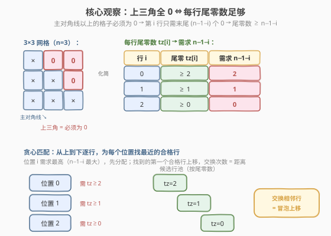
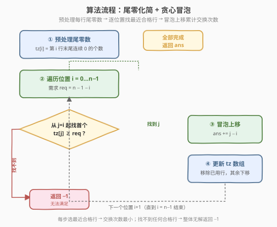

# LeetCode 排布二进制网格的最少交换次数 题解

## 1. 题目概述

- **标题 / 题号**：排布二进制网格的最少交换次数（#1536，medium）
- **链接**：https://leetcode.cn/problems/minimum-swaps-to-arrange-a-binary-grid/
- **难度**：中等
- **标签**：贪心、数组、模拟

**题意**：给定一个 $n \times n$ 的二进制网格 `grid`，每次操作可以选择**相邻两行**进行交换。一个符合要求的网格需要满足**主对角线以上的格子全部为 0**（主对角线指从 $(1,1)$ 到 $(n,n)$，即 0 下标下的 `(0,0)` 到 `(n-1,n-1)`）。返回使网格满足要求的**最少操作次数**；若无法满足则返回 $-1$。

**示例 1**：

```text
输入：grid = [[0,0,1],[1,1,0],[1,0,0]]
输出：3
解释：交换行 2 上移到第 0 行（2 次），再交换行 2 上移到第 1 行（1 次），共 3 次。
```

**示例 2**：

```text
输入：grid = [[0,1,1,0],[0,1,1,0],[0,1,1,0],[0,1,1,0]]
输出：-1
解释：所有行相同，尾零数都为 1，无法满足第 0 行需要 3 个尾零的要求。
```

**示例 3**：

```text
输入：grid = [[1,0,0],[1,1,0],[1,1,1]]
输出：0
解释：网格已经满足要求，无需交换。
```

**约束**：

- `n == grid.length`
- `n == grid[i].length`
- `1 <= n <= 200`
- `grid[i][j]` 要么是 `0` 要么是 `1`

> 💡 关键在于把「上三角全 0」的二维约束压缩成每行的**尾零数**这一一维指标，再转化为「重排一维数组使每个位置满足阈值」的经典贪心问题。

## 2. 解题思路

### 2.1 暴力思路：枚举行的全排列？

最朴素的设想是枚举行的所有排列（$n!$ 种），对每种排列检查是否满足上三角全 0，并计算从初始状态到该排列的最少相邻交换次数（等于逆序对数）。但 $n \le 200$ 时 $n!$ 天文数字，完全不可行；而且计算逆序对也需要额外开销。

> 💡 转换视角：不必枚举排列，而要**抓住每行的本质属性**——上三角全 0 只取决于每行末尾有多少个连续的 0。把网格压缩成一维后，贪心地逐行分配即可。

### 2.2 核心观察：尾零化简 + 贪心匹配



**第一步：二维约束压缩为一维尾零数。**

对于最终位于位置 $i$（0 下标）的行，其上三角格子是第 $i+1, i+2, \ldots, n-1$ 列——恰好是该行**末尾的 $n-1-i$ 个格子**。只要这 $n-1-i$ 个格子全为 0，该行就合法，与对角线及左下角的值无关。

因此定义：

$$\text{tz}[i] = \text{第 } i \text{ 行末尾连续 } 0 \text{ 的个数}$$

行 $i$ 能放在位置 $p$ 的充要条件是 $\text{tz}[i] \ge n - 1 - p$。

**第二步：相邻交换 = 冒泡，距离即代价。**

每次只能交换相邻两行，把某行从位置 $j$ 移到位置 $i$（$j > i$）需要 $j - i$ 次相邻交换，与冒泡排序完全一致。问题等价于：**给一维数组 `tz` 重新排列，使位置 $p$ 的元素 $\ge n-1-p$，最小化总冒泡距离。**

**第三步：贪心——从需求最高的位置开始，选最近的合格行。**

按位置 $p = 0, 1, \ldots, n-1$ 从上到下处理（位置 0 需求 $n-1$ 最高，位置 $n-1$ 需求 0 最低）。对每个位置 $p$，从剩余行中选**下标最小**（离 $p$ 最近）且 $\text{tz} \ge n-1-p$ 的行，冒泡上移到 $p$。

> 💡 **贪心正确性（交换论证）**：假设最优解在位置 $p$ 选了较远的行 $r_2$ 而非最近的合格行 $r_1$，则 $r_1$ 必被用在某个更靠下的位置 $q > p$。交换 $r_1, r_2$ 的分配（$r_1$ 给 $p$、$r_2$ 给 $q$）：$r_1$ 离 $p$ 更近，代价不增；$r_2$ 离 $q$ 更远，但 $r_2$ 原本要从 $r_1$ 上方经过移到 $p$，现在改为移到 $q$，总位移不增。故存在一个选最近合格行的最优解。

> ⚠️ **找不到合格行 ≠ 一定无解？** 严格地，若位置 $p$ 在剩余行中找不到 $\text{tz} \ge n-1-p$ 的行，则**整体无解**返回 $-1$。因为位置 $p$ 的需求 $n-1-p$ 是剩余位置中最高的，剩余行连这个都满足不了，更不可能满足任何位置。这是「需求单调递减」带来的天然不变式。

### 2.3 算法流程图



流程核心是「预处理 + 逐位置贪心」两阶段：

1. **预处理**：扫描每行从右向左数连续 0，得到 `tz[i]`。
2. **贪心主循环**：对 $p = 0 \ldots n-1$，从 $j = p$ 起线性扫描找首个 $\text{tz}[j] \ge n-1-p$；找到则 `ans += j - p` 并把该行从 `tz` 中「抽出」（数组前移）；找不到则立即返回 $-1$。

### 2.4 示例演算

![示例演算：grid = [[0,0,1],[1,1,0],[1,0,0]]](../images/1536_example_walkthrough.svg)

以示例 1 `grid = [[0,0,1],[1,1,0],[1,0,0]]`，$n = 3$ 为例。先算尾零数：

| 行 | 内容 | 末尾连续 0 | tz |
|----|------|-----------|-----|
| 0 | `[0,0,1]` | 末位是 1，断 | 0 |
| 1 | `[1,1,0]` | 末位 0，前一位 1，断 | 1 |
| 2 | `[1,0,0]` | 末两位 0，前一位 1，断 | 2 |

初始 `tz = [0, 1, 2]`，逐位置贪心：

| 步骤 | 位置 $p$ | 需求 $n-1-p$ | 扫描 | 选定 $j$ | 冒泡距离 | 交换后 tz | ans |
|------|---------|-------------|------|---------|---------|-----------|-----|
| ① | 0 | 2 | tz[0]=0✗, tz[1]=1✗, tz[2]=2✓ | 2 | 2 | `[2, 0, 1]` | 2 |
| ② | 1 | 1 | tz[1]=0✗, tz[2]=1✓ | 2 | 1 | `[2, 1, 0]` | 3 |
| ③ | 2 | 0 | tz[2]=0✓ | 2 | 0 | `[2, 1, 0]` | 3 |

最终行顺序为 `[原行2, 原行1, 原行0]` = `[[1,0,0],[1,1,0],[0,0,1]]`，上三角格子 `(0,1)(0,2)(1,2)` 全为 0，合法。**答案 = 3**。

> 💡 步骤 ① 中位置 0 需求最高（要 2 个尾零），只有原行 2 满足，必须把它从底部冒泡到顶部——这是「需求最高者优先」的典型体现。若此时没有任何行满足，直接返回 $-1$（如示例 2）。

## 3. 参考代码

### C++

```cpp
class Solution {
  public:
    int minSwaps(vector<vector<int>>& grid) {
        int n = grid.size();
        vector<int> tz(n);
        for (int i = 0; i < n; ++i) {
            int cnt = 0;
            for (int j = n - 1; j >= 0 && grid[i][j] == 0; --j) cnt++;
            tz[i] = cnt;
        }

        int ans = 0;
        for (int p = 0; p < n; ++p) {
            int req = n - 1 - p;
            int j = p;
            while (j < n && tz[j] < req) ++j;
            if (j == n) return -1;
            ans += j - p;
            int chosen = tz[j];
            tz.erase(tz.begin() + j);
            tz.insert(tz.begin() + p, chosen);
        }
        return ans;
    }
};
```

### Python

```python
class Solution:
    def minSwaps(self, grid: List[List[int]]) -> int:
        n = len(grid)
        tz = []
        for row in grid:
            cnt = 0
            for j in range(n - 1, -1, -1):
                if row[j] == 0:
                    cnt += 1
                else:
                    break
            tz.append(cnt)

        ans = 0
        for p in range(n):
            req = n - 1 - p
            j = p
            while j < n and tz[j] < req:
                j += 1
            if j == n:
                return -1
            ans += j - p
            tz.insert(p, tz.pop(j))
        return ans
```

> 💡 **数组维护技巧**：找到行 $j$ 后用 `erase + insert`（C++）或 `pop + insert`（Python）把它移到位置 $p$，保证后续扫描从 $p+1$ 起仍在「剩余行」上进行。也可换成标记数组跳过已用行，避免 $O(n)$ 搬移（见第 5 节）。

## 4. 复杂度分析

| 维度 | 复杂度 | 说明 |
|------|--------|------|
| 时间复杂度 | $O(n^2)$ | 预处理 $O(n^2)$；主循环 $n$ 轮，每轮扫描 + 搬移各 $O(n)$ |
| 空间复杂度 | $O(n)$ | 尾零数组 `tz` |

> 💡 对 $n \le 200$，$n^2 = 4 \times 10^4$，常数极小，远在时限内。瓶颈在主循环的线性扫描与数组搬移，二者同阶。

## 5. 扩展：避免搬移的「已用标记」写法

上面的 `erase + insert` 每轮搬移 $O(n)$，虽不影响整体 $O(n^2)$，但常数偏大。可改用**布尔标记数组**跳过已用行，避免物理搬移：

### C++

```cpp
class Solution {
  public:
    int minSwaps(vector<vector<int>>& grid) {
        int n = grid.size();
        vector<int> tz(n);
        for (int i = 0; i < n; ++i) {
            int cnt = 0;
            for (int j = n - 1; j >= 0 && grid[i][j] == 0; --j) cnt++;
            tz[i] = cnt;
        }

        vector<bool> used(n, false);
        int ans = 0;
        for (int p = 0; p < n; ++p) {
            int req = n - 1 - p;
            int j = 0, passed = 0;
            while (j < n) {
                if (used[j]) { j++; continue; }
                if (tz[j] >= req) break;
                j++; passed++;
            }
            if (j == n) return -1;
            ans += passed;          // 等价于 j 在剩余行中的相对位置 - p
            used[j] = true;
        }
        return ans;
    }
};
```

| 写法 | 时间 | 空间 | 特点 |
|------|------|------|------|
| `erase + insert` | $O(n^2)$ | $O(n)$ | 直观，数组始终是「剩余行」 |
| 已用标记 | $O(n^2)$ | $O(n)$ | 无搬移，常数更小；`passed` 记录跳过的未用行数即冒泡距离 |

> ⚠️ 已用标记写法中，`passed` 统计的是「未使用的、不满足当前需求的行数」，正好等于把选定行冒泡到当前位置 $p$ 需要经过的未用行数——即真实交换次数。注意不要把已用行算进 `passed`，它们已不在候选池中。

## 6. 面试要点

1. **为什么能把二维网格压缩成尾零数？**

   - 最终位于位置 $i$ 的行，上三角格子恰好是该行末尾 $n-1-i$ 个。只要这 $n-1-i$ 个为 0 即合法，与行内其它位置的值无关。所以每行只需记录「末尾连续 0 的个数」这一标量，问题降维到一维数组重排。

2. **贪心为什么从需求最高的位置（$p=0$）开始？**

   - 位置 $p=0$ 需求 $n-1$ 最高，可选行最少；若它都满足不了，整体无解。先处理高需求位置能**尽早暴露无解**，且高需求行「向下兼容」（满足高需求的行必满足低需求位置），先分配不浪费资源。需求随 $p$ 单调递减是不变式的基础。

3. **为什么选「最近的合格行」是最优的？**

   - 交换论证：若最优解在位置 $p$ 选了较远的 $r_2$ 而非最近的合格 $r_1$，把 $r_1$ 改配给 $p$、$r_2$ 配给 $r_1$ 原本的位置，总位移不增。故存在选最近合格行的最优解。直觉上：越早用掉近处的合格行，远处的行留给后续低需求位置，距离代价最小。

4. **何时返回 $-1$？**

   - 某位置 $p$ 在剩余行中找不到 $\text{tz} \ge n-1-p$ 的行时立即返回 $-1$。因为 $n-1-p$ 是剩余位置中最高需求，连它都满足不了则必然无解。也可在预处理后直接判：若「尾零数 $\ge k$」的行数对每个 $k=0\ldots n-1$ 都不少于 $n-k$，则有解，但贪心过程中自然判定更简洁。

5. **相邻交换次数为什么等于 $j - p$？**

   - 只能交换相邻两行，把行从位置 $j$ 移到位置 $i$（$j > i$）必须依次与前面 $j - i$ 行交换，恰如冒泡排序中一个元素的上浮步数。总交换次数 = 各行上浮距离之和。

## 同类练习题

| # | 题目 | 与本题的关联 |
|---|------|-------------|
| 1850 | [邻位交换的最小次数](https://leetcode.cn/problems/minimum-adjacent-swaps-to-reach-the-kth-smallest-number/) | 相邻交换把数字串变为第 k 小排列，求最少相邻交换次数——同样是「目标排列 + 逆序对/冒泡距离」的贪心计数，承接本题的相邻交换代价模型 |
| 1535 | [找出数组游戏的赢家](https://leetcode.cn/problems/find-the-winner-of-an-array-game/) | 数组模拟 + 贪心，同为本区间的高频中等题，对比「逐位置贪心」与「队列模拟」两种思路 |
| 945 | [使数组唯一的最小增量](https://leetcode.cn/problems/minimum-increment-to-make-array-unique/) | 贪心 + 排序，使每个元素唯一的最小代价——与本题同为「逐位置贪心 + 满足阈值」范式，但操作是增量而非交换 |
| 1963 | [使字符串平衡的最小交换次数](https://leetcode.cn/problems/minimum-number-of-swaps-to-make-the-string-balanced/) | 括号串平衡的最小相邻交换，贪心匹配最近合法位置，思路与本题「找最近合格行」高度同构 |
| 801 | [使序列递增的最小交换次数](https://leetcode.cn/problems/minimum-swaps-to-make-sequences-increasing/) | DP 求最小交换使两序列递增，对比「贪心可解」与「需 DP」的判定边界——本题有单调不变式可贪心，801 需状态 DP |
