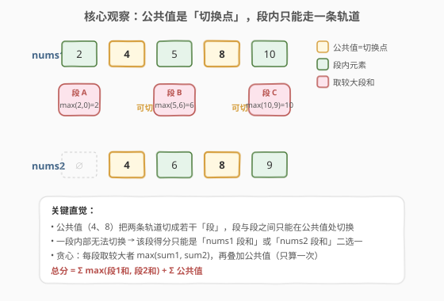
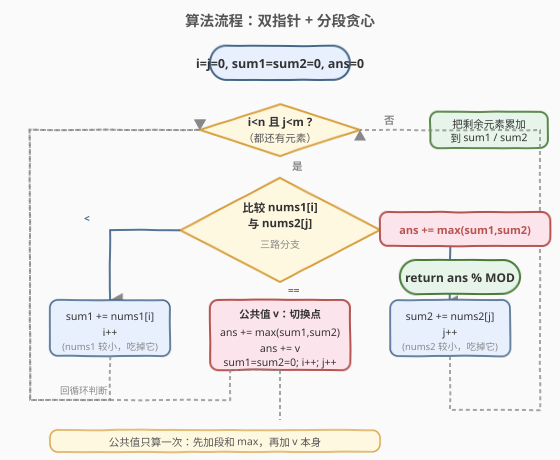

# 最大得分

- **题目名称**：最大得分
- **链接**：[1537. 最大得分](https://leetcode.cn/problems/get-the-maximum-score/)
- **难度**：困难
- **标签**：数组、双指针、贪心、动态规划

## 1. 题目概述

给定两个 **有序** 且数组内元素互不相同的数组 `nums1` 和 `nums2`。一条**合法路径**定义如下：

- 选择 `nums1` 或 `nums2` 开始遍历（从下标 0 处开始）。
- 从左到右遍历当前数组。
- 遇到两个数组中都存在的值时，可以切换到另一个数组对应数字处继续遍历（但路径中重复数字只统计一次）。

**得分** = 合法路径中不同数字的和。求所有合法路径中的**最大得分**，结果对 $10^9 + 7$ 取余。

**示例 1**：

```text
输入：nums1 = [2,4,5,8,10], nums2 = [4,6,8,9]
输出：30
解释：最大得分路径为 [2,4,6,8,10]，得分 2+4+6+8+10 = 30。
```

**示例 2**：

```text
输入：nums1 = [1,3,5,7,9], nums2 = [3,5,100]
输出：109
解释：最大得分路径为 [1,3,5,100]，得分 1+3+5+100 = 109。
```

**示例 3**：

```text
输入：nums1 = [1,2,3,4,5], nums2 = [6,7,8,9,10]
输出：40
解释：两数组无公共值，直接取和较大的整条数组 [6,7,8,9,10]。
```

**约束条件**：

- $1 \leq \text{nums1.length}, \text{nums2.length} \leq 10^5$
- $1 \leq \text{nums1}[i], \text{nums2}[i] \leq 10^7$
- `nums1` 和 `nums2` 都是严格递增的数组。

> 💡 两个数组各自严格递增且无重复——这意味着它们天然有序，**双指针归并**是遍历两者的最优骨架；而「公共值」是唯一能切换轨道的位置，本题的所有技巧都围绕「公共值把路径切成若干独立段」这一结构展开。

---

## 2. 解题思路

### 2.1 暴力思路：枚举所有切换组合

每个公共值处都有「切换 / 不切换」两种选择。若有 $k$ 个公共值，则共有 $2^k$ 种合法路径（每段选 nums1 或 nums2）。暴力做法是枚举所有 $2^k$ 种组合，对每种组合累加路径得分取最大值，时间复杂度 $O(2^k \cdot (n+m))$。

当 $k$ 较大时（最坏 $k = \min(n,m) \approx 10^5$）指数爆炸，不可行。需要利用「**段与段之间相互独立**」的结构把指数问题降为线性。

### 2.2 核心观察：公共值是切换点，分段独立贪心



**关键直觉**：公共值（两个数组的交集）把两条轨道切成若干「段」。在一段内部（两个相邻公共值之间），你**无法切换**轨道——只能从头到尾走 nums1 的这段，或走 nums2 的这段。只有到达公共值时才有机会换轨。

由此得到三个推论：

1. **段内得分二选一**：第 $r$ 段的得分只能是「nums1 在该段的元素和 $S_1^{(r)}$」或「nums2 在该段的元素和 $S_2^{(r)}$」，取较大者 $\max(S_1^{(r)}, S_2^{(r)})$ 即可。
2. **段间相互独立**：无论第 $r$ 段走哪条轨道，到达公共值 $v_r$ 时所处的「状态」都一样（站在值 $v_r$ 上），对第 $r+1$ 段的选择毫无影响。这是**贪心最优性**的基石——局部最优可拼成全局最优。
3. **公共值只算一次**：切换发生在公共值处，该值在路径中只出现一次，所以每个公共值 $v_r$ 单独叠加到答案里。

> ⚠️ **为何段间独立？** 想象公共值 $v_r$ 是一座「桥」。无论你从桥的哪一侧（nums1 段还是 nums2 段）上桥，过桥后都站在 $v_r$ 这个点上，下一步（第 $r+1$ 段）的选择空间完全相同。因此第 $r$ 段的决策不会传导到后续——这是无后效性的体现，贪心与 DP 在此等价。

最终公式：

$$\text{ans} = \sum_{r} \max\bigl(S_1^{(r)},\ S_2^{(r)}\bigr) \;+\; \sum_{r} v_r$$

其中 $S_1^{(r)}, S_2^{(r)}$ 是第 $r$ 段在 nums1 / nums2 上的元素和，$v_r$ 是第 $r$ 个公共值。首段之前和末段之后是两个「无公共值边界」的段，同样取 $\max$ 处理。

### 2.3 算法流程图

用双指针 $i, j$ 同步遍历两个有序数组，维护当前段的累计和 `sum1`、`sum2`：



- `nums1[i] < nums2[j]`：nums1 较小，把它吃进 `sum1`，`i++`。
- `nums1[i] > nums2[j]`：nums2 较小，把它吃进 `sum2`，`j++`。
- `nums1[i] == nums2[j]`：命中公共值 $v$！先结算本段 `ans += max(sum1, sum2)`，再叠加公共值 `ans += v`，然后清零 `sum1 = sum2 = 0`，`i++, j++` 双双前进。
- 任一数组遍历完后，把另一数组剩余元素累加进对应的 `sum`，最后再 `ans += max(sum1, sum2)` 收尾。

> 💡 这就是经典的**有序数组归并**骨架（与 [88. 合并两个有序数组](../0001-0100/88_合并两个有序数组.md) 同源），只是在「相等」分支多做了一次段和结算。相等即公共值，是归并里唯一需要「两边都前进」的情况，恰好对应本题的切换点。

### 2.4 示例演算

以示例 1 `nums1 = [2,4,5,8,10]`, `nums2 = [4,6,8,9]` 为例，公共值为 $4, 8$，将路径切成三段：

![示例演算：[2,4,5,8,10] 与 [4,6,8,9] 的分段贪心过程](../images/1537_example_walkthrough.svg)

| 步骤 | 比较结果 | 动作 | sum1 | sum2 | ans |
|------|---------|------|------|------|-----|
| ① | $2 < 4$ | sum1 吃 2，i++ | 2 | 0 | 0 |
| ② | $4 == 4$ | 结算：ans += max(2,0)+4 | 0 | 0 | 6 |
| ③ | $5 < 6$ | sum1 吃 5，i++ | 5 | 0 | 6 |
| ④ | $8 > 6$ | sum2 吃 6，j++ | 5 | 6 | 6 |
| ⑤ | $8 == 8$ | 结算：ans += max(5,6)+8 | 0 | 0 | 20 |
| ⑥ | $10 > 9$ | sum2 吃 9，j 用尽 | 0 | 9 | 20 |
| ⑦ | nums2 用尽 | sum1 吃剩余 10 | 10 | 9 | 20 |
| ⑧ | 收尾 | ans += max(10,9) | 10 | 9 | **30** |

最优路径 `[2,4,6,8,10]`：段 A 取 nums1 的 `2`，段 B 取 nums2 的 `6`（$6 > 5$），段 C 取 nums1 的 `10`（$10 > 9$），完美对应「每段取较大者」的贪心选择。

---

## 3. 参考代码

### C++

```cpp
class Solution {
  public:
    int maxSum(vector<int>& nums1, vector<int>& nums2) {
        const long long MOD = 1e9 + 7;
        int i = 0, j = 0, n = nums1.size(), m = nums2.size();
        long long sum1 = 0, sum2 = 0, ans = 0;

        while (i < n && j < m) {
            if (nums1[i] < nums2[j]) {
                sum1 += nums1[i++];
            } else if (nums1[i] > nums2[j]) {
                sum2 += nums2[j++];
            } else {
                ans += max(sum1, sum2) + nums1[i];
                sum1 = sum2 = 0;
                i++;
                j++;
            }
        }
        while (i < n) sum1 += nums1[i++];
        while (j < m) sum2 += nums2[j++];
        ans += max(sum1, sum2);

        return ans % MOD;
    }
};
```

### Python

```python
class Solution:
    def maxSum(self, nums1: List[int], nums2: List[int]) -> int:
        MOD = 10**9 + 7
        i = j = 0
        n, m = len(nums1), len(nums2)
        sum1 = sum2 = ans = 0

        while i < n and j < m:
            if nums1[i] < nums2[j]:
                sum1 += nums1[i]
                i += 1
            elif nums1[i] > nums2[j]:
                sum2 += nums2[j]
                j += 1
            else:
                ans += max(sum1, sum2) + nums1[i]
                sum1 = sum2 = 0
                i += 1
                j += 1

        while i < n:
            sum1 += nums1[i]
            i += 1
        while j < m:
            sum2 += nums2[j]
            j += 1
        ans += max(sum1, sum2)

        return ans % MOD
```

> ⚠️ **溢出注意**：数组长度 $10^5$、元素最大 $10^7$，单段和最大约 $10^{12}$，答案最大约 $2 \times 10^{12}$。C++ 中 `int`（约 $2.1 \times 10^9$）会溢出，必须用 `long long` 累加；Python 原生大整数无此问题。最终统一 `% MOD` 即可，无需中途取模（$2 \times 10^{12}$ 远小于 `long long` 上限 $9.2 \times 10^{18}$）。

---

## 4. 复杂度分析

| 维度 | 复杂度 | 说明 |
|------|--------|------|
| 时间复杂度 | $O(n + m)$ | 双指针各遍历两个数组一次，每个元素至多被访问一次 |
| 空间复杂度 | $O(1)$ | 只用 `i, j, sum1, sum2, ans` 五个变量 |

> 💡 本题的最优解做到了**线性时间 + 常数空间**，关键在于利用了「两个数组已排序」这一前提——有序性让双指针能在 $O(n+m)$ 内同步遍历并精准识别所有公共值，无需额外哈希表。若数组无序，需先排序或用哈希表找交集，复杂度会上升。

---

## 5. 面试要点

1. **为什么贪心是全局最优？**

   - 段间**无后效性**：无论第 $r$ 段走哪条轨道，到达公共值 $v_r$ 后所处的状态完全相同（站在值 $v_r$ 上），对第 $r+1$ 段的决策毫无影响。因此每段独立取 $\max(S_1^{(r)}, S_2^{(r)})$ 可直接拼成全局最大值，不存在「为后续牺牲当前」的反贪心情况。

2. **这题能不用贪心、用 DP 写吗？**

   - 可以。定义 `dp1` = 当前以 nums1 结尾的最大得分，`dp2` = 以 nums2 结尾的最大得分。遍历时各自累加当前元素；命中公共值 $v$ 时，`dp1 = dp2 = max(dp1, dp2) + v`（切换点把两条轨道的状态合并）。这个 DP 会在段内退化为「单轨道累加」，在公共值处退化为「取较大段和」——与贪心完全等价。贪心是 DP 在本题的特殊结构下的最优简化。

3. **为什么用双指针而不是哈希表找公共值？**

   - 两个数组已排序，双指针能在 $O(n+m)$ 时间、$O(1)$ 空间内一边找公共值一边累加段和，一步到位。哈希表需要 $O(n+m)$ 时间 + $O(n)$ 空间，且找完交集后仍需再遍历一次算段和，多一倍常数和空间。有序是本题最关键的隐藏条件。

4. **公共值为什么要单独加，不能在段和里算？**

   - 公共值 $v$ 是两条轨道的**交汇点**，它既属于 nums1 段也属于 nums2 段。若并入段和，会被两边各算一次导致重复。正确做法是：段和只算**严格在两公共值之间**的元素，公共值 $v$ 单独叠加且只加一次——这正对应「路径中重复数字只统计一次」的题意。

5. **如果两个数组没有公共值怎么办？**

   - 双指针的 `==` 分支永不触发，最终 `ans = 0 + max(sum1, sum2)`，即取两整条数组中和较大的那条。如示例 3，直接返回 `sum([6,7,8,9,10]) = 40`。代码无需特判，逻辑自然兼容。

6. **取模时机有什么讲究？**

   - 累加过程中 `ans` 最大约 $2 \times 10^{12}$，C++ `long long` 可容纳，故**只在 return 时取模**即可，避免每次加法都取模带来的常数开销。若改用 `int` 累加则中途必溢出——这是本题最常见的 WA 原因。

---

## 6. 同类练习题

- [88. 合并两个有序数组](https://leetcode.cn/problems/merge-sorted-array/)（[题解](../0001-0100/88_合并两个有序数组.md)）：双指针归并两个有序数组的母题，本题遍历两数组的基础骨架即源于此
- [350. 两个数组的交集 II](https://leetcode.cn/problems/intersection-of-two-arrays-ii/)：双指针求两有序数组的交集，本题「公共值 = 切换点」的识别操作即此过程
- [21. 合并两个有序链表](https://leetcode.cn/problems/merge-two-sorted-lists/)（[题解](../0001-0100/21_合并两个有序链表.md)）：归并双指针的链表版，与本题同属「双指针同步遍历两有序序列」范式
- [718. 最长重复子数组](https://leetcode.cn/problems/maximum-length-of-repeated-subarray/)（[题解](../0701-0800/718_最长重复子数组.md)）：两个数组对比的双指针 / DP 结构，对照本题在公共元素处的「合并状态」决策
- [152. 乘积最大子数组](https://leetcode.cn/problems/maximum-product-subarray/)（[题解](../0001-0100/152_乘积最大子数组.md)）：维护两条候选并取较优者，与本题「段内二选一取 max」的贪心思路遥相呼应
