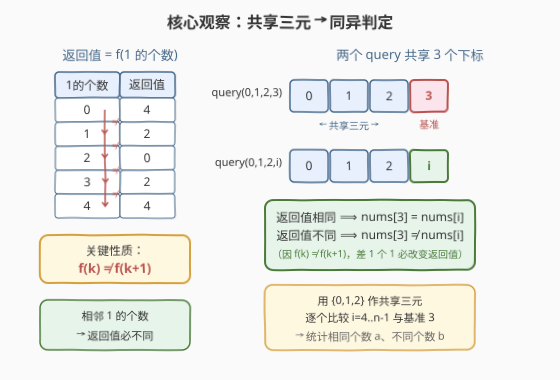
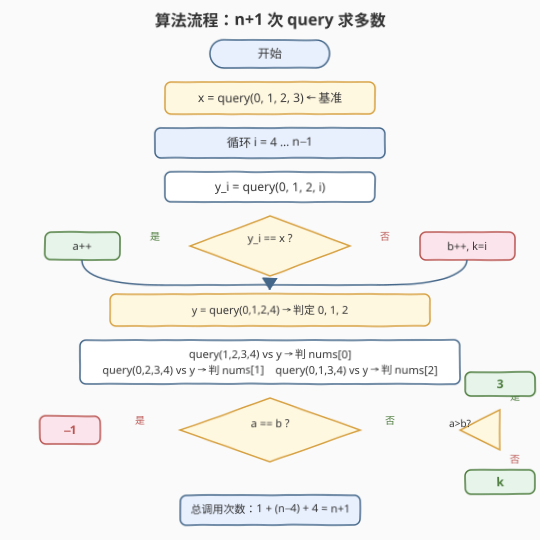

# 找出隐藏数组中出现次数最多的元素

- **题目名称**：找出隐藏数组中出现次数最多的元素
- **链接**：[1538. 找出隐藏数组中出现次数最多的元素](https://leetcode.cn/problems/guess-the-majority-in-a-hidden-array/)
- **难度**：中等
- **标签**：数组、数学、交互

## 1. 题目概述

有一个只含 **0** 和 **1** 的整数数组 `nums`，你**无法直接访问**它，只能通过 `ArrayReader` API 间接查询：

- **`int query(int a, int b, int c, int d)`**：其中 `0 <= a < b < c < d < length()`。返回 4 个元素 `nums[a], nums[b], nums[c], nums[d]` 的**取值分布**：
  - **4**：4 个元素全相同（全 0 或全 1）
  - **2**：3 个相同、1 个不同（3-1 分布）
  - **0**：2 个 0、2 个 1（2-2 分布）
- **`int length()`**：返回数组长度。

**调用限制**：最多调用 `query()` **$2n$** 次（$n$ 为数组长度）。

**返回**：数组中出现次数最多的值（多数元素）的**任意一个下标**；若 0 和 1 出现次数相等，返回 $-1$。

**示例 1**：

```text
输入：nums = [0,0,1,0,1,1,1,1]
输出：5
解释：1 出现 5 次、0 出现 3 次，多数是 1。返回下标 2, 4, 5, 6, 7 中任意一个均可。
```

**示例 2**：

```text
输入：nums = [0,0,1,1,0]
输出：0
解释：0 出现 3 次，多数是 0。
```

**示例 3**：

```text
输入：nums = [1,0,1,0,1,0,1,0]
输出：-1
解释：0 和 1 各出现 4 次，平局返回 -1。
```

**约束条件**：

- $5 \le \text{nums.length} \le 10^5$
- $0 \le \text{nums[i]} \le 1$

> 💡 这是一道**交互式脑力题**：不能直接读数组，只能通过 4 元素分布查询间接推断。核心挑战是——如何用**每次仅返回 4 个元素分布**的 query，高效地判定每个元素是否等于某个"基准"，从而统计 0/1 各自的个数。

---

## 2. 解题思路

### 2.1 暴力思路：能否逐个确定每个元素的值？

最直觉的想法是：想办法确定每个 `nums[i]` 到底是 0 还是 1，然后数个数。

但问题是：`query(a, b, c, d)` 一次涉及 **4 个**元素，返回的是它们的**联合分布**，无法孤立地读出单个元素的值。即使知道 `query(0,1,2,3) = 2`（3-1 分布），也无法判断是"3 个 0 + 1 个 1"还是"1 个 0 + 3 个 1"，更无法定位那个"多出来的"元素在哪。

> 💡 转换视角：与其**绝对确定**每个元素的值，不如**相对比较**——选定一个"基准"元素，判定其余每个元素与基准**相同还是不同**。只需 $n - 1$ 次"同/异"判定，就能把数组分成两组，较大组即为多数。关键在于：如何用 query 实现一次"同/异"判定？

### 2.2 核心观察：共享三元 → 同异判定



**第一步：理解返回值的本质。**

`query(a, b, c, d)` 的返回值完全由 4 个元素中 **1 的个数** $k$ 决定，映射关系记为 $f(k)$：

| 1 的个数 $k$ | 0 | 1 | 2 | 3 | 4 |
|:---:|:---:|:---:|:---:|:---:|:---:|
| 返回值 $f(k)$ | 4 | 2 | 0 | 2 | 4 |

**关键性质**：$f(k) \ne f(k+1)$ 对所有 $k \in \{0, 1, 2, 3\}$ 成立——即**1 的个数相差 1，返回值必然不同**。

> ⚠️ 反之不成立：$f(0) = f(4) = 4$、$f(1) = f(3) = 2$，返回值相同不代表 1 的个数相同。但对我们的用途来说，只需要"差 1 必不同"这一方向。

**第二步：利用共享三元组做比较。**

考虑两个 query：`query(0, 1, 2, 3)` 和 `query(0, 1, 2, i)`，它们**共享下标 $\{0, 1, 2\}$**，仅第 4 个下标不同（$3$ vs $i$）。

设 $S$ 为 $\{0, 1, 2\}$ 中 1 的个数，则：

- `query(0,1,2,3)` $= f(S + \text{nums[3]})$
- `query(0,1,2,i)` $= f(S + \text{nums[i]})$

由关键性质 $f(k) \ne f(k+1)$：

- **返回值相同** $\Rightarrow S + \text{nums[3]} = S + \text{nums[i]} \Rightarrow$ **`nums[3] == nums[i]`**
- **返回值不同** $\Rightarrow$ **`nums[3] != nums[i]`**

> 💡 这就实现了一次"同/异"判定！用 `query(0,1,2,3)` 的返回值 $x$ 作基准，对每个 $i \ge 4$ 调用 `query(0,1,2,i)` 比较返回值是否等于 $x$，就能判定 `nums[i]` 是否等于 `nums[3]`。

**第三步：如何判定下标 0, 1, 2 与基准 3 的关系？**

上述方法用 $\{0, 1, 2\}$ 作共享三元，恰好把 $\{0, 1, 2\}$ 本身排除在外。要判定 `nums[0]`、`nums[1]`、`nums[2]` 是否等于 `nums[3]`，需要换一组共享三元。

观察：用 `query(0, 1, 2, 4)` 的返回值 $y$ 作新基准（$n \ge 5$ 保证下标 4 存在），然后：

| 比较 | 共享三元 | 不同元素 | 返回值相同 $\Rightarrow$ |
|------|---------|---------|----------------------|
| `query(1,2,3,4)` vs `query(0,1,2,4)` | $\{1, 2, 4\}$ | $3$ vs $0$ | `nums[0] == nums[3]` |
| `query(0,2,3,4)` vs `query(0,1,2,4)` | $\{0, 2, 4\}$ | $3$ vs $1$ | `nums[1] == nums[3]` |
| `query(0,1,3,4)` vs `query(0,1,2,4)` | $\{0, 1, 4\}$ | $3$ vs $2$ | `nums[2] == nums[3]` |

> ⚠️ 这里巧妙地用 $\{0, 1, 2, 4\}$ 的各种 3-子集作共享三元，把 $3$ 换进去与 $0$、$1$、$2$ 分别比较。注意 `query(0,1,2,4)` 在循环中 $i=4$ 时已经调用过，可以**复用其结果** $y$，省去一次重复调用。

### 2.3 算法流程图



**总 query 次数**：$1$（基准）$+ (n-4)$（循环）$+ 1$（$y$）$+ 3$（判定 0,1,2）$= n + 1$，远在 $2n$ 限制内。

> 💡 **优化**：`query(0,1,2,4)` 在循环 $i=4$ 时已调用，结果存为 $y$ 即可省去第 5 步的重复调用，总次数降为 $n$。这正是 Follow up 的答案。

### 2.4 示例演算

![示例演算：nums=[0,0,1,0,1,1,1,1], n=8](../images/gtm_example_walkthrough.svg)

以 `nums = [0,0,1,0,1,1,1,1]` 为例，基准选 `nums[3] = 0`：

**① 基准**：`query(0,1,2,3)`，元素 $\{0,0,1,0\}$，1 的个数 $= 1$，返回 $x = 2$。

**② 循环 $i = 4 \ldots 7$**：`query(0,1,2,i)` vs $x$：

| $i$ | 元素 | 1 的个数 | 返回值 | vs $x=2$ | 判定 | 计数 |
|-----|------|---------|--------|---------|------|------|
| 4 | $\{0,0,1,1\}$ | 2 | 0 | $\ne$ | `nums[4]≠nums[3]` | $b{=}1, k{=}4$ |
| 5 | $\{0,0,1,1\}$ | 2 | 0 | $\ne$ | `nums[5]≠nums[3]` | $b{=}2, k{=}5$ |
| 6 | $\{0,0,1,1\}$ | 2 | 0 | $\ne$ | `nums[6]≠nums[3]` | $b{=}3, k{=}6$ |
| 7 | $\{0,0,1,1\}$ | 2 | 0 | $\ne$ | `nums[7]≠nums[3]` | $b{=}4, k{=}7$ |

循环后：$a = 1$（仅下标 3），$b = 4$，$k = 7$。

**③ 判定 0, 1, 2**：$y = \text{query}(0,1,2,4) = 0$（元素 $\{0,0,1,1\}$，2 个 1）。

| 比较 | 元素 | 1 的个数 | 返回值 | vs $y=0$ | 判定 | 计数 |
|------|------|---------|--------|---------|------|------|
| `query(1,2,3,4)` | $\{0,1,0,1\}$ | 2 | 0 | $=$ | `nums[0]=nums[3]` | $a{=}2$ |
| `query(0,2,3,4)` | $\{0,1,0,1\}$ | 2 | 0 | $=$ | `nums[1]=nums[3]` | $a{=}3$ |
| `query(0,1,3,4)` | $\{0,0,0,1\}$ | 1 | 2 | $\ne$ | `nums[2]≠nums[3]` | $b{=}5, k{=}2$ |

**④ 结果**：$a = 3$，$b = 5$。$b > a$，多数是与基准**不同**的值（1），返回 $k = 2$。$\checkmark$

---

## 3. 参考代码

### C++

```cpp
/**
 * // This is the ArrayReader's API interface.
 * // You should not implement it, or speculate about its implementation
 * class ArrayReader {
 *   public:
 *     // return 4 if the values of the 4 elements are the same (0 or 1).
 *     // return 2 if three elements have a value equal to 0 and one has value 1, or vice versa.
 *     // return 0 : if two elements have a value equal to 0 and two have a value equal to 1.
 *     int query(int a, int b, int c, int d);
 *
 *     // Returns the length of the array
 *     int length();
 * };
 */

class Solution {
  public:
    int guessMajority(ArrayReader& reader) {
        int n = reader.length();
        int x = reader.query(0, 1, 2, 3);   // 基准
        int a = 1, b = 0;                    // a: 与 nums[3] 相同（含 3 自身）
        int k = 0;                           // 记录"不同组"中任意一个下标

        // ① 循环 i=4..n-1：用 {0,1,2} 共享三元比较
        for (int i = 4; i < n; ++i) {
            if (reader.query(0, 1, 2, i) == x) {
                ++a;
            } else {
                ++b;
                k = i;
            }
        }

        // ② 判定 0, 1, 2：用 {0,1,2,4} 的 3-子集作共享三元
        int y = reader.query(0, 1, 2, 4);
        if (reader.query(1, 2, 3, 4) == y) {
            ++a;                             // nums[0] == nums[3]
        } else {
            ++b;
            k = 0;
        }
        if (reader.query(0, 2, 3, 4) == y) {
            ++a;                             // nums[1] == nums[3]
        } else {
            ++b;
            k = 1;
        }
        if (reader.query(0, 1, 3, 4) == y) {
            ++a;                             // nums[2] == nums[3]
        } else {
            ++b;
            k = 2;
        }

        if (a == b) return -1;
        return a > b ? 3 : k;
    }
};
```

### Python

```python
class Solution:
    def guessMajority(self, reader: "ArrayReader") -> int:
        n = reader.length()
        x = reader.query(0, 1, 2, 3)    # 基准
        a, b = 1, 0                      # a: 与 nums[3] 相同（含 3 自身）
        k = 0                            # 记录"不同组"中任意一个下标

        # ① 循环 i=4..n-1：用 {0,1,2} 共享三元比较
        for i in range(4, n):
            if reader.query(0, 1, 2, i) == x:
                a += 1
            else:
                b += 1
                k = i

        # ② 判定 0, 1, 2：用 {0,1,2,4} 的 3-子集作共享三元
        y = reader.query(0, 1, 2, 4)
        if reader.query(1, 2, 3, 4) == y:
            a += 1                        # nums[0] == nums[3]
        else:
            b += 1
            k = 0
        if reader.query(0, 2, 3, 4) == y:
            a += 1                        # nums[1] == nums[3]
        else:
            b += 1
            k = 1
        if reader.query(0, 1, 3, 4) == y:
            a += 1                        # nums[2] == nums[3]
        else:
            b += 1
            k = 2

        if a == b:
            return -1
        return 3 if a > b else k
```

> 💡 **代码逻辑**：`a` 统计与 `nums[3]` 相同的元素个数（初始化为 1，含 3 自身），`b` 统计不同的个数，`k` 记录"不同组"中最后遇到的下标。最终若 $a > b$，多数是 `nums[3]` 的值，返回下标 $3$；若 $b > a$，多数是另一个值，返回 $k$；若 $a = b$，返回 $-1$。

---

## 4. 复杂度分析

| 维度 | 复杂度 | 说明 |
|------|--------|------|
| 时间复杂度 | $O(n)$ | 共调用 $n + 1$ 次 query，每次 $O(1)$；循环 $n - 4$ 次，总操作数 $\sim n$ |
| 空间复杂度 | $O(1)$ | 仅用常数个整型变量 `a, b, k, x, y` |
| query 次数 | $n + 1$ | $1$（基准）$+ (n-4)$（循环）$+ 1$（$y$）$+ 3$（判定 0,1,2），上限 $2n$ |

> 💡 本题 $n \le 10^5$，$n + 1$ 次 query 远在 $2n$ 限制内，且每次 query 为 $O(1)$，总时间 $\sim 10^5$ 完全可过。

---

## 5. 扩展：最小化 query 调用次数

**Follow up**：最少需要多少次 query 才能找到多数元素？

**答案：$n$ 次。**

观察上述 $n + 1$ 次调用中，`query(0, 1, 2, 4)` 出现了**两次**——一次在循环 $i = 4$ 时，一次在判定阶段取 $y$。只需在循环时**缓存** $i = 4$ 的结果，省去重复调用：

```cpp
int y = 0;  // 缓存 query(0,1,2,4) 的结果
for (int i = 4; i < n; ++i) {
    int r = reader.query(0, 1, 2, i);
    if (i == 4) y = r;        // 缓存，不重复调用
    if (r == x) ++a;
    else { ++b; k = i; }
}
// 后续直接用缓存的 y，不再调 query(0,1,2,4)
```

总次数降为 $1 + (n - 4) + 3 = n$。

**能否低于 $n$？** 不能。每次 query 共享 3 个下标时，返回值只提供 **1 比特**信息（与基准相同/不同）。要对 $n - 1$ 个元素逐一判定同异关系，至少需要 $n - 1$ 次比较 query，加上 $1$ 次基准 query，共 $n$ 次。因此 $n$ 是下界。

> ⚠️ 更严格地说，信息论下界为 $\lceil (n-1) / 1 \rceil + 1 = n$ 比特/次——因为 query 返回值只有 $\{0, 2, 4\}$ 三种可能，但用于同异比较时仅区分"相等/不等"两种，每 query 恰好 1 比特。$n - 1$ 个关系 + 1 个基准 = $n$。

---

## 6. 面试要点

1. **为什么 `f(k) != f(k+1)` 是整个算法的基石？**

   - `query` 返回值由 4 元素中 1 的个数 $k$ 决定：$f(0){=}4, f(1){=}2, f(2){=}0, f(3){=}2, f(4){=}4$。相邻 $k$ 值的返回值总是不同（$4 \ne 2 \ne 0 \ne 2 \ne 4$）。因此两个共享 3 下标的 query，若第 4 个元素相同则返回值必相同，不同则必不同——这把"4 元素分布查询"转化为"1 比特同异判定"。

2. **为什么选下标 3 作基准，而不是 0 或别的？**

   - 下标 3 是第一个 query `query(0,1,2,3)` 的第 4 个参数，天然把 $\{0,1,2\}$ 和 $\{4, \ldots, n{-}1\}$ 分到两侧。$\{4, \ldots, n{-}1\}$ 可直接用 $\{0,1,2\}$ 作共享三元循环比较；$\{0,1,2\}$ 需要额外 3 次 query 换用含下标 4 的 3-子集作共享三元。选其他下标作基准也是可以的，但代码结构会不同。

3. **判定 0, 1, 2 的三次 query 为什么这样设计？**

   - 目标是分别比较 `nums[0]`、`nums[1]`、`nums[2]` 与 `nums[3]`。每次需要一组共享 3 个下标的 query 对，其中一个是含 3 的 query，另一个是不含 3 但含目标下标的 query。用 `query(0,1,2,4)` 作不含 3 的参考，然后 `query(1,2,3,4)` 把 0 换成 3（共享 $\{1,2,4\}$）、`query(0,2,3,4)` 把 1 换成 3（共享 $\{0,2,4\}$）、`query(0,1,3,4)` 把 2 换成 3（共享 $\{0,1,4\}$）。

4. **如果数组长度恰好是 5（最小值）怎么办？**

   - $n = 5$ 时循环只跑 $i = 4$ 一次，判定 0,1,2 的三次 query 照常。总调用 $1 + 1 + 1 + 3 = 6$ 次，上限 $2 \times 5 = 10$，完全够用。算法对 $n \ge 5$ 均正确。

5. **这道题和 Boyer-Moore 多数投票法（169 题）有什么区别？**

   - [169. 多数元素](https://leetcode.cn/problems/majority-element/) 可以**直接访问数组**，用 Boyer-Moore 算法 $O(n)$ 时间 $O(1)$ 空间，利用"抵消"思想找多数。本题**无法直接读取**元素值，只能通过 4 元素分布查询间接推断，因此不能用 Boyer-Moore，而要用"共享三元同异判定"把每次 query 转化为 1 比特信息。两者目标相同（找多数），但信息获取方式的约束完全不同。

---

## 7. 同类练习题

- [277. 搜寻名人](https://leetcode.cn/problems/find-the-celebrity/)（[题解](../0201-0300/277_搜寻名人.md)）：交互式 API + 两遍扫描消除法，同为"受限 API 下逐元素判定"范式，用 `knows()` 排除候选而非直接读取
- [278. 第一个错误的版本](https://leetcode.cn/problems/first-bad-version/)（[题解](../0201-0300/278_第一个错误的版本.md)）：交互式 API + 二分查找，同属"受限查询下定位目标"的交互题家族
- [1157. 子数组中占绝大多数的元素](https://leetcode.cn/problems/online-majority-element-in-subarray/)（[题解](../1101-1200/1157_子数组中占绝大多数的元素.md)）：多数元素进阶，用二倍提升（binary lifting）预处理 + 随机化查询 $O(1)$ 回答子数组多数，对比本题的"无直接访问"约束
- [169. 多数元素](https://leetcode.cn/problems/majority-element/)：Boyre-Moore 多数投票法，可自由访问数组时的经典多数算法，对比本题受限 API 下的解法差异
- [398. 随机数索引](https://leetcode.cn/problems/random-pick-index/)（[题解](../0301-0400/398_随机数索引.md)）：蓄水池抽样，同属"受限信息下做统计推断"的思路，无法预知全量数据时用单遍扫描 + 概率替换
