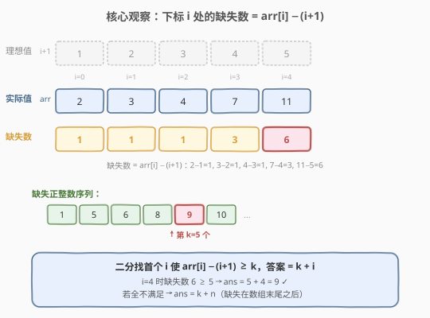
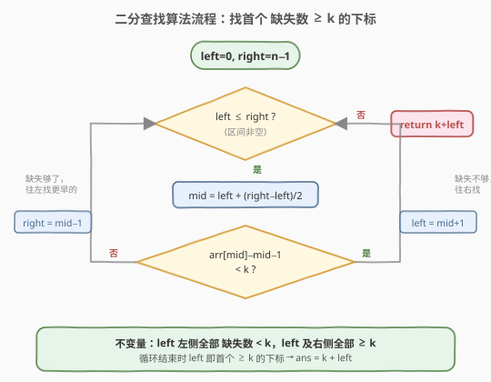

# 第 k 个缺失的正整数

- **题目名称**：第 k 个缺失的正整数
- **链接**：[1539. 第 k 个缺失的正整数](https://leetcode.cn/problems/kth-missing-positive-number/)
- **难度**：简单
- **标签**：数组、二分查找

## 1. 题目概述

给你一个**严格升序排列**的正整数数组 `arr` 和一个整数 `k`。请你找到这个数组里第 `k` 个缺失的正整数。

**示例 1**：

```text
输入：arr = [2,3,4,7,11], k = 5
输出：9
解释：缺失的正整数包括 [1,5,6,8,9,10,12,13,...]。第 5 个缺失的正整数为 9。
```

**示例 2**：

```text
输入：arr = [1,2,3,4], k = 2
输出：6
解释：缺失的正整数包括 [5,6,7,...]。第 2 个缺失的正整数为 6。
```

**约束条件**：

- `1 <= arr.length <= 1000`
- `1 <= arr[i] <= 1000`
- `1 <= k <= 1000`
- 数组**严格升序**（`arr[i] < arr[j]` for all `i < j`）

> 💡 题目进阶要求时间复杂度小于 $O(n)$。数组有序 + 查找目标 → **二分查找**的自然信号。关键在于把「第 k 个缺失」转化为一个可在下标上二分的**单调谓词**。

---

## 2. 解题思路

### 2.1 暴力思路：逐个枚举正整数

从正整数 `1` 开始逐个检查：当前数在不在 `arr` 里？不在就计数 `miss++`，当 `miss == k` 时返回该数。用指针 `i` 跟踪 `arr` 中已比较到的位置（因为 `arr` 有序，可以同步推进）。时间 $O(n + k)$，空间 $O(1)$。

```text
miss = 0, cur = 1, i = 0
while miss < k:
    if i < n and arr[i] == cur:
        i += 1          # cur 在数组里，不缺失
    else:
        miss += 1        # cur 缺失
    if miss < k:
        cur += 1
return cur
```

能过提交，但 $O(n + k)$ 不满足进阶的 $O(\log n)$ 要求。问题在于逐个枚举没有利用「缺失数的**累积量**随下标单调递增」这一性质。

### 2.2 核心观察：缺失数 = arr[i] − (i+1)



如果数组中没有任何缺失，那么 `arr[i]` 应该恰好等于 $i + 1$（下标从 0 开始）。因此，下标 `i` 处**到 `arr[i]` 为止累计缺失的正整数个数**为：

$$\text{missing}(i) = \text{arr}[i] - (i + 1)$$

以 `arr = [2,3,4,7,11]` 为例：

| 下标 $i$ | $\text{arr}[i]$ | 理想值 $i+1$ | 缺失数 $\text{arr}[i]-(i+1)$ |
|---------|-----------------|--------------|------------------------------|
| 0 | 2 | 1 | 1 |
| 1 | 3 | 2 | 1 |
| 2 | 4 | 3 | 1 |
| 3 | 7 | 4 | 3 |
| 4 | 11 | 5 | **6** |

$\text{missing}(i)$ 是关于 $i$ 的**单调不减**函数（因为 `arr` 严格递增，每跨一步 $\text{arr}[i]$ 的增量 $\geq 1$，而 $(i+1)$ 的增量恒为 1，所以差值不会减小）。单调性 → 可以二分！

> 💡 **关键转化**：不要逐个枚举缺失数，而是在**下标**上二分，找「首个使 $\text{missing}(i) \geq k$ 的下标」。找到后，答案 $= k + i$。这是因为：在下标 $i$ 之前有 $i$ 个数组元素（均小于第 $k$ 个缺失数），所以第 $k$ 个缺失数在自然数中的位置是 $k + i$。

> ⚠️ **若所有下标的 $\text{missing}(i) < k$**（如示例 2），说明第 $k$ 个缺失数在数组末尾之后。此时二分会自然收敛到 `left = n`，公式 $\text{ans} = k + \text{left} = k + n$ 同样适用，无需特判。

### 2.3 算法流程图



沿用闭区间 $[\text{left}, \text{right}]$ 模板，循环不变量为：**`left` 左侧所有下标的缺失数 $< k$，`left` 及右侧所有下标的缺失数 $\geq k$**（若存在）。

- $\text{arr}[\text{mid}] - \text{mid} - 1 < k$：缺失数不够，答案在右半，`left = mid + 1`。
- $\text{arr}[\text{mid}] - \text{mid} - 1 \geq k$：缺失数够了，`mid` 是候选，继续往左找更早的，`right = mid - 1`。

循环结束时 `left > right`，`left` 恰好停在首个缺失数 $\geq k$ 的下标（或 $n$），答案 $= k + \text{left}$。

### 2.4 示例演算

![示例演算：arr=[2,3,4,7,11], k=5](../images/kthmp_walkthrough.svg)

以 `arr = [2,3,4,7,11], k = 5` 为例，$n = 5$：

| 轮次 | left | right | mid | arr[mid] | 缺失数 | 判断 | 动作 |
|------|------|-------|-----|----------|--------|------|------|
| 1 | 0 | 4 | 2 | 4 | $4-3=1$ | $1 < 5$ | left = 3 |
| 2 | 3 | 4 | 3 | 7 | $7-4=3$ | $3 < 5$ | left = 4 |
| 3 | 4 | 4 | 4 | 11 | $11-5=6$ | $6 \geq 5$ | right = 3 |
| 收敛 | 4 | 3 | — | — | — | left > right | **ans = 5+4 = 9** |

三轮后 `left = 4 > right = 3`，返回 $k + \text{left} = 5 + 4 = 9$。✓

对照示例 2：`arr = [1,2,3,4], k = 2`，每个下标的缺失数均为 0，二分一路 `left = mid + 1` 推到 `left = 4 = n`，返回 $2 + 4 = 6$。✓

---

## 3. 参考代码

### C++（二分查找）

```cpp
class Solution {
  public:
    int findKthPositive(vector<int>& arr, int k) {
        int left = 0, right = arr.size() - 1;
        while (left <= right) {
            int mid = left + (right - left) / 2;
            if (arr[mid] - mid - 1 < k) {
                left = mid + 1;   // 缺失数不够，往右找
            } else {
                right = mid - 1;  // 缺失数够了，往左找更早的
            }
        }
        return k + left;  // left 即首个缺失数 >= k 的下标（或 n）
    }
};
```

### Python

```python
class Solution:
    def findKthPositive(self, arr: list[int], k: int) -> int:
        left, right = 0, len(arr) - 1
        while left <= right:
            mid = left + (right - left) // 2
            if arr[mid] - mid - 1 < k:
                left = mid + 1   # 缺失数不够，往右找
            else:
                right = mid - 1  # 缺失数够了，往左找更早的
        return k + left  # left 即首个缺失数 >= k 的下标（或 n）
```

> 💡 **O(n) 线性写法**（更直观，适合先说清思路再优化）：
> ```python
> class Solution:
>     def findKthPositive(self, arr: list[int], k: int) -> int:
>         for x in arr:
>             if x <= k:
>                 k += 1  # x 占据了一个本该缺失的位置，k 后移
>             else:
>                 break
>         return k
> ```
> 思路：初始答案为 `k`，遍历 `arr` 中每个 $\leq k$ 的元素时，说明该元素"占用"了一个缺失位，`k` 需要后移一位。一旦遇到 $> k$ 的元素即可停止。等价于公式 $\text{ans} = k + (\text{arr 中} \leq \text{ans 的元素个数})$。

---

## 4. 复杂度分析

| 维度 | 复杂度 | 说明 |
|------|--------|------|
| 时间复杂度 | $O(\log n)$ | 每轮区间折半，最多 $\lceil \log_2 n \rceil$ 轮；$n=1000$ 时约 10 轮 |
| 空间复杂度 | $O(1)$ | 仅用 `left`、`right`、`mid` 三个指针变量 |

> 💡 线性写法的时间为 $O(n)$（最坏遍历整个数组），但代码更直观。面试中先说线性思路建立直觉，再优化到二分是常见推进路径。

---

## 5. 扩展：线性扫描的等价理解

线性写法 `if arr[i] <= k: k += 1` 的本质和二分公式 $\text{ans} = k + i$ 完全等价：

- 遍历到下标 $i$ 时，若 `arr[i] <= k + i`（即 $\text{arr}[i] - i - 1 < k$，缺失数不够），说明 `arr[i]` 小于等于当前答案候选，占用了一个缺失位，答案后移一位。
- 等价地，线性写法中的 `k` 在循环结束后变成了 $k + (\text{满足 arr}[i] \leq k+i \text{ 的元素个数})$，正好是 $k + i_{\text{first\_ge}}$，与二分结果一致。

两种写法的关系：

| 写法 | 核心操作 | 等价条件 |
|------|---------|---------|
| 二分 | 找首个 $\text{arr}[i] - i - 1 \geq k$ 的 $i$ | $\text{ans} = k + i$ |
| 线性 | 遍历，若 $\text{arr}[i] \leq k$ 则 $k\!+\!+$ | $\text{arr}[i] \leq k \Leftrightarrow \text{arr}[i] - i - 1 < k$（$k$ 随 $i$ 同步增长） |

> ⚠️ 线性写法中 `k` 是动态增长的——每遇到一个 $\leq k$ 的元素，`k` 加 1，这使得条件 `arr[i] <= k` 在第 $i$ 步等价于 `arr[i] <= 初始k + i`，即 `arr[i] - i - 1 < 初始k`，与二分的谓词一致。

---

## 6. 面试要点

1. **缺失数公式 $\text{arr}[i] - (i+1)$ 是怎么想到的？**

   - 如果没有缺失，`arr[i]` 应等于 $i+1$（下标 0 对应值 1）。实际值与理想值的差就是累计缺失数。这种「实际 vs 理想」的差值技巧在**旋转数组**（[153. 寻找旋转排序数组中的最小值](../0101-0200/153_寻找旋转排序数组中的最小值.md)）等题中也有应用：用下标与值的对比关系建立单调性。

2. **为什么答案恰好是 $k + \text{left}$？**

   - `left` 停在首个缺失数 $\geq k$ 的下标 $i$。这意味着下标 $0 \sim i-1$ 的 $i$ 个数组元素都小于第 $k$ 个缺失数（它们的缺失数 $< k$）。在自然数 $1 \sim (k+i)$ 中，有 $i$ 个被数组占用，剩余 $k$ 个缺失，第 $k$ 个恰好是 $k + i$。

3. **如果所有元素都不够（缺失数全 $< k$）怎么办？**

   - 二分会一路 `left = mid + 1` 推到 `left = n`，此时 `left > right` 退出循环，返回 $k + n$。例如 `arr = [1,2,3,4], k = 2` 返回 $2 + 4 = 6$。无需任何特判，公式天然覆盖。

4. **线性写法和二分写法哪个更好？**

   - $n \leq 1000$ 时两者性能差异可忽略。线性写法代码更短、直觉更强，适合作为切入点；二分写法满足进阶的 $O(\log n)$ 要求，展示对单调性的利用。面试中先说线性建立直觉，再优化到二分是最佳推进路径。

5. **这道题和 [704. 二分查找](../0701-0800/704_二分查找.md) / [35. 搜索插入位置](../0001-0100/35_搜索插入位置.md) 有什么关联？**

   - 三者共用闭区间二分模板。704 是最纯粹的「判存在」；35 把找不到时的 `return -1` 改成 `return left`（找下界）；本题进一步把比较条件从 `nums[mid] vs target` 升级为 `arr[mid] - mid - 1 vs k`（**带下标的复合谓词**），但二分骨架完全一致——找首个满足谓词的位置。

---

## 7. 同类练习题

- [704. 二分查找](https://leetcode.cn/problems/binary-search/)：闭区间二分模板的母题，本题的二分骨架直接复用
- [35. 搜索插入位置](https://leetcode.cn/problems/search-insert-position/)：找下界（首个 ≥ target），本题是「首个缺失数 ≥ k」的下界变体，思路一脉相承
- [1060. 有序数组中的缺失元素](https://leetcode.cn/problems/missing-element-in-sorted-array/)：本题的进阶版（返回区间内的第 k 个缺失），同一公式 $\text{missing}(i) = \text{arr}[i] - (i+1)$ 的直接应用
- [278. 第一个错误的版本](https://leetcode.cn/problems/first-bad-version/)：单调布尔谓词上二分找首个 true，与本题「首个缺失数 ≥ k」同构
- [153. 寻找旋转排序数组中的最小值](https://leetcode.cn/problems/find-minimum-in-rotated-sorted-array/)：「实际值 vs 下标关系」建立单调性的另一范例，对比理解二分谓词的构造
