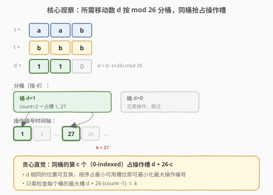
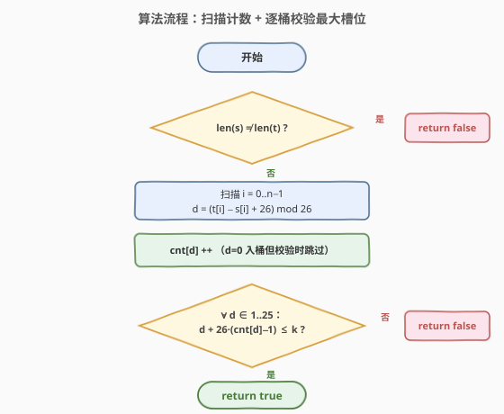
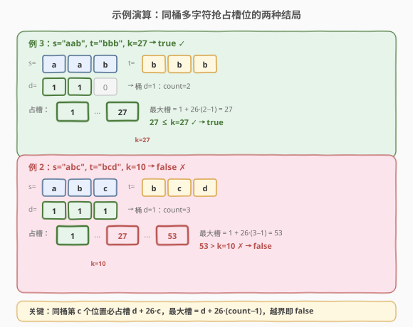

# LeetCode K 次操作转变字符串 题解

## 1. 题目概述

- **标题 / 题号**：K 次操作转变字符串（#1540，medium）
- **链接**：https://leetcode.cn/problems/can-convert-string-in-k-moves/
- **难度**：中等
- **标签**：贪心、哈希表、字符串

**题意**：给你两个字符串 `s` 和 `t`，目标是在 `k` 次操作以内把字符串 `s` 转变成 `t`。

在第 `i` 次操作时（`1 <= i <= k`），你可以：

- 选择字符串 `s` 中满足 `1 <= j <= s.length` 且**之前未被选过**的任意下标 `j`（下标从 1 开始），并将此位置的字符**切换 `i` 次**；
- 或不进行任何操作。

「切换 1 次」指用字母表中该字母的下一个字母替换它（字母表环状接起来，所以 `'z'` 切换后会变成 `'a'`）。第 `i` 次操作意味着该字符应**切换 `i` 次**。任意一个下标 `j` 最多只能被操作 1 次。

如果在不超过 `k` 次操作内可以把 `s` 转变成 `t`，返回 `true`，否则返回 `false`。

**示例 1**：

```text
输入：s = "input", t = "ouput", k = 9
输出：true
解释：第 6 次操作时将 'i' 切换 6 次得到 'o'；第 7 次操作时将 'n' 切换 7 次得到 'u'。
```

**示例 2**：

```text
输入：s = "abc", t = "bcd", k = 10
输出：false
解释：三个字符都需要切换 1 次。第 1 次操作可处理一个，但另外两个需要第 27、53 次操作，均超过 k=10。
```

**示例 3**：

```text
输入：s = "aab", t = "bbb", k = 27
输出：true
解释：第 1 次操作将第一个 'a' 切换 1 次得 'b'；第 27 次操作将第二个 'a' 切换 27 次得 'b'（27 mod 26 = 1）。
```

**约束**：

- `1 <= s.length, t.length <= 10^5`
- `0 <= k <= 10^9`
- `s` 和 `t` 只包含小写英文字母。

> 💡 关键约束是「每个下标最多操作一次」+「第 `i` 次操作切换 `i` 次」。这意味着若位置 `j` 要从 `s[j]` 变成 `t[j]`，它必须被安排在某个操作编号 `i` 上，且 `i mod 26 = (t[j] - s[j]) mod 26`。问题退化为：**给每个待变位置分配一个互不相同的操作编号 `i ∈ [1, k]`，且 `i` 与该位置所需位移同余**。

## 2. 解题思路

### 2.1 暴力思路：逐位贪心匹配操作编号

最直观的想法是：遍历每个位置，计算它需要的位移 `d = (t[j] - s[j]) mod 26`，然后从 `d` 开始按步长 26 向上找一个还未被占用的最小操作编号 `i`（`d, d+26, d+52, ...`），占用之；若找到的 `i > k` 则返回 `false`。

```text
used = set()
for j in 0..n-1:
    d = (t[j] - s[j] + 26) % 26
    if d == 0: continue
    i = d
    while i in used or i <= k:    # 找最小可用 i ≡ d (mod 26)
        if i not in used and i <= k: break
        i += 26
    if i > k: return false
    used.add(i)
return true
```

问题在于：最坏情况下 `used` 集合很大，每个位置都要线性试探多个 `i`，复杂度退化到 $O(n^2)$ 量级（当大量位置同余时）。对于 $n = 10^5$ 会超时。我们需要一个**不依赖逐个试探**的判定方法。

### 2.2 核心观察：按 mod 26 分桶，同桶第 c 个必占槽 d + 26·c



把每个待变位置按其位移 `d` 分桶（`d ∈ {1, 2, ..., 25}`，`d=0` 表示无需操作直接跳过）。**同一桶内的所有位置都需要同一个余数 `d`**，因此它们能使用的操作编号集合完全相同：`{d, d+26, d+52, ...} ∩ [1, k]`。

> 💡 **关键洞察**：同一桶内的位置是**完全等价**的——它们需要的位移都相同，区别仅在于占用哪个槽位。要让最大操作编号尽可能小，**贪心地让第 `c` 个（0-indexed）位置占用第 `c` 小的可用槽 `d + 26·c`** 即可。这是最优的：任意其他分配方案只会把某些位置推到更大的槽位，不可能让最大值更小。

于是无需逐个试探，只需统计每桶的容量 `cnt[d]`，该桶需要的**最大操作编号**就是：

$$\text{lastOp}(d) = d + 26 \cdot (\text{cnt}[d] - 1)$$

若对所有 `d ∈ {1, ..., 25}` 都有 $\text{lastOp}(d) \leq k$，则返回 `true`；任一桶越界即 `false`。

> ⚠️ **为什么 `cnt[d] - 1` 而不是 `cnt[d]`？** 第 1 个位置（`c=0`）占槽 `d + 26·0 = d`，第 `cnt[d]` 个位置（`c = cnt[d]-1`）占槽 `d + 26·(cnt[d]-1)`。所以最大槽用 `cnt[d]-1` 作系数。当 `cnt[d] = 0` 时该桶为空，`lastOp = d - 26 < 0 ≤ k`，自动通过。

### 2.3 算法流程图



流程非常精简：先做长度守门（不等直接 `false`），再一趟扫描把所有位移入桶计数，最后一趟遍历 25 个非零桶校验最大槽是否越界。两趟扫描 + 一次 25 步校验，总计 $O(n)$。

### 2.4 示例演算



以两个对照示例展示「同桶多字符」的两种结局：

- **例 3**（`s="aab", t="bbb", k=27`）：两位移均为 `d=1`，`cnt[1]=2`，最大槽 `1 + 26·1 = 27 ≤ 27` ✓ → `true`。两个 `'a'` 分别用第 1、27 次操作。
- **例 2**（`s="abc", t="bcd", k=10`）：三位移均为 `d=1`，`cnt[1]=3`，最大槽 `1 + 26·2 = 53 > 10` ✗ → `false`。即便第 1 次操作能处理一个字符，剩余两个要排到第 27、53 次，远超 `k=10`。

> 💡 **对比要点**：两例的 `d` 都是 1，差别只在「同桶竞争者数量」。`k` 必须能容纳 `cnt[d]` 个间距 26 的槽位——这正是公式 `d + 26·(cnt[d]-1) ≤ k` 的直观含义。

## 3. 参考代码

### C++（一趟扫描计数 + 逐桶校验）

```cpp
class Solution {
  public:
    bool canConvertString(string s, string t, int k) {
        if (s.size() != t.size()) return false;        // 长度不等直接 false
        int cnt[26] = {0};
        for (int i = 0; i < (int)s.size(); i++) {
            int d = (t[i] - s[i] + 26) % 26;            // 所需位移（0..25）
            cnt[d]++;
        }
        for (int d = 1; d < 26; d++) {                  // d=0 无需操作，跳过
            int lastOp = d + 26 * (cnt[d] - 1);         // 该桶最大操作编号
            if (lastOp > k) return false;
        }
        return true;
    }
};
```

### Python

```python
class Solution:
    def canConvertString(self, s: str, t: str, k: int) -> bool:
        if len(s) != len(t):
            return False
        cnt = [0] * 26
        for cs, ct in zip(s, t):
            d = (ord(ct) - ord(cs)) % 26               # 所需位移（0..25）
            cnt[d] += 1
        for d in range(1, 26):                          # d=0 无需操作，跳过
            if d + 26 * (cnt[d] - 1) > k:              # 该桶最大操作编号越界
                return False
        return True
```

> 💡 **Python 的 `%` 对负数返回非负结果**：`ord(ct) - ord(cs)` 为负时（如 `ct='a', cs='z'`），`(−25) % 26 = 1`，正是 `'z'→'a'→'b'` 的环状位移 1。C++ 中 `%` 对负数保留符号，故写作 `(t[i] - s[i] + 26) % 26` 显式加 26 规整。

> 💡 **为什么不用真的分配？** 题目只问「能否」，不要求给出具体方案。我们只需判定「每个桶的容量能否被 `[1, k]` 内同余槽位容纳」，因此 `cnt` 计数 + 公式校验就够了，无需维护 `used` 集合。

## 4. 复杂度分析

| 维度 | 复杂度 | 说明 |
|------|--------|------|
| 时间复杂度 | $O(n)$ | 一趟扫描 $n$ 个字符计数 + 一趟固定 25 步校验，总计线性 |
| 空间复杂度 | $O(1)$ | `cnt` 数组大小固定为 26，与 $n$ 无关 |

> 💡 对 $n = 10^5$，扫描约 $10^5$ 次取模运算 + 25 次比较，远在时限内。`k` 可达 $10^9$ 但只参与一次比较，无溢出风险（C++ 中 `d + 26*(cnt[d]-1)` 最大约 $25 + 26 \times 10^5 \approx 2.6 \times 10^6$，远在 `int` 范围内）。

## 5. 扩展：输出一种具体分配方案

本题只需返回布尔值。若进一步要求**输出每个待变位置分配到的操作编号**，可在桶内维护一个「下一个可用槽」指针，按位置出现顺序分配：

```cpp
// 在已统计 cnt[d] 且判定可行后，再扫一遍输出分配
int nextSlot[26];
for (int d = 1; d < 26; d++) nextSlot[d] = d;
vector<int> assign(n, 0);                // assign[j] = 位置 j 的操作编号，0 表示无需操作
for (int j = 0; j < (int)s.size(); j++) {
    int d = (t[j] - s[j] + 26) % 26;
    if (d == 0) continue;
    assign[j] = nextSlot[d];
    nextSlot[d] += 26;                   // 同桶下一个位置用下一个槽
}
```

| 维度 | 复杂度 | 说明 |
|------|--------|------|
| 时间复杂度 | $O(n)$ | 两趟扫描，每位置 $O(1)$ |
| 空间复杂度 | $O(n)$ | 需存储长度为 $n$ 的分配结果数组 |

> ⚠️ 该方案要求**先判定可行再分配**，否则可能在分配中途发现越界。保持「判定」与「构造」分离是常见模式：判定阶段用计数公式 $O(1)$ 校验，构造阶段按序占用 $O(n)$ 输出。

## 6. 面试要点

1. **为什么同桶按序占最小槽是最优的？**

   - 同一桶 `d` 内所有位置所需的余数完全相同，可用的槽位集合 `{d, d+26, ...} ∩ [1,k]` 也完全相同。要让「最大占用槽」最小，贪心地把第 `c` 个位置（按任意顺序）放到第 `c` 小的可用槽 `d + 26·c` 即可。任何把某位置推到更大槽的方案只会让最大值更大或相等，不会更小——这是经典的「相同物品占用相同资源池，按序贪心」范式，可用交换论证严格证明。

2. **`cnt[d] - 1` 里的 `-1` 容易写错，怎么记？**

   - 第 1 个位置 `c=0` 占槽 `d + 26·0 = d`，所以系数从 0 开始；第 `cnt[d]` 个位置 `c = cnt[d]-1` 占槽 `d + 26·(cnt[d]-1)`。「最大槽」对应最后一个位置，故系数是 `cnt[d]-1` 而非 `cnt[d]`。也可以反向记：若 `cnt[d]=1`，只需槽 `d`，系数应为 0，即 `1-1`。

3. **为什么 `d=0` 不需要校验？**

   - `d=0` 意味着 `s[j] == t[j]`，该位置已经匹配，无需任何操作。即便 `cnt[0]` 很大也不占用任何操作编号。代码中 `cnt[0]` 会被累加但校验循环从 `d=1` 开始，自动跳过。

4. **`k` 很大（$10^9$）时会有问题吗？**

   - 不会。`k` 只在最后比较 `lastOp > k` 时用一次。`lastOp = d + 26·(cnt[d]-1)` 最大约 $25 + 26 \times 10^5 \approx 2.6 \times 10^6$，远小于 `int` 上限，无溢出。算法复杂度与 `k` 的大小无关——这正是「计数 + 公式」相比「逐个试探」的核心优势。

5. **如果要求每个操作编号都至多用一次且必须用满 `k` 次会怎样？**

   - 题目允许「不进行任何操作」跳过某次操作，所以不需要用满 `k` 次，只需在 `[1, k]` 内为每个待变位置找到一个互不相同的同余槽即可。若改为「必须用满」，则需要额外校验「未分配的空闲操作编号能否被全部跳过」——但题目无此约束，无需考虑。

## 同类练习题

| # | 题目 | 与本题的关联 |
|---|------|-------------|
| 1541 | [平衡括号的最少插入次数](https://leetcode.cn/problems/minimum-insertions-to-balance-a-parentheses-string/) | 贪心扫描 + 余数处理，字符串上贪心的另一变体 |
| 13 | [罗马数字转整数](https://leetcode.cn/problems/roman-to-integer/)（[题解](../0001-0100/13_罗马数字转整数.md)） | 字符到数值的映射 + 顺序扫描，与本题「逐字符计算位移」同属字符级贪心/映射 |
| 415 | [字符串相加](https://leetcode.cn/problems/add-strings/)（[题解](../0401-0500/415_字符串相加.md)） | 逐位模拟 + 进位/取模，与本题 `(t[i]-s[i]+26) % 26` 的取模处理思路相通 |
| 1002 | [查找共用字符](https://leetcode.cn/problems/find-common-characters/) | 按字符分桶计数 + 取最小值，与本题「按位移分桶计数」的桶思想一致 |
| 953 | [验证外星语词典](https://leetcode.cn/problems/verifying-an-alien-dictionary/) | 自定义字母表顺序下的字符串比较，与本题「环状字母表位移」同属字母序相关贪心 |
