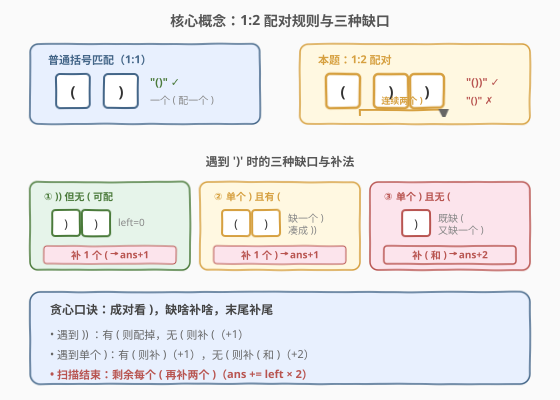
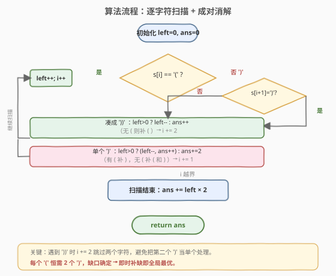
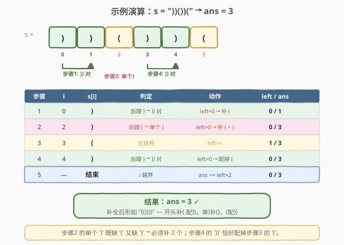

# LeetCode 平衡括号字符串的最少插入次数 题解

## 1. 题目概述

- **标题 / 题号**：平衡括号字符串的最少插入次数（#1541，medium）
- **链接**：https://leetcode.cn/problems/minimum-insertions-to-balance-a-parentheses-string/
- **难度**：中等
- **标签**：贪心、字符串、栈

**题意**：给你一个只包含 `'('` 和 `')'` 的括号字符串 `s`。这里的「平衡」定义**不同于**普通括号匹配——每个 `'('` 必须对应**两个连续的** `'))'`，且 `'('` 在前、`'))'` 在后。你可以在任意位置插入字符，返回使 `s` 平衡的**最少插入次数**。

> 💡 关键差异：普通括号匹配中 `'('` 与 `')'` 是 **1:1** 配对（如 `()` 合法）；本题是 **1:2** 配对（如 `())` 合法，`()` 反而**不**合法）。这一条规则决定了整道题的贪心策略。

**示例 1**：

```text
输入：s = "(()))"
输出：1
解释：第二个 '(' 已有 '))' 配对，第一个 '(' 只有一个 ')'，需在末尾补一个 ')' → "(())))"。
```

**示例 2**：

```text
输入：s = "())"
输出：0
解释：已经平衡，一个 '(' 配两个 ')'。
```

**示例 3**：

```text
输入：s = "))())("
输出：3
解释：开头 '))' 补一个 '('；中间单个 ')' 补一个 ')' 凑成 '))' 配已有的 '('；末尾 '(' 补两个 ')'。
```

**示例 4**：

```text
输入：s = "(((((("
输出：12
解释：6 个 '(' 各需两个 ')'，共补 12 个。
```

**示例 5**：

```text
输入：s = ")))))))"
输出：5
解释：前 6 个 ')' 凑成 3 对 '))'，各补一个 '('（3 次）；末尾单个 ')' 补一个 '(' 和一个 ')'（2 次）。
```

**约束**：

- `1 <= s.length <= 10^5`
- `s` 只包含 `'('` 和 `')'`

## 2. 解题思路

### 2.1 暴力思路：枚举插入位置？

要在任意位置插入字符使串平衡，暴力做法需要决定「在哪插、插什么、插多少」——搜索空间随长度指数膨胀，`n = 10^5` 完全不可行。

> 💡 转换视角：不要"试着插入再验证"，而要**一边扫描一边贪心地补缺**——遇到 `')'` 时，能凑成 `'))'` 就凑，凑不成就当场补；遇到没有 `'('` 可配的 `'))'` 就当场补 `'('`。**局部最优即全局最优**，因为每次补的都是"此刻必须补、无法推后"的字符。

### 2.2 核心观察：贪心配对（每个 `'('` 配两个 `')'`）



核心思路：

- 维护 `left` = **当前尚未配对的 `'('` 数量**（每个最终都需要两个 `')'`）。
- 维护 `ans` = 已累计的插入次数。
- 扫描 `s`，对 `')'` **成对处理**：
  - 若当前 `')'` 后面紧跟另一个 `')'`（即凑成 `'))'`）：
    - `left > 0`：用它配掉一个 `'('`，`left--`；
    - `left == 0`：没有 `'('` 可配，必须**补一个 `'('`**，`ans++`。
  - 若当前 `')'` 单独出现（后面不是 `')'`）：
    - `left > 0`：它与某个 `'('` 配对但**缺一个 `')'`**，补一个 `')'`，`ans++`、`left--`；
    - `left == 0`：既缺 `'('` 又缺一个 `')'`，补 `'('` 和 `')'`，`ans += 2`。
- 扫描结束后，每个剩余的 `'('` 还需两个 `')'`，故 `ans += left * 2`。

> ⚠️ **为什么遇到 `')'` 要"成对处理"？** 因为平衡规则要求 `'('` 配**连续两个** `')'`。若把 `')'` 一个个单独处理，会丢失"连续性"信息——比如 `")("` 中两个 `')'` 不相邻，不能凑成 `'))'`，必须分别各补一个 `'('`（且其中一个还要补 `')'`）。成对处理天然保证了 `'))'` 的连续性。

> 💡 **贪心正确性直觉**：每次遇到 `')'`，"此刻"就是决定它如何被消解的唯一时机——要么配已有的 `'('`，要么补 `'('`；缺 `')'` 时也只能此刻补。推迟插入不会让总次数更少，因为缺口已经确定（每个 `'('` 恒需 2 个 `')'`，不随位置改变）。这等价于经典的括号匹配贪心（[20. 有效括号](../0001-0100/20_有效括号.md)）的 1:2 版本。

### 2.3 算法流程图



### 2.4 示例演算



以 `s = "))())("` （示例 3）为例：

| 步骤 | i | s[i] | 判定 | 动作 | left | ans |
|------|---|------|------|------|------|-----|
| 1 | 0 | `)` | 后跟 `)` → `'))'` 对 | `left==0`，补 `'('` | 0 | 1 |
| 2 | 2 | `)` | 后跟 `'('` → 单个 `')'` | `left==0`，补 `'('`+`')'` | 0 | 3 |
| 3 | 3 | `(` | 左括号 | `left++` | 1 | 3 |
| 4 | 4 | `)` | 后跟 `)` → `'))'` 对 | `left>0`，配掉一个 `'('` | 0 | 3 |
| 5 | — | 结束 | 剩余 `'('` 各补 `'))'` | `ans += left*2` | 0 | 3 |

最终 `ans = 3` ✓。补全后的串为 `"(())))"` 形态：开头补 `'('` 配 `'))'`，中间补 `')` 配 `'('`，末尾 `'('` 恰被第 4 步的 `'))'` 配掉。

## 3. 参考代码

### 方法一：贪心配对（推荐，直观）

### C++

```cpp
class Solution {
public:
    int minInsertions(string s) {
        int left = 0;   // 尚未配对的 '(' 数量
        int ans = 0;
        int n = s.size();
        for (int i = 0; i < n; ) {
            if (s[i] == '(') {
                left++;
                i++;
            } else if (i + 1 < n && s[i + 1] == ')') {
                // 连续两个 ')'，凑成 '))' 配一个 '('
                if (left > 0) left--;
                else ans++;          // 没有 '('，补一个 '('
                i += 2;
            } else {
                // 单个 ')'，缺一个 ')' 凑成 '))'
                if (left > 0) {
                    left--;
                    ans++;           // 补一个 ')'
                } else {
                    ans += 2;        // 补一个 '(' 和一个 ')'
                }
                i++;
            }
        }
        ans += left * 2;             // 剩余每个 '(' 需补两个 ')'
        return ans;
    }
};
```

### Python

```python
class Solution:
    def minInsertions(self, s: str) -> int:
        left = 0    # 尚未配对的 '(' 数量
        ans = 0
        i, n = 0, len(s)
        while i < n:
            if s[i] == '(':
                left += 1
                i += 1
            elif i + 1 < n and s[i + 1] == ')':
                # 连续两个 ')'，凑成 '))' 配一个 '('
                if left > 0:
                    left -= 1
                else:
                    ans += 1          # 补 '('
                i += 2
            else:
                # 单个 ')'，缺一个 ')' 凑成 '))'
                if left > 0:
                    left -= 1
                    ans += 1          # 补 ')'
                else:
                    ans += 2          # 补 '(' 和 ')'
                i += 1
        ans += left * 2               # 剩余每个 '(' 需补两个 ')'
        return ans
```

> 💡 **成对推进是关键**：遇到 `'))'` 时 `i += 2`，避免把第二个 `')'` 误当作"单个 `')'`"重复处理。这是与普通括号匹配（[20. 有效括号](../0001-0100/20_有效括号.md)）代码最大的区别。

## 4. 复杂度分析

| 维度 | 复杂度 | 说明 |
|------|--------|------|
| 时间复杂度 | $O(n)$ | 单趟扫描，每个字符至多访问一次（`'))'` 成对跳过） |
| 空间复杂度 | $O(1)$ | 仅用 `left`、`ans`、`i` 三个整型变量 |

> 💡 对 `n = 10^5`，$O(n)$ 时间 + $O(1)$ 空间是最优解。栈解法（见扩展）同为 $O(n)$ 时间但需 $O(n)$ 空间，本题**贪心优于栈**。

## 5. 扩展：栈解法与"需求计数"精简版

### 5.1 栈解法（存未配对的 `'('`）

用栈模拟配对过程，逻辑与贪心版同构，但显式压栈：

```cpp
class Solution {
public:
    int minInsertions(string s) {
        stack<char> st;   // 存未配对的 '('
        int ans = 0, n = s.size();
        for (int i = 0; i < n; ) {
            if (s[i] == '(') {
                st.push('(');
                i++;
            } else if (i + 1 < n && s[i + 1] == ')') {
                if (!st.empty()) st.pop();
                else ans++;            // 补 '('
                i += 2;
            } else {
                if (!st.empty()) { st.pop(); ans++; }   // 补 ')'
                else ans += 2;                          // 补 '(' 和 ')'
                i++;
            }
        }
        ans += st.size() * 2;
        return ans;
    }
};
```

栈的 `size()` 即贪心版的 `left`。空间 $O(n)$，不如贪心版紧凑。

### 5.2 "需求计数"精简版

用一个变量 `need` 表示"当前还需多少个 `')'`"（每个 `'('` 产生 2 的需求），可把代码压到极简，但含一个"奇偶修正"细节：

```cpp
class Solution {
public:
    int minInsertions(string s) {
        int need = 0, ans = 0;     // need = 还需的 ')' 数
        for (char c : s) {
            if (c == '(') {
                need += 2;
                if (need % 2 == 1) {   // 奇数：上一个 '(' 只配了一个 ')'，补一个
                    ans++;
                    need--;
                }
            } else {
                need--;
                if (need < 0) {        // ')' 多了，补 '('
                    ans++;
                    need += 2;
                }
            }
        }
        return ans + need;
    }
};
```

> 💡 **奇偶修正的含义**：`need` 必须保持偶数——因为每个 `'('` 贡献 2 的需求，`')'` 一次消 1，连续两个 `')'` 才消完一个 `'('`。若 `need` 变成奇数，说明某个 `'('` 只得到了一个 `')'`（不可能再"等"到第二个，因为紧接着是新的 `'('`），必须立即补一个 `')'`。这一步等价于贪心版中"单个 `')'` 补一个"的分支。代码更短但推理更绕，**面试推荐先写方法一**，再口头提及此优化。

## 6. 面试要点

1. **本题的"平衡"和普通括号匹配有什么区别？**

   - 普通匹配（[20. 有效括号](../0001-0100/20_有效括号.md)）：`'('` 与 `')'` **1:1** 配对，`"()"` 合法。
   - 本题：`'('` 与 `'))'` **1:2** 配对，`"())"` 合法、`"()"` **不**合法。因此处理 `')'` 时必须**成对**看，不能逐个消。

2. **为什么贪心是正确的？不会因为"先补"而错失更优解吗？**

   - 每个 `'('` 恒需 2 个 `')'`，这一需求**不随位置改变**。遇到 `')'` 时，它要么配已有的 `'('`，要么补 `'('`；缺 `')'` 时也必须补——这些缺口是确定的，推迟插入不会减少总数。因此"即时补缺"的局部最优等价于全局最优。

3. **遇到单个 `')'`（后面不是 `')'`）时，为什么 `left == 0` 要补 2 个？**

   - 这个 `')'` 既没有前置 `'('` 可配，又缺一个 `')'` 凑成 `'))'`。所以要补一个 `'('`（配对用）和一个 `')'`（凑成 `'))'`），共 2 次，形成 `"())"` 的局部平衡。

4. **扫描结束后为什么还要 `ans += left * 2`？**

   - `left` 是剩余未配对的 `'('`，每个都需要 `'))'`（2 个 `')'`）。它们在串内没等到 `')'`，只能在末尾统一补上，所以加 `left * 2`。

5. **能否用动态规划或区间 DP 解决？**

   - 可以定义 `dp[i][j]` 为使 `s[i..j]` 平衡的最少插入次数，但状态转移复杂、$O(n^2)$ 空间在 $n=10^5$ 下不可行。本题的贪心 $O(n)/O(1)$ 远优于 DP——**识别出"配对型贪心"是关键**，避免误入 DP 死胡同。

## 同类练习题

| # | 题目 | 与本题的关联 |
|---|------|-------------|
| 20 | [有效括号](https://leetcode.cn/problems/valid-parentheses/)（[题解](../0001-0100/20_有效括号.md)） | 普通 1:1 括号匹配的栈模板，本题的 1:2 基础版 |
| 32 | [最长有效括号](https://leetcode.cn/problems/longest-valid-parentheses/)（[题解](../0001-0100/32_最长有效括号.md)） | 栈/DP 求最长合法子串，与本题同属括号配对家族但目标不同（求长度 vs 求插入数） |
| 621 | [任务调度器](https://leetcode.cn/problems/task-scheduler/) | 另一类"配对型贪心"——按周期填补空槽，思路"即时补缺"与本题同构 |
| 921 | [使括号有效的最少添加](https://leetcode.cn/problems/minimum-add-to-make-parentheses-valid/) | 普通 1:1 版本的"最少插入"，本题的直系前序（把 1:1 升级为 1:2） |
| 678 | [有效的括号字符串](https://leetcode.cn/problems/valid-parenthesis-string/) | 含通配符 `'*'` 的括号匹配，贪心/双向范围法，难度更高 |
