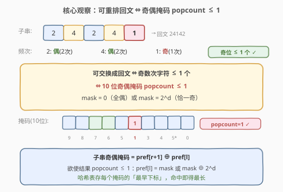
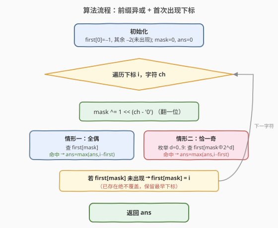
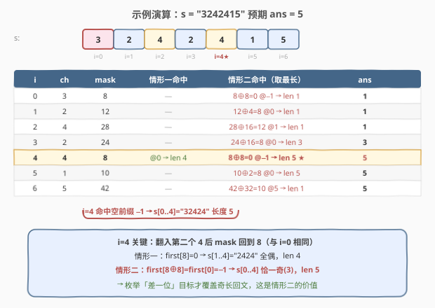

# 找出最长的超赞子字符串

- **题目名称**：找出最长的超赞子字符串
- **链接**：[1542. 找出最长的超赞子字符串](https://leetcode.cn/problems/find-longest-awesome-substring/)
- **难度**：困难
- **标签**：位运算、哈希表、字符串、前缀异或

## 1. 题目概述

给定一个**仅由数字组成**的字符串 `s`，返回其中最长的**超赞子字符串**的长度。「超赞子字符串」指 `s` 的一个非空子字符串，且**进行任意次数的字符交换后可以变成回文串**。

**示例 1**：

```text
输入：s = "3242415"
输出：5
解释："24241" 是最长的超赞子字符串，交换后可得回文 "24142"。
```

**示例 2**：

```text
输入：s = "12345678"
输出：1
```

**示例 3**：

```text
输入：s = "213123"
输出：6
解释："213123" 整段交换后可得回文 "231132"。
```

**示例 4**：

```text
输入：s = "00"
输出：2
```

**约束条件**：

- `1 <= s.length <= 10^5`
- `s` 仅由数字组成（即字符种类只有 `0`–`9` 共 **10** 种）

> ⚠️ 数据规模到 $10^5$，要求近 $O(n)$ 解法；又因字符种类被限定为 10 种，这把「奇偶性」压缩成 10 位掩码成为可能——这是本题能一次扫描求解的关键前提。

---

## 2. 解题思路

### 2.1 暴力思路

枚举所有子字符串 $s[l..r]$（$O(n^2)$ 对），对每段统计各数字频次，判断「奇数次出现的字符是否 $\le 1$ 个」。单段统计 $O(n)$，总复杂度 $O(n^3)$；即便用前缀频次表降到 $O(n^2)$，在 $n = 10^5$ 时仍是 $10^{10}$，必然超时。

需要找到「增量维护、一次扫描即可判定」的状态。

### 2.2 核心观察：可重排回文 ⇔ 奇偶掩码 popcount ≤ 1



**第一步：把「可重排回文」翻译成频次条件。** 一个字符串能通过交换变成回文，当且仅当其中**出现奇数次的字符不超过 1 个**（回文中心可放一个奇字符，其余必须成对）。

**第二步：只关心奇偶性。** 我们不需要知道每个数字出现了几次，只需知道它出现了**奇数次还是偶数次**。把每个数字 $d$ 的奇偶性编码为 1 个 bit（奇为 1、偶为 0），10 个数字正好拼成一个 **10 位掩码** `mask`：

$$
\text{mask} = \bigoplus_{d=0}^{9} \big(\text{count}(d) \bmod 2\big) \ll d
$$

于是「奇数次字符 $\le 1$ 个」等价于「$\text{mask}$ 的 popcount $\le 1$」，即 $\text{mask} = 0$（全偶）或 $\text{mask} = 2^d$（恰一个奇位）。

**第三步：前缀异或把子串奇偶性变成两端之差。** 设 $\text{pref}[i]$ 为前 $i$ 个字符的奇偶掩码（$\text{pref}[0] = 0$）。由于「异或」天然抵消成对贡献，子串 $s[l..r]$ 的奇偶掩码恰为：

$$
\text{parity}(s[l..r]) = \text{pref}[r+1] \oplus \text{pref}[l]
$$

> 💡 **关键转化**：问题从「枚举子串数频次」变成「**找两个前缀掩码，使其异或结果 popcount ≤ 1**，且距离尽量远」。这正是哈希表的舒适区——记录每个掩码**首次出现**的位置，后续遇到能配上的目标时直接算距离。

### 2.3 算法流程图



对每个右端点 $r$（遍历下标 `i`），当前掩码 `mask = pref[i+1]`。我们要找**最早**的 $l$ 使 $\text{pref}[l] \oplus \text{mask}$ 的 popcount $\le 1$，分两种情形：

| 情形 | 目标 `pref[l]` | 子串奇偶性 | 含义 |
|------|----------------|------------|------|
| 一 | `mask` | $0$ | 全偶——可重排成偶长回文 |
| 二 | `mask ^ (1<<d)`，$d \in 0..9$ | $2^d$ | 恰一个奇位——可重排成奇长回文 |

一次遍历即可：

1. 用数组 `first[0..1023]` 记录每个掩码**首次出现**的下标，初值 `-2` 表示「未出现」；`first[0] = -1`（空前缀 `pref[0]=0` 出现在下标 `-1`，对应从串首开始的子串）。
2. 维护当前 `mask` 与答案 `ans`。
3. 对每个下标 `i`、字符 `ch`：
   - `mask ^= 1 << (ch - '0')`（翻一位）。
   - **情形一**：若 `first[mask]` 已存在，`ans = max(ans, i - first[mask])`。
   - **情形二**：枚举 $d=0..9$，令 `target = mask ^ (1<<d)`；若 `first[target]` 已存在，`ans = max(ans, i - first[target])`。
   - 若 `first[mask]` 未出现，才写入 `first[mask] = i`（保留最早下标才能取最长）。
4. 遍历结束，`ans` 即答案。

> ⚠️ **与 [525. 连续数组](../0501-0600/525_连续数组.md) 的对照**：525 把「0/1 个数相等」压缩成单个前缀和、查 `pref[l] == pref[r+1]` 一种情形；本题目标条件是「popcount ≤ 1」，故除「相等」外还要枚举 10 种「差一位」的目标——共 $1 + 10 = 11$ 次查询。骨架完全一致：**求最长 → 存最早下标 → 已存在绝不覆盖**。

### 2.4 示例演算

以 `s = "3242415"` 为例（数字依次 `3,2,4,2,4,1,5`），预期答案 `5`（子串 `"32424"` 中 `3` 出现 1 次、`2` 与 `4` 各 2 次，恰一个奇位）：



| 步骤 | 字符 | mask | 情形一命中 | 情形二命中（取最长） | ans | first 更新 |
|------|------|------|------------|----------------------|-----|------------|
| 初始 | — | 0 | — | — | 0 | {0:−1} |
| i=0 | 3 | 8 | 无 | `8^8=0` @−1 → len 1 | 1 | 写 {8:0} |
| i=1 | 2 | 12 | 无 | `12^4=8` @0 → len 1 | 1 | 写 {12:1} |
| i=2 | 4 | 28 | 无 | `28^16=12` @1 → len 1 | 1 | 写 {28:2} |
| i=3 | 2 | 24 | 无 | `24^16=8` @0 → len **3** | 3 | 写 {24:3} |
| i=4 | 4 | 8 | @0 → len 4 | `8^8=0` @−1 → len **5** | 5 | 不覆盖 |
| i=5 | 1 | 10 | 无 | `10^2=8` @0 → len 5 | 5 | 写 {10:5} |
| i=6 | 5 | 42 | 无 | `42^32=10` @5 → len 1 | 5 | 写 {42:6} |

> 💡 **看 i=4 这一步**：翻入第二个 `4` 后掩码回到 `8`（与 `i=0` 处相同），于是 `s[1..4]="2424"` 全偶得长度 4；更妙的是 `8^8=0` 命中空前缀 `−1`，得到 `s[0..4]="32424"` 长度 5——这正是「枚举差一位目标」带来的收益：情形一只能找到全偶段，情形二才能覆盖「恰一个奇位」的奇长回文。

---

## 3. 参考代码

### C++

```cpp
class Solution {
  public:
    int longestAwesome(string s) {
        const int M = 1 << 10;
        vector<int> first(M, -2);   // -2 = 未出现
        first[0] = -1;              // 空前缀 mask=0 在下标 -1
        int ans = 0, mask = 0;
        for (int i = 0; i < (int)s.size(); ++i) {
            mask ^= 1 << (s[i] - '0');
            // 情形一：子串全偶（parity = 0）
            if (first[mask] != -2)
                ans = max(ans, i - first[mask]);
            // 情形二：子串恰一个奇位（parity = 2^d）
            for (int d = 0; d < 10; ++d) {
                int t = mask ^ (1 << d);
                if (first[t] != -2)
                    ans = max(ans, i - first[t]);
            }
            if (first[mask] == -2)  // 仅首次出现才记录
                first[mask] = i;
        }
        return ans;
    }
};
```

### Python

```python
class Solution:
    def longestAwesome(self, s: str) -> int:
        first = [-2] * 1024
        first[0] = -1            # 空前缀 mask=0 在下标 -1
        ans = mask = 0
        for i, ch in enumerate(s):
            mask ^= 1 << int(ch)
            if first[mask] != -2:                    # 情形一：全偶
                ans = max(ans, i - first[mask])
            for d in range(10):                      # 情形二：恰一个奇位
                t = mask ^ (1 << d)
                if first[t] != -2:
                    ans = max(ans, i - first[t])
            if first[mask] == -2:                    # 仅首次出现才记录
                first[mask] = i
        return ans
```

---

## 4. 复杂度分析

| 维度 | 复杂度 | 说明 |
|------|--------|------|
| 时间复杂度 | $O(n)$ | 遍历 $n$ 个字符，每步掩码翻转 $O(1)$ + 情形二枚举 10 个目标 $O(10)=O(1)$，总计 $O(10n)=O(n)$ |
| 空间复杂度 | $O(1)$ | 掩码仅 10 位，取值范围 $[0, 1023]$，`first` 数组固定大小 1024，与 $n$ 无关 |

> 💡 本题能压到 $O(1)$ 空间，全靠「字符种类只有 10 种」这一约束——掩码状态数 $2^{10}=1024$ 是常数。若字符集扩大到 26 个字母，状态数升至 $2^{26}\approx 6.7\times10^7$，仍可数组存但已偏大；扩到任意 Unicode 则必须退回哈希表。

---

## 5. 扩展：从「最长」到「计数」

本题求「最长超赞子串长度」，存的是每个掩码的**最早下标**。若改为「**统计**超赞子串的个数」，则只需把 `first` 换成「频次」并在每个右端点累加命中次数——这与 [1915. 好子数组的最大数目](https://leetcode.cn/problems/number-of-wonderful-substrings/) 完全同构（1915 正是本题的「计数版」，同为 10 位掩码 + popcount ≤ 1）。

| 题目 | 目标 | 表存什么 | 已存在时是否覆盖 |
|------|------|----------|------------------|
| **1542. 最长超赞子串** | **最长长度** | 掩码的**最早下标** | **不覆盖**，保留最早 |
| 1915. 好子数组的最大数目 | **计数** | 掩码的**出现频次** | 不覆盖，频次 +1 |

> 💡 口诀（承接 [525](../0501-0600/525_连续数组.md)）：**求个数存频次，求最长存最早**。两题骨架完全一致，只差哈希表存的内容与累加方式。

---

## 6. 面试要点

1. **为什么「可交换成回文」等价于「奇数次字符 ≤ 1 个」？**
   - 回文从中心对称：除中心一个字符外，其余字符必须两两配对出现在对称位置，故出现偶数次。「中心」至多放一个奇字符，因此奇数次字符不超过 1 个；反之满足此条件的串总能贪心配对、剩一个放中心，重排成回文。

2. **为什么用异或而不是前缀和来维护奇偶性？**
   - 奇偶性只有两种状态（奇/偶），天然可用 1 个 bit 表示；「翻一位」即异或 `1<<d`，且「成对抵消」正是异或的自反性 $a \oplus a = 0$。前缀和需 10 个计数器、判定时再逐个取模，而异或把它们压缩进一个整数，且子串奇偶性 = 两端异或，一步到位。

3. **`first[0] = -1` 的作用是什么？**
   - 当某段从串首开始且全偶（或恰一奇）时，需要配对的「左端前缀」是空前缀 `pref[0]=0`，它出现在下标 `-1`（数组起点之前）。不初始化 `-1` 会漏掉所有「从头开始」的合法子串；用 `-2` 作「未出现」哨兵以与合法下标 `-1` 区分。

4. **为什么情形二要枚举 10 个目标，情形一却只查 1 个？**
   - popcount ≤ 1 的掩码共有 $1 + 10 = 11$ 种：`0`（全偶）和 $2^d$（$d=0..9$，恰一奇）。给定当前 `mask`，欲使 `mask ^ target` 落在这 11 种上，`target` 必须是 `mask`（对应结果 0）或 `mask ^ 2^d`（对应结果 $2^d$）。所以情形一查 1 个、情形二查 10 个，共 11 次。

5. **能否返回最长超赞子串本身？**
   - 可以。命中时记录 `(first[target], i)` 作为候选端点，最终取最长那对，`s[first[target]+1 .. i]` 即答案子串，时间复杂度仍 $O(n)$；注意情形一对应 `first[mask]`、情形二对应 `first[mask ^ (1<<d)]`，两者都要跟踪。

---

## 7. 同类练习题

- [1915. 好子数组的最大数目](https://leetcode.cn/problems/number-of-wonderful-substrings/)：本题的「计数版」，同为 10 位掩码 + popcount ≤ 1，哈希表存频次而非下标
- [525. 连续数组](https://leetcode.cn/problems/contiguous-array/)（[题解](../0501-0600/525_连续数组.md)）：前缀异或/前缀和 + 哈希存最早下标的「最长」母题，骨架与本题完全一致
- [1371. 每个元音包含偶数次的最长子字符串](https://leetcode.cn/problems/find-the-longest-substring-containing-vowels-in-even-counts/)：5 位掩码 + 前缀异或求最长，只查「相等」一种情形，是本题的简化版
- [974. 和可被 K 整除的子数组](https://leetcode.cn/problems/subarray-sums-divisible-by-k/)（[题解](../0901-1000/974_和可被K整除的子数组.md)）：前缀余数 + 同余定理，前缀异或的「加法世界」镜像
- [1524. 和为奇数的子数组数目](https://leetcode.cn/problems/number-of-sub-arrays-with-odd-sum/)：前缀和奇偶性 + 计数，把「奇偶」压缩为单 bit 的思路与本题同源
