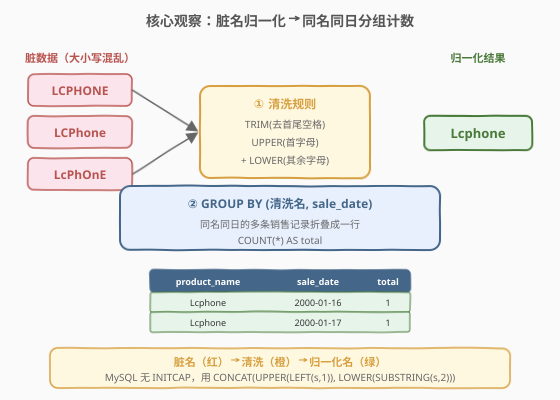
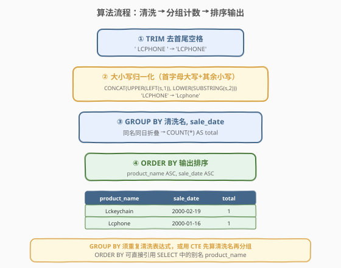
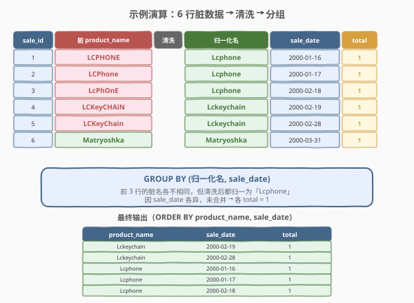

# 产品名称格式修复

- **题目名称**：产品名称格式修复
- **链接**：[1543. 产品名称格式修复 🔒](https://leetcode.cn/problems/fix-product-name-format/)
- **难度**：简单
- **标签**：SQL、字符串清洗、`TRIM`、`UPPER`/`LOWER`、`CONCAT`、`GROUP BY`、`COUNT`、LeetCode 锁题

## 1. 题目概述

给定 `Sales` 表，其 `product_name` 列存在两类「脏数据」：① 首尾可能有多余空格；② 大小写混乱（应为「首字母大写、其余小写」）。编写 SQL 查询，**清洗产品名后**按 `(清洗名, sale_date)` 分组统计销售次数，并按 `product_name`、`sale_date` 升序输出。

**表结构**：

```text
Table: Sales
+-------------+---------+
| Column Name | Type    |
+-------------+---------+
| sale_id     | int     |  ← 主键
| product_name| varchar |
| sale_date   | date    |
+-------------+---------+
该表包含每笔销售的产品名与销售日期。
product_name 列可能含首尾空格，且大小写不规范。
```

**清洗规则**：

1. **去首尾空格**：`TRIM(product_name)`
2. **大小写归一化**：首字母大写，其余字母小写（注意是**整个字符串的首字母**，非每个单词）

**输出列**：`product_name`（清洗后）、`sale_date`、`total`（该产品在当日的销售次数）。

**示例 1**：

```text
输入：
Sales 表:
+---------+--------------+------------+
| sale_id | product_name | sale_date  |
+---------+--------------+------------+
| 1       | LCPHONE      | 2000-01-16 |
| 2       | LCPhone      | 2000-01-17 |
| 3       | LcPhOnE      | 2000-02-18 |
| 4       | LCKeyCHAiN   | 2000-02-19 |
| 5       | LCKeyChain   | 2000-02-28 |
| 6       | Matryoshka   | 2000-03-31 |
+---------+--------------+------------+

输出：
+--------------+------------+-------+
| product_name | sale_date  | total |
+--------------+------------+-------+
| Lckeychain   | 2000-02-19 | 1     |
| Lckeychain   | 2000-02-28 | 1     |
| Lcphone      | 2000-01-16 | 1     |
| Lcphone      | 2000-01-17 | 1     |
| Lcphone      | 2000-02-18 | 1     |
| Matryoshka   | 2000-03-31 | 1     |
+--------------+------------+-------+
```

**解释**：

| sale_id | 脏名 | 清洗后 | 说明 |
|---------|------|--------|------|
| 1 | `LCPHONE` | `Lcphone` | 全大写 → 首字母 L 大写 + 其余 cphone 小写 |
| 2 | `LCPhone` | `Lcphone` | 混合大小写 → 同样归一为 Lcphone |
| 3 | `LcPhOnE` | `Lcphone` | 随机大小写 → 同样归一为 Lcphone |
| 4 | `LCKeyCHAiN` | `Lckeychain` | 全词首字母大写后小写化 |
| 5 | `LCKeyChain` | `Lckeychain` | 与 #4 归一为同一产品 |
| 6 | `Matryoshka` | `Matryoshka` | 本就规范，清洗后不变 |

> ⚠️ 前 3 行脏名各异，清洗后均归一为「Lcphone」；但因 `sale_date` 各不相同，分组后不合并，各自 `total = 1`。若 #1 与 #2 的 `sale_date` 相同（如同为 `2000-01-16`），则合并为一行 `total = 2`。

**约束条件**：

- `sale_id` 是 `Sales` 表的主键
- `product_name` 仅含英文字母与空格
- 结果按 `product_name` 升序、`sale_date` 升序排列

> 💡 本题是 SQL **"字符串清洗 + 分组聚合"入门招牌题**——核心三步：① `TRIM` 去空格；② `CONCAT(UPPER(LEFT(s,1)), LOWER(SUBSTRING(s,2)))` 归一大小写（MySQL 无 `INITCAP`）；③ `GROUP BY (清洗名, sale_date)` + `COUNT(*)`。难点在于手写「首字母大写+其余小写」表达式，以及 `GROUP BY` 须重复该表达式（或用 CTE 先算清洗名）。

---

## 2. 解题思路

### 2.1 暴力思路：逐行清洗

最直觉的过程式思路：遍历 `Sales` 每行，对 `product_name` 先 `trim` 去空格，再首字母大写、其余小写，然后按 `(清洗名, sale_date)` 累加计数。伪代码：

```text
dict = {}
for each row in Sales:
    name = trim(row.product_name)
    name = uppercase(name[0]) + lowercase(name[1:])
    key = (name, row.sale_date)
    dict[key] += 1
result = sorted(dict.items(), by=(name asc, sale_date asc))
```

但**纯 SQL 没有显式逐行循环**——「清洗 + 分组计数」需换成集合式表达：在 `SELECT` 中用字符串函数算出清洗名，再 `GROUP BY` 该清洗名与日期折叠。

### 2.2 核心观察：TRIM + 大小写归一化 + GROUP BY 计数



**问题拆解为三个子问题**：

1. **去空格**：`TRIM(product_name)` 去除首尾空格。注意只去首尾，**不去中间空格**——产品名可能合法地含空格（如 `LC Phone` 清洗后为 `Lc phone`）。

2. **大小写归一化**：MySQL **没有内置 `INITCAP`**（不像 PostgreSQL/Oracle），需手动拼接：
   - `UPPER(LEFT(s, 1))`：取首字符并转大写
   - `LOWER(SUBSTRING(s, 2))`：取第 2 字符起的剩余并转小写
   - `CONCAT(...)` 拼回完整字符串

   > ⚠️ **这是「句子式首字母大写」而非「标题式每词首字母大写」**。`LcPhOnE` → `Lcphone`（仅首字母 L 大写，cphone 全小写），而非 `LcPhone`。题目要求的是前者。

3. **分组计数**：`GROUP BY (清洗名, sale_date)`，`COUNT(*) AS total` 统计同产品同日的销售次数。

> 💡 **为何 `GROUP BY` 要重复清洗表达式？** SQL 中 `GROUP BY` 在 `SELECT` 之前执行（逻辑上），分组依据必须是**原始列或基于原始列的表达式**，不能引用 `SELECT` 中定义的别名。故 `GROUP BY` 中需写完整的 `CONCAT(UPPER(...), LOWER(...))` 表达式。若觉得冗长，可用 **CTE 先算出清洗名再分组**（见解法 B），可读性更佳。

> ⚠️ **最易错点**：误以为 MySQL 有 `INITCAP` 或 `PROPER` 函数直接搞定大小写。实际上 MySQL/MariaDB **均无此内置函数**，必须用 `CONCAT + UPPER + LEFT + LOWER + SUBSTRING` 组合实现。

### 2.3 算法流程图



**逻辑执行步骤**：

| 步骤 | 子句 | 作用 |
|------|------|------|
| ① | `TRIM(product_name)` | 去除首尾空格 |
| ② | `CONCAT(UPPER(LEFT(s,1)), LOWER(SUBSTRING(s,2)))` | 首字母大写 + 其余小写，得到清洗名 |
| ③ | `GROUP BY 清洗名, sale_date` + `COUNT(*)` | 同产品同日折叠计数 |
| ④ | `ORDER BY product_name ASC, sale_date ASC` | 按清洗名、日期升序输出 |

> 💡 **SQL 子句执行顺序**：`FROM` → `WHERE` → `GROUP BY` → `HAVING` → `SELECT`（含别名定义）→ `ORDER BY` → `LIMIT`。`GROUP BY` 在 `SELECT` 之前，故无法引用 `SELECT` 别名；而 `ORDER BY` 在 `SELECT` 之后，**可以引用别名** `product_name`——这是「`GROUP BY` 须重复表达式、`ORDER BY` 可用别名」的根本原因。

### 2.4 示例演算

以示例 1 数据为例，观察「清洗 → 分组 → 排序」的逐步过程：



**步骤 ①②：逐行清洗 product_name**

| sale_id | 脏名 | TRIM 后 | 首字母 | 其余 | 清洗名 |
|---------|------|---------|--------|------|--------|
| 1 | `LCPHONE` | `LCPHONE` | `L` | `cphone` | `Lcphone` |
| 2 | `LCPhone` | `LCPhone` | `L` | `cphone` | `Lcphone` |
| 3 | `LcPhOnE` | `LcPhOnE` | `L` | `cphone` | `Lcphone` |
| 4 | `LCKeyCHAiN` | `LCKeyCHAiN` | `L` | `ckeychain` | `Lckeychain` |
| 5 | `LCKeyChain` | `LCKeyChain` | `L` | `ckeychain` | `Lckeychain` |
| 6 | `Matryoshka` | `Matryoshka` | `M` | `atryoshka` | `Matryoshka` |

**步骤 ③：GROUP BY (清洗名, sale_date) + COUNT(*)**

| 清洗名 | sale_date | 行数 | total |
|--------|-----------|------|-------|
| Lckeychain | 2000-02-19 | #4 | 1 |
| Lckeychain | 2000-02-28 | #5 | 1 |
| Lcphone | 2000-01-16 | #1 | 1 |
| Lcphone | 2000-01-17 | #2 | 1 |
| Lcphone | 2000-02-18 | #3 | 1 |
| Matryoshka | 2000-03-31 | #6 | 1 |

**步骤 ④：ORDER BY product_name ASC, sale_date ASC**

按清洗名字典序排列：`Lckeychain` < `Lcphone`（前两字符 `Lc` 相同，第 3 字符 `k` < `p`）；`Lcphone` < `Matryoshka`（首字符 `L` < `M`）。每组内按 `sale_date` 升序，得到最终 6 行输出。

> 💡 **为何本例 total 全为 1？** 6 行的 `(清洗名, sale_date)` 组合互不相同，分组后每组只有 1 行。若存在两行清洗名与日期均相同（如 #1、#2 的 `sale_date` 改为同一天），它们会合并为一行 `total = 2`。这正是 `GROUP BY` 的意义——**把「同一产品的同日多次销售」折叠成一行计数**。

---

## 3. 参考代码

### SQL（解法 A：`GROUP BY` 内联清洗表达式）

```sql
SELECT
    CONCAT(UPPER(LEFT(TRIM(product_name), 1)),
           LOWER(SUBSTRING(TRIM(product_name), 2))) AS product_name,
    sale_date,
    COUNT(*) AS total
FROM Sales
GROUP BY
    CONCAT(UPPER(LEFT(TRIM(product_name), 1)),
           LOWER(SUBSTRING(TRIM(product_name), 2))),
    sale_date
ORDER BY product_name ASC, sale_date ASC;
```

> 💡 **写法要点**：
> - **`TRIM(product_name)`**：去除首尾空格。MySQL 的 `TRIM` 默认去空格；若要去其他字符需 `TRIM(BOTH 'x' FROM s)`。
> - **`UPPER(LEFT(s, 1))`**：`LEFT(s, 1)` 取首字符，`UPPER` 转大写。等价写法 `UPPER(SUBSTRING(s, 1, 1))`。
> - **`LOWER(SUBSTRING(s, 2))`**：`SUBSTRING(s, 2)` 取第 2 字符起的剩余（MySQL 下标从 1 开始），`LOWER` 转小写。空串时返回空串，安全。
> - **`GROUP BY` 重复完整清洗表达式**：不能用别名 `product_name`，因 `GROUP BY` 先于 `SELECT` 执行。
> - **`ORDER BY product_name`**：此处**可引用别名**，因 `ORDER BY` 后于 `SELECT` 执行。
> - **`COUNT(*)`**：统计每组行数，含所有列。

### SQL（解法 B：CTE 先算清洗名，推荐）

```sql
WITH Cleaned AS (
    SELECT
        CONCAT(UPPER(LEFT(TRIM(product_name), 1)),
               LOWER(SUBSTRING(TRIM(product_name), 2))) AS product_name,
        sale_date
    FROM Sales
)
SELECT
    product_name,
    sale_date,
    COUNT(*) AS total
FROM Cleaned
GROUP BY product_name, sale_date
ORDER BY product_name ASC, sale_date ASC;
```

> 💡 **解法 B 的优势**：用 CTE 把清洗逻辑封装一次，下游 `GROUP BY`/`ORDER BY` 直接引用清洗后的 `product_name` 列名，**避免重复书写冗长的 `CONCAT(...)` 表达式**，可读性与可维护性更佳。MySQL 8.0+ 支持 CTE（`WITH` 子句）；LeetCode 在线判题使用 MySQL 8.0，可放心使用。
>
> **与解法 A 的等价性**：CTE 只是把「算清洗名」提前物化，逻辑上与解法 A 完全一致，优化器通常能将二者生成相同的执行计划。

### SQL（解法 C：`INSERT ... UNION` 思路的伪 `INITCAP`，仅作对照）

某些数据库（PostgreSQL/Oracle）提供 `INITCAP(s)` 直接实现「每词首字母大写」。但本题要求的是「**整个字符串**首字母大写」（非每词），且 MySQL 无此函数，故不能用 `INITCAP` 替代。仅列出对照说明：

```sql
-- PostgreSQL 的 INITCAP 是「每词首字母大写」，语义与本题不同，不可用！
-- INITCAP('lc phone')  →  'Lc Phone'   （每词首字母大写）
-- 本题要求            →  'Lc phone'   （仅整个串首字母大写）
```

> ⚠️ **`INITCAP` 语义陷阱**：即便数据库支持 `INITCAP`，它实现的是「**每个单词**首字母大写」，会产出 `Lc Phone`（空格后字母也大写），与本题「仅整个串首字母大写」语义不符。故本题必须手写 `CONCAT(UPPER(LEFT(s,1)), LOWER(SUBSTRING(s,2)))`。

### Python（pandas）

```python
import pandas as pd

def fix_product_name_format(sales: pd.DataFrame) -> pd.DataFrame:
    sales['product_name'] = sales['product_name'].str.strip().str.capitalize()
    result = (
        sales.groupby(['product_name', 'sale_date'])
        .size()
        .reset_index(name='total')
    )
    result = result.sort_values(['product_name', 'sale_date']).reset_index(drop=True)
    return result[['product_name', 'sale_date', 'total']]
```

> 💡 **pandas 对照**：
> - `.str.strip()` 对应 SQL 的 `TRIM(product_name)`——去首尾空格。
> - `.str.capitalize()` 对应 `CONCAT(UPPER(LEFT(s,1)), LOWER(SUBSTRING(s,2)))`——pandas 的 `capitalize` 语义恰为「首字母大写、其余小写」，与本题要求**完全一致**（注意它不是 `title`，`title` 是每词首字母大写，对应 `INITCAP`）。
> - `.groupby(['product_name', 'sale_date']).size()` 对应 `GROUP BY 清洗名, sale_date` + `COUNT(*)`——`size` 返回每组行数。
> - `.reset_index(name='total')` 把分组键还原为列、计数列命名为 `total`。
> - `.sort_values(['product_name', 'sale_date'])` 对应 `ORDER BY product_name, sale_date`。

---

## 4. 复杂度分析

| 维度 | 解法 A（内联 `GROUP BY`） | 解法 B（CTE 先清洗） | pandas |
|------|--------------------------|----------------------|--------|
| **时间** | $O(n \log n)$ | $O(n \log n)$ | $O(n \log n)$ |
| **空间** | $O(n)$ | $O(n)$ | $O(n)$ |
| **表达式重复** | ✓ 重复 2 次 | ✗ 仅写 1 次 | ✗ 链式调用 1 次 |
| **可读性** | 一般（表达式冗长） | ✓ 最清晰 | ✓ 清晰 |
| **推荐度** | ✓ 兼容旧版 | ✓ **首选** | ✓ 验证用 |

> - $n$ = `Sales` 表行数
> - **时间**：清洗每行 $O(L)$（$L$ 为字符串长度，常数级），扫 $n$ 行 $O(n)$；`GROUP BY` 哈希分组 $O(n)$；`ORDER BY` 排序 $O(n \log n)$，总体 $O(n \log n)$。
> - **空间**：分组哈希表与排序缓冲 $O(n)$；CTE 物化清洗结果 $O(n)$。
> - **索引优化**：本题以字符串函数计算为瓶颈，常规 B+ 树索引对「函数计算后的列」无效。若清洗名查询频繁，可建**生成列 + 索引**：`GENERATED COLUMN AS (CONCAT(...)) STORED` 并在其上建索引。

---

## 5. 扩展：MySQL 字符串大小写函数族

### 5.1 四种「大小写」语义对比

| 函数/写法 | 语义 | `'lc phone ABC'` → | 本题适用? |
|-----------|------|---------------------|-----------|
| `LOWER(s)` / `LCASE(s)` | 全小写 | `lc phone abc` | ✗（全小写，非首字母大写） |
| `UPPER(s)` / `UCASE(s)` | 全大写 | `LC PHONE ABC` | ✗ |
| `INITCAP(s)`（PG/Oracle） | **每词**首字母大写 | `Lc Phone Abc` | ✗（语义不符） |
| `CONCAT(UPPER(LEFT(s,1)), LOWER(SUBSTRING(s,2)))` | **整串**首字母大写 | `Lc phone abc` | ✓ **本题所需** |

> 💡 **口诀**：`LOWER`/`UPPER` 是「一刀切全转」，`INITCAP` 是「每词首字母」，而本题要的是「整串首字母」——MySQL 无内置函数，必须手写 `CONCAT + UPPER(LEFT) + LOWER(SUBSTRING)`。

### 5.2 边界情况

| 输入 | `TRIM` 后 | 清洗结果 | 说明 |
|------|-----------|----------|------|
| `'  LCPHONE  '` | `LCPHONE` | `Lcphone` | 首尾空格被 `TRIM` 去除 |
| `'A'` | `A` | `A` | 单字符：`SUBSTRING(s,2)` 返回空串，`CONCAT('A','')` = `'A'` |
| `''`（空串） | `''` | `''` | `LEFT('',1)` 返回空串，`UPPER('')=''`，结果空串 |
| `' lc phone '` | `lc phone` | `Lc phone` | 中间空格保留，仅首字母 `l→L`，其余含 `p` 转小写 |

> ⚠️ 单字符与空串场景下，`SUBSTRING(s, 2)` 返回空串不会报错，`CONCAT` 自动忽略空串参数。这是该写法安全的根本原因。

---

## 6. 面试要点

1. **MySQL 没有 `INITCAP`，如何实现「首字母大写、其余小写」？**

   > 用 `CONCAT(UPPER(LEFT(s, 1)), LOWER(SUBSTRING(s, 2)))`。`LEFT(s, 1)` 取首字符，`UPPER` 转大写；`SUBSTRING(s, 2)` 取第 2 字符起的剩余，`LOWER` 转小写；`CONCAT` 拼接。注意先 `TRIM` 去空格，否则首字符可能是空格。

2. **为什么 `GROUP BY` 中要重复清洗表达式，而 `ORDER BY` 可以直接用别名？**

   > SQL 逻辑执行顺序为 `GROUP BY` → `SELECT`（定义别名）→ `ORDER BY`。`GROUP BY` 在 `SELECT` 之前执行，此时别名 `product_name` 尚未定义，必须写完整的清洗表达式；`ORDER BY` 在 `SELECT` 之后执行，别名已生效，可直接引用。这是 SQL 子句执行顺序的直接推论。

3. **本题的「首字母大写」与 PostgreSQL 的 `INITCAP` 有何不同？**

   > `INITCAP` 实现的是「**每个单词**首字母大写」（空格分隔的每个词都首字母大写），如 `INITCAP('lc phone')` → `Lc Phone`。本题要求「**整个字符串**首字母大写」，如 `lc phone` → `Lc phone`（仅首字母 L 大写，`phone` 的 p 仍小写）。语义不同，故即便有 `INITCAP` 也不能用。

4. **`TRIM` 只去首尾空格还是也去中间空格？**

   > `TRIM(s)` 默认只去除**首尾**空格，**不去中间空格**。产品名可能合法含空格（如 `LC Phone`），清洗后为 `Lc phone`，中间空格保留。若需去所有空格，用 `REPLACE(s, ' ', '')`。本题明确只去首尾。

5. **若同一清洗名在同一天有多次销售，`total` 如何变化？**

   > `GROUP BY (清洗名, sale_date)` 把同产品同日的多行折叠为一行，`COUNT(*)` 累加行数。若 `Lcphone` 在 `2000-01-16` 有 3 笔销售，则输出 `Lcphone | 2000-01-16 | 3`。这正是分组计数的意义——把脏数据中「同产品同日」的多次记录归并统计。

> 💡 **一句话总结**：1543 是 SQL **"字符串清洗 + 分组计数"入门招牌题**——核心模板「`TRIM` 去空格 → `CONCAT(UPPER(LEFT(s,1)), LOWER(SUBSTRING(s,2)))` 归一大小写 → `GROUP BY 清洗名, sale_date` + `COUNT(*)` → `ORDER BY`」。最大要点：**MySQL 无 `INITCAP`，手写首字母大写表达式；`GROUP BY` 须重复表达式或用 CTE 先算清洗名**。

---

## 7. 同类练习题

- [1527. 患某种疾病的患者 🔒](https://leetcode.cn/problems/patients-with-a-condition/)：`LIKE` + `LOWER` 大小写不敏感匹配，同为「字符串清洗/规范化」家族，叠加 `LIKE` 模式匹配
- [1667. 修复表中的名字 🔒](https://leetcode.cn/problems/fix-names-in-a-table/)：几乎同构——`TRIM` + 首字母大写 + 其余小写，仅输出列不同（无分组计数），是 1543 的退化版
- [196. 删除重复的电子邮箱](https://leetcode.cn/problems/delete-duplicate-emails/)：`DELETE` + 自连接去重，共享「字符串列规范化后判定重复」的清洗思想
- [511. 游戏玩法分析 I](https://leetcode.cn/problems/game-play-analysis-i/)：`GROUP BY + MIN` 聚合，共享 1543 的「`GROUP BY` 分组聚合」骨架（无字符串清洗）
- [627. 变更性别](https://leetcode.cn/problems/swap-salary/)：`UPDATE + CASE WHEN` 字符串列重写，同为「字符串列规范化」的 DML 版本
