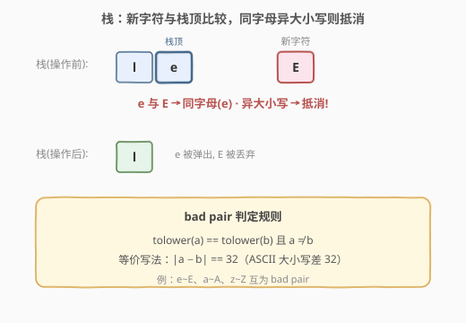
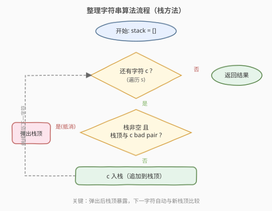
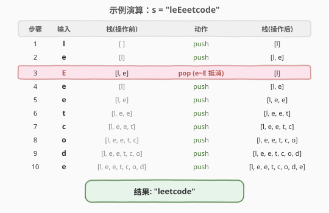

# 整理字符串

- **题目名称**：整理字符串
- **链接**：[1544. 整理字符串](https://leetcode.cn/problems/make-the-string-great/)
- **难度**：简单
- **标签**：栈、字符串

## 1. 题目概述

给定一个由大小写英文字母组成的字符串 `s`，其中「坏对」定义为两个相邻字符 `s[i]` 和 `s[i+1]` 满足：

- `s[i]` 是某字母的小写，`s[i+1]` 是同一字母的大写（或反过来）

为使字符串变「好」，你可以反复选择任意一对相邻的坏对并**同时删除**这两个字符，直到字符串中不再有坏对。返回最终得到的「好字符串」。

**示例 1**：

```text
输入：s = "leEeetcode"
输出："leetcode"
解释：第一对坏对 "eE" 出现在下标 1-2，删除后得到 "leetcode"，不再有坏对。
```

**示例 2**：

```text
输入：s = "abBAcC"
输出：""
解释：存在多种删除顺序，但无论哪种顺序最终都得到空串。
     例如先删 "bB" → "aAcC" → 删 "aA" → "cC" → 删 "cC" → ""。
```

**示例 3**：

```text
输入：s = "s"
输出："s"
解释：字符串只有一个字符，不可能有坏对。
```

**约束条件**：

- `1 <= s.length <= 100`
- `s` 仅由大小写英文字母组成

---

## 2. 解题思路

### 2.1 暴力思路

反复扫描字符串：每轮找到第一个坏对（相邻的同字母异大小写对），删除后重新开始扫描，直到某一轮没有坏对为止。最坏情况下（如 `"abBAcC"` 逐对消除），每轮删 2 个字符共 $n/2$ 轮，每轮扫描 $O(n)$，总计 $O(n^2)$。虽然 $n \le 100$ 能过，但不够优雅。

> 💡 关键问题在于：删除一对后，原本不相邻的两个字符可能变成新的相邻坏对。暴力法反复从头扫描浪费了大量已确认无坏对的前缀信息。

### 2.2 核心观察：栈



栈天然解决了「删除后新相邻」的问题：

- 逐个字符入栈，**入栈前**检查新字符与栈顶是否构成坏对。
- 若是坏对 → 弹出栈顶（相当于同时删除这两个字符），新字符也**不入栈**。
- 若不是坏对 → 新字符正常入栈。

> 💡 **为什么栈能自动处理「删除后新相邻」？** 弹出栈顶后，栈的新栈顶就是之前被隔开的字符。下一个字符到来时会与这个新栈顶比较——这正是「删除后新相邻」的自动处理。无需回头扫描。

**坏对判定**：两个字符 `a`、`b` 构成坏对当且仅当 `tolower(a) == tolower(b)` 且 `a ≠ b`。等价地，对英文字母可直接判断 $|a - b| = 32$（ASCII 中大小写字母差恰好 32）。

### 2.3 算法流程图



整体只有一重遍历，每个字符至多入栈一次、出栈一次，总操作不超过 $2n$。

### 2.4 示例演算

以 `s = "leEeetcode"` 为例：



关键在第 3 步：`E` 到来时栈顶为 `e`，二者构成坏对（同字母 `e`、大小写不同），弹出 `e` 且 `E` 不入栈。之后 `e` 到来时栈顶变为 `l`，不构成坏对，正常入栈——最终结果 `"leetcode"` 正好去掉了多余的 `"eE"`。

---

## 3. 参考代码

### C++（字符串模拟栈）

```cpp
class Solution {
public:
    string makeGood(string s) {
        string stack;
        for (char c : s) {
            if (!stack.empty() && abs(stack.back() - c) == 32) {
                stack.pop_back();
            } else {
                stack.push_back(c);
            }
        }
        return stack;
    }
};
```

### Python

```python
class Solution:
    def makeGood(self, s: str) -> str:
        stack = []
        for c in s:
            if stack and abs(ord(stack[-1]) - ord(c)) == 32:
                stack.pop()
            else:
                stack.append(c)
        return "".join(stack)
```

> 💡 **用 `string` 当栈**：C++ 中直接用 `std::string` 的 `push_back` / `pop_back` / `back()` 模拟栈，比 `stack<char>` 更简洁，且最终直接返回字符串无需转换。Python 中用 `list` 模拟栈，最后 `"".join()` 拼接。

---

## 4. 复杂度分析

| 维度 | 复杂度 | 说明 |
|------|--------|------|
| 时间复杂度 | $O(n)$ | 每个字符至多入栈一次、出栈一次，总计 $2n$ 次操作 |
| 空间复杂度 | $O(n)$ | 栈最坏存放全部 $n$ 个字符（无坏对时） |

---

## 5. 扩展：原地双指针

若要求 $O(1)$ 额外空间，可用双指针在原字符串上模拟栈：

```cpp
class Solution {
public:
    string makeGood(string s) {
        int top = 0;
        for (int i = 0; i < s.size(); ++i) {
            if (top > 0 && abs(s[top - 1] - s[i]) == 32) {
                top--;
            } else {
                s[top++] = s[i];
            }
        }
        s.resize(top);
        return s;
    }
};
```

`top` 指针之前的部分就是「栈内容」，新字符要么覆盖写入 `s[top]` 并递增 `top`，要么 `top--` 弹出。最终 `s.resize(top)` 截断即可。

---

## 6. 面试要点

1. **为什么用栈而不是从头反复扫描？**

   - 删除一对坏对后，之前被隔开的字符可能变成新的相邻坏对。栈在弹出后自动让新栈顶暴露，下一个字符自然与新栈顶比较——无需回头扫描，$O(n)$ 一次遍历搞定。

2. **坏对的判定条件怎么写？**

   - `tolower(a) == tolower(b) && a != b`（最直观），或对纯字母输入直接 `abs(a - b) == 32`（ASCII 大小写差 32，最快）。注意 `a != b` 不能省，否则同大小写的相同字母也会被误删。

3. **本题与 [1047. 删除字符串中的所有相邻重复项](https://leetcode.cn/problems/remove-all-adjacent-duplicates-in-string/) 的区别？**

   - 1047 删除的是**完全相同**的相邻字符（`aa` → 删），而 1544 删除的是**同字母异大小写**的相邻字符（`aA` 或 `Aa` → 删，但 `aa` 不删）。骨架完全一样，只是判定条件从 `a == b` 变成 `tolower(a) == tolower(b) && a != b`。

4. **删除顺序会影响最终结果吗？**

   - 不会。可以证明：无论按什么顺序删除坏对，最终得到的字符串相同。因为每对坏对的删除是「可交换」的——两对不重叠的坏对互不影响，重叠的坏对（如 `aAa` 中间有 `Aa` 和 `aA` 两对）删除任意一对后另一对也自然消失。栈方法隐式选择了「从左到右」的顺序，但结果与任意顺序一致。

5. **能否原地 $O(1)$ 空间？**

   - 可以。用双指针 `top` 在原数组上模拟栈（见第 5 节），写入和弹出都在原数组完成，最后 `resize` 截断。面试中可作为 follow-up 主动提出。

---

## 7. 同类练习题

- [1047. 删除字符串中的所有相邻重复项](https://leetcode.cn/problems/remove-all-adjacent-duplicates-in-string/)：完全相同字符的相邻删除，栈模板，本题的「精确匹配」版
- [1209. 删除字符串中的所有相邻重复项 II](https://leetcode.cn/problems/remove-all-adjacent-duplicates-ii/)：相邻 k 个相同字符才删除，栈 + 计数，1544 的进阶变体
- [71. 简化路径](https://leetcode.cn/problems/simplify-path/)：栈处理路径分量，同样的「遇到特定条件弹出」模式
- [20. 有效的括号](https://leetcode.cn/problems/valid-parentheses/)：栈匹配括号对，与本题「配对抵消」思想一致
- [2390. 从字符串中移除星号](https://leetcode.cn/problems/removing-stars-from-a-string/)：星号删除前一个字符，栈模拟，同骨架
