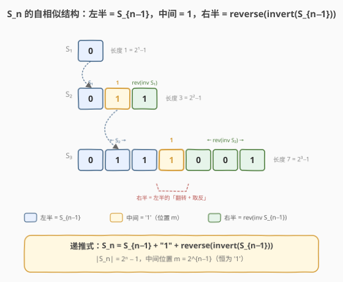
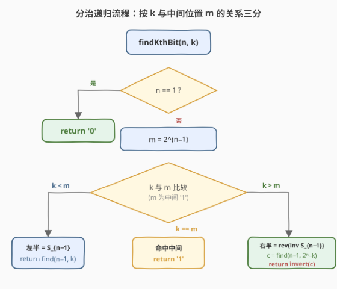
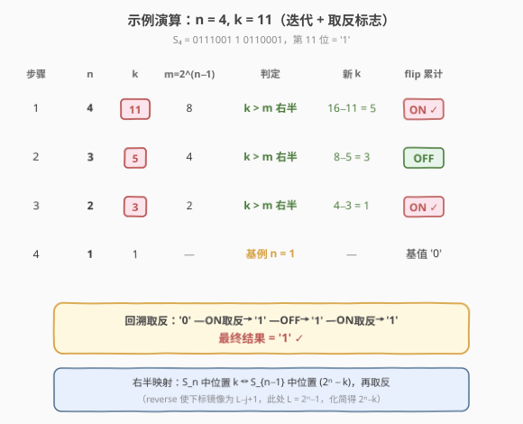

# LeetCode 找出第N个二进制字符串的第K位 题解

## 1. 题目概述

- **标题 / 题号**：找出第N个二进制字符串的第K位（#1545，medium）
- **链接**：https://leetcode.cn/problems/find-kth-bit-in-nth-binary-string/
- **难度**：中等
- **标签**：递归、分治、字符串、位运算

**题意**：定义二进制字符串序列 $S_1, S_2, \dots$：

- $S_1 = \texttt{"0"}$
- 对 $i > 1$：$S_i = S_{i-1} + \texttt{"1"} + \text{reverse}(\text{invert}(S_{i-1}))$

其中 `invert(x)` 把串中每一位取反（`0`→`1`、`1`→`0`），`reverse(x)` 把串翻转。

给定正整数 $n$ 和 $k$，返回 $S_n$ 中第 $k$ 位字符（**1-indexed**）。

**示例 1**：

```text
输入：n = 3, k = 1
输出："0"
解释：S_3 = "0111001"，第 1 位为 '0'。
```

**示例 2**：

```text
输入：n = 4, k = 11
输出："1"
解释：S_4 = "011100110110001"，第 11 位为 '1'。
```

**示例 3**：

```text
输入：n = 1, k = 1
输出："0"
解释：S_1 = "0"。
```

**示例 4**：

```text
输入：n = 2, k = 3
输出："1"
解释：S_2 = "011"，第 3 位为 '1'。
```

**约束**：

- $1 \le n \le 20$
- $1 \le k \le 2^n - 1$

> 💡 由递推式可归纳出 $|S_n| = 2|S_{n-1}| + 1 = 2^n - 1$，因此 $k$ 的上界恰好是 $S_n$ 的长度。

## 2. 解题思路

### 2.1 暴力思路

按递推式逐层构造 $S_n$：从 $S_1 = \texttt{"0"}$ 出发，每轮对当前串**取反 + 翻转**拼到尾部。最终取 $S_n[k-1]$。

```cpp
string s = "0";
for (int i = 2; i <= n; ++i) {
    string t = s;
    for (char &c : t) c ^= 1;        // '0'^1='1', '1'^1='0'
    reverse(t.begin(), t.end());
    s = s + "1" + t;
}
return s[k - 1];
```

- 时间 $O(2^n)$、空间 $O(2^n)$。$n=20$ 时 $|S_{20}| \approx 10^6$，能过但浪费——我们只需要**一个字符**却构造了整条串。

> ⚠️ 关键浪费：题目只问第 $k$ 位的值，而暴力把整条 $S_n$ 物化出来。能否只沿着第 $k$ 位所在的「路径」向下递归？

### 2.2 核心观察：分治递归



$S_n$ 具有**自相似结构**：它是 $S_{n-1}$ 的两份拷贝（右份先取反再翻转）夹一个 `1`：

$$S_n = \underbrace{S_{n-1}}_{\text{左半}} + \underbrace{\texttt{1}}_{\text{中间}} + \underbrace{\text{reverse}(\text{invert}(S_{n-1}))}_{\text{右半}}$$

设 $L_n = 2^n - 1$，中间 `1` 的位置为 $m = 2^{n-1}$（1-indexed）。则第 $k$ 位落在三个区间之一：

| $k$ 的位置 | 所在区间 | 处理 |
|------------|----------|------|
| $k = m$ | 中间 | 直接返回 `'1'` |
| $k < m$ | 左半 $= S_{n-1}$ | 递归 $\text{find}(n-1, k)$，**不变** |
| $k > m$ | 右半 $= \text{reverse}(\text{invert}(S_{n-1}))$ | 镜像到 $S_{n-1}$ 的对应位，**再取反** |

**右半的映射推导**：右半长度 $= L_{n-1} = 2^{n-1}-1$。设 $k$ 在右半内的偏移 $j = k - m$（$j \in [1, L_{n-1}]$）。由于右半是 `reverse(invert(S_{n-1}))`：

- `reverse` 把右半第 $j$ 个字符对应到 $\text{invert}(S_{n-1})$ 的第 $L_{n-1} - j + 1$ 个；
- `invert` 再对该位取反。

化简下标：$L_{n-1} - j + 1 = (2^{n-1}-1) - (k - 2^{n-1}) + 1 = 2^n - k$。

> 💡 即 **$S_n$ 的第 $k$ 位 = `invert`( $S_{n-1}$ 的第 $(2^n - k)$ 位 )**。每深入一层，要么不变（走左半），要么「换下标 + 取反」（走右半）。

### 2.3 算法流程图



每层做一次三分判定，$n$ 每减 1，最多递归 $n$ 层即触底（$n=1$ 返回 `'0'`）。

### 2.4 示例演算

以 $n=4, k=11$（示例 2）为例，沿着第 11 位向下递归：



三次都走右半（$k > m$），下标依次变为 $5 \to 3 \to 1$，取反标志在 ON/OFF 间翻转。触底 $S_1$ 的第 1 位为 `'0'`，累计取反次数为奇数（3 次），故 `'0' → '1'`。

## 3. 参考代码

### C++（分治递归）

```cpp
class Solution {
public:
    char findKthBit(int n, int k) {
        if (n == 1) return '0';
        int m = 1 << (n - 1);              // 中间 '1' 的位置（1-indexed）
        if (k == m) return '1';
        if (k < m) return findKthBit(n - 1, k);
        // k > m：右半 = reverse(invert(S_{n-1}))
        // S_n 第 k 位 ↔ S_{n-1} 第 (2^n - k) 位，再取反
        char c = findKthBit(n - 1, (1 << n) - k);
        return c == '0' ? '1' : '0';
    }
};
```

### Python

```python
class Solution:
    def findKthBit(self, n: int, k: int) -> str:
        if n == 1:
            return "0"
        m = 1 << (n - 1)
        if k == m:
            return "1"
        if k < m:
            return self.findKthBit(n - 1, k)
        c = self.findKthBit(n - 1, (1 << n) - k)
        return "1" if c == "0" else "0"
```

> 💡 **位运算技巧**：$2^n$ 与 $2^{n-1}$ 直接用 `1 << n` / `1 << (n-1)` 计算，避免浮点与循环。取反用三目即可（只有 0/1 两种值）。

## 4. 复杂度分析

| 维度 | 复杂度 | 说明 |
|------|--------|------|
| 时间复杂度 | $O(n)$ | 每层一次三分判定 $O(1)$，最多递归 $n$ 层即触底 $n=1$ |
| 空间复杂度 | $O(n)$ | 递归栈深度最多 $n$（$n \le 20$，可视为常数） |

对比暴力的 $O(2^n)$，分治把「构造整串」压缩为「沿单条路径下探」，是典型的**指数→线性**优化。

## 5. 扩展：迭代 + 取反标志

递归版每层在「走右半」时取反一次。可用一个布尔标志 `flip` 累计取反次数的奇偶性，把递归改写为循环，做到 $O(1)$ 额外空间：

```cpp
class Solution {
public:
    char findKthBit(int n, int k) {
        bool flip = false;
        while (n > 1) {
            int m = 1 << (n - 1);
            if (k == m) return flip ? '0' : '1';   // 中间恒为 '1'，按 flip 取反
            if (k > m) {
                k = (1 << n) - k;                  // 镜像到 S_{n-1} 的对应位
                flip = !flip;                      // 累计一次取反
            }
            --n;                                   // 走左半：k 不变，flip 不变
        }
        return flip ? '1' : '0';                   // n == 1，基值 '0' 按 flip 取反
    }
};
```

```python
class Solution:
    def findKthBit(self, n: int, k: int) -> str:
        flip = False
        while n > 1:
            m = 1 << (n - 1)
            if k == m:
                return "0" if flip else "1"
            if k > m:
                k = (1 << n) - k
                flip = not flip
            n -= 1
        return "1" if flip else "0"
```

> 💡 **等价性**：递归版每层 `return invert(find(...))` 的取反，被「摊」到 `flip` 标志上——从根到叶累计的取反次数奇偶性，决定基值 `'0'` 是否翻转。中间命中时同理：`'1'` 按 `flip` 决定最终值。

## 6. 面试要点

1. **为什么不直接构造 $S_n$？**

   - $|S_n| = 2^n - 1$ 指数增长，$n=20$ 已达百万级。题目只问**单个字符**，构造整串是「用空间换不需要的精度」。分治利用自相似性，只沿第 $k$ 位所在的路径下探，$O(n)$ 即可。

2. **右半的下标映射 $2^n - k$ 怎么推出来的？**

   - 右半第 $j$ 位（$j = k - m$）经 `reverse` 对应到 $\text{invert}(S_{n-1})$ 的第 $L_{n-1} - j + 1$ 位，展开 $L_{n-1} = 2^{n-1}-1$、$m = 2^{n-1}$ 即得 $2^n - k$。再叠加 `invert` 的逐位取反。

3. **递归和迭代版如何选择？**

   - 递归版直接对应递推式，可读性最强，面试默认写它；迭代版用 `flip` 标志把递归栈消除为 $O(1)$ 空间，适合在 follow-up「能否常数空间」时主动给出。

4. **`flip` 标志为什么能代替递归的取反？**

   - 取反满足「奇数次为反、偶数次为原值」的结合律。从根到叶路径上所有「走右半」产生的取反操作可合并为一个布尔奇偶标志，无需逐层回溯时再翻转。

5. **本题与一般「分治找第 k 个」的异同？**

   - 与快速选择/二分找第 $k$ 大同属「按结构三分缩小规模」的范式；区别在于右半多了 `reverse + invert` 两步变换，因此下标要镜像、结果要取反——是带「变换累积」的分治。

## 同类练习题

| # | 题目 | 与本题的关联 |
|---|------|-------------|
| 1540 | [K 次操作转变字符串](https://leetcode.cn/problems/can-convert-string-in-k-moves/) | 同样涉及字符映射与计数下标变换，承接本题的「下标追踪」思路 |
| 395 | [至少有 K 个重复字符的最长子串](https://leetcode.cn/problems/longest-substring-with-at-least-k-repeating-characters/) | 按分割点递归分治，体会「按结构缩小规模」的通用范式 |
| 50 | [Pow(x, n)](https://leetcode.cn/problems/powx-n/) | 快速幂的递归/迭代双写，与本题「递归转迭代 + 累计标志」同构 |
| 70 | [爬楼梯](https://leetcode.cn/problems/climbing-stairs/) | 递推结构 $f(n) = f(n-1) + f(n-2)$，对照本题 $S_n$ 的递推构造 |
| 89 | [格雷编码](https://leetcode.cn/problems/gray-code/) | 自相似递推生成（镜像反射），与 $S_n$ 的「左半 + 镜像右半」结构高度同构 |
