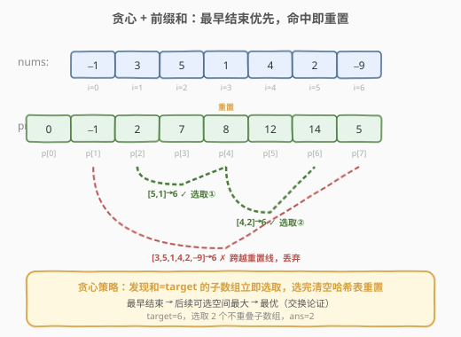
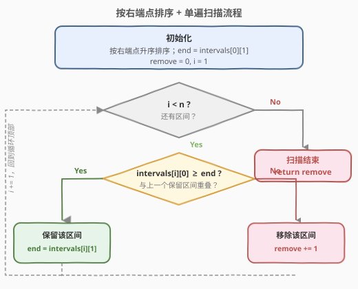
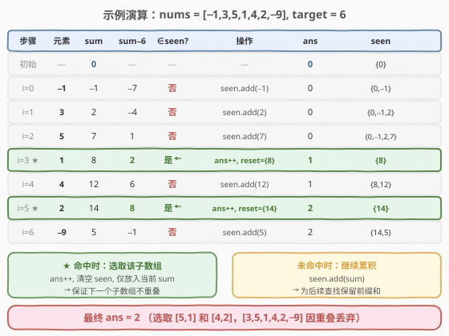

# 和为目标值且不重叠的非空子数组的最大数目

- **题目名称**：和为目标值且不重叠的非空子数组的最大数目
- **链接**：[1546. 和为目标值且不重叠的非空子数组的最大数目](https://leetcode.cn/problems/maximum-number-of-non-overlapping-subarrays-with-sum-equals-target/)
- **难度**：中等
- **标签**：数组、前缀和、哈希表、贪心

## 1. 题目概述

给定一个数组 `nums` 和一个整数 `target`，返回**非空不重叠**子数组的最大数目，且每个子数组中数字和都为 `target`。

**示例 1**：

```text
输入：nums = [1,1,1,1,1], target = 2
输出：2
解释：2 个不重叠子数组 [1,1,1,1,1]，和均为 2。
```

**示例 2**：

```text
输入：nums = [-1,3,5,1,4,2,-9], target = 6
输出：2
解释：3 个子数组和为 6（[5,1], [4,2], [3,5,1,4,2,-9]），但只有前 2 个不重叠。
```

**示例 3**：

```text
输入：nums = [-2,6,6,3,5,4,1,2,8], target = 10
输出：3
```

**示例 4**：

```text
输入：nums = [0,0,0], target = 0
输出：3
```

**约束条件**：

- `1 <= nums.length <= 10^5`
- `-10^4 <= nums[i] <= 10^4`
- `0 <= target <= 10^6`

> ⚠️ `n` 最大 $10^5$，暴力枚举所有子数组 $O(n^2)$ 会超时；且数组含负数，滑动窗口不适用。需要结合**前缀和 + 哈希**查找子数组，再用**贪心**保证不重叠。

---

## 2. 解题思路

### 2.1 暴力思路

枚举所有子数组 `[i, j]`，用前缀和 $O(1)$ 求和判断是否等于 `target`，收集所有满足条件的子数组作为「区间」。再在这些区间中选出最大数量的不重叠区间——这是经典的**区间调度问题**，可按右端点排序后贪心选取，$O(n^2 \log n)$。

但 $n = 10^5$ 时，光枚举子数组就是 $O(n^2)$，必然超时。需要将「查找子数组」与「贪心选取」**合并到一次遍历**中。

### 2.2 核心观察：前缀和 + 哈希 + 贪心最早结束



本题是两个经典思想的结合：

1. **前缀和 + 哈希**（找和为 `target` 的子数组）：定义前缀和 `prefix[i]` 为 `nums[0..i-1]` 的和，则子数组 `nums[j..i-1]` 的和为 `prefix[i] - prefix[j]`。要使和等于 `target`，只需 `prefix[j] = prefix[i] - target`。用哈希集合 `seen` 存储已遍历的前缀和，即可 $O(1)$ 查询。

2. **贪心最早结束**（保证不重叠）：将每个和为 `target` 的子数组视为一个「区间」`[j, i-1]`。要在所有区间中选出最大数量的不重叠区间，经典策略是**按右端点排序，每次选结束最早的**。由于我们从左到右扫描，**第一次发现某个位置 `i` 满足 `prefix[i] - target ∈ seen` 时，这就是以 `i` 为右端点的所有合法区间中结束最早的一个**——立即选取它。

> 💡 **关键操作——命中即重置**：选取一个子数组后，执行 `seen.clear()` 并仅放入当前 `prefix[i]`。这保证了下一个子数组的起点必须在 `i` 之后（因为 `seen` 中只有 `prefix[i]`，后续查找 `prefix[k] - target` 只能匹配从 `i` 开始的子数组），从而确保不重叠。

这与 [435. 无重叠区间](../0401-0500/435_无重叠区间.md) 的贪心思想一脉相承——都是「最早结束优先」，只是 435 在已知的区间集合上排序选取，而本题在扫描过程中**即时发现、即时选取**。

### 2.3 算法流程图



**一次遍历**边走边查：

1. 初始化 `sum = 0`、`ans = 0`、`seen = {0}`（前缀和 0 对应空前缀）。
2. 遍历每个元素 `num`：
   - `sum += num`
   - 若 `sum - target ∈ seen`：命中！`ans += 1`，清空 `seen`，仅放入 `sum`（重置，保证不重叠）。
   - 否则：`seen.add(sum)`（继续累积，为后续查找做准备）。
3. 返回 `ans`。

> 💡 **为什么 `seen` 初始化为 `{0}`？** 当前缀和本身就等于 `target` 时（即从下标 0 开始的子数组和为 `target`），需要 `sum - target = 0` 在 `seen` 中。初始放入 `0` 正是为此。

### 2.4 示例演算

以 `nums = [-1, 3, 5, 1, 4, 2, -9]`，`target = 6` 为例：



| 步骤 | 元素 | sum | sum−6 | ∈seen? | 操作 | ans | seen |
|------|------|-----|-------|--------|------|-----|------|
| 初始 | — | 0 | — | — | — | 0 | {0} |
| i=0 | −1 | −1 | −7 | 否 | seen.add(−1) | 0 | {0,−1} |
| i=1 | 3 | 2 | −4 | 否 | seen.add(2) | 0 | {0,−1,2} |
| i=2 | 5 | 7 | 1 | 否 | seen.add(7) | 0 | {0,−1,2,7} |
| i=3 ★ | 1 | 8 | 2 | **是** | ans++, reset={8} | 1 | {8} |
| i=4 | 4 | 12 | 6 | 否 | seen.add(12) | 1 | {8,12} |
| i=5 ★ | 2 | 14 | 8 | **是** | ans++, reset={14} | 2 | {14} |
| i=6 | −9 | 5 | −1 | 否 | seen.add(5) | 2 | {14,5} |

- **i=3**：`sum=8`，`8−6=2` 在 `seen` 中 → 子数组 `[5,1]`（前缀 2→8），选取并重置 `seen={8}`。
- **i=5**：`sum=14`，`14−6=8` 在 `seen` 中 → 子数组 `[4,2]`（前缀 8→14），选取并重置 `seen={14}`。
- **i=6**：`sum=5`，`5−6=−1` 不在 `seen` 中。虽然 `[3,5,1,4,2,−9]` 的和也为 6（前缀 −1→5），但 `−1` 在重置时已被清除，**正确丢弃**了这条重叠区间。

最终答案为 `2`。

---

## 3. 参考代码

### C++

```cpp
class Solution {
public:
    int maxNonOverlapping(vector<int>& nums, int target) {
        int ans = 0, sum = 0;
        unordered_set<int> seen = {0};
        for (int num : nums) {
            sum += num;
            if (seen.count(sum - target)) {
                ans++;
                seen.clear();
                seen.insert(sum);
            } else {
                seen.insert(sum);
            }
        }
        return ans;
    }
};
```

### Python

```python
class Solution:
    def maxNonOverlapping(self, nums: List[int], target: int) -> int:
        ans = 0
        s = 0
        seen = {0}
        for num in nums:
            s += num
            if s - target in seen:
                ans += 1
                seen = {s}
            else:
                seen.add(s)
        return ans
```

> 💡 **Python 技巧**：重置时直接 `seen = {s}` 创建新集合，比 `seen.clear(); seen.add(s)` 更简洁，且让旧集合被 GC 回收。

---

## 4. 复杂度分析

| 维度 | 复杂度 | 说明 |
|------|--------|------|
| 时间复杂度 | $O(n)$ | 单次遍历，每步哈希集合的查询 / 插入 / 清空均为均摊 $O(1)$ |
| 空间复杂度 | $O(n)$ | `seen` 最多存储 $n$ 个前缀和（两次命中之间最多累积 $n$ 个元素） |

---

## 5. 扩展：贪心正确性证明与 DP 递推

### 5.1 交换论证

为什么「最早结束优先」是最优的？设贪心选取的第一个子数组为 $[l_1, r_1]$（结束最早），最优解的第一个子数组为 $[l_1', r_1']$，则 $r_1 \leq r_1'$。将最优解中的 $[l_1', r_1']$ 替换为 $[l_1, r_1]$，剩余可选区间集合**不缩小**（因为 $r_1 \leq r_1'$，后续约束更宽松），因此替换后仍能得到同样数量的不重叠子数组。由归纳法，贪心解与最优解的子数组数目相同。

### 5.2 DP 递推

也可用动态规划求解，定义 `dp[i]` 为 `nums[0..i-1]` 中的最大不重叠子数组数：

$$
\text{dp}[i] = \max\Big(\text{dp}[i-1],\ \ \text{best}[\text{prefix}[i] - \text{target}] + 1\Big)
$$

其中 `best[v]` 记录前缀和等于 `v` 的所有位置中最大的 `dp` 值。每步更新 `best[prefix[i]]`。时间 $O(n)$，空间 $O(n)$。

贪心解法无需维护 `best` 表，实现更简洁，且两者复杂度相同。

---

## 6. 面试要点

1. **为什么命中后要清空 `seen`？**
   - 清空 `seen` 并只放入当前 `sum`，等价于「下一个子数组的起点必须在当前位置之后」。若不清空，后续可能匹配到已选取子数组内部的前缀和，导致重叠。

2. **贪心为什么最优？**
   - 这是经典的**区间调度问题**：从所有合法区间中选最多不重叠区间，「按右端点排序、每次选最早结束」是经典最优策略。本题从左到右扫描时，第一次命中的就是结束最早的区间，等价于该贪心策略。可用交换论证证明。

3. **与 560（和为 K 的子数组）的区别？**
   - [560](https://leetcode.cn/problems/subarray-sum-equals-k/) 统计**所有**和为 K 的子数组数目（允许重叠），用前缀和 + 哈希计数即可。本题要求子数组**不重叠**且数目**最大**，需要贪心选取 + 重置。

4. **数组含负数，为什么不能用滑动窗口？**
   - 滑动窗口依赖窗口和的单调性（扩大窗口和增大，缩小窗口和减小）。负数存在时，扩大窗口和可能减小，单调性被破坏，无法判断何时收缩。前缀和 + 哈希不受此限制。

5. **`target = 0` 时的边界情况？**
   - 示例 4 中 `nums = [0,0,0], target = 0`：每一步 `sum` 都为 0，`sum - 0 = 0` 始终在 `seen` 中，每步都命中并重置 `seen = {0}`，最终 `ans = 3`。算法自然处理，无需特判。

---

## 7. 同类练习题

- [435. 无重叠区间](https://leetcode.cn/problems/non-overlapping-intervals/)（[题解](../0401-0500/435_无重叠区间.md)）：贪心区间调度母题，按右端点排序选最多不重叠区间
- [560. 和为 K 的子数组](https://leetcode.cn/problems/subarray-sum-equals-k/)（[题解](../0501-0600/560_和为K的子数组.md)）：前缀和 + 哈希的母题，统计所有和为 K 的子数组（允许重叠）
- [1524. 和为奇数的子数组数目](https://leetcode.cn/problems/number-of-sub-arrays-with-odd-sum/)（[题解](../1501-1600/1524_和为奇数的子数组数目.md)）：前缀和 + 哈希的姊妹题，统计所有奇数和子数组数目
- [1520. 最多的不重叠子字符串](https://leetcode.cn/problems/maximum-number-of-non-overlapping-substrings/)（[题解](../1501-1600/1520_最多的不重叠子字符串.md)）：同类——求最多不重叠子字符串，贪心选取
- [974. 和可被 K 整除的子数组](https://leetcode.cn/problems/subarray-sums-divisible-by-k/)（[题解](../0901-1000/974_和可被K整除的子数组.md)）：前缀和 + 同余分桶，统计所有和被 K 整除的子数组
