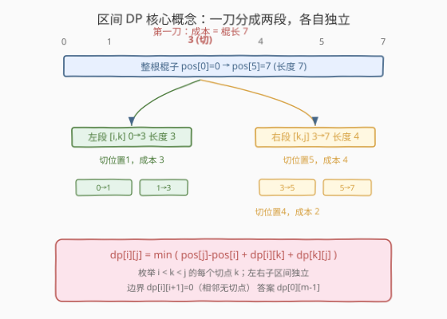
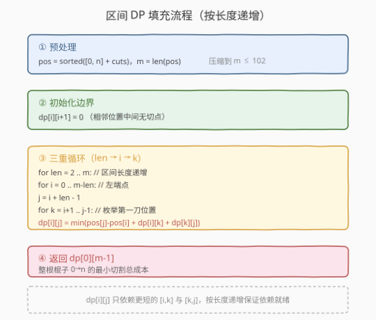
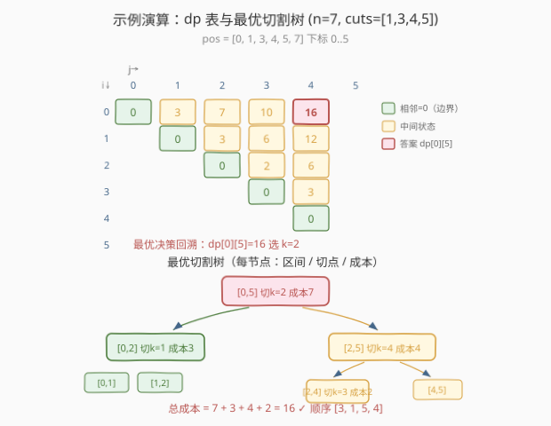

# LeetCode 切棍子的最小成本 题解

## 1. 题目概述

- **标题 / 题号**：切棍子的最小成本（#1547，hard）
- **链接**：https://leetcode.cn/problems/minimum-cost-to-cut-a-stick/
- **难度**：困难
- **标签**：数组、动态规划、区间 DP

**题意**：有一根长度为 `n` 的木棍，棍上从 `0` 到 `n` 标记了若干位置。给定一个整数数组 `cuts`，其中 `cuts[i]` 表示需要切开的位置。**切割顺序可以任意安排**。每次切割的成本是**当前被切木棍的长度**，总成本是历次切割成本之和。返回把所有 cuts 都切完的**最小总成本**。

**示例 1**：

```text
输入：n = 7, cuts = [1,3,4,5]
输出：16
解释：按给定顺序 [1,3,4,5] 切割，成本 = 7+6+4+3 = 20；
      调整为 [3,5,1,4]，成本 = 7+4+3+2 = 16（最优）。
```

**示例 2**：

```text
输入：n = 9, cuts = [5,6,1,4,2]
输出：22
```

**约束**：

- `2 <= n <= 10^6`
- `1 <= cuts.length <= min(n - 1, 100)`
- `1 <= cuts[i] <= n - 1`
- `cuts` 中所有整数互不相同

> ⚠️ 关键约束：`n` 可以到 $10^6$，但 `cuts.length <= 100`。这说明**不能按棍子长度建状态**（$n$ 太大），而应**按 cut 位置建状态**——真正的有效规模是 `cuts` 的个数，而非 $n$。这一观察直接决定了状态定义。

## 2. 解题思路

### 2.1 暴力思路：枚举所有切割顺序

把 `cuts` 全排列，对每种顺序模拟切割并累计成本，取最小值。`m = len(cuts)` 个切点的全排列共 $m!$ 种，$m = 100$ 时为天文数字，完全不可行。

> 💡 转换视角：切割的本质是**不断把一根棍子一分为二**。先在哪切，决定了后续两段各自独立地继续切。这正是**区间 DP**（分治 + 重叠子问题）的典型结构——与 [312. 戳气球](../0301-0400/312_戳气球.md)、矩阵连乘同源。

### 2.2 核心观察：区间 DP（按 cut 位置建状态）



**第一步：压缩有效规模。** 把 `0` 和 `n` 加入 `cuts` 并排序，得到位置数组 `pos = [0, ..., n]`（长度 $m \le 102$）。这样每一段棍子都由 `pos` 中两个下标唯一确定，$n$ 的大小不再参与状态。

**第二步：状态定义。**

> $\text{dp}[i][j]$ = 在区间 `pos[i..j]`（即从位置 `pos[i]` 到 `pos[j]` 的这段棍子）上，完成**所有**位于其内部的切割所需的**最小总成本**。

**第三步：状态转移——枚举「最先切的位置」。**

对区间 `[i, j]`（$j - i \ge 2$，中间至少有一个 cut），考虑**这一刀先切在哪里**。若第一刀切在 `pos[k]`（$i < k < j$）：

- 这一刀的成本 = 当前棍长 $= \text{pos}[j] - \text{pos}[i]$；
- 左段 `[i, k]` 和右段 `[k, j]` **相互独立**，各自最优累加即可。

$$
\text{dp}[i][j] = \min_{i < k < j}\bigl(\text{pos}[j] - \text{pos}[i] + \text{dp}[i][k] + \text{dp}[k][j]\bigr)
$$

**边界**：$\text{dp}[i][i+1] = 0$（相邻位置，中间无切点，无需切割）。

**答案**：$\text{dp}[0][m-1]$（整根棍子 `pos[0]=0` 到 `pos[m-1]=n`）。

> 💡 **与「枚举最后切」等价**：本题也可理解为「最后切的位置 k 把整段分成左右两段」——无论按「最先」还是「最后」理解，转移结构一致，因为切割顺序对应一棵**二叉决策树**，每条边把区间分成独立的两半。这与 [312. 戳气球](../0301-0400/312_戳气球.md)「枚举最后戳的气球」是完全同构的套路。

### 2.3 算法流程图



按**区间长度**从短到长递推：长度 2（相邻）填 0；长度 3 枚举 1 个中间切点；……；长度 $m$ 填右上角 `dp[0][m-1]`。每个 `dp[i][j]` 只依赖**更短的子区间** `[i,k]` 和 `[k,j]`，因此按长度递增即可保证依赖已就绪。

### 2.4 示例演算

以示例 1 `n = 7, cuts = [1,3,4,5]` 为例：

- `pos = [0, 1, 3, 4, 5, 7]`，$m = 6$（下标 0..5 对应位置 0,1,3,4,5,7）。
- 填 $6 \times 6$ 上三角 dp 表（行列均为 `pos` 下标 $i, j$）：



| 长度 | 区间 `[i,j]` | 棍长 `pos[j]-pos[i]` | 枚举 k 的取值 | $\text{dp}[i][j]$ |
|------|--------------|----------------------|---------------|-------------------|
| 2 | `[0,1]` `[1,2]` `[2,3]` `[3,4]` `[4,5]` | — | 边界 | 0, 0, 0, 0, 0 |
| 3 | `[0,2]` (0→3) | 3 | k=1: 3+0+0 | **3** |
| 3 | `[1,3]` (1→4) | 3 | k=2: 3+0+0 | **3** |
| 3 | `[2,4]` (3→5) | 2 | k=3: 2+0+0 | **2** |
| 3 | `[3,5]` (4→7) | 3 | k=4: 3+0+0 | **3** |
| 4 | `[0,3]` (0→4) | 4 | k=1: 4+0+3=7; k=2: 4+3+0=7 | **7** |
| 4 | `[1,4]` (1→5) | 4 | k=2: 4+0+2=6; k=3: 4+3+0=7 | **6** |
| 4 | `[2,5]` (3→7) | 4 | k=3: 4+0+3=7; k=4: 4+2+0=6 | **6** |
| 5 | `[0,4]` (0→5) | 5 | k=1:5+0+6=11; k=2:5+3+2=10; k=3:5+7+0=12 | **10** |
| 5 | `[1,5]` (1→7) | 6 | k=2:6+0+6=12; k=3:6+3+3=12; k=4:6+6+0=12 | **12** |
| 6 | `[0,5]` (0→7) | 7 | k=1:7+0+12=19; k=2:**7+3+6=16**; k=3:7+7+3=17; k=4:7+10+0=17 | **16** |

`dp[0][5] = 16`，即答案。回溯最优决策：整段 `[0,5]` 选 $k=2$（在位置 3 切，成本 7）→ 左段 `[0,2]` 切位置 1（成本 3）→ 右段 `[2,5]` 切位置 5（成本 4）→ 段 `[2,4]` 切位置 4（成本 2）。总成本 $7+3+4+2 = 16$，对应切割顺序 `[3, 5, 1, 4]`，与题目描述一致。

> 💡 注意 `[1,5]` 一行三个 k 都得 12——这说明同一最优成本可能对应多条决策路径，区间 DP 只保证**值**最优，不保证方案唯一。

## 3. 参考代码

### C++（迭代区间 DP）

```cpp
class Solution {
  public:
    int minCost(int n, vector<int>& cuts) {
        vector<int> pos(cuts.begin(), cuts.end());
        pos.push_back(0);
        pos.push_back(n);
        sort(pos.begin(), pos.end());
        int m = pos.size();

        // dp[i][j] = 在 pos[i..j] 这段棍子上完成所有切割的最小成本
        vector<vector<int>> dp(m, vector<int>(m, 0));

        for (int len = 2; len <= m; len++) {        // 按区间长度递增
            for (int i = 0; i + len - 1 < m; i++) { // 枚举左端点
                int j = i + len - 1;                // 右端点
                if (len == 2) {
                    dp[i][j] = 0;                   // 相邻，无切点
                    continue;
                }
                int best = INT_MAX;
                for (int k = i + 1; k < j; k++) {   // 枚举第一刀切在哪
                    best = min(best, pos[j] - pos[i] + dp[i][k] + dp[k][j]);
                }
                dp[i][j] = best;
            }
        }
        return dp[0][m - 1];
    }
};
```

### Python（记忆化 DFS，等价但更直观）

```python
class Solution:
    def minCost(self, n: int, cuts: List[int]) -> int:
        pos = sorted([0, n] + cuts)
        m = len(pos)

        @cache
        def dfs(i: int, j: int) -> int:
            if i + 1 == j:          # 相邻位置，中间无切点
                return 0
            best = float('inf')
            for k in range(i + 1, j):   # 第一刀切在 pos[k]
                best = min(best, pos[j] - pos[i] + dfs(i, k) + dfs(k, j))
            return best

        return dfs(0, m - 1)
```

> 💡 **两种写法等价**：迭代版自底向上按长度填表；记忆化版自顶向下递归 + 缓存。状态总数 $O(m^2)$、每个状态枚举 $O(m)$ 个切点，总复杂度一致。记忆化版代码更短、思路更贴近递归定义；迭代版常数更小、无栈溢出风险。面试时按习惯选其一即可。

## 4. 复杂度分析

| 维度 | 复杂度 | 说明 |
|------|--------|------|
| 时间复杂度 | $O(m^3)$ | $m = \text{len(cuts)} + 2 \le 102$；状态数 $O(m^2)$，每个状态枚举 $O(m)$ 个切点 |
| 空间复杂度 | $O(m^2)$ | 二维 dp 表（记忆化版含递归栈 $O(m)$） |

> ⚠️ 注意复杂度是关于**切点数 $m$** 而非棍长 $n$。$m \le 102 \Rightarrow m^3 \approx 10^6$，远低于时间限制。即便 $n = 10^6$，只要切点不多，算法依然高效——这正是「按 cut 位置建状态」的精妙之处。

## 5. 扩展：方案回溯与同类模型

### 5.1 回溯最优切割顺序

若需输出具体切割顺序（而非仅最小成本），可额外记录 `choice[i][j] = k` 表示区间 `[i,j]` 的最优第一刀位置。填完表后从 `[0,m-1]` 递归展开：先输出 `pos[choice[i][j]]`，再分别递归左段 `[i, k]` 与右段 `[k, j]`。空间额外 $O(m^2)$。

### 5.2 三大「枚举分割点」区间 DP 对比

| 题目 | 状态 | 转移枚举 | 成本来源 |
|------|------|----------|----------|
| [312. 戳气球](../0301-0400/312_戳气球.md) | `dp[i][j]` 戳掉开区间 (i,j) 内气球的最大得分 | 最后戳的 k | `nums[i]*nums[k]*nums[j]` |
| **1547. 切棍子** | `dp[i][j]` 切完 pos[i..j] 内所有切点的最小成本 | 最先切的 k | `pos[j]-pos[i]`（当前棍长） |
| [1039. 多边形三角剖分](https://leetcode.cn/problems/minimum-score-triangulation-of-polygon/) | `dp[i][j]` 多边形 i..j 三角剖分最低得分 | 中间顶点 k | 三角形面积 `A[i]*A[k]*A[j]` |

三者骨架完全一致：**区间两端固定、枚举中间分割点、左右子区间独立求解**。掌握其中一题，其余可举一反三。

## 6. 面试要点

1. **为什么要把 `0` 和 `n` 加入 cuts？**

   - `0` 和 `n` 是棍子的两端，作为区间的天然边界。加入后每段棍子都由 `pos` 中两个下标唯一刻画，状态定义干净。更重要的是，这样**第一刀的成本 = `pos[j]-pos[i]`** 统一适用于任意子区间，无需对「整根 vs 子段」做特判。

2. **为什么复杂度是 $O(m^3)$ 而不是 $O(n^3)$？**

   - $n$ 可达 $10^6$，但切点数 $m \le 102$。状态以下标 $i, j \in [0, m)$ 建立与具体位置值无关——`pos[j]-pos[i]` 只是 $O(1)$ 取值，不参与循环规模。**识别有效规模**是本题最关键的洞察。

3. **「最先切」和「最后切」两种理解等价吗？**

   - 等价。切割过程对应一棵二叉决策树：每个内部节点代表一刀，左右子树是切出的两段。无论从根（最先切）还是从叶（最后切）方向定义状态，递推结构都是「区间分成左右两半独立求解」，最终 dp 值相同。本题写「最先切」更直观（成本就是当前棍长）。

4. **为什么不能用贪心（比如每次切最短/最长的段）？**

   - 贪心缺乏最优子结构保证。比如先切最中间的位置看似「均分」，但后续两段的成本分布未必最优；先切端点附近虽首刀成本高，却可能让后续每段都极短。区间 DP 通过**枚举所有分割点取最小**穷尽了所有决策树形态，才能保证全局最优。

5. **记忆化 DFS 和迭代 DP 怎么选？**

   - 状态依赖关系清晰、需按长度递推时迭代版更稳妥（无栈溢出、常数小）；状态转移递归定义自然、想快速验证思路时记忆化版更简洁。本题 $m \le 102$ 递归深度最多 100，两者都安全。

## 同类练习题

| # | 题目 | 与本题的关联 |
|---|------|-------------|
| 312 | [戳气球](https://leetcode.cn/problems/burst-balloons/)（[题解](../0301-0400/312_戳气球.md)) | 区间 DP 经典，按「最后戳的位置」划分区间，对比「最先切」与「最后戳」两种等价视角 |
| 1039 | [多边形三角剖分的最低得分](https://leetcode.cn/problems/minimum-score-triangulation-of-polygon/) | 区间 DP 在环形结构上的变体，转移枚举中间顶点 |
| 1000 | [合并石头的最低成本](https://leetcode.cn/problems/minimum-cost-to-merge-stones/) | 区间 DP + 附加维度（剩余堆数），难度更高，体会「区间合并」类转移 |
| 877 | [石子游戏](https://leetcode.cn/problems/stone-game/)（[题解](../0801-0900/877_石子游戏.md)) | 博弈型区间 DP，转移取 `max` 而非 `min`，对比「成本最小化」与「净赚最大化」 |
| 1130 | [叶值的最小代价生成树](https://leetcode.cn/problems/minimum-cost-tree-from-leaf-values/) | 区间 DP + 非叶子节点成本，与 312 同构（卡特兰结构） |
