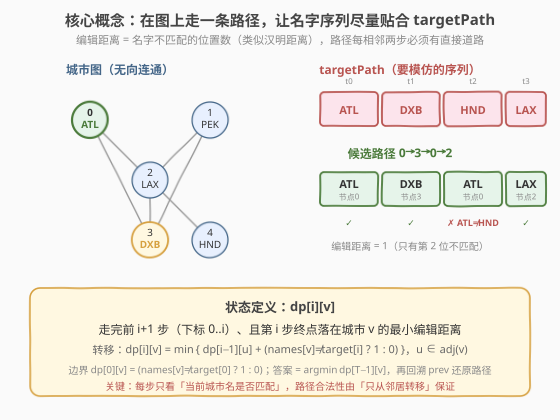
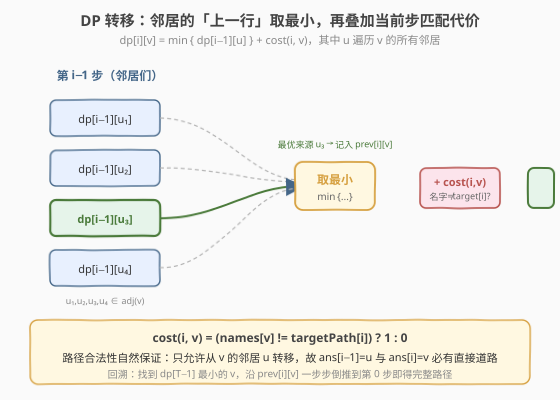
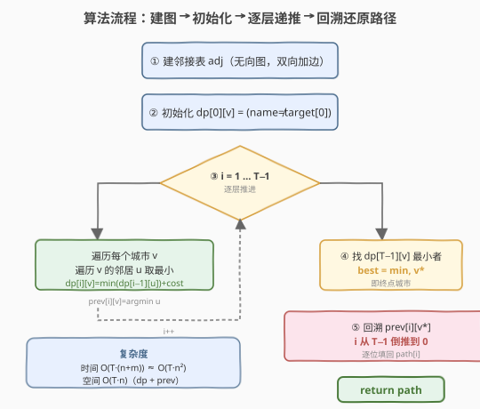
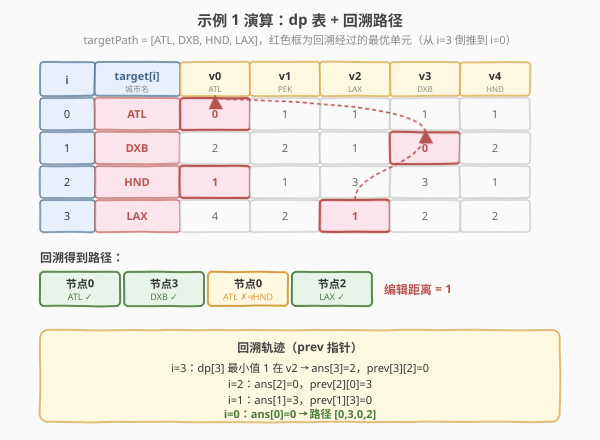

# LeetCode 图中最相似的路径 题解

## 1. 题目概述

- **标题 / 题号**：图中最相似的路径（#1548，hard）
- **链接**：https://leetcode.cn/problems/the-most-similar-path-in-a-graph/
- **难度**：困难
- **标签**：图、动态规划、字符串、数组

**题意**：有 `n` 座城市和 `m` 条**双向道路**，`roads[i] = [ai, bi]` 连接城市 `ai` 与 `bi`。每座城市的名字恰为 3 个大写英文字母，存于字符串数组 `names`。整张图保证**连通**且任意两城之间至多一条直达道路。

给定字符串数组 `targetPath`，需要在图中找一条**长度相同**（节点数等于 `targetPath.length`）的路径，使其与 `targetPath` 的**编辑距离最小**。

- **编辑距离**：路径上各城市的名字依次与 `targetPath` 逐位比较，**不匹配的位置数**即为编辑距离（本质是名字序列的汉明距离）。
- **路径合法**：相邻两步 `ans[i]` 与 `ans[i+1]` 之间必须有直达道路；**节点可重复访问**。
- 多解返回任意一条即可。

**示例 1**：

```text
输入：n = 5, roads = [[0,2],[0,3],[1,2],[1,3],[1,4],[2,4]],
     names = ["ATL","PEK","LAX","DXB","HND"], targetPath = ["ATL","DXB","HND","LAX"]
输出：[0,2,4,2]
解释：[0,2,4,2]、[0,3,0,2]、[0,3,1,2] 都是合法答案。
     [0,3,0,2] 对应 ["ATL","DXB","ATL","LAX"]，编辑距离 = 1（第 2 位 ATL≠HND）。
```

**示例 2**：

```text
输入：n = 4, roads = [[1,0],[2,0],[3,0],[2,1],[3,1],[3,2]],
     names = ["ATL","PEK","LAX","DXB"], targetPath = ["ABC","DEF","GHI","JKL","MNO","PQR","STU","VWX"]
输出：[0,1,0,1,0,1,0,1]
解释：图中没有任何城市名匹配 targetPath，故任意合法路径编辑距离均为 8。
```

**示例 3**：

```text
输入：n = 6, roads = [[0,1],[1,2],[2,3],[3,4],[4,5]],
     names = ["ATL","PEK","LAX","ATL","DXB","HND"], targetPath = ["ATL","DXB","HND","DXB","ATL","LAX","PEK"]
输出：[3,4,5,4,3,2,1]
解释：路径名 ["ATL","DXB","HND","DXB","ATL","LAX","PEK"] 与 targetPath 完全一致，编辑距离 = 0。
```

**约束**：

- `2 <= n <= 100`
- `m == roads.length`，`n - 1 <= m <= n * (n - 1) / 2`
- `0 <= ai, bi <= n - 1`，`ai != bi`
- 图保证连通，任意两城至多一条直达道路
- `names.length == n`，`names[i].length == 3`，均为大写字母
- `1 <= targetPath.length <= 100`，`targetPath[i].length == 3`

## 2. 解题思路

### 2.1 暴力思路：枚举所有路径

从每个城市出发，逐步走 `T = len(targetPath)` 步，每步可走向任意邻居。由于**节点可重复**，路径总数最坏可达 $n \cdot (\text{deg})^{T-1}$，稠密图下 $\deg \approx n$，总方案数约 $n^T$。$n = T = 100$ 时为天文数字，完全不可行。

> 💡 转换视角：路径每一步的代价只取决于「当前城市名是否匹配 targetPath 当前位」，**与历史无关**；而合法性只需保证「每步从邻居转移」。这是典型的**阶段 + 状态**结构——用 **动态规划** 在图上做最短路。

### 2.2 核心观察：图上分层 DP



**阶段**：按 `targetPath` 的下标 `i` 划分，共 `T` 层（`i = 0 … T-1`）。

**状态**：

> $\text{dp}[i][v]$ = 走完前 $i+1$ 步（下标 $0..i$）、且第 $i$ 步终点落在城市 $v$ 时，与 `targetPath[0..i]` 的**最小编辑距离**。

**关键设计**：状态只记「终点城市 $v$」与「当前步数 $i$」，不记完整路径——因为代价只由「$v$ 的名字是否匹配 `targetPath[i]`」决定，**最优子结构成立**：前 $i$ 步的最优终点 $v$，必然由前 $i-1$ 步的某个最优邻居转移而来。

**路径合法性**：转移时只允许从 $v$ 的**邻居** $u$ 走过来，这样 $\text{ans}[i-1]=u$ 与 $\text{ans}[i]=v$ 之间必有直达道路，合法性被转移方程**自然保证**，无需额外校验。

### 2.3 状态转移



$$
\text{dp}[i][v] = \min_{u \in \text{adj}(v)} \text{dp}[i-1][u] \;+\; \text{cost}(i, v)
$$

其中匹配代价：

$$
\text{cost}(i, v) = \begin{cases} 0, & \text{names}[v] = \text{targetPath}[i] \\ 1, & \text{names}[v] \neq \text{targetPath}[i] \end{cases}
$$

- **边界**：$i = 0$ 时无前驱，$\text{dp}[0][v] = \text{cost}(0, v)$（任何城市都可作为起点）。
- **记录前驱**：转移时把取到最小的那个邻居 $u$ 存入 $\text{prev}[i][v]$，供最后**回溯还原路径**。
- **答案**：$\min_v \text{dp}[T-1][v]$ 即最小编辑距离，对应城市 $v^\*$ 为终点；从 $v^\*$ 沿 `prev` 倒推到第 0 步即得完整路径。

### 2.4 算法流程图



### 2.5 示例演算

以示例 1 为例。建图后邻接关系：

| 城市 | 名字 | 邻居 |
|------|------|------|
| 0 | ATL | 2, 3 |
| 1 | PEK | 2, 3, 4 |
| 2 | LAX | 0, 1, 4 |
| 3 | DXB | 0, 1 |
| 4 | HND | 1, 2 |

`targetPath = [ATL, DXB, HND, LAX]`（$T=4$）。逐层填表（红色为回溯经过的最优单元）：



| 步骤 | 计算 | 结果 |
|------|------|------|
| $i=0$ | $\text{dp}[0][v] = \text{cost}(0,v)$，ATL 匹配 v0 | `[0,1,1,1,1]` |
| $i=1$ | 每个城市取邻居的 $\text{dp}[0]$ 最小值 + cost(1,v)，DXB 匹配 v3 | `[2,2,1,0,2]` |
| $i=2$ | HND 匹配 v4，v0 从 v3(0) 转移得 1 | `[1,1,3,3,1]` |
| $i=3$ | LAX 匹配 v2，v2 从 v0(1)/v1(1)/v4(1) 转移得 1 | `[4,2,1,2,2]` |

终点最小值在 $v2=1$。沿 `prev` 回溯：$i{=}3\to v2$，$\text{prev}[3][2]=0 \to i{=}2\,v0$，$\text{prev}[2][0]=3 \to i{=}1\,v3$，$\text{prev}[1][3]=0 \to i{=}0\,v0$，得路径 `[0,3,0,2]`，名字序列 `["ATL","DXB","ATL","LAX"]`，仅第 2 位 ATL≠HND，编辑距离 = 1。

> 💡 **为何允许重复访问不影响 DP**：状态只记「终点 $v$」与「步数 $i$」，不记历史节点；转移时 $u$ 可以等于 $v$ 的某个已访问城市（只要它们相邻），DP 自动选择全局最优而不陷入「不能重复」的限制。这也是题面 follow-up 的对比点——若限制每点只访问一次，状态需额外记录已访问集合（状态压缩），规模骤增。

## 3. 参考代码

### C++

```cpp
class Solution {
  public:
    vector<int> mostSimilar(int n, vector<vector<int>>& roads,
                            vector<string>& names, vector<string>& targetPath) {
        // 建邻接表
        vector<vector<int>> adj(n);
        for (auto& r : roads) {
            adj[r[0]].push_back(r[1]);
            adj[r[1]].push_back(r[0]);
        }

        int T = targetPath.size();
        const int INF = 1e9;
        // dp[i][v]：走完前 i+1 步、终点为 v 的最小编辑距离
        vector<vector<int>> dp(T, vector<int>(n, INF));
        vector<vector<int>> prev(T, vector<int>(n, -1));

        // 边界：第 0 步
        for (int v = 0; v < n; ++v)
            dp[0][v] = (names[v] != targetPath[0]);

        // 逐层递推
        for (int i = 1; i < T; ++i) {
            for (int v = 0; v < n; ++v) {
                int add = (names[v] != targetPath[i]);
                for (int u : adj[v]) {
                    if (dp[i - 1][u] + add < dp[i][v]) {
                        dp[i][v] = dp[i - 1][u] + add;
                        prev[i][v] = u;
                    }
                }
            }
        }

        // 找终点：dp[T-1] 中最小者
        int best = INF, last = -1;
        for (int v = 0; v < n; ++v) {
            if (dp[T - 1][v] < best) {
                best = dp[T - 1][v];
                last = v;
            }
        }

        // 回溯还原路径
        vector<int> path(T);
        for (int i = T - 1, cur = last; i >= 0; --i) {
            path[i] = cur;
            cur = prev[i][cur];
        }
        return path;
    }
};
```

### Python

```python
class Solution:
    def mostSimilar(self, n: int, roads: List[List[int]],
                    names: List[str], targetPath: List[str]) -> List[int]:
        adj = [[] for _ in range(n)]
        for a, b in roads:
            adj[a].append(b)
            adj[b].append(a)

        T = len(targetPath)
        INF = float('inf')
        dp = [[INF] * n for _ in range(T)]
        prev = [[-1] * n for _ in range(T)]

        for v in range(n):
            dp[0][v] = 0 if names[v] == targetPath[0] else 1

        for i in range(1, T):
            for v in range(n):
                add = 0 if names[v] == targetPath[i] else 1
                for u in adj[v]:
                    if dp[i - 1][u] + add < dp[i][v]:
                        dp[i][v] = dp[i - 1][u] + add
                        prev[i][v] = u

        last = min(range(n), key=lambda v: dp[T - 1][v])

        path = [0] * T
        cur = last
        for i in range(T - 1, -1, -1):
            path[i] = cur
            cur = prev[i][cur]
        return path
```

> 💡 **空间优化**：`dp[i]` 只依赖 `dp[i-1]`，可用滚动数组把空间降到 $O(n)$。但 `prev` 必须保留全部 $T$ 层才能回溯路径，故总体仍为 $O(T \cdot n)$。若只需最小距离不需路径，则可省去 `prev` 做到 $O(n)$ 空间。

## 4. 复杂度分析

| 维度 | 复杂度 | 说明 |
|------|--------|------|
| 时间复杂度 | $O(T \cdot (n + m))$ | 共 $T$ 层，每层遍历所有边两端（每个 $v$ 枚举其邻居，总邻居数 $= 2m$）；稠密图退化为 $O(T \cdot n^2)$ |
| 空间复杂度 | $O(T \cdot n)$ | `dp` 与 `prev` 各 $T \times n$；邻接表 $O(n + m)$ |

> ⚠️ 本题 $n, T \le 100$，$T \cdot n^2 \le 10^6$，时间空间都宽裕。注意 `dp[i]` 只依赖上一层，可滚动优化 dp 但 `prev` 不可省（回溯需要完整前驱链）。

## 5. 扩展：follow-up——每点最多访问一次

题面追问：若路径中**每个节点最多访问一次**，应如何修改？

- **难点**：状态需额外记录「已访问集合」，否则无法判断某邻居是否走过。
- **新状态**：$\text{dp}[i][v][S]$，$S$ 为已访问城市的位掩码（$n \le 100$ 时状态数 $2^{100}$，**不可行**）。
- **结论**：$n$ 较小（如 $n \le 15$）时可用**状态压缩 DP**；$n = 100$ 时该限制使问题变为 NP-hard（类似最长简单路径），只能启发式或近似求解。这也是题面允许重复访问的原因——把问题限制在多项式可解范围。

> 💡 对比 [943. 最短超级串](https://leetcode.cn/problems/find-the-shortest-superstring/)（$n \le 12$，状压 DP 求排列）与 [847. 访问所有节点的最短路径](https://leetcode.cn/problems/shortest-path-visiting-all-nodes/)（$n \le 12$，状压 BFS），都是「限制访问」导致必须状压的小规模问题。

## 6. 面试要点

1. **为什么这题是 DP 而不是最短路算法（Dijkstra）？**

   - 阶段固定为 `targetPath` 的每一位，**每步代价非负且与步数绑定**（第 $i$ 步只比较 `targetPath[i]`）。虽然本质上是在「分层图」上求最短路，但分层结构使**逐层 DP**比通用 Dijkstra 更直接、无需堆，复杂度也更清晰。可视为 Dijkstra 在**分层 DAG**上的特例。

2. **路径合法性如何保证？**

   - 转移方程只从 $v$ 的邻居 $u$ 取值，因此 $\text{ans}[i-1]=u$ 与 $\text{ans}[i]=v$ 必相邻。不需要在回溯后再校验。

3. **为什么起点任意？**

   - 第 0 步对每个城市 $v$ 都初始化 $\text{dp}[0][v] = \text{cost}(0,v)$，相当于「以任意城市为起点」的全部初始状态，DP 自然选出最优起点。

4. **回溯如何实现？为什么需要 prev 表？**

   - `dp` 只存最优值不存来源；要还原路径必须记录每个状态由哪个邻居转移而来，即 `prev[i][v]`。从终点 `last` 沿 `prev` 倒推即得路径。这是所有「求方案」类 DP 的通用套路（如 [322. 零钱兑换](../0301-0400/322_零钱兑换.md) 求具体硬币组合）。

5. **edit distance 与经典编辑距离（72 题）有何区别？**

   - 本题的「编辑距离」实为**汉明距离**：只允许逐位比较是否相等，**不允许插入/删除/替换操作**；路径长度必须等于 `targetPath.length`。[72. 编辑距离](../0001-0100/72_编辑距离.md) 是允许三种操作的真正 Levenshtein 距离。题面命名易混淆，需看清定义。

## 同类练习题

| # | 题目 | 与本题的关联 |
|---|------|-------------|
| 322 | [零钱兑换](https://leetcode.cn/problems/coin-change/) | DP + prev 回溯还原方案，本题回溯套路的母题 |
| 743 | [网络延迟时间](https://leetcode.cn/problems/network-delay-time/) | 图上单源最短路（Dijkstra），与本题分层 DP 互为对照（通用最短路 vs 分层特例） |
| 787 | [K 站中转内最便宜的航班](https://leetcode.cn/problems/cheapest-flights-within-k-stops/) | 限制步数的图上最短路，同样是「按步数分层」的 DP 思想 |
| 847 | [访问所有节点的最短路径](https://leetcode.cn/problems/shortest-path-visiting-all-nodes/) | 限制每点访问的状态压缩 BFS，对照本题 follow-up 的「每点只访问一次」 |
| 943 | [最短超级串](https://leetcode.cn/problems/find-the-shortest-superstring/) | 状压 DP + 路径回溯，规模小但「记录前驱还原方案」思路一致 |
