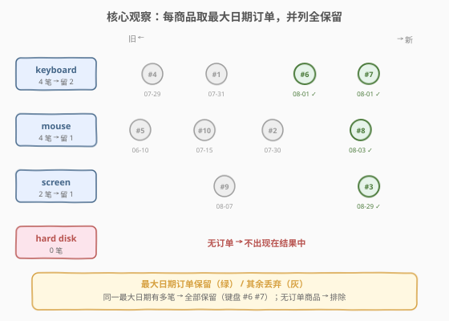
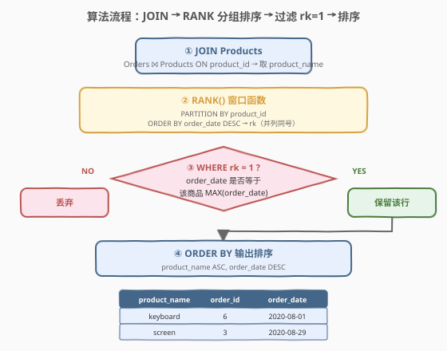
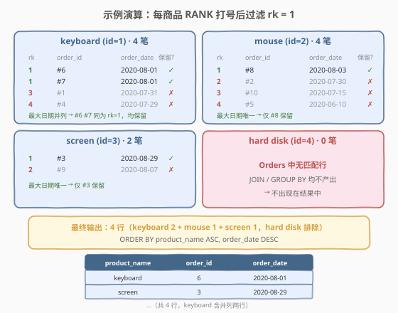

# 每件商品的最新订单

- **题目名称**：每件商品的最新订单
- **链接**：[1549. 每件商品的最新订单 🔒](https://leetcode.cn/problems/the-most-recent-orders-for-each-product/)
- **难度**：中等
- **标签**：数据库、SQL、窗口函数、`RANK`、Top-1 per group、并列保留、`JOIN`、`GROUP BY` + `MAX`、相关子查询、LeetCode 锁题

## 1. 题目概述

给定 `Customers`、`Orders`、`Products` 三张表，编写 SQL 查询，找到**每件商品的最新订单**。若同一商品在最新日期有多笔订单，则**全部返回**；无订单的商品不出现在结果中。

**表结构**：

```text
Table: Customers
+---------------+---------+
| Column Name   | Type    |
+---------------+---------+
| customer_id   | int     |  ← 具有唯一值
| name          | varchar |
+---------------+---------+
该表包含消费者的信息。

Table: Orders
+---------------+---------+
| Column Name   | Type    |
+---------------+---------+
| order_id      | int     |  ← 具有唯一值
| order_date    | date    |
| customer_id   | int     |
| product_id    | int     |
+---------------+---------+
该表包含 id 为 customer_id 的消费者的订单信息。

Table: Products
+---------------+---------+
| Column Name   | Type    |
+---------------+---------+
| product_id    | int     |  ← 具有唯一值
| product_name  | varchar |
| price         | int     |
+---------------+---------+
该表包含商品信息。
```

**排序要求**：结果按 `product_name` **升序**排列；若同名，按 `order_date` **降序**排列。

> ⚠️ 本题的 `Customers` 表为**干扰项**——输出列只需 `product_name`（来自 `Products`）、`order_id`、`order_date`（来自 `Orders`），完全不涉及客户名。识别并剔除冗余表是本题的第一个小考点。

**示例 1**：

```text
输入：
Customers 表:
+-------------+-----------+
| customer_id | name      |
+-------------+-----------+
| 1           | Winston   |
| 2           | Jonathan  |
| 3           | Annabelle |
| 4           | Marwan    |
| 5           | Khaled    |
+-------------+-----------+

Orders 表:
+----------+------------+-------------+------------+
| order_id | order_date | customer_id | product_id |
+----------+------------+-------------+------------+
| 1        | 2020-07-31 | 1           | 1          |
| 2        | 2020-07-30 | 2           | 2          |
| 3        | 2020-08-29 | 3           | 3          |
| 4        | 2020-07-29 | 4           | 1          |
| 5        | 2020-06-10 | 1           | 2          |
| 6        | 2020-08-01 | 2           | 1          |
| 7        | 2020-08-01 | 3           | 1          |
| 8        | 2020-08-03 | 1           | 2          |
| 9        | 2020-08-07 | 2           | 3          |
| 10       | 2020-07-15 | 1           | 2          |
+----------+------------+-------------+------------+

Products 表:
+------------+--------------+-------+
| product_id | product_name | price |
+------------+--------------+-------+
| 1          | keyboard     | 120   |
| 2          | mouse        | 80    |
| 3          | screen       | 600   |
| 4          | hard disk    | 450   |
+------------+--------------+-------+

输出:
+--------------+----------+------------+
| product_name | order_id | order_date |
+--------------+----------+------------+
| keyboard     | 6        | 2020-08-01 |
| keyboard     | 7        | 2020-08-01 |
| mouse        | 8        | 2020-08-03 |
| screen       | 3        | 2020-08-29 |
+--------------+----------+------------+
```

**解释**：

| 商品 | 订单数 | 最新日期 | 处理 | 保留 |
|------|--------|----------|------|------|
| keyboard | 4 笔 | `2020-08-01` | 该日有 #6、#7 两笔，**并列全保留** | 2 笔 |
| mouse | 4 笔 | `2020-08-03` | 仅 #8 一笔 | 1 笔 |
| screen | 2 笔 | `2020-08-29` | 仅 #3 一笔 | 1 笔 |
| hard disk | 0 笔 | — | 无订单，不出现 | 0 笔 |

**约束条件**：

- `customer_id` 是 `Customers` 表具有唯一值的列
- `order_id` 是 `Orders` 表具有唯一值的列
- `product_id` 是 `Products` 表具有唯一值的列
- 结果按 `product_name` 升序、`order_date` 降序排列

> 💡 本题是 SQL **"Top-1 per group 并列保留"招牌题**——核心套路：用 `RANK() OVER (PARTITION BY product_id ORDER BY order_date DESC)` 给每件商品的订单按时间倒序打序号 `rk`，再 `WHERE rk = 1` 过滤。难点在于**并列处理**：keyboard 在最新日期 `2020-08-01` 有两笔订单，必须用 `RANK`/`DENSE_RANK`（并列同号）而非 `ROW_NUMBER`（强制唯一，会丢一行）。与同库 1532「最近的三笔订单」形成对照——1532 要"恰好前 3 行"用 `ROW_NUMBER`，本题要"最大日期所有行"用 `RANK`。

---

## 2. 解题思路

### 2.1 暴力思路：逐商品取最新

最直觉的过程式思路：对每件商品，取出其全部订单，找到最大 `order_date`，再筛出该日期的所有订单。伪代码：

```text
for each product p:
    orders = SELECT * FROM Orders WHERE product_id = p.id
    max_date = max(o.order_date for o in orders)
    result += [o for o in orders if o.order_date == max_date]
result = sorted(result, by=(product_name asc, order_date desc))
```

但**纯 SQL 没有显式逐行循环**——"按商品分组 + 组内取最大日期的所有行"需换成集合式表达。关键在于：组内最大日期可能对应**多行**，不能简单 `ORDER BY ... LIMIT 1`（会丢并列行）。

### 2.2 核心观察：RANK 窗口函数 + 过滤 rk = 1（并列全保留）



**问题拆解为三个子问题**：

1. **关联商品名**：`Orders` 表只有 `product_id`，没有 `product_name`——需 `JOIN Products` 取 `product_name` 作为输出列。注意用 `INNER JOIN`：无订单的商品（hard disk）不应出现。

2. **组内排序打序号**：`RANK() OVER (PARTITION BY product_id ORDER BY order_date DESC)` 给每件商品的订单按日期倒序编号。`PARTITION BY product_id` 表示「每件商品独立编号」；`ORDER BY order_date DESC` 表示「越新的订单序号越小」。**关键**：`RANK` 对排序值相同的行分配**相同序号**——keyboard 的 #6、#7 同为 `2020-08-01`，均得 `rk = 1`。

3. **过滤最新**：`WHERE rk = 1`。由于 `RANK` 让最大日期的所有行都得 `rk = 1`，**并列行天然全保留**——无需额外判断。

> ⚠️ **本题最易错点**：误用 `ROW_NUMBER()`。`ROW_NUMBER` 强制组内序号唯一递增，即便排序值相同也分配 1、2、3…——keyboard 的 #6、#7 会得 `rk = 1`、`2`，过滤 `rk = 1` 只剩一行，**丢失并列订单**。本题必须用 `RANK` 或 `DENSE_RANK`（两者在 `rk = 1` 时结果一致）。

> 💡 **RANK vs DENSE_RANK vs ROW_NUMBER**：详见第 5 节扩展。一句话——**取"最大/最新的所有行"用 `RANK`/`DENSE_RANK`，取"恰好前 N 行"用 `ROW_NUMBER`**。

### 2.3 算法流程图



**逻辑执行步骤**：

| 步骤 | 子句 | 作用 |
|------|------|------|
| ① | `FROM Orders JOIN Products ON ...` | 关联两表，每行订单获得 `product_name` |
| ② | `RANK() OVER (PARTITION BY product_id ORDER BY order_date DESC)` | 每商品组内按时间倒序打序号 `rk`（并列同号） |
| ③ | `WHERE rk = 1` | 过滤保留每商品最新日期的所有订单（并列全留） |
| ④ | `ORDER BY product_name ASC, order_date DESC` | 按题目要求排序输出 |

> 💡 **SQL 子句执行顺序**：`FROM`（含 `JOIN`/`ON`）→ `WHERE` → `GROUP BY` → `HAVING` → `SELECT`（含窗口函数）→ `ORDER BY` → `LIMIT`。窗口函数在 `SELECT` 阶段计算，**晚于 `WHERE`**——这正是「`rk` 必须放进 CTE/子查询，外层再过滤」的根本原因（与 1532 同理）。

### 2.4 示例演算

以示例 1 数据为例，观察「`RANK` 打序号 → 过滤 `rk = 1`」的逐步过程：



**步骤 ①②：JOIN 两表 + RANK 打序号**

每件商品的订单按 `order_date DESC` 排序后分配 `rk`：

| 商品 | rk | order_id | order_date | 保留? |
|------|----|----------|------------|-------|
| keyboard | 1 | #6 | 2020-08-01 | ✓ |
| keyboard | 1 | #7 | 2020-08-01 | ✓（与 #6 同日，并列 rk=1） |
| keyboard | 3 | #1 | 2020-07-31 | ✗ |
| keyboard | 4 | #4 | 2020-07-29 | ✗ |
| mouse | 1 | #8 | 2020-08-03 | ✓ |
| mouse | 2 | #2 | 2020-07-30 | ✗ |
| mouse | 3 | #10 | 2020-07-15 | ✗ |
| mouse | 4 | #5 | 2020-06-10 | ✗ |
| screen | 1 | #3 | 2020-08-29 | ✓ |
| screen | 2 | #9 | 2020-08-07 | ✗ |

**步骤 ③：WHERE rk = 1**

保留 keyboard 的 #6、#7（同日并列），mouse 的 #8，screen 的 #3，共 4 行。hard disk 无订单，`JOIN` 不产出，不出现。

**步骤 ④：ORDER BY product_name ASC, order_date DESC**

按商品名升序（keyboard → mouse → screen），同商品内按 `order_date` 降序，得到最终 4 行输出。

> 💡 **keyboard 的 rk 为何是 1, 1, 3, 4 而非 1, 1, 2, 3？** 这是 `RANK` 的语义：排序值相同的行同号，**后续序号跳过并列数**。#6、#7 同日得 `rk = 1`，下一个较旧日期 #1 跳到 `rk = 3`（跳过 2）。`DENSE_RANK` 则不跳号（1, 1, 2, 3）。但在「过滤 `rk = 1`」时两者结果完全一致——都保留所有最大日期行。这也是本题 `RANK` 与 `DENSE_RANK` 皆可的原因。

> ⚠️ **并列行的输出顺序**：题目只指定 `ORDER BY product_name, order_date`，未指定 `order_id` 决胜。keyboard 的 #6、#7 同日，其相对顺序在题目中未定义，力扣判题器对未指定排序键的并列行做归一化比较，故无需追加决胜键。如需本地稳定输出可追加 `, order_id DESC`，不影响判题正确性。

---

## 3. 参考代码

### SQL（解法 A：`RANK` 窗口函数，推荐）

```sql
WITH T AS (
    SELECT
        p.product_name AS product_name,
        o.order_id     AS order_id,
        o.order_date   AS order_date,
        RANK() OVER (
            PARTITION BY o.product_id
            ORDER BY o.order_date DESC
        ) AS rk
    FROM Orders o
    JOIN Products p ON o.product_id = p.product_id
)
SELECT product_name, order_id, order_date
FROM T
WHERE rk = 1
ORDER BY product_name ASC, order_date DESC;
```

> 💡 **写法要点**：
> - **`JOIN Products`**：`Orders` 没有 `product_name`，需关联 `Products` 取商品名。用 `INNER JOIN`——无订单的商品（hard disk）不应出现，`INNER JOIN` 天然过滤。
> - **`RANK()` 而非 `ROW_NUMBER()`**：本题核心。`RANK` 让最大日期的所有行都得 `rk = 1`，并列全保留；`ROW_NUMBER` 强制唯一会丢并列行。
> - **`PARTITION BY product_id`**：每件商品独立编号，`rk` 在每商品组内从 1 重新开始。
> - **CTE 包裹 `rk` 再过滤**：窗口函数在 `SELECT` 阶段计算，晚于 `WHERE`，故必须用 CTE/子查询先算 `rk`，外层 `WHERE rk = 1`。
> - **`Customers` 表不用**：输出无需客户名，剔除冗余表。
> - ✓ **最推荐**：语义清晰、性能最优（一次排序），MySQL 8.0+/PostgreSQL/Pandas 通用。

### SQL（解法 B：`MAX(order_date)` + `IN` 子查询，无窗口函数）

```sql
SELECT p.product_name AS product_name,
       o.order_id     AS order_id,
       o.order_date   AS order_date
FROM Orders o
JOIN Products p ON o.product_id = p.product_id
WHERE (o.product_id, o.order_date) IN (
    SELECT product_id, MAX(order_date)
    FROM Orders
    GROUP BY product_id
)
ORDER BY p.product_name ASC, o.order_date DESC;
```

> 💡 **解法 B 的思路**：子查询 `SELECT product_id, MAX(order_date) ... GROUP BY product_id` 算出每件商品的「最大日期」，外层用 `(product_id, order_date) IN ...` 筛出**恰好等于该最大日期的所有订单**——并列行天然全保留（同日多笔都匹配）。`GROUP BY` 只包含有订单的商品，无订单商品（hard disk）自动排除。
>
> **与解法 A 的区别**：不依赖窗口函数，兼容 MySQL 5.7 等旧版本。语义上「`order_date` 等于该商品最大日期 ⇔ 它是最新订单之一」等价于 `RANK() = 1`，是 Top-1 per group 的经典非窗口写法。`(col1, col2) IN (...)` 是 MySQL 的**行构造器（row constructor）**语法，等价于逐列 `OR` 拼接但更简洁。

### SQL（解法 C：`NOT EXISTS` 相关子查询，语义对照）

```sql
SELECT p.product_name AS product_name,
       o.order_id     AS order_id,
       o.order_date   AS order_date
FROM Orders o
JOIN Products p ON o.product_id = p.product_id
WHERE NOT EXISTS (
    SELECT 1
    FROM Orders o2
    WHERE o2.product_id = o.product_id
      AND o2.order_date > o.order_date
)
ORDER BY p.product_name ASC, o.order_date DESC;
```

> 💡 **解法 C 的思路**：对每条订单 `o`，检查「**不存在**同一商品中比它更近的订单」（`o2.order_date > o.order_date`）。若无更近订单，说明 `o` 处于该商品的最新日期——保留。同日多笔订单互不"更近"（`>` 严格大于，不包含等于），故并列全保留。
>
> **与解法 B 的对照**：解法 B 用「等于最大值」正向匹配，解法 C 用「没有更大值」反向判定，两者等价（`x = max ⇔ ¬∃ y > x`）。解法 C 是 1532 解法 B（「比它近的不到 N 条」`COUNT` 版）在 `N = 0` 时的退化——"比它近的为 0 条"即"没有更近的"。相关子查询对每行执行一次，最坏 $O(n^2)$；可在 `Orders(product_id, order_date)` 上建复合索引缓解。

### Python（pandas）

```python
import pandas as pd

def the_most_recent_orders_for_each_product(customers: pd.DataFrame, orders: pd.DataFrame, products: pd.DataFrame) -> pd.DataFrame:
    merged = orders.merge(products, on='product_id', how='inner')
    merged['max_date'] = merged.groupby('product_id')['order_date'].transform('max')
    recent = merged[merged['order_date'] == merged['max_date']]
    recent = recent.sort_values(['product_name', 'order_date'], ascending=[True, False])
    return recent[['product_name', 'order_id', 'order_date']].reset_index(drop=True)
```

> 💡 **pandas 对照**：
> - `orders.merge(products, on='product_id', how='inner')` 对应 SQL 的 `JOIN Products`（`inner` 过滤无订单商品）。
> - `.groupby('product_id')['order_date'].transform('max')` 对应子查询 `MAX(order_date) ... GROUP BY product_id`——`transform` 把组内最大值广播回每行，长度与原 DataFrame 对齐。
> - `merged['order_date'] == merged['max_date']` 对应 `WHERE (product_id, order_date) IN (...)`——筛出等于最大日期的所有行，并列全保留。
> - 若想对照解法 A 的 `RANK`：`merged['rk'] = merged.groupby('product_id')['order_date'].rank(method='min', ascending=False)`，再 `merged[merged['rk'] == 1]`。pandas `rank(method='min')` = SQL `RANK`，`method='dense'` = `DENSE_RANK`，`method='first'` = `ROW_NUMBER`（强制唯一，会丢并列，**不可用**）。

---

## 4. 复杂度分析

| 维度 | 解法 A（`RANK`） | 解法 B（`MAX` + `IN`） | 解法 C（`NOT EXISTS`） | pandas |
|------|------------------|------------------------|------------------------|--------|
| **时间** | $O(n \log n)$ | $O(n)$ | $O(n^2)$（最坏）/ $O(n \log n)$（有索引） | $O(n \log n)$ |
| **空间** | $O(n)$ | $O(n)$ | $O(1)$ 额外 | $O(n)$ |
| **是否依赖窗口函数** | 是（MySQL 8.0+） | 否 | 否 | 否（`transform`） |
| **并列保留** | ✓ `RANK` 同号 | ✓ `IN` 匹配最大值 | ✓ `>` 不含等于 | ✓ `== max_date` |
| **推荐度** | ✓ **首选** | ✓ 旧版本/无窗口函数首选 | ✓ 语义对照 | ✓ 验证用 |

> - $n$ = `Orders` 表行数
> - **时间**：解法 A 的 `JOIN` $O(n)$ + 组内排序 $O(n \log n)$（各商品订单数 $k_i$，总排序 $O(\sum k_i \log k_i) \le O(n \log n)$）+ 过滤 $O(n)$。解法 B 的 `GROUP BY` 哈希聚合 $O(n)$ + `IN` 半连接 $O(n)$（哈希查找），总体 $O(n)$，**理论最快**。解法 C 对每行执行一次相关子查询，最坏 $O(n^2)$；若 `Orders(product_id, order_date)` 上有复合索引，子查询走索引范围扫描，降到 $O(n \log n)$。
> - **空间**：解法 A 的 CTE/排序需 $O(n)$ 中间存储；解法 B 的哈希表 $O(n)$；解法 C 仅常数额外空间。
> - **索引优化**：在 `Orders(product_id, order_date DESC)` 上建复合索引可让解法 A 的窗口排序直接走索引顺序、解法 C 的子查询走索引范围扫描、解法 B 的 `GROUP BY` 走索引有序聚合。

---

## 5. 扩展：ROW_NUMBER vs RANK vs DENSE_RANK（并列处理对照）

本题的辨析核心是三个窗口函数对**排序值并列**的不同处理。设某商品有 4 笔订单，日期倒序为 `08-01, 08-01, 07-31, 07-29`（前两笔同日）：

### 5.1 三函数序号分配对比

| order_date | `ROW_NUMBER` | `RANK` | `DENSE_RANK` |
|------------|--------------|--------|--------------|
| 08-01（#6） | 1 | 1 | 1 |
| 08-01（#7） | 2 | 1 | 1 |
| 07-31 | 3 | 3 | 2 |
| 07-29 | 4 | 4 | 3 |

> 💡 **口诀**：
> - `ROW_NUMBER`：**强制唯一**，并列也分 1、2（不跳号，但每行不同）。
> - `RANK`：**并列同号，后续跳号**（1, 1, 3, 4）。
> - `DENSE_RANK`：**并列同号，后续不跳**（1, 1, 2, 3）。

### 5.2 过滤 `= 1` 的结果差异

| 函数 | `WHERE rk = 1` 保留行数 | 本题适用? |
|------|-------------------------|-----------|
| `ROW_NUMBER` | 1 行（仅 #6 或 #7 之一） | ✗ 丢并列 |
| `RANK` | 2 行（#6、#7 全留） | ✓ |
| `DENSE_RANK` | 2 行（#6、#7 全留） | ✓ |

> ⚠️ **本题必须避免 `ROW_NUMBER`**：它会把 keyboard 的两笔最新订单砍成一笔，丢失数据。`RANK` 与 `DENSE_RANK` 在 `= 1` 时等价，任选其一。一般「取最大/最新的所有行」推荐 `RANK`（更常见），「取连续名次」用 `DENSE_RANK`。

### 5.3 与同库 1532「最近的三笔订单」的对照

| 维度 | 1532 最近的三笔订单 | 1549 每件商品的最新订单 |
|------|---------------------|-------------------------|
| 目标 | 每客户**恰好前 3 行** | 每商品**最大日期所有行** |
| 并列处理 | **强制唯一**（前 3 行，不能超） | **并列全保留**（同日多笔都要） |
| 选函数 | `ROW_NUMBER` | `RANK` / `DENSE_RANK` |
| 过滤 | `WHERE rn <= 3` | `WHERE rk = 1` |
| 非窗口等价 | 相关子查询 `COUNT < 3` | `MAX(order_date) + IN` / `NOT EXISTS` |

> 💡 **一句话辨析**：「取前 N **行**」用 `ROW_NUMBER`（要的是行数，并列也只取 N 行）；「取最值**所有行**」用 `RANK`/`DENSE_RANK`（要的是满足条件的全部，并列都要）。1532 是前者，1549 是后者。

### 5.4 变体：若要求"含无订单商品"如何处理？

本题排除无订单商品（hard disk 不出现）。若题目改为「**每件商品都列出**，无订单者的 `order_id`/`order_date` 为 `NULL`」，只需把 `JOIN` 换成从 `Products` 出发的 `LEFT JOIN`，并放宽过滤条件：

```sql
SELECT p.product_name AS product_name,
       o.order_id     AS order_id,
       o.order_date   AS order_date
FROM Products p
LEFT JOIN Orders o ON p.product_id = o.product_id
WHERE o.order_id IS NULL
   OR (o.product_id, o.order_date) IN (
       SELECT product_id, MAX(order_date) FROM Orders GROUP BY product_id
   )
ORDER BY p.product_name ASC, o.order_date DESC;
```

> 💡 `LEFT JOIN` 保留无订单商品（`o.*` 为 `NULL`）；`o.order_id IS NULL` 让这些商品以 `NULL` 订单行通过过滤，其余按"等于最大日期"筛选。这是「INNER vs LEFT JOIN」选择决定结果集是否含"无匹配行"的典型示范。

---

## 6. 面试要点

1. **为什么本题用 `RANK` 而非 `ROW_NUMBER`？**

   > 本题要求"最大日期的**所有**订单"——若同一商品在最新日期有多笔（如 keyboard 的 #6、#7 同为 `2020-08-01`），需全部返回。`RANK` 对排序值相同的行分配相同序号，两笔都得 `rk = 1`，过滤后并列全保留。`ROW_NUMBER` 强制组内序号唯一（1、2），过滤 `= 1` 只剩一笔，丢失并列数据。

2. **`RANK` 和 `DENSE_RANK` 在本题有区别吗？**

   > 在「过滤 `rk = 1`」时**无区别**——两者都让最大日期的所有行得 `rk = 1`。区别在后续序号：`RANK` 跳号（1, 1, 3, 4），`DENSE_RANK` 不跳（1, 1, 2, 3）。本题只取 `= 1`，跳不跳号无关，故皆可。若题目改为"取最新两天"（`rk <= 2`），`RANK` 的 `rk <= 2` 只含最大日期行（第二天跳到 3），`DENSE_RANK` 的 `rk <= 2` 含最大日期 + 次大日期——此时需按语义选 `DENSE_RANK`。

3. **如何处理"无订单的商品"？**

   > 用 `INNER JOIN Orders ⨝ Products`（或 `GROUP BY product_id` 子查询）天然排除——无订单商品不产出任何行。本题要求如此。若误用 `FROM Products LEFT JOIN Orders`，hard disk 会以 `NULL` 订单行出现，需额外 `WHERE o.order_id IS NULL` 才能让它通过，否则其 `NULL` 的 `order_date` 在 `RANK`/`MAX` 比较中行为异常。

4. **解法 B 中 `(product_id, order_date) IN (...)` 是什么语法？**

   > 是 MySQL 的**行构造器（row constructor）**语法：`(col1, col2) IN (SELECT a, b ...)` 等价于逐行比较元组相等。它比 `product_id IN (...) AND order_date IN (...)` 更精确——后者是两个独立 `IN`，会误匹配"商品 A 的日期 + 商品 B 的最大日期"的交叉组合；行构造器要求 `(product_id, order_date)` 作为整体匹配某条 `(product_id, MAX(order_date))`，避免串味。

5. **解法 C 的 `NOT EXISTS` 与解法 B 的 `MAX + IN` 为何等价？**

   > 「`o.order_date` 等于该商品最大日期」⇔「不存在同商品中比 `o` 更近的订单」。形式化：$x = \max S \iff \nexists y \in S,\ y > x$。解法 B 是正向（等于最大值），解法 C 是反向（无更大值），两者逻辑等价，都保留并列行（`>` 严格大于，不含等于，故同日多笔互不排除）。解法 C 是 1532「比它近的 `COUNT < N`」在 `N = 0` 时的退化。

> 💡 **一句话总结**：1549 是 SQL **"Top-1 per group 并列保留"招牌题**——核心模板「`JOIN Products` 取名 → `RANK() OVER (PARTITION BY product_id ORDER BY order_date DESC)` 打 `rk` → 外层 `WHERE rk = 1` → `ORDER BY`」。最大要点：**最大日期有多笔时必须用 `RANK`/`DENSE_RANK` 并列同号，禁用 `ROW_NUMBER`**；无订单商品由 `INNER JOIN`/`GROUP BY` 天然排除。与 1532「前 3 行用 `ROW_NUMBER`」形成"并列保留 vs 强制唯一"的经典对照。

---

## 7. 同类练习题

- [1532. 最近的三笔订单 🔒](https://leetcode.cn/problems/the-most-recent-three-orders/)：同库同家族 Top-N per group，**强制唯一取前 3 行用 `ROW_NUMBER`**，与本题"并列保留用 `RANK`"形成对照
- [184. 部门工资最高的员工](https://leetcode.cn/problems/department-highest-salary/)：Top-1 per group 入门题，若并列最高薪需全返回则与 1549 同构（用 `RANK`/`MAX+IN`）
- [185. 部门工资前三高的所有员工 🔒](https://leetcode.cn/problems/department-top-three-salaries/)：`DENSE_RANK` 取每组前 3 高薪，并列用 `DENSE_RANK` 不跳号，与 1549 共享"并列保留"思想
- [1174. 即时食物配送 II 🔒](https://leetcode.cn/problems/immediate-food-delivery-ii/)：`ROW_NUMBER`/`MIN` 求首次订单 → 聚合算比例，共享「`PARTITION BY` 找组内最值」骨架
- [550. 游戏玩法分析 IV 🔒](https://leetcode.cn/problems/game-play-analysis-iv/)：`ROW_NUMBER`/`MIN` 求首次登录 → 判次日留存，同为窗口函数分组找最值应用
