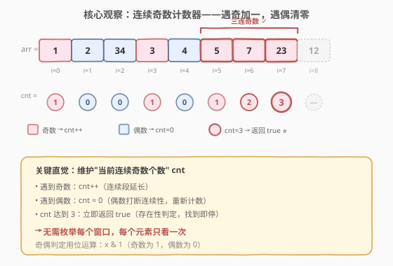
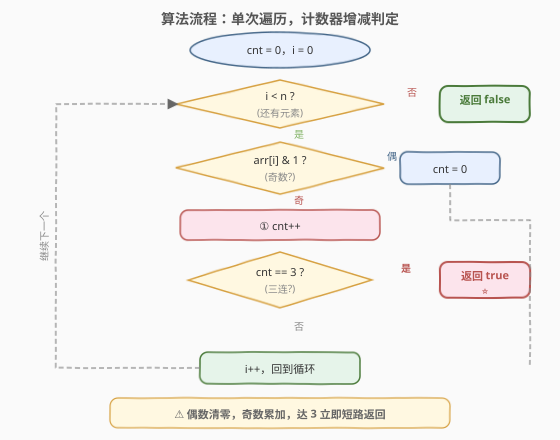

# LeetCode 存在连续三个奇数的数组 题解

## 1. 题目概述

- **标题 / 题号**：存在连续三个奇数的数组（#1550，easy）
- **链接**：https://leetcode.cn/problems/three-consecutive-odds/
- **难度**：简单
- **标签**：数组

**题意**：给你一个整数数组 `arr`，请你判断数组中是否存在**三个连续的奇数**。即是否存在下标 `i`（`0 <= i <= n-3`），使得 `arr[i]`、`arr[i+1]`、`arr[i+2]` 均为奇数。存在则返回 `true`，否则返回 `false`。

**示例 1**：

```text
输入：arr = [2,6,4,1]
输出：false
解释：不存在连续三个奇数。
```

**示例 2**：

```text
输入：arr = [1,2,34,3,4,5,7,23,12]
输出：true
解释：存在连续三个奇数 [5,7,23]。
```

**约束**：

- `1 <= arr.length <= 1000`
- `1 <= arr[i] <= 1000`

> 💡 题目只问"是否存在"，是典型的**存在性判定**问题——一旦找到满足条件的三连奇数即可立即返回 `true`，无需枚举所有位置。

## 2. 解题思路

### 2.1 暴力思路：枚举每个长度为 3 的窗口

最直观的做法是：对每个起点 `i`（`0 <= i <= n-3`），检查 `arr[i]`、`arr[i+1]`、`arr[i+2]` 是否都是奇数。

```text
for i in 0..n-3:
    if arr[i] 奇 and arr[i+1] 奇 and arr[i+2] 奇:
        return true
return false
```

时间复杂度 $O(n)$（每个窗口只看 3 个元素，共 $n-2$ 个窗口），空间 $O(1)$。问题在于：**相邻窗口的元素大量重叠**——`arr[i+1]` 和 `arr[i+2]` 在窗口 `i` 中检查过，在窗口 `i+1` 中又被重新检查。如果能用"一个计数器跟踪当前连续奇数的个数"，就能避免重复判定，每个元素只看一次。

### 2.2 核心观察：连续奇数计数器——遇奇加一，遇偶清零



关键直觉：**三个连续奇数 = 一段长度达到 3 的奇数连续子串**。我们不需要对每个窗口独立判定，只需维护一个"当前连续奇数计数" `cnt`：

- 遍历到**奇数**：`cnt++`。若 `cnt == 3`，立即返回 `true`。
- 遍历到**偶数**：`cnt = 0`（偶数"打断"了奇数连续段，重新计数）。

> 💡 **为什么偶数要清零而不是减一？** 因为"连续"要求三个奇数**相邻**。一个偶数出现在中间，无论之前积累了多少个连续奇数，这段连续性都被打断了——后面的奇数要和这个偶数之前的奇数"连续"已不可能，所以必须从零重新开始计数。

> 💡 **奇偶判定用位运算**：`arr[i] & 1` 在二进制末位取 1，奇数为 1、偶数为 0，比 `arr[i] % 2 == 1` 更简洁高效。

### 2.3 算法流程图



整个流程是单层循环：判断当前元素奇偶 → 奇则 `cnt++` 并检查是否达 3，偶则 `cnt = 0` → 移动到下一个元素。一旦 `cnt == 3` 立即短路返回 `true`；遍历结束仍未触发则返回 `false`。

### 2.4 示例演算

![示例演算：arr = [1,2,34,3,4,5,7,23,12]](../images/tco_example_walkthrough.svg)

以 `arr = [1,2,34,3,4,5,7,23,12]` 为例：

| i | arr[i] | 奇偶 | cnt | 说明 |
|---|--------|------|-----|------|
| 0 | 1 | 奇 | 1 | 首个奇数，开始计数 |
| 1 | 2 | 偶 | 0 | 偶数打断，清零 |
| 2 | 34 | 偶 | 0 | 仍是偶数，保持 0 |
| 3 | 3 | 奇 | 1 | 重新开始计数 |
| 4 | 4 | 偶 | 0 | 偶数打断，清零 |
| 5 | 5 | 奇 | 1 | 开始计数 |
| 6 | 7 | 奇 | 2 | 连续第 2 个奇数 |
| 7 | 23 | 奇 | 3 | **连续第 3 个！返回 true ⭐** |

在 `i = 7` 时 `cnt` 达到 3，立即返回 `true`，无需检查 `i = 8` 的 `12`。

## 3. 参考代码

### C++（计数器一次遍历）

```cpp
class Solution {
  public:
    bool threeConsecutiveOdds(vector<int>& arr) {
        int cnt = 0;
        for (int x : arr) {
            if (x & 1) {
                if (++cnt == 3) return true;
            } else {
                cnt = 0;
            }
        }
        return false;
    }
};
```

### Python

```python
class Solution:
    def threeConsecutiveOdds(self, arr: list[int]) -> bool:
        cnt = 0
        for x in arr:
            if x & 1:
                cnt += 1
                if cnt == 3:
                    return True
            else:
                cnt = 0
        return False
```

> 💡 **短路返回**：一旦 `cnt == 3` 立即 `return true`，不必遍历剩余元素。这是"存在性判定"问题的通用优化——找到即停，最坏情况（不存在时）才遍历完整数组。

## 4. 复杂度分析

| 维度 | 复杂度 | 说明 |
|------|--------|------|
| 时间复杂度 | $O(n)$ | 最坏情况遍历整个数组一次；存在三连奇数时提前返回，平均更优 |
| 空间复杂度 | $O(1)$ | 只用常数变量 `cnt` |

## 5. 扩展：推广到"连续 K 个"

若将问题改为"判断是否存在连续 $K$ 个奇数"，只需把判定条件 `cnt == 3` 改为 `cnt == K` 即可，算法结构不变。进一步地，若要统计数组中**有多少段**长度恰好为 $K$ 的连续奇数子数组，则需用"至多 $K$ 减至多 $K-1$"的转化技巧，参见 [1248. 统计「优美子数组」](https://leetcode.cn/problems/count-number-of-nice-subarrays/)。

## 6. 面试要点

1. **为什么用计数器而不是枚举窗口？**

   - 枚举窗口虽然也是 $O(n)$，但相邻窗口元素重叠导致重复判定。计数器法每个元素只处理一次，逻辑更简洁，且天然支持"找到即停"的短路返回。

2. **偶数为什么清零而不是减一？**

   - "连续"要求相邻。偶数一旦出现在中间，其前后的奇数就不可能构成"连续"，之前的累积全部作废，必须从零重新计数。

3. **如何判断奇偶？`x & 1` 和 `x % 2` 有什么区别？**

   - 二者等价（对正整数），`x & 1` 取二进制末位，奇数为 1 偶数为 0。位运算通常更快，但在现代编译器下 `x % 2` 也会被优化为位运算，可读性差异不大。

4. **如果题目改成"连续 K 个奇数"呢？**

   - 把 `cnt == 3` 改成 `cnt == K` 即可，算法不变。若要计数而非判定存在性，则需用前缀和或"至多 K"转化。

5. **如果数组很长且三连奇数出现在末尾附近，性能如何？**

   - 仍需遍历到接近末尾才能发现，这是最坏情况 $O(n)$。但计数器法不会比枚举窗口法更慢，且当三连奇数出现较早时能提前返回，平均性能更优。

## 同类练习题

| # | 题目 | 与本题的关联 |
|---|------|-------------|
| 1248 | [统计「优美子数组」](https://leetcode.cn/problems/count-number-of-nice-subarrays/) | 从"判定存在"升级为"计数"，连续 K 个奇数子数组的计数问题 |
| 485 | [最大连续 1 的个数](https://leetcode.cn/problems/max-consecutive-ones/) | 维护连续计数器求最大长度，与本题计数器思路同源 |
| 228 | [汇总区间](https://leetcode.cn/problems/summary-ranges/) | 连续段的识别与合并，"连续"概念的另一种应用 |
| 1004 | [最大连续 1 的个数 III](https://leetcode.cn/problems/max-consecutive-ones-iii/) | 连续段 + 翻转容忍，计数器思想的进阶变体 |
| 2348 | [全 0 子数组的数目](https://leetcode.cn/problems/number-of-zero-filled-subarrays/) | 连续相同元素的子数组计数，同属"连续段"思维 |
