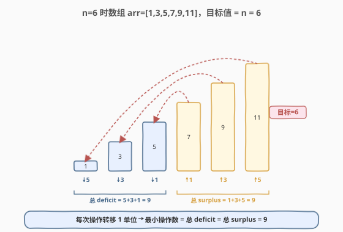
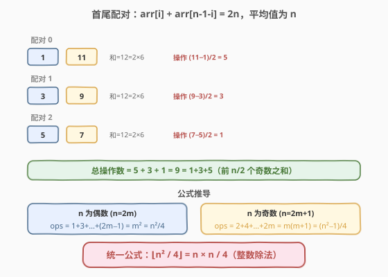
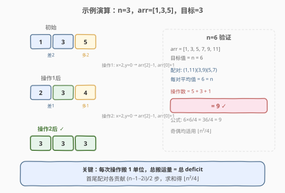

# 使数组中所有元素相等的最小操作数

- **题目名称**：使数组中所有元素相等的最小操作数
- **链接**：[1551. 使数组中所有元素相等的最小操作数](https://leetcode.cn/problems/minimum-operations-to-make-array-equal/)
- **难度**：中等
- **标签**：数学、数组、贪心

## 1. 题目概述

存在一个长度为 `n` 的数组 `arr`，其中 `arr[i] = (2 * i) + 1`（`0 <= i < n`），即 `arr = [1, 3, 5, …, 2n−1]`。

一次操作中，选出两个下标 `x` 和 `y`，使 `arr[x]` 减 `1`、`arr[y]` 加 `1`（把 `1` 个单位从 `x` 搬到 `y`）。目标是使数组中所有元素**相等**。返回所需的最小操作数。

**示例 1**：

```text
输入：n = 3
输出：2
解释：arr = [1, 3, 5]
操作1：选 x=2, y=0 → [2, 3, 4]
操作2：选 x=2, y=0 → [3, 3, 3]
```

**示例 2**：

```text
输入：n = 6
输出：9
解释：arr = [1, 3, 5, 7, 9, 11]，目标值 = 6
```

**约束条件**：

- `1 <= n <= 10^4`

---

## 2. 解题思路

### 2.1 暴力思路：模拟搬运

数组元素确定：`arr[i] = 2i + 1`，是一个首项为 1、公差为 2 的等差数列。

- **总和**：$1 + 3 + 5 + \cdots + (2n-1) = n^2$。
- **目标值**（所有元素最终相等时的值）：$n^2 / n = n$。
- **每次操作搬 1 个单位**，所以最小操作数 = 需要搬运的总量 = 低于目标值的元素总差额（deficit）。

遍历一遍，把所有 $< n$ 的元素的差额累加即可，$O(n)$。

> 💡 这已经能过，但题目给了确定公式 `arr[i] = 2i+1`，意味着答案必有闭式——能否 $O(1)$ 直接算出来？

### 2.2 核心观察：首尾配对 + 闭式公式



把数组**首尾配对**：`arr[i]` 与 `arr[n−1−i]`。

$$\text{arr}[i] + \text{arr}[n-1-i] = (2i+1) + (2(n-1-i)+1) = 2n$$

每一对的**和恒为 $2n$**，因此**平均值恒为 $n$**——恰好是目标值！要把一对都变成 $n$，只需把大的一半往小的一半搬，搬运量为两者差的一半：

$$\text{ops}_i = \frac{\text{arr}[n-1-i] - \text{arr}[i]}{2} = \frac{2n - 2 - 4i}{2} = n - 1 - 2i$$

对 $i = 0, 1, \ldots, \lfloor n/2 \rfloor - 1$ 求和（奇数时中间元素 `arr[(n−1)/2] = n` 已等于目标，贡献 0）：

$$\text{ans} = \sum_{i=0}^{\lfloor n/2 \rfloor - 1} (n - 1 - 2i)$$

> ⚠️ 这里能配对的本质是**数组的对称性**：`arr[i]` 与 `arr[n−1−i]` 关于中点对称，和恒为 $2n$。若题目给的不是等差数列（比如随机数组），就不能这样配对，只能老实模拟。

### 2.3 算法流程图：公式推导



分奇偶讨论求和：

- **$n$ 为偶数**（$n = 2m$）：配 $m$ 对，操作数为 $n-1, n-3, \ldots, 1$，即前 $m$ 个奇数之和：

$$\text{ans} = 1 + 3 + \cdots + (2m-1) = m^2 = \frac{n^2}{4}$$

- **$n$ 为奇数**（$n = 2m+1$）：配 $m$ 对（中间元素已等于目标），操作数为 $n-1, n-3, \ldots, 2$，即前 $m$ 个偶数之和：

$$\text{ans} = 2 + 4 + \cdots + 2m = m(m+1) = \frac{n^2 - 1}{4}$$

两者合并为一个统一公式：

$$\boxed{\text{ans} = \left\lfloor \frac{n^2}{4} \right\rfloor = \frac{n \times n}{4} \text{（整数除法）}}$$

验证：$n=3 \Rightarrow 9/4 = 2$；$n=6 \Rightarrow 36/4 = 9$；$n=1 \Rightarrow 1/4 = 0$（已相等）。

### 2.4 示例演算



以 $n=3$ 为例，`arr = [1, 3, 5]`，目标 $= 3$：

| 步骤 | 数组 | 操作 | 说明 |
|------|------|------|------|
| 初始 | [1, 3, 5] | — | 1 差 2，5 多 2 |
| 操作1 | [2, 3, 4] | x=2, y=0 | 5→4, 1→2 |
| 操作2 | [3, 3, 3] | x=2, y=0 | 4→3, 2→3 |

共 **2** 次操作，与公式 $3^2/4 = 2$ 一致。

> 💡 观察到每一步都把「最大值往最小值搬」——这正是贪心配对思想的体现：配对 `(1,5)` 需要搬 $(5-1)/2 = 2$ 次，中间的 `3` 不动。

---

## 3. 参考代码

### 方法一：$O(1)$ 公式（推荐）

### C++

```cpp
class Solution {
  public:
    int minOperations(int n) {
        return n * n / 4;
    }
};
```

### Python

```python
class Solution:
    def minOperations(self, n: int) -> int:
        return n * n // 4
```

> 💡 C++ 与 Python 的整数除法对非负数行为一致，直接 `n * n / 4`（C++）或 `n * n // 4`（Python）即可。$n \le 10^4$，$n^2 \le 10^8$，不溢出 `int`。

### 方法二：$O(n)$ 模拟（用于验证思路）

### C++

```cpp
class Solution {
  public:
    int minOperations(int n) {
        int ans = 0;
        for (int i = 0; i < n / 2; ++i) {
            ans += n - 1 - 2 * i;   // 配对 i 与 n-1-i 的搬运量
        }
        return ans;
    }
};
```

### Python

```python
class Solution:
    def minOperations(self, n: int) -> int:
        return sum(n - 1 - 2 * i for i in range(n // 2))
```

> 💡 累加 `n - 1 - 2i`（$i = 0 \ldots \lfloor n/2 \rfloor - 1$）正是配对搬运量的求和，化简后就是 $\lfloor n^2 / 4 \rfloor$。

---

## 4. 复杂度分析

| 维度 | 方法一（公式） | 方法二（模拟） | 说明 |
|------|---------------|---------------|------|
| 时间复杂度 | $O(1)$ | $O(n)$ | 公式直接返回；模拟遍历 $\lfloor n/2 \rfloor$ 次 |
| 空间复杂度 | $O(1)$ | $O(1)$ | 均只用常数变量 |

> ⚠️ 本题 $n \le 10^4$，两种方法都远超时限要求。但面试中应优先给出 $O(1)$ 公式解，展示对数列结构的洞察。

---

## 5. 扩展：为何能配对？

本题能 $O(1)$ 求解的根源是**数组被给定为等差数列** `arr[i] = 2i+1`，具有两个关键性质：

1. **总和确定**：$n$ 个连续奇数之和 $= n^2$，目标值 $= n$ 与 $n$ 本身绑定。
2. **对称性**：`arr[i] + arr[n-1-i] = 2n` 恒成立，每对平均值 $= n$ = 目标值。

若把题目改为「给定任意数组，每次操作搬 1 单位，求使所有元素相等的最小操作数」，则：

- 目标值仍为平均值（总和 / $n$，需整除）；
- 但**不能再首尾配对**，只能遍历累加所有低于平均值的差额，$O(n)$。
- 若总和不能被 $n$ 整除，则无解。

> 💡 这类「搬 1 单位使相等」的问题，本质都是**计算总差额的一半**——因为每次操作同时减少一个 deficit、增加一个 surplus，一进一出抵消。

---

## 6. 面试要点

1. **为什么目标值是 $n$？**

   - 数组是 $1, 3, \ldots, 2n-1$，和 $= n^2$，$n$ 个元素平均 $= n^2/n = n$。每次操作总和不变（一加一减），所以最终所有元素都等于平均值 $n$。

2. **为什么最小操作数 = 总 deficit？**

   - 每次操作把 1 个单位从「高于目标」的元素搬到「低于目标」的元素，同时消除 1 单位 surplus 和 1 单位 deficit。总 deficit = 总 surplus，操作数 = 总 deficit。

3. **公式 $\lfloor n^2/4 \rfloor$ 怎么来的？**

   - 首尾配对，每对贡献 $n-1-2i$ 步。偶数时求和为前 $n/2$ 个奇数之和 $= (n/2)^2 = n^2/4$；奇数时为前 $(n-1)/2$ 个偶数之和 $= (n-1)/2 \cdot (n+1)/2 = (n^2-1)/4$。两者统一为 $\lfloor n^2/4 \rfloor$。

4. **如果不给定 `arr[i] = 2i+1`，而是任意数组怎么办？**

   - 先算总和与平均值（需整除否则无解），再遍历累加所有低于平均值元素的差额即可，$O(n)$。配对优化依赖等差数列的对称性，不普适。

5. **`n*n/4` 会溢出吗？**

   - $n \le 10^4$，$n^2 \le 10^8$，远小于 `INT_MAX`（约 $2.1 \times 10^9$）。若 $n$ 更大（如 $10^5$），需注意用 `long long`。

---

## 7. 同类练习题

- [453. 最小操作次数使数组元素相等](https://leetcode.cn/problems/minimum-moves-to-equal-array-elements/)：每次让 $n-1$ 个元素 +1 等价于让 1 个元素 −1，转化为本题同款「搬 1 单位」模型
- [462. 最小操作次数使数组元素相等 II](https://leetcode.cn/problems/minimum-moves-to-equal-array-elements-ii/)：任意数组每次改 1 单位，目标是中位数而非平均值，贪心选中位数最优
- [2139. 得到目标值的最小行动次数](https://leetcode.cn/problems/minimum-moves-to-reach-target-score/)：从 1 到 target，每次 +1 或加倍，贪心逆推（除法优先），数学贪心思路对照
- [2541. 使数组中所有元素相等的最小操作数 II](https://leetcode.cn/problems/minimum-operations-to-make-array-equal-ii/)：本题变体，每次 +1/−1 可指定不同位置，目标值为任意指定值，贪心 + 差分
